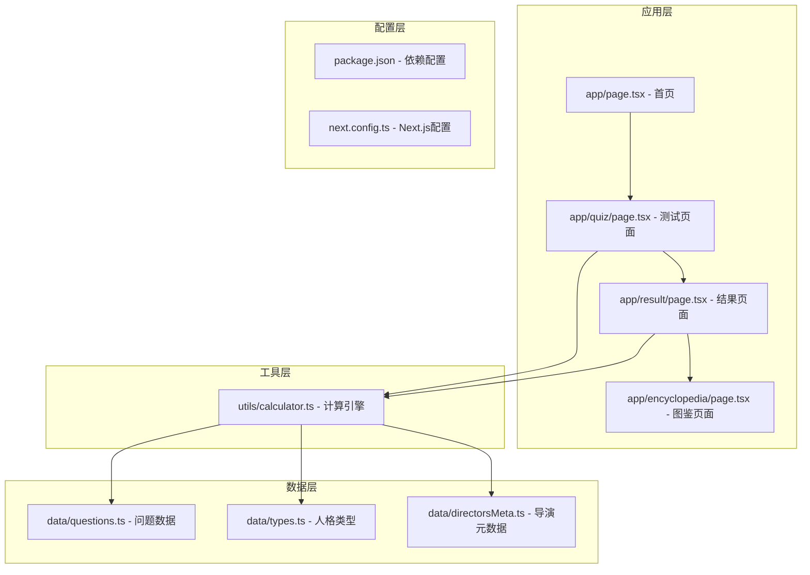
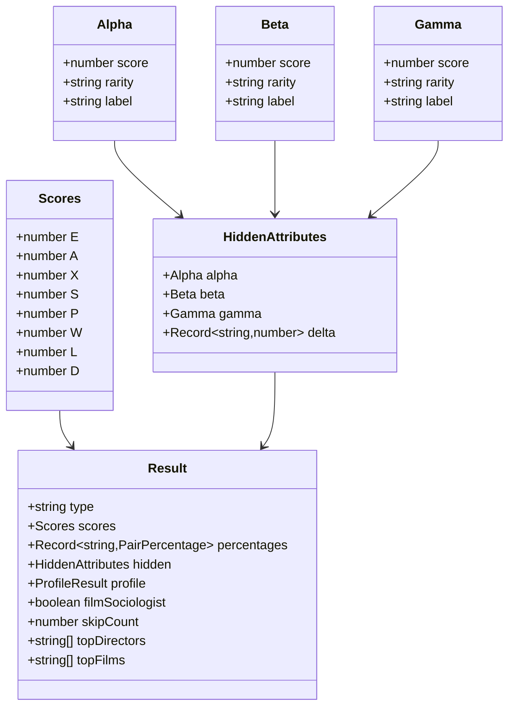
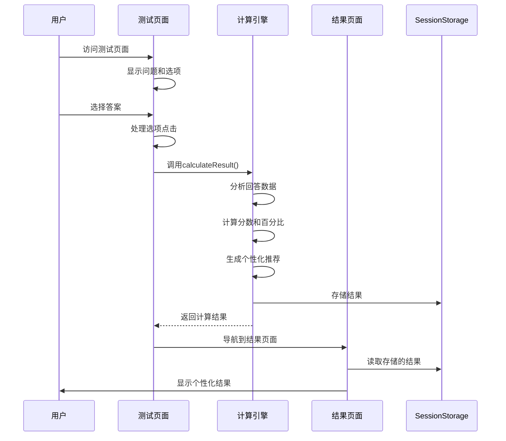
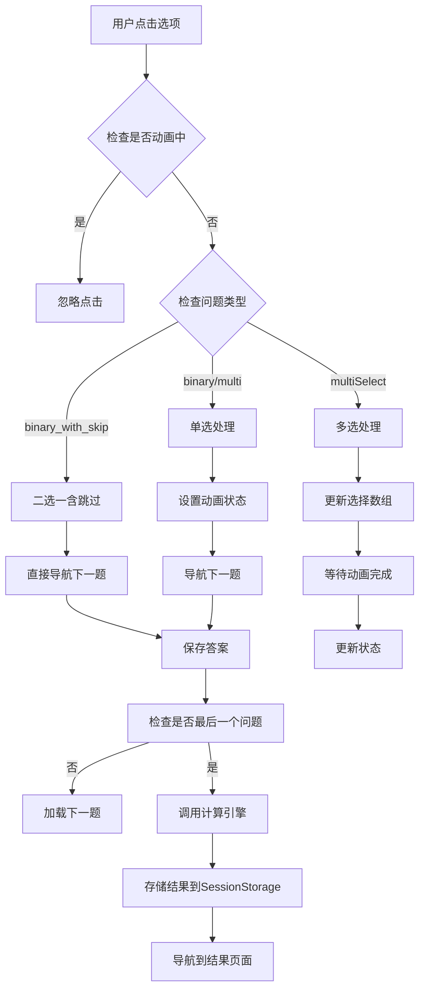
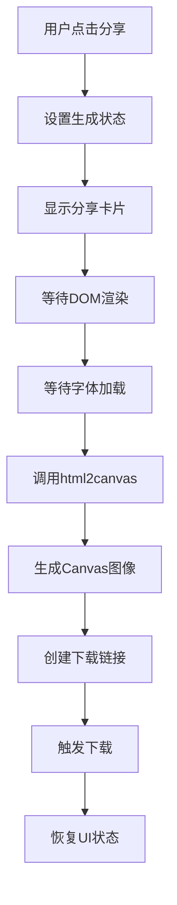
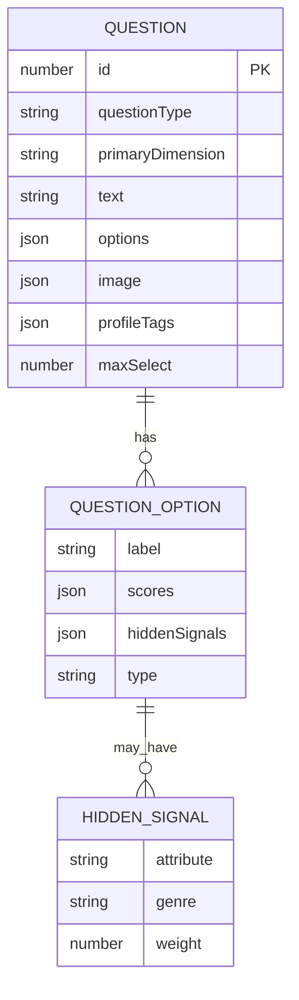

# API参考文档

<cite>
**本文档引用的文件**
- [app/page.tsx](file://app/page.tsx)
- [app/quiz/page.tsx](file://app/quiz/page.tsx)
- [app/result/page.tsx](file://app/result/page.tsx)
- [app/encyclopedia/page.tsx](file://app/encyclopedia/page.tsx)
- [utils/calculator.ts](file://utils/calculator.ts)
- [data/questions.ts](file://data/questions.ts)
- [data/types.ts](file://data/types.ts)
- [data/directorsMeta.ts](file://data/directorsMeta.ts)
- [package.json](file://package.json)
- [next.config.ts](file://next.config.ts)
</cite>

## 目录
1. [简介](#简介)
2. [项目结构](#项目结构)
3. [核心组件](#核心组件)
4. [架构概览](#架构概览)
5. [详细组件分析](#详细组件分析)
6. [依赖关系分析](#依赖关系分析)
7. [性能考虑](#性能考虑)
8. [故障排除指南](#故障排除指南)
9. [结论](#结论)

## 简介

FBTI（Film Buff Type Indicator）是一个基于MBTI理论的电影人格测试应用，通过40个精心设计的问题来分析用户的电影偏好和观看习惯，生成个性化的电影人格类型和推荐。

该项目采用React 19和Next.js 16构建，使用TypeScript进行类型安全编程，实现了完整的前端交互流程，包括测试问答、结果计算、个性化推荐等功能。

## 项目结构



**图表来源**
- [app/page.tsx:1-76](file://app/page.tsx#L1-L76)
- [app/quiz/page.tsx:1-395](file://app/quiz/page.tsx#L1-L395)
- [app/result/page.tsx:1-923](file://app/result/page.tsx#L1-L923)
- [app/encyclopedia/page.tsx:1-354](file://app/encyclopedia/page.tsx#L1-L354)

**章节来源**
- [package.json:1-30](file://package.json#L1-L30)
- [next.config.ts:1-8](file://next.config.ts#L1-L8)

## 核心组件

### 计算引擎API

计算引擎是FBTI项目的核心，负责处理用户回答并生成最终结果。主要包含以下接口：

#### 主要接口

| 接口名称 | 参数 | 返回值 | 描述 |
|---------|------|--------|------|
| `calculateResult` | `AnswerEntry[]` | `Result` | 主要计算函数，处理用户回答并生成结果 |
| `scoreDirector` | `DirectorMeta, number, number, number` | `number` | 评分导演适配度 |
| `scoreFilm` | `FilmMeta, number, number, number, number` | `number` | 评分电影适配度 |

#### 数据结构



**图表来源**
- [utils/calculator.ts:5-444](file://utils/calculator.ts#L5-L444)

**章节来源**
- [utils/calculator.ts:235-444](file://utils/calculator.ts#L235-L444)

### 问题系统API

问题系统提供了完整的问答交互框架，支持多种问题类型：

#### 问题类型

| 类型 | 特征 | 示例 |
|------|------|------|
| `binary` | 二选一 | 感知模式问题 |
| `multi` | 多选一 | 观影环境选择 |
| `binary_with_skip` | 二选一含跳过 | 配乐偏好问题 |
| `multiSelect` | 多选多 | 名场面定义问题 |

#### 问题选项类型

| 类型 | 特征 | 用途 |
|------|------|------|
| `substantive` | 实质性回答 | 正常计分 |
| `skip` | 跳过回答 | 不计入计分 |

**章节来源**
- [data/questions.ts:33-42](file://data/questions.ts#L33-L42)

## 架构概览



**图表来源**
- [app/quiz/page.tsx:69-95](file://app/quiz/page.tsx#L69-L95)
- [utils/calculator.ts:235-444](file://utils/calculator.ts#L235-L444)

## 详细组件分析

### 测试问答系统

测试问答系统是用户交互的核心组件，提供了完整的问答流程管理。

#### 组件属性

| 属性名称 | 类型 | 默认值 | 描述 |
|----------|------|--------|------|
| `currentQuestion` | `number` | `0` | 当前问题索引 |
| `answers` | `AnswerEntry[]` | `[]` | 用户已回答的答案集合 |
| `selectedOptions` | `number[]` | `[]` | 当前问题已选择的选项索引 |
| `animating` | `boolean` | `false` | 动画状态标志 |

#### 事件处理



**图表来源**
- [app/quiz/page.tsx:39-95](file://app/quiz/page.tsx#L39-L95)

**章节来源**
- [app/quiz/page.tsx:19-122](file://app/quiz/page.tsx#L19-L122)

### 结果展示系统

结果展示系统负责将计算结果以可视化的方式呈现给用户。

#### 主要功能模块

| 模块名称 | 功能描述 | 关键特性 |
|----------|----------|----------|
| `维度分析` | 展示四个维度的得分对比 | 进度条可视化、动态标签 |
| `隐藏属性` | 显示α、β、γ隐藏属性等级 | 稀有度徽章、颜色编码 |
| `类型基因` | 展示类型基因雷达图 | 交互式SVG图表、悬停提示 |
| `观影画像` | 生成个性化观影偏好描述 | 自然语言生成、情境化描述 |

#### 分享功能

结果页面集成了HTML2Canvas分享功能，允许用户生成个性化的分享卡片：



**图表来源**
- [app/result/page.tsx:102-134](file://app/result/page.tsx#L102-L134)

**章节来源**
- [app/result/page.tsx:64-462](file://app/result/page.tsx#L64-L462)

### 数据模型

#### 问题数据模型



**图表来源**
- [data/questions.ts:33-42](file://data/questions.ts#L33-L42)

#### 人格类型模型

FBTI定义了16种电影人格类型，每种类型包含：

| 字段 | 类型 | 描述 |
|------|------|------|
| `code` | `string` | 人格代码（4字符） |
| `name` | `string` | 人格名称 |
| `tagline` | `string` | 标语 |
| `description` | `string` | 详细描述 |
| `directors` | `string[]` | 代表导演列表 |
| `films` | `string[]` | 代表作品列表 |
| `socialLabel` | `string` | 社交表现描述 |

**章节来源**
- [data/types.ts:1-428](file://data/types.ts#L1-L428)

### 外部API集成

#### TMDB API集成

项目集成了TMDB（The Movie Database）API用于电影信息查询和链接跳转：

| 功能 | API端点 | 参数 | 用途 |
|------|---------|------|------|
| 导演搜索 | `/search/person` | `query` | 搜索电影导演信息 |
| 电影搜索 | `/search/movie` | `query` | 搜索电影作品信息 |
| 电影详情 | `/movie/{id}` | `id` | 获取电影详细信息 |
| 导演详情 | `/person/{id}` | `id` | 获取导演详细信息 |

**章节来源**
- [app/result/page.tsx:306-332](file://app/result/page.tsx#L306-L332)

## 依赖关系分析

```mermaid
graph TB
subgraph "外部依赖"
A[react@19.2.4]
B[react-dom@19.2.4]
C[next@16.2.4]
D[framer-motion@12.38.0]
E[html2canvas@1.4.1]
end
subgraph "内部模块"
F[utils/calculator.ts]
G[data/questions.ts]
H[data/types.ts]
I[data/directorsMeta.ts]
J[app/quiz/page.tsx]
K[app/result/page.tsx]
end
A --> J
A --> K
B --> J
B --> K
C --> J
C --> K
D --> K
E --> K
F --> G
F --> H
F --> I
J --> F
K --> F
J --> G
K --> H
```

**图表来源**
- [package.json:11-28](file://package.json#L11-L28)

**章节来源**
- [package.json:11-28](file://package.json#L11-L28)

## 性能考虑

### 计算优化

1. **分数计算优化**
   - 使用权重分配算法减少重复计算
   - 缓存中间结果避免重复计算
   - 数组操作优化减少内存分配

2. **渲染性能**
   - 使用React.memo优化组件重渲染
   - 条件渲染减少不必要的DOM节点
   - 动画状态管理避免过度重排

3. **数据处理**
   - 使用Map和Set提高查找效率
   - 预计算阈值减少运行时计算
   - 批量更新状态减少重渲染次数

### 内存管理

- SessionStorage使用限制在合理范围内
- 大对象序列化和反序列化优化
- 事件监听器清理防止内存泄漏

## 故障排除指南

### 常见问题及解决方案

| 问题类型 | 症状 | 可能原因 | 解决方案 |
|----------|------|----------|----------|
| 计算错误 | 结果异常或NaN | 输入数据格式错误 | 验证输入数据类型和范围 |
| 渲染问题 | 页面空白或闪烁 | 状态更新时机不当 | 检查useState和useEffect使用 |
| API调用失败 | TMDB链接无法访问 | 网络连接问题 | 添加错误处理和重试机制 |
| 性能问题 | 页面卡顿 | 大量DOM操作 | 优化渲染逻辑和使用虚拟滚动 |

### 调试建议

1. **开发工具**
   - 使用React DevTools检查组件树
   - 利用浏览器性能面板分析瓶颈
   - 设置断点调试异步操作

2. **日志记录**
   - 在关键计算步骤添加日志
   - 记录用户交互事件
   - 监控API调用成功率

**章节来源**
- [app/result/page.tsx:128-133](file://app/result/page.tsx#L128-L133)

## 结论

FBTI项目展示了现代Web应用的最佳实践，通过精心设计的API架构和数据模型，实现了完整的电影人格测试功能。项目的主要优势包括：

1. **模块化设计** - 清晰的组件分离和职责划分
2. **类型安全** - TypeScript提供完整的类型安全保障
3. **用户体验** - 流畅的交互流程和丰富的视觉反馈
4. **可扩展性** - 灵活的数据模型支持功能扩展
5. **性能优化** - 合理的状态管理和渲染优化

该API参考文档为开发者提供了完整的集成指南，包括所有公共接口、数据结构定义和使用示例，便于进一步的功能扩展和定制开发。