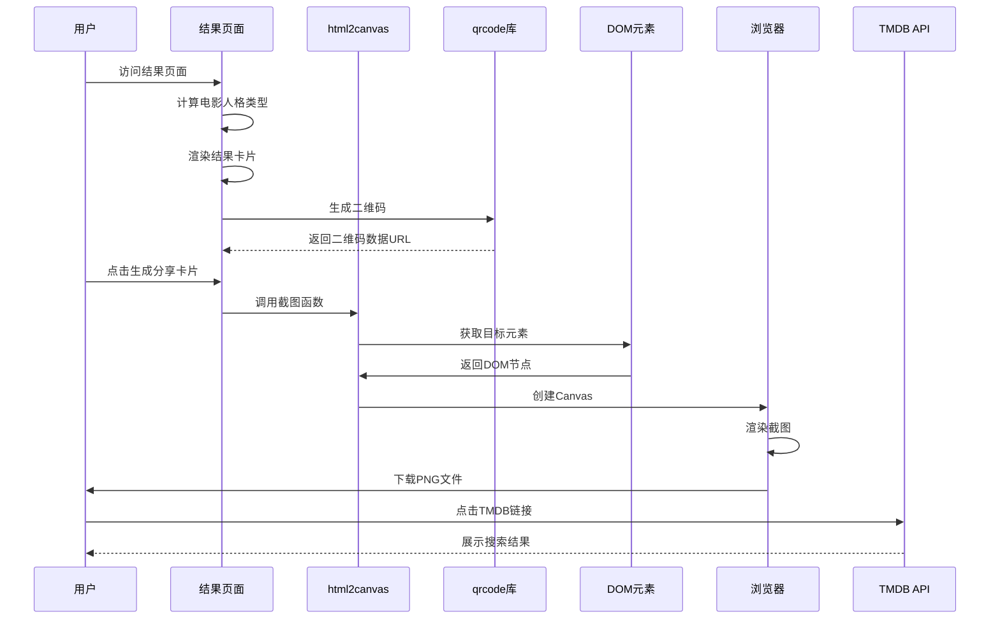
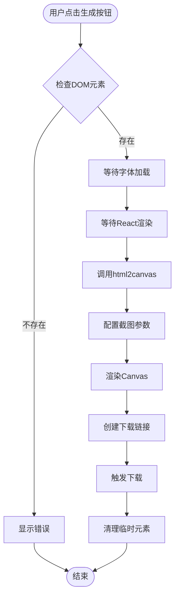
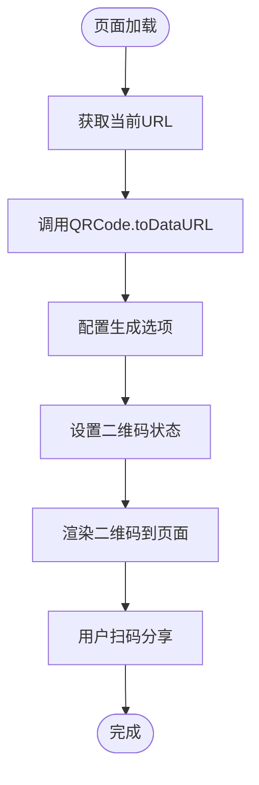
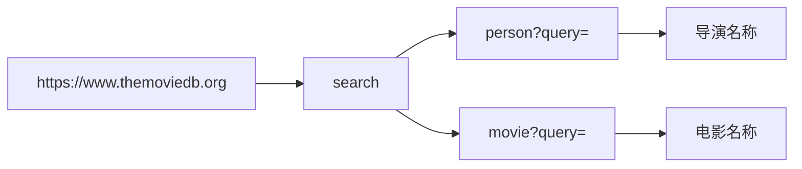
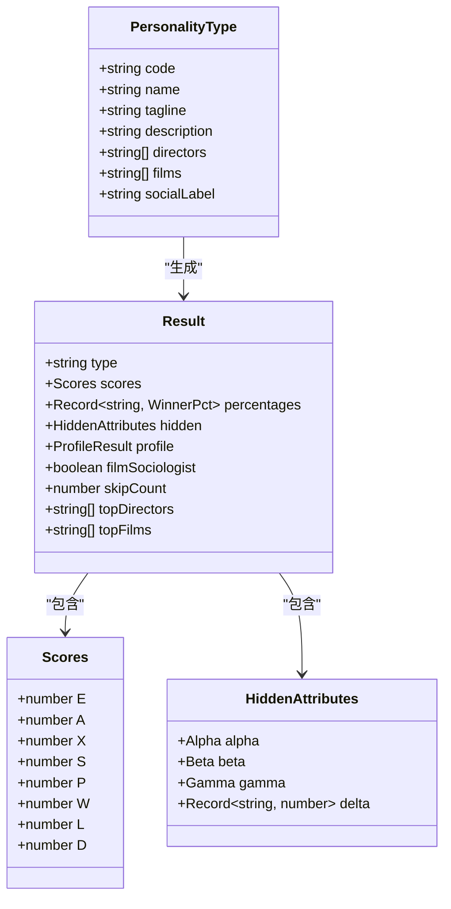
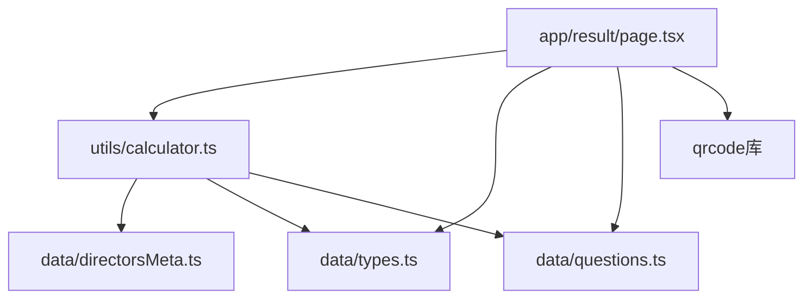
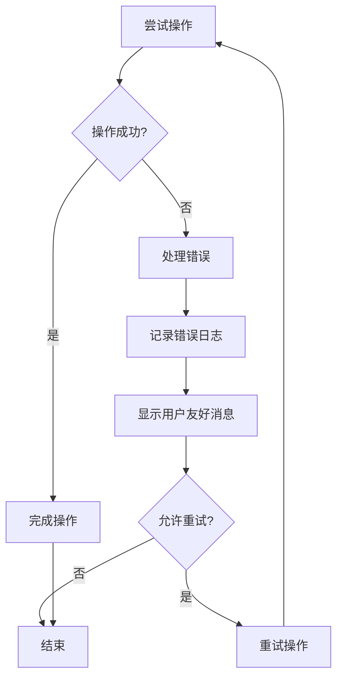

# 外部集成API

<cite>
**本文档引用的文件**
- [README.md](file://README.md)
- [package.json](file://package.json)
- [app/result/page.tsx](file://app/result/page.tsx)
- [data/questions.ts](file://data/questions.ts)
- [data/types.ts](file://data/types.ts)
- [data/directorsMeta.ts](file://data/directorsMeta.ts)
- [utils/calculator.ts](file://utils/calculator.ts)
- [node_modules/@types/qrcode/index.d.ts](file://node_modules/@types/qrcode/index.d.ts)
</cite>

## 更新摘要
**变更内容**
- 新增二维码生成功能，集成qrcode库用于分享和身份验证
- 更新依赖分析，包含新的qrcode库依赖
- 扩展API参考，增加二维码生成接口说明
- 更新架构概览，反映二维码功能的集成

## 目录
1. [简介](#简介)
2. [项目结构](#项目结构)
3. [核心组件](#核心组件)
4. [架构概览](#架构概览)
5. [详细组件分析](#详细组件分析)
6. [依赖分析](#依赖分析)
7. [性能考虑](#性能考虑)
8. [故障排除指南](#故障排除指南)
9. [结论](#结论)
10. [附录](#附录)

## 简介

FBTI外部集成系统是一个基于Next.js的应用程序，专注于电影人格测试和结果分享功能。本系统集成了TMDB（The Movie Database）API用于搜索导演和电影信息，并使用html2canvas库进行结果页面的截图分享功能。**最新更新**增加了二维码生成功能，使用qrcode库为测试结果提供数字化分享和身份验证能力。

该系统的核心功能包括：
- 电影人格测试计算和结果生成
- TMDB API集成用于导演和电影信息检索
- html2canvas截图生成和PNG格式导出
- **新增**二维码生成和分享功能
- 用户结果页面的个性化展示
- 外部API的错误处理和重试机制

## 项目结构

项目采用Next.js应用结构，主要包含以下关键目录和文件：

```mermaid
graph TB
subgraph "应用层"
APP[app/]
RESULT[app/result/page.tsx]
QUIZ[app/quiz/page.tsx]
ENC[app/encyclopedia/page.tsx]
end
subgraph "数据层"
DATA[data/]
QUESTIONS[data/questions.ts]
TYPES[data/types.ts]
DIRECTORS[data/directorsMeta.ts]
end
subgraph "工具层"
UTILS[utils/]
CALCULATOR[utils/calculator.ts]
end
subgraph "配置层"
CONFIG[根目录配置]
PKG[package.json]
NEXT[next.config.ts]
TS[tsconfig.json]
end
subgraph "第三方库"
QRCODE[qrcode库]
HTML2CANVAS[html2canvas库]
END
RESULT --> CALCULATOR
RESULT --> TYPES
RESULT --> QUESTIONS
RESULT --> QRCODE
RESULT --> HTML2CANVAS
CALCULATOR --> DIRECTORS
CALCULATOR --> TYPES
```

**图表来源**
- [package.json:11-18](file://package.json#L11-L18)
- [app/result/page.tsx:1-12](file://app/result/page.tsx#L1-L12)

**章节来源**
- [README.md:1-37](file://README.md#L1-L37)
- [package.json:1-31](file://package.json#L1-L31)

## 核心组件

### TMDB API集成组件

系统通过以下方式集成TMDB API：

1. **链接跳转集成**：直接使用TMDB搜索链接进行结果展示
2. **问题图像集成**：在问卷中嵌入TMDB电影图像
3. **导演元数据管理**：维护导演和电影的元数据信息

### html2canvas集成组件

系统实现了完整的截图分享功能：

1. **截图生成**：使用html2canvas将React组件转换为Canvas
2. **PNG导出**：支持PNG格式的图片下载
3. **样式保持**：确保截图保持原始样式和布局

### **新增**二维码生成组件

系统集成了完整的二维码生成功能：

1. **动态二维码生成**：根据当前URL动态生成二维码
2. **自定义样式配置**：支持颜色、尺寸和边距的自定义
3. **实时预览展示**：在结果页面右上角实时显示二维码
4. **移动端友好**：适配移动设备的扫码体验

**章节来源**
- [app/result/page.tsx:85-100](file://app/result/page.tsx#L85-L100)
- [app/result/page.tsx:188-196](file://app/result/page.tsx#L188-L196)
- [data/questions.ts:222-260](file://data/questions.ts#L222-L260)

## 架构概览

系统采用模块化架构，主要组件交互如下：



**图表来源**
- [app/result/page.tsx:85-100](file://app/result/page.tsx#L85-L100)
- [app/result/page.tsx:124-157](file://app/result/page.tsx#L124-L157)
- [app/result/page.tsx:454-460](file://app/result/page.tsx#L454-L460)

## 详细组件分析

### html2canvas截图组件

#### 核心功能实现



**图表来源**
- [app/result/page.tsx:124-157](file://app/result/page.tsx#L124-L157)

#### 截图配置参数详解

| 参数名称 | 类型 | 默认值 | 描述 |
|---------|------|--------|------|
| backgroundColor | string | `#0a0e1a` | 背景色设置 |
| scale | number | `2` | 设备像素比缩放 |
| useCORS | boolean | `true` | 启用跨域资源加载 |
| logging | boolean | `false` | 禁用日志输出 |
| width | number | `el.scrollWidth` | 截图宽度 |
| height | number | `el.scrollHeight` | 截图高度 |
| scrollX | number | `0` | 水平滚动位置 |
| scrollY | number | `0` | 垂直滚动位置 |

#### DOM元素选择策略

系统采用以下DOM元素选择策略：

1. **目标元素ID**：使用`share-card-capture`作为截图目标
2. **临时渲染**：将截图内容渲染到屏幕外的固定位置
3. **字体等待**：确保自定义字体加载完成后再进行截图
4. **延迟处理**：添加适当的延迟确保DOM渲染完成

**章节来源**
- [app/result/page.tsx:124-157](file://app/result/page.tsx#L124-L157)
- [app/result/page.tsx:606-609](file://app/result/page.tsx#L606-L609)

### **新增**二维码生成组件

#### 核心功能实现



**图表来源**
- [app/result/page.tsx:85-100](file://app/result/page.tsx#L85-L100)

#### 二维码生成配置参数

| 参数名称 | 类型 | 默认值 | 描述 |
|---------|------|--------|------|
| width | number | `120` | 二维码宽度（像素） |
| margin | number | `1` | 边距大小 |
| color.dark | string | `"#d4a853"` | 深色模块颜色（琥珀色） |
| color.light | string | `"#0a0e1a"` | 浅色模块颜色（深色背景） |

#### 二维码渲染策略

系统采用以下二维码渲染策略：

1. **固定位置**：在页面右上角固定位置显示二维码
2. **半透明背景**：使用深色背景增强二维码对比度
3. **标签说明**：显示"扫码测试"文字说明
4. **响应式设计**：适配不同屏幕尺寸的显示效果

**章节来源**
- [app/result/page.tsx:85-100](file://app/result/page.tsx#L85-L100)
- [app/result/page.tsx:188-196](file://app/result/page.tsx#L188-L196)

### TMDB API集成组件

#### 搜索功能实现

系统通过以下方式集成TMDB API：

1. **直接链接跳转**：使用TMDB官方搜索链接
2. **问题图像嵌入**：在问卷中嵌入TMDB电影图像
3. **元数据管理**：维护导演和电影的元数据信息

#### TMDB链接格式



**图表来源**
- [app/result/page.tsx:721-731](file://app/result/page.tsx#L721-L731)
- [app/result/page.tsx:635-646](file://app/result/page.tsx#L635-L646)

#### 问题图像集成

系统在问卷中集成了多种TMDB图像类型：

1. **单图模式**：显示单一电影图像
2. **分割模式**：显示左右对比图像
3. **网格模式**：显示多张电影图像的网格布局

**章节来源**
- [data/questions.ts:222-260](file://data/questions.ts#L222-L260)
- [data/questions.ts:590-628](file://data/questions.ts#L590-L628)
- [data/questions.ts:728-794](file://data/questions.ts#L728-L794)

### 数据模型组件

#### 电影人格类型定义

系统定义了完整的电影人格类型体系：



**图表来源**
- [data/types.ts:1-9](file://data/types.ts#L1-L9)
- [utils/calculator.ts:31-41](file://utils/calculator.ts#L31-L41)

#### 导演元数据管理

系统维护了详细的导演元数据：

| 元数据字段 | 类型 | 描述 |
|-----------|------|------|
| name | string | 导演姓名 |
| era | number | 时代分类 (1=经典, 2=中期, 3=当代) |
| style | number | 风格分类 (0=自然主义, 1=形式主义) |
| diversity | number | 多元化程度 (0=主流, 1=国际/独立) |
| genres | string[] | 擅长类型列表 |

**章节来源**
- [data/directorsMeta.ts:5-11](file://data/directorsMeta.ts#L5-L11)
- [data/directorsMeta.ts:22-116](file://data/directorsMeta.ts#L22-L116)

## 依赖分析

### 外部依赖关系

```mermaid
graph TB
subgraph "运行时依赖"
NEXT[Next.js 16.2.4]
REACT[React 19.2.4]
REACTDOM[React DOM 19.2.4]
HTML2CANVAS[html2canvas 1.4.1]
QRCODE[qrcode 1.5.4]
FRAMER[Motion 12.38.0]
end
subgraph "开发依赖"
TYPESCRIPT[TypeScript 5.9.3]
ESLINT[ESLint 9.x]
TAILWIND[Tailwind CSS 4.x]
TYPES_NODE[@types/node 20.x]
TYPES_REACT[@types/react 19.x]
TYPES_HTML2CANVAS[@types/html2canvas 0.5.35]
TYPES_QRCODE[@types/qrcode 1.5.4]
end
RESULT_PAGE[结果页面] --> HTML2CANVAS
RESULT_PAGE --> QRCODE
RESULT_PAGE --> REACT
RESULT_PAGE --> NEXT
CALCULATOR[计算器] --> REACT
CALCULATOR --> TYPESCRIPT
```

**图表来源**
- [package.json:11-18](file://package.json#L11-L18)

### 内部模块依赖

系统内部模块之间的依赖关系：



**图表来源**
- [app/result/page.tsx:1-12](file://app/result/page.tsx#L1-L12)
- [utils/calculator.ts:1-3](file://utils/calculator.ts#L1-L3)

**章节来源**
- [package.json:11-18](file://package.json#L11-L18)

## 性能考虑

### html2canvas性能优化

1. **设备像素比控制**：通过`scale`参数平衡质量与性能
2. **DOM渲染时机**：等待字体加载和React渲染完成
3. **内存管理**：及时清理临时DOM元素和Canvas对象
4. **并发控制**：避免同时进行多个截图操作

### **新增**二维码生成性能优化

1. **异步生成**：使用Promise异步生成二维码，避免阻塞主线程
2. **错误处理**：捕获二维码生成异常，防止影响页面加载
3. **缓存策略**：二维码基于当前URL生成，避免重复计算
4. **资源优化**：使用Data URL格式，减少额外的HTTP请求

### TMDB API性能优化

1. **链接跳转优化**：直接使用TMDB链接减少服务器负载
2. **图像缓存**：利用浏览器缓存机制
3. **按需加载**：仅在需要时加载相关资源

### 缓存策略

系统采用以下缓存策略：

1. **会话存储**：使用sessionStorage缓存测试结果
2. **浏览器缓存**：利用浏览器缓存机制
3. **本地存储**：可扩展的localStorage缓存方案
4. **二维码缓存**：基于URL的二维码数据URL缓存

**章节来源**
- [app/result/page.tsx:72-93](file://app/result/page.tsx#L72-L93)
- [app/result/page.tsx:85-100](file://app/result/page.tsx#L85-L100)
- [app/result/page.tsx:124-157](file://app/result/page.tsx#L124-L157)

## 故障排除指南

### html2canvas常见问题

#### 截图失败问题

**症状**：截图生成失败或空白图片

**解决方案**：
1. 检查目标DOM元素是否存在
2. 确保字体已完全加载
3. 验证CSS样式兼容性
4. 检查跨域资源访问权限

#### 性能问题

**症状**：截图过程缓慢或内存占用过高

**解决方案**：
1. 调整`scale`参数降低分辨率
2. 减少DOM元素数量
3. 优化CSS样式
4. 实施适当的延迟机制

### **新增**二维码生成问题

#### 二维码生成失败

**症状**：二维码无法生成或显示为空白

**解决方案**：
1. 检查URL的有效性和完整性
2. 验证qrcode库的正确导入
3. 确认浏览器对Promise的支持
4. 检查网络连接状态

#### 显示异常问题

**症状**：二维码显示模糊或位置不正确

**解决方案**：
1. 调整二维码的width参数
2. 检查CSS样式冲突
3. 验证固定定位的正确性
4. 确认颜色对比度符合要求

### TMDB集成问题

#### 链接跳转问题

**症状**：点击TMDB链接无法正常跳转

**解决方案**：
1. 检查URL编码是否正确
2. 验证查询参数格式
3. 确认网络连接状态

#### 图像加载问题

**症状**：TMDB图像无法正常显示

**解决方案**：
1. 检查网络连接
2. 验证图像URL有效性
3. 确认CDN服务状态

### 错误处理机制

系统实现了基本的错误处理机制：



**图表来源**
- [app/result/page.tsx:98-100](file://app/result/page.tsx#L98-L100)
- [app/result/page.tsx:151-153](file://app/result/page.tsx#L151-L153)

**章节来源**
- [app/result/page.tsx:98-100](file://app/result/page.tsx#L98-L100)
- [app/result/page.tsx:151-153](file://app/result/page.tsx#L151-L153)

## 结论

FBTI外部集成系统成功实现了电影人格测试与外部服务的集成，**最新更新**增加了二维码生成功能，主要特点包括：

1. **完整的html2canvas集成**：提供了高质量的截图分享功能
2. ****新增**完整的二维码生成系统**：支持动态二维码生成和分享
3. **灵活的TMDB集成**：通过链接跳转和图像嵌入实现无缝集成
4. **健壮的数据模型**：支持复杂的电影人格计算和结果展示
5. **良好的用户体验**：通过渐进式加载和即时反馈提升用户满意度
6. **现代化的分享体验**：结合二维码和截图功能提供多样化的分享方式

系统在性能优化、错误处理和用户体验方面都体现了良好的设计原则，**新增的二维码功能**进一步增强了系统的实用性和现代感，为后续的功能扩展奠定了坚实基础。

## 附录

### API参考表

#### html2canvas配置参数

| 参数 | 类型 | 必需 | 描述 |
|------|------|------|------|
| backgroundColor | string | 否 | 背景色设置 |
| scale | number | 否 | 设备像素比缩放 |
| useCORS | boolean | 否 | 启用跨域资源加载 |
| logging | boolean | 否 | 日志输出控制 |
| width | number | 否 | 截图宽度 |
| height | number | 否 | 截图高度 |
| scrollX | number | 否 | 水平滚动位置 |
| scrollY | number | 否 | 垂直滚动位置 |

#### **新增**二维码生成配置参数

| 参数 | 类型 | 必需 | 描述 |
|------|------|------|------|
| width | number | 否 | 二维码宽度（像素） |
| margin | number | 否 | 边距大小 |
| color.dark | string | 否 | 深色模块颜色 |
| color.light | string | 否 | 浅色模块颜色 |

#### TMDB链接参数

| 参数 | 类型 | 描述 |
|------|------|------|
| query | string | 搜索关键词 |
| language | string | 语言代码 |
| region | string | 地区代码 |

### 最佳实践建议

1. **性能优化**：合理设置html2canvas参数，避免过度渲染
2. ****新增**二维码优化**：使用异步生成避免阻塞页面加载
3. **错误处理**：实施完善的错误处理和用户反馈机制
4. **安全性**：确保所有外部链接的安全性验证
5. **可维护性**：保持代码结构清晰，注释完整
6. **测试覆盖**：建立全面的测试用例，确保功能稳定性
7. ****新增**用户体验优化**：提供多种分享方式满足不同用户需求
8. ****新增**兼容性考虑**：确保二维码在不同设备上的可读性