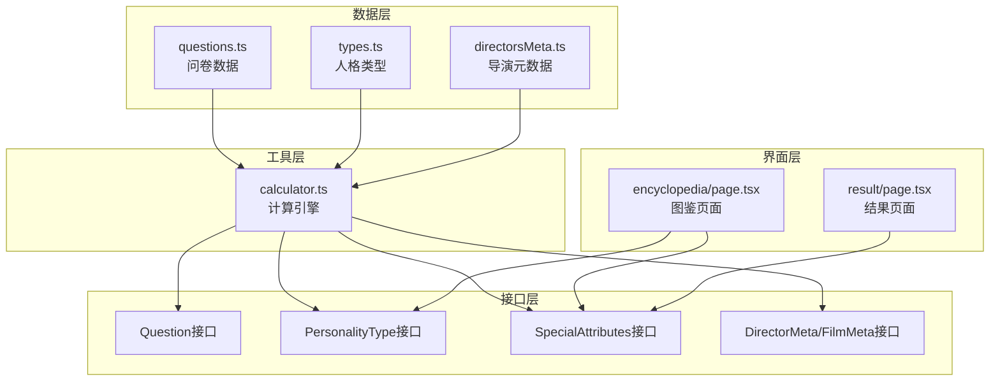
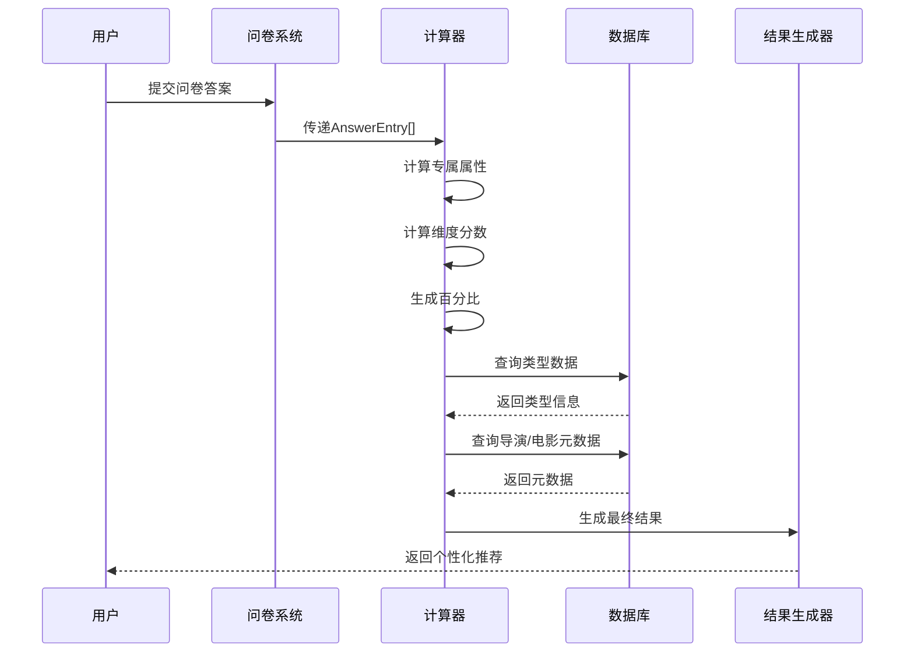
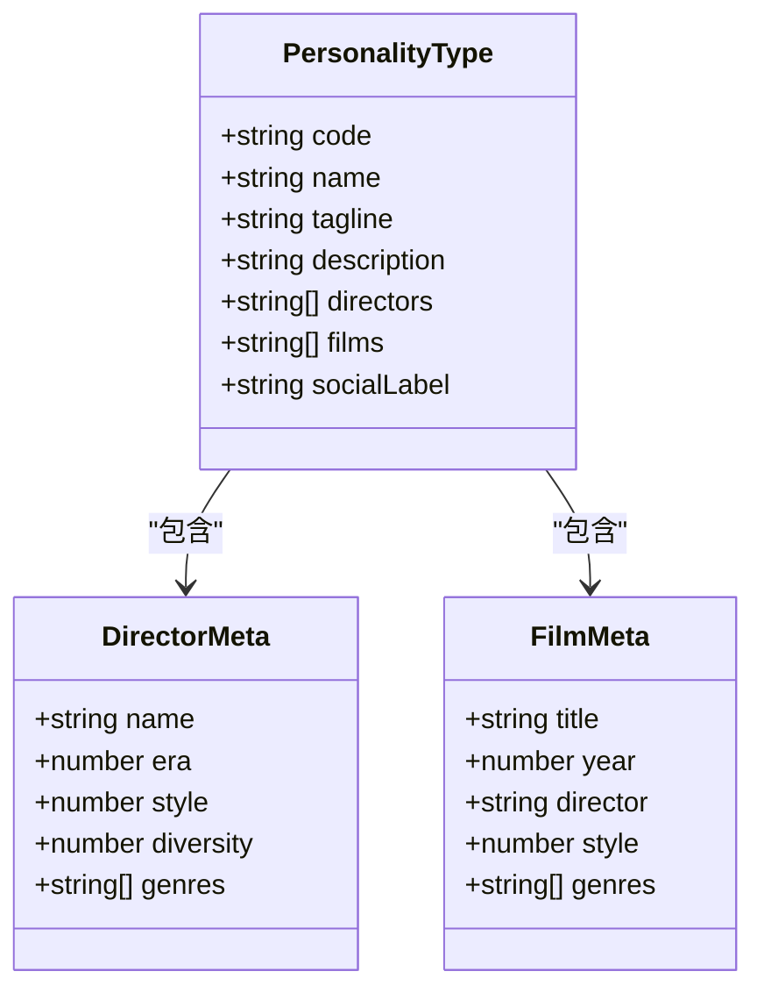
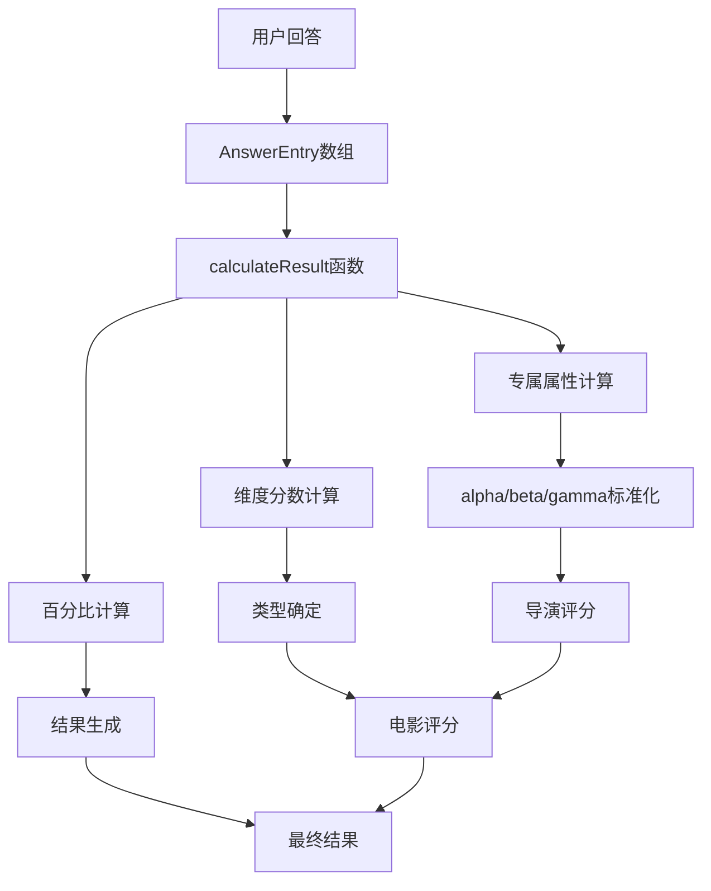

# 数据模型API

<cite>
**本文档引用的文件**
- [types.ts](file://data/types.ts)
- [questions.ts](file://data/questions.ts)
- [directorsMeta.ts](file://data/directorsMeta.ts)
- [calculator.ts](file://utils/calculator.ts)
- [page.tsx](file://app/encyclopedia/page.tsx)
- [result/page.tsx](file://app/result/page.tsx)
</cite>

## 更新摘要
**变更内容**
- 更新了从"隐藏属性"到"专属属性"的品牌重塑
- 新增了"类型基因"（delta）数据模型规范
- 增强了视觉呈现和交互设计的文档说明
- 更新了专属印记勋章体系的详细说明

## 目录
1. [简介](#简介)
2. [项目结构](#项目结构)
3. [核心组件](#核心组件)
4. [架构概览](#架构概览)
5. [详细组件分析](#详细组件分析)
6. [依赖分析](#依赖分析)
7. [性能考虑](#性能考虑)
8. [故障排除指南](#故障排除指南)
9. [结论](#结论)

## 简介

FBTI数据模型系统是一个基于问卷调查的电影类型识别和个性化推荐系统。该系统通过四个核心维度（E/A、X/S、P/W、L/D）来分析用户的观影偏好，并生成个性化的电影推荐结果。

**品牌重塑**：系统已从传统的"隐藏属性"概念升级为"专属属性"，包括：
- 时间穿越者（α）：对影史跨度的感知
- 形式感应器（β）：对电影形式的敏感度  
- 文化通行证（γ）：国际观影广度
- 类型基因（δ）：6种电影类型的偏好强度

系统的核心数据模型包括：
- Question接口：定义问卷题目结构
- PersonalityType接口：描述不同类型人格特征
- SpecialAttributes接口：管理专属属性（α、β、γ、δ）
- DirectorMeta和FilmMeta接口：导演和电影元数据
- 计算器模块：处理数据验证、业务规则和结果生成

## 项目结构



**图表来源**
- [questions.ts:1-1867](file://data/questions.ts#L1-L1867)
- [types.ts:1-428](file://data/types.ts#L1-L428)
- [directorsMeta.ts:1-337](file://data/directorsMeta.ts#L1-L337)
- [calculator.ts:1-504](file://utils/calculator.ts#L1-L504)
- [page.tsx:1-359](file://app/encyclopedia/page.tsx#L1-L359)
- [result/page.tsx:574-1051](file://app/result/page.tsx#L574-L1051)

**章节来源**
- [questions.ts:1-1867](file://data/questions.ts#L1-L1867)
- [types.ts:1-428](file://data/types.ts#L1-L428)
- [directorsMeta.ts:1-337](file://data/directorsMeta.ts#L1-L337)
- [calculator.ts:1-504](file://utils/calculator.ts#L1-L504)
- [page.tsx:1-359](file://app/encyclopedia/page.tsx#L1-L359)
- [result/page.tsx:574-1051](file://app/result/page.tsx#L574-L1051)

## 核心组件

### Question接口规范

Question接口定义了问卷题目的完整结构，包含以下核心字段：

**基础字段**
- `id`: number - 问卷题目的唯一标识符
- `questionType`: "binary" | "multi" | "binary_with_skip" | "multiSelect" - 题目类型枚举
- `primaryDimension`: "EA" | "XS" | "PW" | "LD" | "none" - 主要维度标识
- `text`: string - 问题文本内容
- `options`: QuestionOption[] - 选项数组

**可选字段**
- `image?`: QuestionImage - 图像配置对象
- `profileTags?`: Record<number, string> - 个人档案标签映射
- `maxSelect?`: number - 多选题的最大选择数量

**QuestionOption接口**
- `label`: string - 选项显示文本
- `scores`: Record<string, number> - 维度分数映射
- `hiddenSignals?`: HiddenSignal[] - 专属属性信号数组
- `type`: "substantive" | "skip" - 选项类型

**HiddenSignal接口**
- `attribute`: "α" | "β" | "γ" | "δ" - 专属属性标识符
- `genre?`: string - 类型特定的专属信号
- `weight`: number - 权重值

**章节来源**
- [questions.ts:33-42](file://data/questions.ts#L33-L42)
- [questions.ts:26-31](file://data/questions.ts#L26-L31)
- [questions.ts:1-5](file://data/questions.ts#L1-L5)

### PersonalityType接口规范

PersonalityType接口描述了16种主要人格类型的数据结构：

**核心字段**
- `code`: string - 类型代码（如"EXPL"、"ESWD"等）
- `name`: string - 类型名称
- `tagline`: string - 类型标语
- `description`: string - 详细描述
- `directors`: string[] - 推荐导演列表
- `films`: string[] - 推荐电影列表
- `socialLabel`: string - 社交标签描述

**类型分类**
系统支持16种主要人格类型，分为两大类别：
- **情感体验型**（E系列，8种类型）：共8种类型，强调情感体验和人文关怀
- **理性解析型**（A系列，8种类型）：共8种类型，强调技术分析和逻辑推理

**章节来源**
- [types.ts:1-9](file://data/types.ts#L1-L9)

### SpecialAttributes专属属性规范

SpecialAttributes接口管理用户专属属性，用于个性化推荐：

**属性定义**
- `alpha`: { score: number; rarity: string; label: string } - 时间穿越者属性
- `beta`: { score: number; rarity: string; label: string } - 形式感应器属性  
- `gamma`: { score: number; rarity: string; label: string } - 文化通行证属性
- `delta`: Record<string, number> - 类型基因属性

**专属印记勋章体系**
- `alpha`（时间穿越者）：对影史跨度的感知能力
  - 稀有度：普通、罕见、稀有、传奇
  - 描述：你的影史跨度
- `beta`（形式感应器）：对电影形式的敏感度
  - 稀有度：普通、罕见、稀有、传奇
  - 描述：你对电影形式的感知
- `gamma`（文化通行证）：国际观影广度
  - 稀有度：普通、罕见、稀有、传奇
  - 描述：你的国际观影广度

**类型基因（δ）数据**
- `horror`: 偏好恐怖、悬疑、心理恐惧类叙事
- `comedy`: 偏好幽默、荒诞、轻松解压的喜剧类型
- `scifi`: 偏好未来主义、太空探索、科技伦理类叙事
- `crime`: 偏好犯罪、黑帮、警匪、法庭类叙事
- `animation`: 偏好动画、定格动画、手绘动画等形式
- `documentary`: 偏好纪实、非虚构、真实事件改编类叙事

**属性范围和计算逻辑**
- `alpha`（时间穿越者）：数值范围[0, ∞)，标准化到[0,1]
- `beta`（形式感应器）：数值范围[0, ∞)，标准化到[0,1]  
- `gamma`（文化通行证）：数值范围[0, ∞)，标准化到[0,1]
- `delta`（类型基因）：包含6种类型偏好，数值范围[0, ∞)

**稀有度标签**
- `common`（普通）：基础水平
- `uncommon`（罕见）：具有一定特色
- `rare`（稀有）：独特偏好
- `legendary`（传奇）：极强特色

**章节来源**
- [calculator.ts:16-21](file://utils/calculator.ts#L16-L21)
- [calculator.ts:43-76](file://utils/calculator.ts#L43-L76)
- [directorsMeta.ts:242-278](file://data/directorsMeta.ts#L242-L278)
- [page.tsx:36-70](file://app/encyclopedia/page.tsx#L36-L70)
- [page.tsx:101-108](file://app/encyclopedia/page.tsx#L101-L108)

### DirectorMeta和FilmMeta元数据

**DirectorMeta接口**
- `name`: string - 导演姓名
- `era`: number - 时代标识（1=经典，2=中期，3=当代）
- `style`: number - 艺术风格（0=写实，1=形式主义）
- `diversity`: number - 地域多样性（0=主流，1=国际/独立）
- `genres`: string[] - 专长类型列表

**FilmMeta接口**
- `title`: string - 电影标题
- `year`: number - 上映年份
- `director`: string - 导演姓名
- `style`: number - 艺术风格
- `genres`: string[] - 类型列表

**章节来源**
- [directorsMeta.ts:5-19](file://data/directorsMeta.ts#L5-L19)

## 架构概览



**图表来源**
- [calculator.ts:235-444](file://utils/calculator.ts#L235-L444)
- [questions.ts:44-1867](file://data/questions.ts#L44-L1867)

## 详细组件分析

### Question数据验证规则

**必填字段验证**
- `id`: 必须为正整数，且在问卷范围内
- `questionType`: 必须为预定义枚举值之一
- `primaryDimension`: 必须为有效维度标识符
- `text`: 必须为非空字符串
- `options`: 必须为非空数组

**数据类型检查**
- `questionType`: 字符串枚举类型
- `primaryDimension`: 字符串枚举类型
- `maxSelect`: 数字类型，仅在multiSelect类型中使用
- `options`: 数组类型，每个元素必须符合QuestionOption结构

**取值范围限制**
- `maxSelect`: 必须大于0且小于等于options.length
- `scores`中的数值：支持正数、负数和零
- `hiddenSignals`中的weight：支持正数、负数和零

**章节来源**
- [questions.ts:33-42](file://data/questions.ts#L33-L42)
- [questions.ts:26-31](file://data/questions.ts#L26-L31)

### SpecialAttributes计算逻辑

**属性标准化**
专属属性通过以下公式进行标准化：
```
normalized = min(1, max(0, raw_score / max_threshold))
```

**稀有度判定阈值**
- `alpha`：阈值[2, 5, 8]对应[rare, uncommon, common]
- `beta`：阈值[3, 7, 12]对应[rare, uncommon, common]  
- `gamma`：阈值[1, 3, 5]对应[rare, uncommon, common]

**属性权重分配**
- `alpha`（时间穿越者）：影响导演和电影的年代偏好
- `beta`（形式感应器）：影响导演和电影的艺术风格偏好
- `gamma`（文化通行证）：影响导演和电影的地域偏好
- `delta`（类型基因）：影响6种电影类型的偏好强度

**类型基因雷达图**
结果页面使用SVG雷达图展示类型基因分布：
- 6个维度：恐怖、喜剧、科幻、犯罪、动画、纪录片
- 颜色编码：每种类型基因对应特定颜色
- 动态交互：悬停显示详细信息和数值

**章节来源**
- [calculator.ts:499-503](file://utils/calculator.ts#L499-L503)
- [calculator.ts:64-76](file://utils/calculator.ts#L64-L76)
- [result/page.tsx:593-600](file://app/result/page.tsx#L593-L600)
- [result/page.tsx:785-811](file://app/result/page.tsx#L785-L811)

### PersonalityType关联关系

**类型层次结构**


**图表来源**
- [types.ts:1-9](file://data/types.ts#L1-L9)
- [directorsMeta.ts:5-19](file://data/directorsMeta.ts#L5-L19)

**章节来源**
- [types.ts:11-427](file://data/types.ts#L11-L427)

### 数据模型之间的引用路径

**计算流程图**


**图表来源**
- [calculator.ts:235-444](file://utils/calculator.ts#L235-L444)
- [directorsMeta.ts:242-278](file://data/directorsMeta.ts#L242-L278)

**章节来源**
- [calculator.ts:446-493](file://utils/calculator.ts#L446-L493)

## 依赖分析

```mermaid
graph LR
subgraph "外部依赖"
TS[TypeScript]
NODE[Node.js运行时]
NEXT[Next.js框架]
END
subgraph "内部模块"
QUEST[data/questions.ts]
TYPES[data/types.ts]
DIRECT[data/directorsMeta.ts]
CALC[utils/calculator.ts]
ENCY[app/encyclopedia/page.tsx]
RESULT[app/result/page.tsx]
END
TS --> QUEST
TS --> TYPES
TS --> DIRECT
TS --> CALC
TS --> ENCY
TS --> RESULT
QUEST --> CALC
TYPES --> CALC
DIRECT --> CALC
CALC --> QUEST
CALC --> TYPES
CALC --> DIRECT
ENCY --> TYPES
ENCY --> CALC
RESULT --> CALC
```

**图表来源**
- [questions.ts:1-1867](file://data/questions.ts#L1-L1867)
- [types.ts:1-428](file://data/types.ts#L1-L428)
- [directorsMeta.ts:1-337](file://data/directorsMeta.ts#L1-L337)
- [calculator.ts:1-504](file://utils/calculator.ts#L1-L504)
- [page.tsx:1-359](file://app/encyclopedia/page.tsx#L1-L359)
- [result/page.tsx:574-1051](file://app/result/page.tsx#L574-L1051)

**章节来源**
- [calculator.ts:1-4](file://utils/calculator.ts#L1-L4)

## 性能考虑

**数据结构优化**
- 使用Record<string, T>模式减少重复代码
- 数组操作采用Map/Filter/Sort组合提高效率
- 缓存常用查询结果避免重复计算

**内存使用**
- SpecialAttributes使用轻量级对象结构
- 评分函数采用增量计算避免重复遍历
- 类型数据按需加载，支持懒加载机制

**扩展性设计**
- 支持动态添加新的专属属性
- 可配置的阈值系统便于调整算法参数
- 模块化设计便于功能扩展和维护

## 故障排除指南

**常见问题诊断**

1. **专属属性计算异常**
   - 检查alpha/beta/gamma的权重是否为正数
   - 验证标准化阈值设置是否合理
   - 确认稀有度标签映射表完整性

2. **类型基因雷达图显示异常**
   - 检查delta属性的6个类型键是否存在
   - 验证数值范围是否在预期范围内
   - 确认SVG坐标计算的正确性

3. **类型推荐不准确**
   - 检查PersonalityType数据完整性
   - 验证导演和电影元数据的有效性
   - 确认评分函数的权重分配

4. **图鉴页面显示问题**
   - 检查专属印记勋章的颜色配置
   - 验证类型基因的颜色映射
   - 确认响应式布局的正确性

**调试建议**
- 使用console.log输出中间计算结果
- 实施单元测试覆盖关键计算逻辑
- 监控内存使用情况避免泄漏
- 实施错误边界处理机制

**章节来源**
- [calculator.ts:235-444](file://utils/calculator.ts#L235-L444)
- [directorsMeta.ts:242-278](file://data/directorsMeta.ts#L242-L278)
- [page.tsx:311-333](file://app/encyclopedia/page.tsx#L311-L333)
- [result/page.tsx:785-811](file://app/result/page.tsx#L785-L811)

## 结论

FBTI数据模型系统通过精心设计的数据接口和计算逻辑，实现了对用户观影偏好的精准识别和个性化推荐。系统的核心优势包括：

1. **完整的数据模型**：涵盖问卷、类型、元数据和专属属性的完整数据结构
2. **严格的验证机制**：确保数据质量和计算准确性
3. **灵活的扩展性**：支持新的属性和类型添加
4. **高效的性能表现**：优化的数据结构和算法实现
5. **现代化的用户体验**：从传统的隐藏属性升级为专属属性，提供更直观的个性化体验

**品牌重塑亮点**：
- 专属属性概念更加贴近用户认知
- 类型基因雷达图提供可视化反馈
- 增强的视觉设计和交互体验

该系统为电影推荐和个人化服务提供了坚实的数据基础和技术保障，具有良好的应用前景和发展潜力。