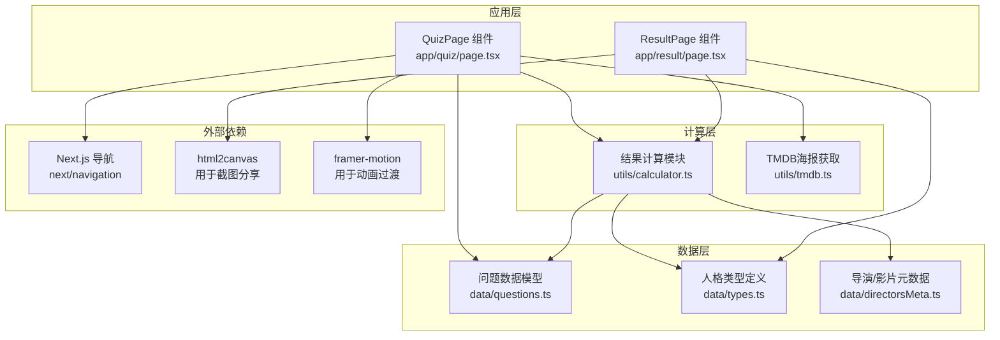
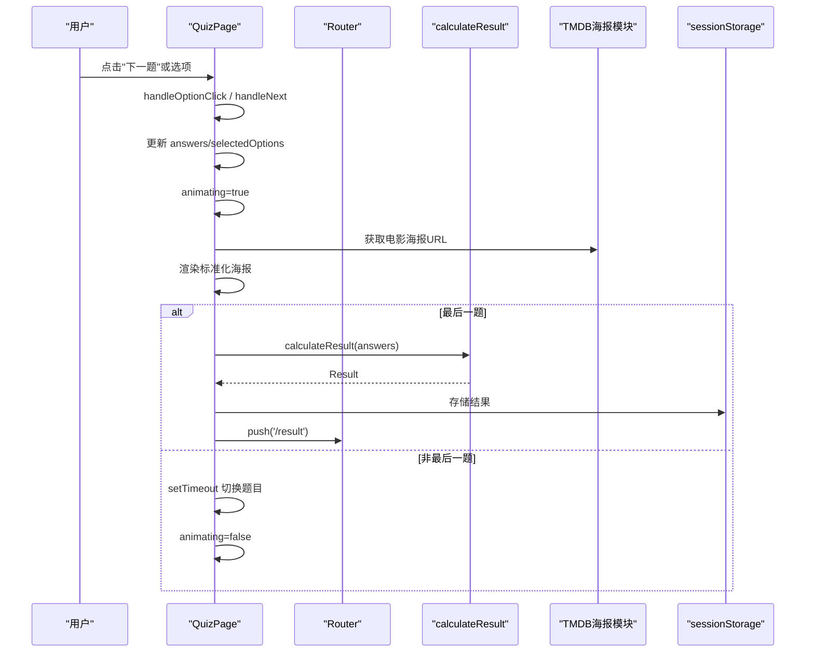
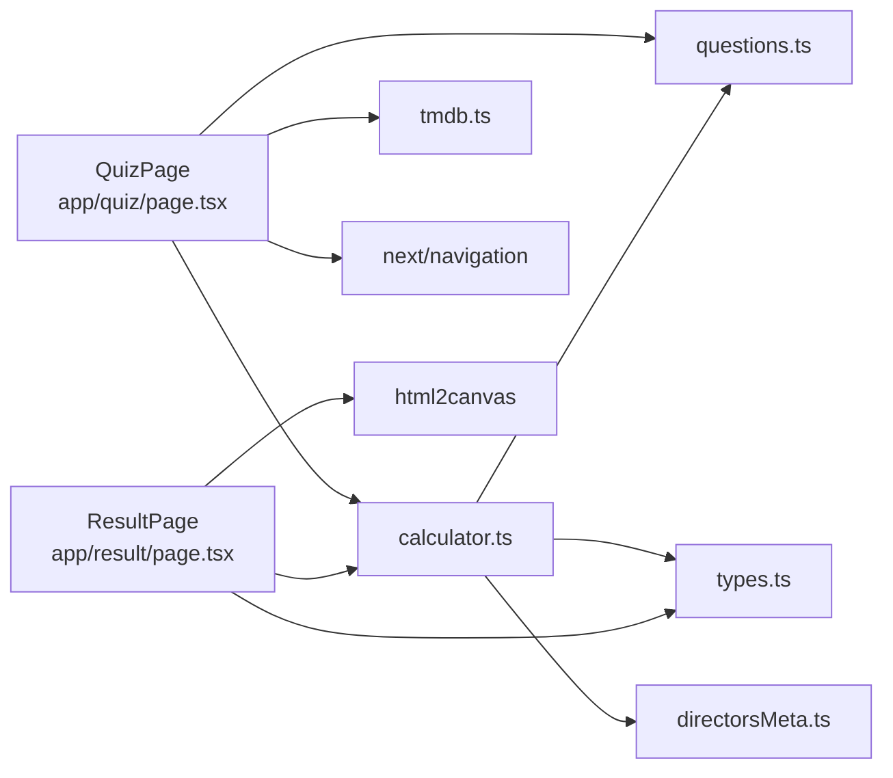

# 测试问答API

<cite>
**本文引用的文件**
- [app/quiz/page.tsx](file://app/quiz/page.tsx)
- [utils/calculator.ts](file://utils/calculator.ts)
- [utils/tmdb.ts](file://utils/tmdb.ts)
- [data/questions.ts](file://data/questions.ts)
- [data/types.ts](file://data/types.ts)
- [app/result/page.tsx](file://app/result/page.tsx)
- [data/directorsMeta.ts](file://data/directorsMeta.ts)
- [package.json](file://package.json)
</cite>

## 更新摘要
**变更内容**
- 更新了QuizPage组件的UI架构，包括标准化的电影海报展示系统
- 新增了改进的标题覆盖层和更好的用户交互体验
- 优化了图像占位符组件，支持多种布局模式
- 增强了渐变背景和视觉层次效果
- 改进了动画控制和进度跟踪机制

## 目录
1. [简介](#简介)
2. [项目结构](#项目结构)
3. [核心组件](#核心组件)
4. [架构总览](#架构总览)
5. [详细组件分析](#详细组件分析)
6. [依赖分析](#依赖分析)
7. [性能考虑](#性能考虑)
8. [故障排查指南](#故障排查指南)
9. [结论](#结论)
10. [附录](#附录)

## 简介
本文件为 FBTI 测试问答系统的 API 参考文档，重点围绕 QuizPage 组件的接口规范进行系统化说明，覆盖 props 定义、状态管理、事件处理函数、问题类型系统、动画与进度控制、以及与计算模块的集成方式。文档同时提供 AnswerEntry 接口说明、handleOptionClick、handleNext、handleBack 等核心方法的参数与行为约定，并给出完整的使用示例与最佳实践建议，帮助开发者快速集成与扩展问答系统。

**更新** 本次更新重点关注quiz页面的重大UI改进，包括标准化的电影海报展示系统、改进的标题覆盖层设计和增强的用户交互体验。

## 项目结构
- 应用入口位于 app/quiz/page.tsx，负责问答流程与交互。
- 计算模块位于 utils/calculator.ts，负责根据用户回答计算最终结果。
- TMDB电影海报获取模块位于 utils/tmdb.ts，负责电影海报的预获取和管理。
- 数据模型位于 data/questions.ts、data/types.ts、data/directorsMeta.ts，定义问题、类型与元数据。
- 结果页位于 app/result/page.tsx，负责展示与导出结果。
- 依赖声明位于 package.json，包含 Next.js、React、html2canvas、framer-motion 等。

**图表来源**
- [app/quiz/page.tsx:19-262](file://app/quiz/page.tsx#L19-L262)
- [utils/calculator.ts:235-444](file://utils/calculator.ts#L235-L444)
- [utils/tmdb.ts:110-151](file://utils/tmdb.ts#L110-L151)
- [data/questions.ts:33-42](file://data/questions.ts#L33-L42)
- [data/types.ts:11-427](file://data/types.ts#L11-L427)
- [data/directorsMeta.ts:22-116](file://data/directorsMeta.ts#L22-L116)
- [app/result/page.tsx:64-134](file://app/result/page.tsx#L64-L134)

**章节来源**
- [app/quiz/page.tsx:19-262](file://app/quiz/page.tsx#L19-L262)
- [utils/calculator.ts:235-444](file://utils/calculator.ts#L235-L444)
- [utils/tmdb.ts:110-151](file://utils/tmdb.ts#L110-L151)
- [data/questions.ts:33-42](file://data/questions.ts#L33-L42)
- [data/types.ts:11-427](file://data/types.ts#L11-L427)
- [data/directorsMeta.ts:22-116](file://data/directorsMeta.ts#L22-L116)
- [app/result/page.tsx:64-134](file://app/result/page.tsx#L64-L134)

## 核心组件
- QuizPage 组件：负责渲染当前题目、处理选项点击、前进/后退、进度与动画控制、以及跳转至结果页。
- 计算模块 calculateResult：接收 AnswerEntry 数组，计算维度得分、百分比、隐藏属性、画像与推荐导演/影片等。
- TMDB海报获取模块：负责预获取电影海报URL，支持电影海报的标准化展示。
- 问题数据模型：定义 Question、QuestionOption、QuestionImage 等接口，支撑题型与图片占位渲染。
- 人格类型与元数据：定义 personalityTypes 与 directorsMeta、filmsMeta，用于个性化推荐与标签生成。

**章节来源**
- [app/quiz/page.tsx:19-262](file://app/quiz/page.tsx#L19-L262)
- [utils/calculator.ts:235-444](file://utils/calculator.ts#L235-L444)
- [utils/tmdb.ts:110-151](file://utils/tmdb.ts#L110-L151)
- [data/questions.ts:33-42](file://data/questions.ts#L33-L42)
- [data/types.ts:11-427](file://data/types.ts#L11-L427)
- [data/directorsMeta.ts:22-116](file://data/directorsMeta.ts#L22-L116)

## 架构总览
QuizPage 通过 useState 管理当前题目索引、已选选项、动画状态与确认模态框；通过 useCallback 缓存事件处理器以减少重渲染；通过 useRouter 实现页面跳转；通过 sessionStorage 传递结果数据；通过计算模块完成最终评分与画像生成。

**图表来源**
- [app/quiz/page.tsx:39-95](file://app/quiz/page.tsx#L39-L95)
- [utils/calculator.ts:235-444](file://utils/calculator.ts#L235-L444)
- [utils/tmdb.ts:110-151](file://utils/tmdb.ts#L110-L151)

**章节来源**
- [app/quiz/page.tsx:39-95](file://app/quiz/page.tsx#L39-L95)
- [utils/calculator.ts:235-444](file://utils/calculator.ts#L235-L444)
- [utils/tmdb.ts:110-151](file://utils/tmdb.ts#L110-L151)

## 详细组件分析

### QuizPage 组件 API 规范
- 组件名称：QuizPage
- 文件位置：app/quiz/page.tsx
- 作用：承载问答流程，管理状态与事件，渲染题目与选项，控制动画与进度，处理跳转。

- Props（组件自身不接收外部 props）
  - 无外部 props，内部通过 useState 管理状态。

- 状态管理
  - currentQuestion: number — 当前题目索引
  - answers: AnswerEntry[] — 已提交的答案集合
  - selectedOptions: number[] — 当前题目的已选选项索引（多选时累计）
  - animating: boolean — 动画过渡中，防止重复点击
  - showConfirmModal: boolean — 是否显示"返回主页"确认模态框

- 事件处理函数
  - handleOptionClick(optIdx: number): void
    - 参数：optIdx — 选项索引
    - 行为：
      - 若处于动画中则忽略
      - 若为多选题：切换选中/取消，受 maxSelect 限制
      - 若为二选题或普通多选：点击即自动进入下一题
      - 若为 binary_with_skip 且点击 skip：立即进入下一题
    - 调用时机：选项按钮点击
  - handleNext(opts: number[]): void
    - 参数：opts — 当前题目的选项索引数组
    - 行为：
      - 若处于动画中则忽略
      - 清除当前题目的旧答案，写入新答案
      - 若非最后一题：延时切换题目，重置选中项，结束动画
      - 若为最后一题：计算结果、存储到 sessionStorage、跳转至结果页
    - 调用时机：多选题"下一题"按钮点击或单选/二选自动前进
  - handleBack(): void
    - 行为：若非第一题，回到上一题并恢复其答案
    - 调用时机：头部"上一题"按钮点击
  - handleHomeClick(): void
    - 行为：显示"返回主页"确认模态框
  - handleConfirmHome(): void
    - 行为：跳转至首页
  - handleCancelHome(): void
    - 行为：关闭确认模态框

- 进度与动画
  - progress：基于当前题号与总题数计算百分比，用于进度条
  - animating：控制题目切换时的淡入淡出与位移动画
  - 通过 setTimeout 控制动画时序，确保 UI 与数据更新顺序一致

- 题目类型与渲染
  - 根据 question.questionType 判断渲染逻辑：
    - binary：二选题，点击即前进
    - multi：多选题，支持多项选择，需显式点击"下一题"
    - binary_with_skip：二选题含"跳过"，点击跳过即前进
    - multiSelect：多选题，支持 maxSelect 限制
  - 图片占位：根据 QuestionImage 的布局类型渲染不同样式的占位图，支持单列、分割、3宫格、4宫格等多种布局

- 状态同步与路由跳转
  - 使用 sessionStorage 存储最终结果，结果页通过 sessionStorage 读取并清理
  - 使用 Next.js 的 useRouter 实现页面跳转

**章节来源**
- [app/quiz/page.tsx:19-262](file://app/quiz/page.tsx#L19-L262)
- [app/quiz/page.tsx:39-95](file://app/quiz/page.tsx#L39-L95)

### AnswerEntry 接口
- 定义位置：app/quiz/page.tsx 与 utils/calculator.ts
- 字段说明
  - questionIndex: number — 对应的问题索引（questions 数组下标）
  - optionIndices: number[] — 当前题目的选项索引数组（多选题可能包含多个）

- 用途
  - 作为 handleNext 的输入参数，参与 calculateResult 的计算
  - 作为 answers 状态的一部分，用于恢复与导航

**章节来源**
- [app/quiz/page.tsx:14-17](file://app/quiz/page.tsx#L14-L17)
- [utils/calculator.ts:78-81](file://utils/calculator.ts#L78-L81)

### 问题类型系统
- Question 接口
  - questionType: "binary" | "multi" | "binary_with_skip" | "multiSelect"
  - primaryDimension: "EA" | "XS" | "PW" | "LD" | "none"
  - text: string
  - options: QuestionOption[]
  - image?: QuestionImage
  - profileTags?: Record<number, string>
  - maxSelect?: number

- QuestionOption 接口
  - label: string
  - scores: Record<string, number>
  - hiddenSignals?: HiddenSignal[]
  - type: "substantive" | "skip"

- QuestionImage 接口
  - type: "tmdb" | "ai_placeholder"
  - layout: "single" | "split" | "grid3" | "grid4"
  - tmdb?: TmdbFilm[]
  - aiPrompts?: AiPrompt[]

- 处理逻辑
  - binary：二选题，点击即前进
  - multi：多选题，支持多项选择，需显式点击"下一题"
  - binary_with_skip：二选题含"跳过"，点击跳过即前进
  - multiSelect：多选题，受 maxSelect 限制，权重按选择数量平均分配

**章节来源**
- [data/questions.ts:33-42](file://data/questions.ts#L33-L42)
- [data/questions.ts:26-31](file://data/questions.ts#L26-L31)
- [data/questions.ts:19-24](file://data/questions.ts#L19-L24)

### TMDB海报获取模块
- 模块功能：负责预获取电影海报URL，支持电影海报的标准化展示
- 主要函数
  - initMoviePosters(): Promise<Record<string, string | null>>
    - 预获取所有问题中涉及的电影海报URL
    - 返回电影标题到海报URL的映射
  - fetchMoviePosters(movies: { title: string; year: number }[]): Promise<Record<string, string | null>>
    - 批量获取电影海报URL
    - 支持带年份和不带年份的搜索回退
  - searchMovie(query: string, year?: number): Promise<TmdbMovie | null>
    - 搜索TMDB电影信息
    - 支持年份参数

- 预定义电影列表：包含24部经典电影，涵盖科幻、剧情、动画等多个类型

**章节来源**
- [utils/tmdb.ts:110-151](file://utils/tmdb.ts#L110-L151)
- [utils/tmdb.ts:92-108](file://utils/tmdb.ts#L92-L108)
- [utils/tmdb.ts:57-80](file://utils/tmdb.ts#L57-L80)

### 计算模块 API
- 函数：calculateResult(answers: AnswerEntry[]): Result
  - 输入：AnswerEntry[] — 用户答题记录
  - 输出：Result — 包含类型代码、维度得分、百分比、隐藏属性、画像、推荐导演/影片等
  - 关键步骤：
    - 遍历答案，统计 skipCount
    - 根据题型与选项权重累加维度得分
    - 计算各维度百分比
    - 生成隐藏属性（alpha/beta/gamma）与类型基因（delta）
    - 生成观影画像（profile）与推荐导演/影片
    - 判断是否为"银幕社会学家"

- Result 接口
  - type: string
  - scores: Scores
  - percentages: Record<string, { winner: string; pct: number }>
  - hidden: HiddenAttributes
  - profile: ProfileResult | null
  - filmSociologist: boolean
  - skipCount: number
  - topDirectors: string[]
  - topFilms: string[]

**章节来源**
- [utils/calculator.ts:235-444](file://utils/calculator.ts#L235-L444)
- [utils/calculator.ts:31-41](file://utils/calculator.ts#L31-L41)

### ImagePlaceholder 组件
- 组件功能：根据 QuestionImage 的布局类型渲染不同样式的电影海报占位图
- 支持的布局类型：
  - single：单列海报，使用渐变背景
  - split：左右分割布局，支持AI占位符
  - grid3：3宫格布局
  - grid4：4宫格布局
- 渐变背景系统：为不同布局提供协调的视觉效果
- 标准化展示：统一的边框、圆角和阴影效果

**章节来源**
- [app/quiz/page.tsx:301-394](file://app/quiz/page.tsx#L301-L394)

### 使用示例与最佳实践
- 在组件中集成问答系统
  - 引入 useRouter、questions 数据、calculateResult
  - 使用 useState 管理 currentQuestion、answers、selectedOptions、animating
  - 通过 handleOptionClick 与 handleNext 实现答题与前进
  - 在最后一题调用 calculateResult，将结果存入 sessionStorage 并跳转至结果页
  - 在结果页通过 sessionStorage 读取结果并展示

- 状态同步与路由跳转
  - 通过 sessionStorage 传递结果，避免路由参数带来的复杂性
  - 在结果页清理 sessionStorage，确保重新开始时干净的状态

- 动画与进度控制
  - 使用 animating 控制过渡动画，避免重复点击
  - 使用 progress 计算百分比，配合 CSS 过渡实现平滑进度条

- 电影海报展示
  - 使用 TMDB 模块预获取海报URL，提升加载性能
  - 通过 ImagePlaceholder 组件实现标准化的海报展示
  - 支持多种布局模式，适应不同题目的视觉需求

**章节来源**
- [app/quiz/page.tsx:19-262](file://app/quiz/page.tsx#L19-L262)
- [app/result/page.tsx:64-134](file://app/result/page.tsx#L64-L134)

## 依赖分析
- 内部依赖
  - app/quiz/page.tsx 依赖 data/questions.ts、utils/calculator.ts、utils/tmdb.ts、next/navigation
  - utils/calculator.ts 依赖 data/questions.ts、data/types.ts、data/directorsMeta.ts
  - app/result/page.tsx 依赖 utils/calculator.ts、data/types.ts

- 外部依赖
  - next/navigation：页面跳转
  - html2canvas：结果页截图分享
  - framer-motion：动画过渡（在结果页中使用）

**图表来源**
- [app/quiz/page.tsx:5-6](file://app/quiz/page.tsx#L5-L6)
- [utils/calculator.ts:1-3](file://utils/calculator.ts#L1-L3)
- [utils/tmdb.ts:1-3](file://utils/tmdb.ts#L1-L3)
- [app/result/page.tsx:3-9](file://app/result/page.tsx#L3-L9)

**章节来源**
- [app/quiz/page.tsx:5-6](file://app/quiz/page.tsx#L5-L6)
- [utils/calculator.ts:1-3](file://utils/calculator.ts#L1-L3)
- [utils/tmdb.ts:1-3](file://utils/tmdb.ts#L1-L3)
- [app/result/page.tsx:3-9](file://app/result/page.tsx#L3-L9)

## 性能考虑
- 事件处理器缓存
  - 使用 useCallback 包装 handleOptionClick、handleNext、handleBack，减少不必要的重渲染
- 动画时序
  - 使用 setTimeout 控制动画与状态切换的时序，避免 UI 与数据不同步
- 电影海报预加载
  - 通过 initMoviePosters 预获取所有海报URL，减少运行时加载延迟
- 选项权重
  - multiSelect 模式下按选择数量平均分配权重，降低计算复杂度
- 结果计算
  - calculateResult 采用单次遍历聚合维度得分，时间复杂度 O(N)，N 为答案数量

## 故障排查指南
- 无法前进到下一题
  - 检查 animating 状态是否为 true（动画中会阻止操作）
  - 确认 handleNext 的调用时机与参数（多选题需传入 selectedOptions）
- 选项无法切换
  - 多选题受 maxSelect 限制，检查题目的 maxSelect 设置
- 最后一题未跳转
  - 确认 calculateResult 已被调用并将结果存入 sessionStorage
  - 检查 useRouter 的 push 调用
- 结果页空白
  - 确认 sessionStorage 中存在 fbti_result
  - 检查结果页的 useEffect 与 sessionStorage 读取逻辑
- 电影海报显示异常
  - 检查 TMDB 模块的海报URL获取是否成功
  - 确认 ImagePlaceholder 组件的布局参数正确
- UI布局问题
  - 检查渐变背景类名是否正确应用
  - 确认响应式布局断点设置

**章节来源**
- [app/quiz/page.tsx:39-95](file://app/quiz/page.tsx#L39-L95)
- [app/result/page.tsx:64-93](file://app/result/page.tsx#L64-L93)
- [utils/tmdb.ts:110-151](file://utils/tmdb.ts#L110-L151)

## 结论
QuizPage 组件提供了清晰的问答流程与状态管理，结合 calculateResult 的结果计算和 TMDB 海报获取模块，实现了从答题到画像生成的完整闭环。通过 AnswerEntry 接口与题型系统，系统支持多种题型与复杂的权重分配；通过标准化的电影海报展示和改进的UI设计，显著提升了用户体验。新增的渐变背景系统、多种布局模式和动画控制，使得问答界面更加美观和专业。建议在集成时重点关注状态同步、动画时序、题型差异和电影海报展示的性能优化，以获得稳定可靠的问答体验。

## 附录

### API 速查表
- QuizPage
  - 状态：currentQuestion, answers, selectedOptions, animating, showConfirmModal
  - 方法：handleOptionClick, handleNext, handleBack, handleHomeClick, handleConfirmHome, handleCancelHome
- AnswerEntry
  - 字段：questionIndex, optionIndices
- Question 接口
  - 字段：questionType, primaryDimension, text, options, image, profileTags, maxSelect
- TMDB 模块
  - 函数：initMoviePosters(), fetchMoviePosters(), searchMovie()
- 计算函数
  - calculateResult(answers): Result

**章节来源**
- [app/quiz/page.tsx:19-262](file://app/quiz/page.tsx#L19-L262)
- [app/quiz/page.tsx:14-17](file://app/quiz/page.tsx#L14-L17)
- [data/questions.ts:33-42](file://data/questions.ts#L33-L42)
- [utils/calculator.ts:235-444](file://utils/calculator.ts#L235-L444)
- [utils/tmdb.ts:110-151](file://utils/tmdb.ts#L110-L151)