# 计算引擎API

<cite>
**本文档引用的文件**
- [calculator.ts](file://utils/calculator.ts)
- [types.ts](file://data/types.ts)
- [questions.ts](file://data/questions.ts)
- [questions-test.ts](file://data/questions-test.ts)
- [directorsMeta.ts](file://data/directorsMeta.ts)
- [page.tsx](file://app/quiz/page.tsx)
- [page.tsx](file://app/result/page.tsx)
- [page.tsx](file://app/test/page.tsx)
- [page.tsx](file://app/test/quiz/page.tsx)
- [quick-test.js](file://scripts/quick-test.js)
- [quick-test-simple.js](file://scripts/quick-test-simple.js)
</cite>

## 更新摘要
**变更内容**
- 新增快速测试权重补偿系统，针对答题数 ≤ 25 的精简版测试进行特殊处理
- 更新隐藏属性稀有度阈值和标签系统
- 增强个性化推荐算法的权重分配
- 新增测试模式和快速测试脚本支持
- 改进UI组件的隐藏属性展示和基因分析功能

## 目录
1. [简介](#简介)
2. [项目结构](#项目结构)
3. [核心组件](#核心组件)
4. [架构概览](#架构概览)
5. [详细组件分析](#详细组件分析)
6. [快速测试系统](#快速测试系统)
7. [UI组件设计](#ui组件设计)
8. [依赖分析](#依赖分析)
9. [性能考虑](#性能考虑)
10. [故障排除指南](#故障排除指南)
11. [结论](#结论)

## 简介

FBTI计算引擎是一个基于问卷调查的电影人格类型识别系统。该引擎通过分析用户的观影偏好和行为模式，生成个性化的电影人格类型报告，包括基础维度分数、隐藏属性分析、个性化推荐等内容。

本API文档专注于`calculateResult`函数的完整接口规范，涵盖输入参数格式、返回值结构、计算逻辑以及隐藏属性的详细说明。特别关注新增的快速测试权重补偿系统和增强的个性化推荐算法。

## 项目结构

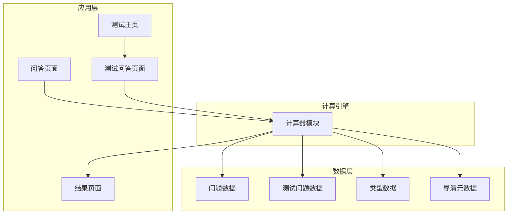

**图表来源**
- [page.tsx:87-95](file://app/quiz/page.tsx#L87-L95)
- [page.tsx:135-188](file://app/result/page.tsx#L135-L188)
- [page.tsx:31-37](file://app/test/page.tsx#L31-L37)
- [page.tsx:21-78](file://app/test/quiz/page.tsx#L21-L78)

**章节来源**
- [page.tsx:1-395](file://app/quiz/page.tsx#L1-L395)
- [page.tsx:1-567](file://app/test/quiz/page.tsx#L1-L567)
- [calculator.ts:1-644](file://utils/calculator.ts#L1-L644)

## 核心组件

### 主要接口定义

计算引擎的核心接口包括以下关键类型：

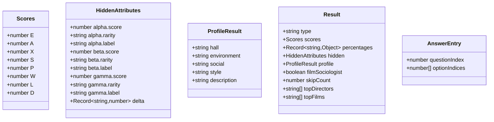

**图表来源**
- [calculator.ts:5-41](file://utils/calculator.ts#L5-L41)
- [calculator.ts:78-81](file://utils/calculator.ts#L78-L81)

### 输入参数规范

`calculateResult`函数接受以下输入参数：

| 参数名称 | 类型 | 必填 | 描述 |
|---------|------|------|------|
| answers | AnswerEntry[] | 是 | 用户的答案数组，每个元素包含问题索引和选项索引数组 |

**章节来源**
- [calculator.ts:353-584](file://utils/calculator.ts#L353-L584)

## 架构概览

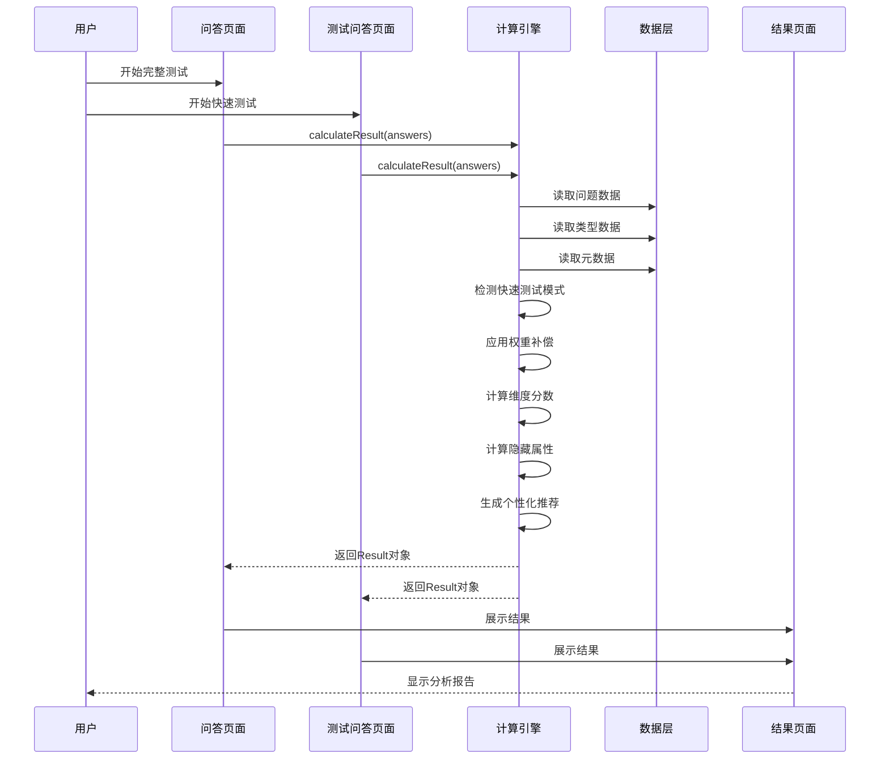

**图表来源**
- [page.tsx:87-95](file://app/quiz/page.tsx#L87-L95)
- [page.tsx:149-157](file://app/test/quiz/page.tsx#L149-L157)
- [calculator.ts:353-584](file://utils/calculator.ts#L353-L584)

## 详细组件分析

### calculateResult 函数详解

#### 函数签名
```typescript
export function calculateResult(answers: AnswerEntry[]): Result
```

#### 输入参数格式

`AnswerEntry`接口定义：
- `questionIndex`: number - 问题在问题数组中的索引
- `optionIndices`: number[] - 用户选择的选项索引数组

#### 计算流程

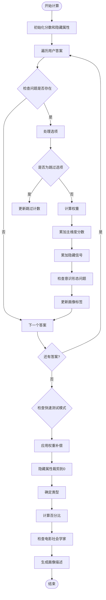

**图表来源**
- [calculator.ts:387-584](file://utils/calculator.ts#L387-L584)

#### 返回值结构

`Result`对象包含以下字段：

| 字段名 | 类型 | 描述 |
|-------|------|------|
| type | string | 四字母类型代码（如 EXPL） |
| scores | Scores | 八个维度的基础分数 |
| percentages | Record<string, { winner: string; pct: number }> | 每个维度对的相对百分比 |
| hidden | HiddenAttributes | 隐藏属性分析结果 |
| profile | ProfileResult \| null | 观影画像信息 |
| filmSociologist | boolean | 是否触发电影社会学家彩蛋 |
| skipCount | number | 跳过的问题数量 |
| topDirectors | string[] | 个性化推荐的导演（前3名） |
| topFilms | string[] | 个性化推荐的电影（前3名） |

**章节来源**
- [calculator.ts:31-41](file://utils/calculator.ts#L31-L41)
- [calculator.ts:353-584](file://utils/calculator.ts#L353-L584)

### 快速测试权重补偿系统

**新增功能**：针对答题数 ≤ 25 的精简版测试，系统会自动应用权重补偿算法：

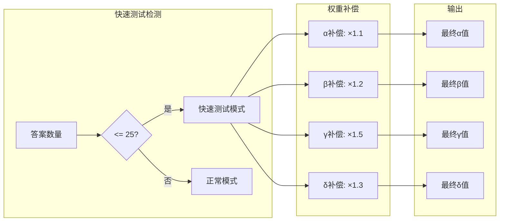

**补偿系数详情**：
- α（时间穿越者）：×1.1
- β（形式感应器）：×1.2  
- γ（文化通行证）：×1.5
- δ（类型基因）：×1.3

**章节来源**
- [calculator.ts:475-484](file://utils/calculator.ts#L475-L484)

### 隐藏属性计算方法

#### α（Alpha）属性 - 时间穿越者

**计算公式**：
- 直接累加所有与时间跨度相关的隐藏信号权重
- 使用阈值进行稀有度分级：[2, 4, 6]

**权重分配**：
- 1920年代默片：+2
- 1970年代经典：+1  
- 2000年代新片：+0.5
- 跳过选项：-1

**稀有度等级**：
- 常见：0-2分
- 罕见：2-4分
- 稀有：4-6分
- 传奇：6分以上

#### β（Beta）属性 - 形式感应器

**计算公式**：
- 直接累加所有与电影形式感知相关的隐藏信号权重
- 使用阈值进行稀有度分级：[3, 7, 12]

**权重分配**：
- 视听语言：+1
- 技术层面：+2
- 跳过选项：-1

**稀有度等级**：
- 常见：0-3分
- 罕见：3-7分
- 稀有：7-12分  
- 传奇：12分以上

#### γ（Gamma）属性 - 文化通行证

**计算公式**：
- 直接累加所有与国际电影相关的隐藏信号权重
- 使用阈值进行稀有度分级：[2, 4, 6]

**权重分配**：
- 主流好莱坞：+0
- 亚洲/欧洲电影：+1
- 跳过选项：-1

**稀有度等级**：
- 常见：0-2分
- 罕见：2-4分
- 稀有：4-6分
- 传奇：6分以上

#### δ（Delta）属性 - 类型基因

**计算公式**：
- 按电影类型分别累加权重
- 不进行稀有度分级

**类型权重**：
- 恐怖片：+1
- 喜剧：+1  
- 科幻：+1
- 犯罪：+1
- 动画：+1
- 纪录片：+1

**章节来源**
- [calculator.ts:16-21](file://utils/calculator.ts#L16-L21)
- [calculator.ts:43-62](file://utils/calculator.ts#L43-L62)
- [calculator.ts:306-329](file://utils/calculator.ts#L306-L329)
- [calculator.ts:346-352](file://utils/calculator.ts#L346-L352)

### 评分算法实现

#### 主维度分数计算

每个问题的选项都包含`scores`属性，格式为`Record<string, number>`，其中键对应不同的维度：

| 维度代码 | 维度名称 | 描述 |
|---------|----------|------|
| E | 共情 | 用情感和直觉感受电影 |
| A | 解析 | 用理性和技法解读电影 |
| X | 拓荒 | 跨越文化与类型的边界 |
| S | 深耕 | 在一个领域越走越深 |
| P | 微光 | 聚焦一个人的内心旅程 |
| W | 广角 | 展开时代全景 |
| L | 向阳 | 相信电影里应该有光 |
| D | 逐暗 | 不回避黑暗与残酷 |

**多选权重计算**：
对于多选题，每个选择的权重为 `1 / 实际选择数量`

#### 百分比计算

每个维度对的百分比计算公式：
```
百分比 = round(max(分数1, 分数2) / (分数1 + 分数2)) * 100
```

如果总分为0，则默认50%

**章节来源**
- [calculator.ts:296-304](file://utils/calculator.ts#L296-L304)
- [calculator.ts:510-519](file://utils/calculator.ts#L510-L519)

### 类型判定逻辑

类型代码由四个字母组成，每个字母代表一个维度的比较结果：

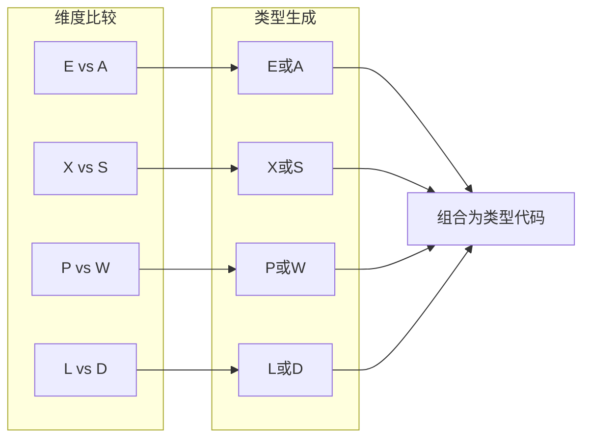

**图表来源**
- [calculator.ts:494-500](file://utils/calculator.ts#L494-L500)

**章节来源**
- [calculator.ts:494-500](file://utils/calculator.ts#L494-L500)

### 个性化推荐算法

#### 导演推荐

使用加权评分算法：
```
导演评分 = eraScore * 0.3 + styleScore * 0.4 + diversityScore * 0.3
```

其中：
- `eraScore = 1 - (α权重 * |era-1|/2 + (1-α权重) * |3-era|/2)`
- `styleScore = 1 - |导演风格-β权重|`
- `diversityScore = 1 - |导演多样性-γ权重|`

#### 电影推荐

结合电影自身特征和导演评分：
```
电影评分 = eraScore * 0.25 + styleScore * 0.35 + directorScore * 0.4
```

**章节来源**
- [directorsMeta.ts:285-328](file://data/directorsMeta.ts#L285-L328)

## 快速测试系统

### 测试模式概述

系统提供两种测试模式：完整版和快速版，针对不同使用场景优化用户体验。

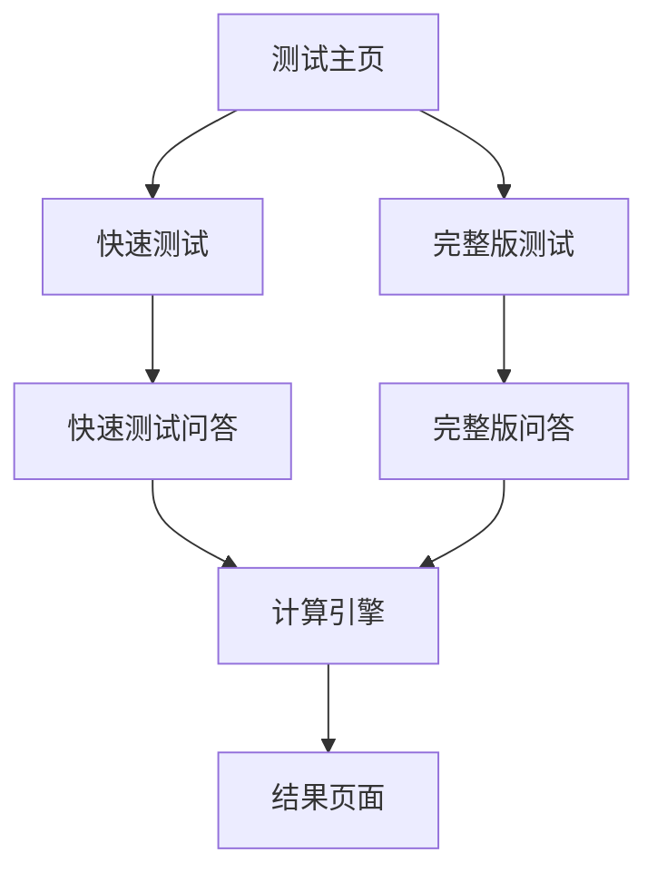

**图表来源**
- [page.tsx:31-37](file://app/test/page.tsx#L31-L37)
- [page.tsx:21-78](file://app/test/quiz/page.tsx#L21-L78)

### 快速测试配置

快速测试版本包含精选的24道题目，覆盖所有主要维度：
- EA维度：4道题
- XS维度：5道题  
- PW维度：4道题
- LD维度：7道题
- 观影画像题：4道题

**章节来源**
- [page.tsx:10-25](file://app/test/page.tsx#L10-L25)

### 快速测试脚本

系统提供两个JavaScript脚本用于自动化测试：

#### 快速测试脚本（高级版）
- 支持多种策略：随机、交替、优先跳过等
- 自动完成最多60题
- 包含详细的控制台输出

#### 简化版测试脚本
- 最简单的自动化测试实现
- 随机选择选项
- 适合快速验证功能

**章节来源**
- [quick-test.js:14-153](file://scripts/quick-test.js#L14-L153)
- [quick-test-simple.js:11-63](file://scripts/quick-test-simple.js#L11-L63)

## UI组件设计

### 隐藏属性展示组件

结果页面实现了专门的隐藏属性展示组件，采用卡片式设计：

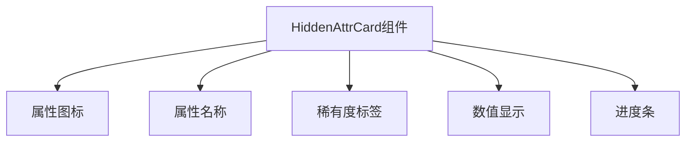

**属性图标颜色方案**：
- α属性：渐变紫色系
- β属性：渐变蓝色系  
- γ属性：渐变绿色系

**稀有度标签样式**：
- 常见：灰色背景
- 罕见：绿色背景
- 稀有：蓝色背景
- 传奇：琥珀色背景

**章节来源**
- [page.tsx:910-942](file://app/result/page.tsx#L910-L942)

### 雷达图可视化

结果页面实现了交互式的类型基因雷达图：

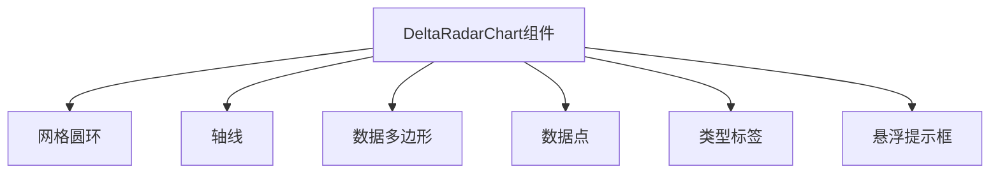

**雷达图设计特点**：
- **配色方案**：使用统一的琥珀色(#d4a853)作为主色调
- **网格系统**：4层同心圆网格，清晰显示数值层级
- **数据多边形**：半透明填充，突出基因分布特征
- **交互设计**：鼠标悬停显示详细信息和阴影效果

**基因类型映射**：
- 恐怖片：紫色(#a855f7)
- 喜剧：琥珀色(#fbbf24)
- 科幻：青色(#06b6d4)
- 犯罪：红色(#dc2626)
- 动画：粉色(#f472b6)
- 纪录片：绿色(#10b981)

**章节来源**
- [page.tsx:953-1051](file://app/result/page.tsx#L953-L1051)

### 分享卡片设计

结果页面集成了完整的分享功能，支持生成精美的分享卡片：

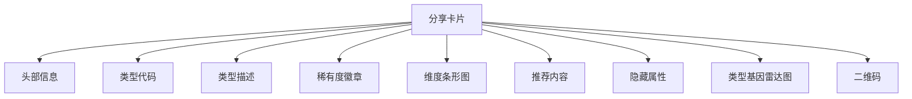

**分享卡片特性**：
- **响应式设计**：适配不同屏幕尺寸
- **高质量渲染**：使用html2canvas生成PNG图片
- **主题一致性**：保持与页面相同的配色方案
- **功能完整性**：包含所有核心信息元素

**章节来源**
- [page.tsx:552-908](file://app/result/page.tsx#L552-L908)

### 观影画像生成

系统支持基于用户回答生成个性化的观影画像：

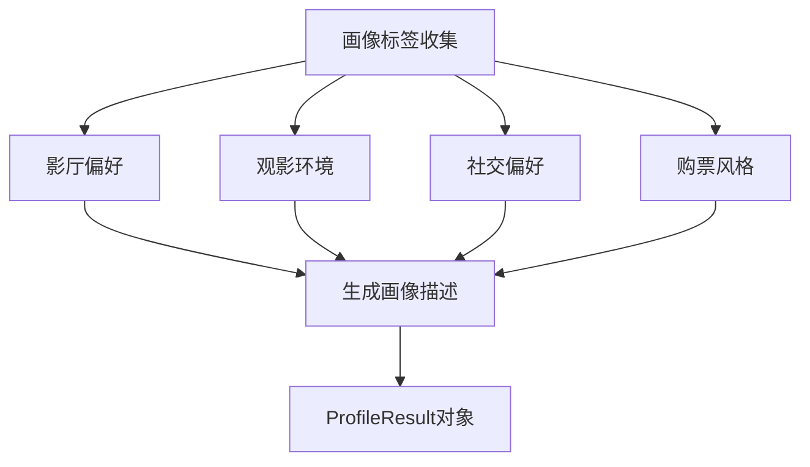

**画像维度**：
- 影厅偏好：巨幕信徒、居家党、性价比玩家等
- 观影环境：影院原教旨主义者、沙发哲学家等  
- 社交偏好：独行侠、散场话事人等
- 购票风格：首映场占座王、口碑鉴定师等

**章节来源**
- [calculator.ts:536-551](file://utils/calculator.ts#L536-L551)

## 依赖分析

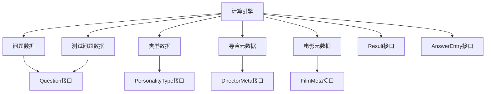

**图表来源**
- [calculator.ts:1-644](file://utils/calculator.ts#L1-L644)
- [types.ts:1-478](file://data/types.ts#L1-L478)
- [directorsMeta.ts:1-329](file://data/directorsMeta.ts#L1-L329)

**章节来源**
- [calculator.ts:1-4](file://utils/calculator.ts#L1-L4)
- [types.ts:1-11](file://data/types.ts#L1-L11)
- [directorsMeta.ts:1-21](file://data/directorsMeta.ts#L1-L21)

## 性能考虑

### 时间复杂度
- **主要计算**：O(n)，n为问题数量
- **推荐算法**：O(m)，m为类型关联的导演/电影数量
- **快速测试补偿**：O(1)，固定时间复杂度
- **总体复杂度**：O(n + m)

### 空间复杂度
- **内存使用**：O(1)，固定大小的数据结构
- **推荐列表**：O(1)，固定返回3个结果
- **快速测试模式**：O(1)，额外的常数级内存

### 优化建议
1. **缓存机制**：对常用查询结果进行缓存
2. **增量计算**：支持部分更新的计算
3. **并发处理**：对独立计算任务进行并行化
4. **快速测试优化**：针对精简版测试的特殊优化

## 故障排除指南

### 常见问题及解决方案

#### 1. 空答案数组
**症状**：返回的分数全部为0
**原因**：传入了空数组
**解决**：确保至少有一个有效答案

#### 2. 无效问题索引
**症状**：某些答案被忽略
**原因**：questionIndex超出范围
**解决**：验证问题索引的有效性

#### 3. 跳过选项过多
**症状**：结果准确性下降
**原因**：skipCount超过阈值（25%）
**解决**：鼓励用户完成所有问题

#### 4. 隐藏属性为负值
**症状**：隐藏属性出现负数
**原因**：跳过选项导致的负值
**解决**：自动裁剪到0（已内置）

#### 5. 快速测试结果偏差
**症状**：精简版测试结果与完整版差异较大
**原因**：权重补偿系统的影响
**解决**：理解并接受补偿机制，或使用完整版测试

**章节来源**
- [calculator.ts:387-492](file://utils/calculator.ts#L387-L492)

### 错误处理最佳实践

```typescript
// 基础错误处理
try {
    const result = calculateResult(validatedAnswers);
    if (result.skipCount > questions.length * 0.25) {
        console.warn('跳过选项较多，建议重新测试');
    }
    return result;
} catch (error) {
    console.error('计算引擎错误:', error);
    throw new Error('无法生成结果，请检查输入数据');
}

// 快速测试特殊处理
if (answers.length <= 25) {
    console.log('检测到快速测试模式，将应用权重补偿');
    // 补偿已在计算引擎内部处理
}
```

## 结论

FBTI计算引擎提供了一个完整、精确且具有良好扩展性的电影人格分析系统。其核心优势包括：

1. **精确的计算模型**：基于严格的数学公式和权重分配
2. **丰富的分析维度**：涵盖基础维度和隐藏属性的多层次分析
3. **个性化的推荐**：结合用户偏好和类型特征的智能推荐
4. **优秀的用户体验**：直观的结果展示和交互设计
5. **灵活的测试模式**：支持快速测试和完整测试两种模式
6. **强大的补偿机制**：针对精简版测试的特殊优化

**更新亮点**：
- **快速测试权重补偿系统**：针对答题数 ≤ 25 的精简版测试提供特殊权重补偿
- **增强的隐藏属性分析**：更新的稀有度阈值和标签系统
- **改进的个性化推荐**：优化的导演和电影推荐算法
- **完整的测试生态系统**：支持测试模式和自动化测试脚本
- **增强的UI组件**：改进的隐藏属性展示和基因分析功能
- **专业的视觉设计**：统一的配色方案和主题风格

该API为开发者提供了清晰的接口规范和完整的实现细节，便于集成和扩展。通过合理的错误处理和边界情况管理，确保了系统的稳定性和可靠性。新增的快速测试系统进一步提升了用户体验，满足了不同场景下的使用需求。