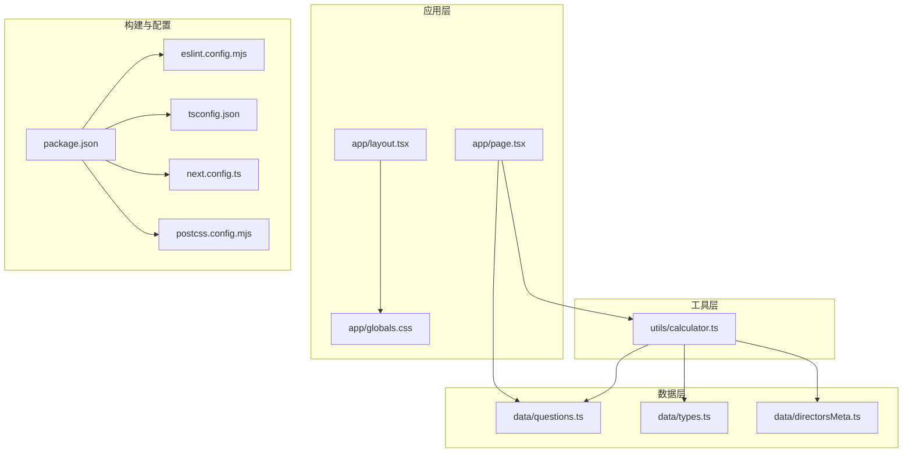
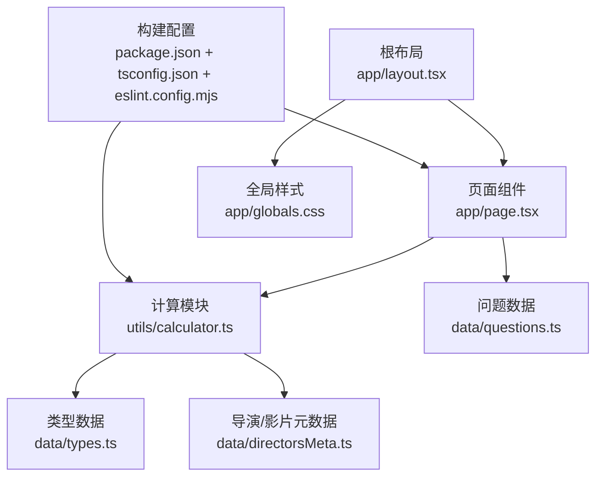
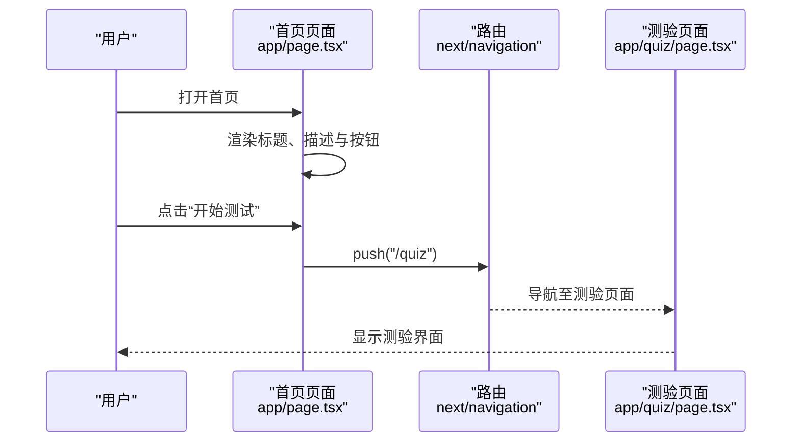
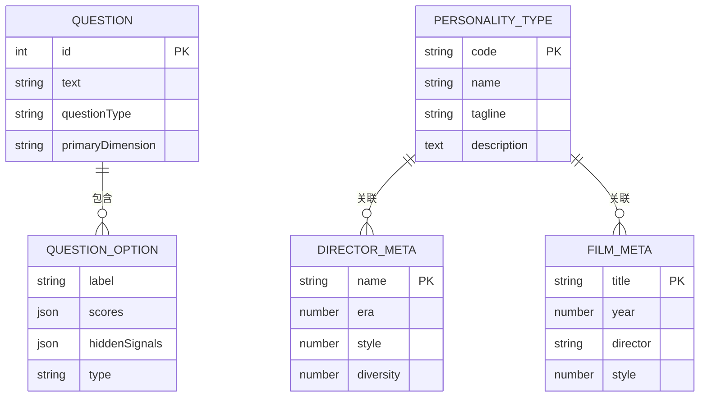
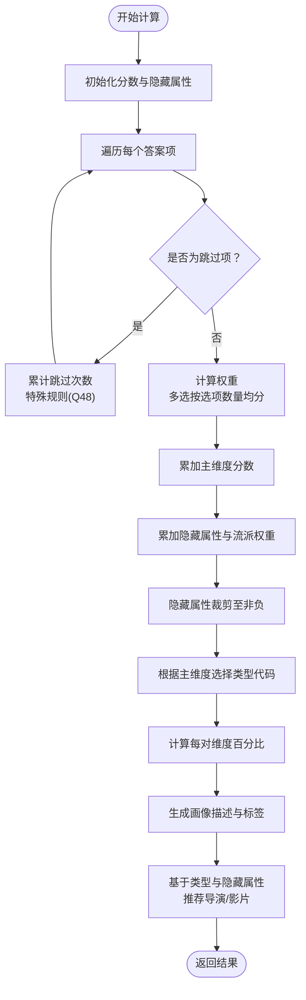
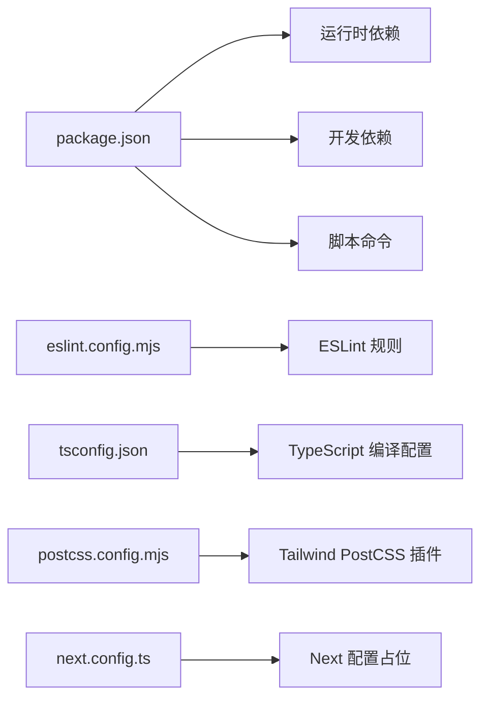

# 开发指南

<cite>
**本文引用的文件**   
- [package.json](file://package.json)
- [eslint.config.mjs](file://eslint.config.mjs)
- [tsconfig.json](file://tsconfig.json)
- [next.config.ts](file://next.config.ts)
- [postcss.config.mjs](file://postcss.config.mjs)
- [README.md](file://README.md)
- [app/layout.tsx](file://app/layout.tsx)
- [app/page.tsx](file://app/page.tsx)
- [app/globals.css](file://app/globals.css)
- [data/questions.ts](file://data/questions.ts)
- [data/types.ts](file://data/types.ts)
- [data/directorsMeta.ts](file://data/directorsMeta.ts)
- [utils/calculator.ts](file://utils/calculator.ts)
- [AGENTS.md](file://AGENTS.md)
- [CLAUDE.md](file://CLAUDE.md)
</cite>

## 目录
1. [简介](#简介)
2. [项目结构](#项目结构)
3. [核心组件](#核心组件)
4. [架构总览](#架构总览)
5. [详细组件分析](#详细组件分析)
6. [依赖分析](#依赖分析)
7. [性能考虑](#性能考虑)
8. [故障排除指南](#故障排除指南)
9. [结论](#结论)
10. [附录](#附录)

## 简介
本开发指南面向 FBTI 项目的新老贡献者，目标是帮助团队建立统一的代码规范、开发流程与最佳实践。内容覆盖 ESLint 配置、TypeScript 设置、Git 工作流、编码标准与命名约定、注释规范、本地开发与调试、性能优化、代码审查与质量保障、常见问题排查以及贡献流程。文档同时提供可视化架构与流程图，便于快速理解与落地执行。

## 项目结构
FBTI 是基于 Next.js 应用，采用 App Router 结构组织页面与资源。数据层包含题目、类型与元数据，业务计算位于工具模块，UI 层通过 TailwindCSS 提供样式基础。

**图表来源**
- [app/layout.tsx:1-53](file://app/layout.tsx#L1-L53)
- [app/page.tsx:1-76](file://app/page.tsx#L1-L76)
- [app/globals.css:1-51](file://app/globals.css#L1-L51)
- [data/questions.ts:1-800](file://data/questions.ts#L1-L800)
- [data/types.ts:1-428](file://data/types.ts#L1-L428)
- [data/directorsMeta.ts:1-279](file://data/directorsMeta.ts#L1-L279)
- [utils/calculator.ts:1-504](file://utils/calculator.ts#L1-L504)
- [package.json:1-30](file://package.json#L1-L30)
- [eslint.config.mjs:1-19](file://eslint.config.mjs#L1-L19)
- [tsconfig.json:1-35](file://tsconfig.json#L1-L35)
- [next.config.ts:1-8](file://next.config.ts#L1-L8)
- [postcss.config.mjs:1-8](file://postcss.config.mjs#L1-L8)

**章节来源**
- [README.md:1-37](file://README.md#L1-L37)
- [package.json:1-30](file://package.json#L1-L30)

## 核心组件
- 页面与布局
  - 根布局负责全局字体、元数据与根节点样式注入。
  - 首页作为入口页面，承载导航与交互。
- 数据模型
  - 问题集合、类型集合与导演/影片元数据，支撑答题与结果计算。
- 计算器
  - 负责评分、百分比、隐藏属性、画像描述生成与个性化推荐。
- 构建与工具链
  - ESLint、TypeScript、PostCSS/Tailwind、Next 配置。

**章节来源**
- [app/layout.tsx:1-53](file://app/layout.tsx#L1-L53)
- [app/page.tsx:1-76](file://app/page.tsx#L1-L76)
- [data/questions.ts:1-800](file://data/questions.ts#L1-L800)
- [data/types.ts:1-428](file://data/types.ts#L1-L428)
- [data/directorsMeta.ts:1-279](file://data/directorsMeta.ts#L1-L279)
- [utils/calculator.ts:1-504](file://utils/calculator.ts#L1-L504)
- [eslint.config.mjs:1-19](file://eslint.config.mjs#L1-L19)
- [tsconfig.json:1-35](file://tsconfig.json#L1-L35)
- [postcss.config.mjs:1-8](file://postcss.config.mjs#L1-L8)
- [next.config.ts:1-8](file://next.config.ts#L1-L8)

## 架构总览
FBTI 采用“页面驱动 + 数据/工具分离”的结构。页面仅负责展示与交互，业务逻辑集中在工具模块；数据以 TypeScript 类型定义，确保静态安全与可维护性。

**图表来源**
- [app/page.tsx:1-76](file://app/page.tsx#L1-L76)
- [utils/calculator.ts:1-504](file://utils/calculator.ts#L1-L504)
- [data/questions.ts:1-800](file://data/questions.ts#L1-L800)
- [data/types.ts:1-428](file://data/types.ts#L1-L428)
- [data/directorsMeta.ts:1-279](file://data/directorsMeta.ts#L1-L279)
- [app/layout.tsx:1-53](file://app/layout.tsx#L1-L53)
- [app/globals.css:1-51](file://app/globals.css#L1-L51)
- [package.json:1-30](file://package.json#L1-L30)
- [tsconfig.json:1-35](file://tsconfig.json#L1-L35)
- [eslint.config.mjs:1-19](file://eslint.config.mjs#L1-L19)

## 详细组件分析

### 页面与布局（app/page.tsx 与 app/layout.tsx）
- 页面职责
  - 使用客户端上下文进行路由跳转。
  - 渲染入口内容与交互按钮，连接到测验与图鉴页面。
- 布局职责
  - 注入 Google Fonts 变量，设置站点元信息与根节点类名。
  - 全局背景与文本颜色由 CSS 变量控制，确保一致的主题风格。

**图表来源**
- [app/page.tsx:1-76](file://app/page.tsx#L1-L76)
- [app/layout.tsx:1-53](file://app/layout.tsx#L1-L53)

**章节来源**
- [app/page.tsx:1-76](file://app/page.tsx#L1-L76)
- [app/layout.tsx:1-53](file://app/layout.tsx#L1-L53)
- [app/globals.css:1-51](file://app/globals.css#L1-L51)

### 数据模型（data/questions.ts、data/types.ts、data/directorsMeta.ts）
- 问题模型
  - 支持二元、多选、含跳过等题型，选项包含维度得分与隐藏信号。
  - 图像字段支持 TMDB 或 AI 占位符，用于展示与提示。
- 类型模型
  - 定义人格类型、标签、描述与导演/影片列表。
- 导演/影片元数据
  - 包含时代、风格、多样性等特征，用于个性化推荐。

**图表来源**
- [data/questions.ts:1-800](file://data/questions.ts#L1-L800)
- [data/types.ts:1-428](file://data/types.ts#L1-L428)
- [data/directorsMeta.ts:1-279](file://data/directorsMeta.ts#L1-L279)

**章节来源**
- [data/questions.ts:1-800](file://data/questions.ts#L1-L800)
- [data/types.ts:1-428](file://data/types.ts#L1-L428)
- [data/directorsMeta.ts:1-279](file://data/directorsMeta.ts#L1-L279)

### 计算器（utils/calculator.ts）
- 功能概览
  - 统计主维度分数与隐藏属性（α/β/γ/δ），生成百分比与画像描述。
  - 基于类型与隐藏属性，推荐导演与影片。
- 关键流程
  - 遍历答案，按题型与选项权重累加分数。
  - 计算隐藏属性并归一化，结合阈值映射稀有度标签。
  - 生成画像描述与个性化推荐。

**图表来源**
- [utils/calculator.ts:235-444](file://utils/calculator.ts#L235-L444)

**章节来源**
- [utils/calculator.ts:1-504](file://utils/calculator.ts#L1-L504)

## 依赖分析
- 运行时依赖
  - Next.js、React、TailwindCSS、Framer Motion、html2canvas 等。
- 开发依赖
  - ESLint、TypeScript、Tailwind PostCSS 插件等。
- 构建与运行脚本
  - dev、build、start、lint 等命令。

**图表来源**
- [package.json:1-30](file://package.json#L1-L30)
- [eslint.config.mjs:1-19](file://eslint.config.mjs#L1-L19)
- [tsconfig.json:1-35](file://tsconfig.json#L1-L35)
- [postcss.config.mjs:1-8](file://postcss.config.mjs#L1-L8)
- [next.config.ts:1-8](file://next.config.ts#L1-L8)

**章节来源**
- [package.json:1-30](file://package.json#L1-L30)

## 性能考虑
- 构建与类型检查
  - TypeScript 启用严格模式与增量编译，减少重复检查成本。
  - 禁用 emit 以避免输出 JS，保持纯类型检查。
- 样式与渲染
  - 使用 TailwindCSS 与原子类，避免运行时样式计算。
  - 页面组件尽量保持轻量，复杂计算移至工具模块。
- 代码质量
  - ESLint 集成 Next 核心 Web Vitals 与 TypeScript 规则，降低运行时风险。
- 资源加载
  - 图片占位策略：开发阶段使用占位符，上线前替换为真实图片，减少首屏压力。

[本节为通用性能建议，无需特定文件引用]

## 故障排除指南
- ESLint 报错
  - 确认已安装依赖并执行 lint 脚本；若默认忽略影响范围过大，可在配置中调整忽略列表。
- TypeScript 类型错误
  - 检查接口定义与数据一致性；严格模式下需显式处理可选字段。
- Next 配置冲突
  - 当前配置为空，若新增配置请遵循 Next 16 的新约定，避免破坏性变更。
- 样式异常
  - 检查 CSS 变量与字体变量是否正确注入；确认 Tailwind 插件已启用。
- 图片占位与最终替换
  - 开发期使用占位符，上线前统一替换为真实图片，避免资源缺失。

**章节来源**
- [eslint.config.mjs:1-19](file://eslint.config.mjs#L1-L19)
- [tsconfig.json:1-35](file://tsconfig.json#L1-L35)
- [next.config.ts:1-8](file://next.config.ts#L1-L8)
- [postcss.config.mjs:1-8](file://postcss.config.mjs#L1-L8)
- [CLAUDE.md:1-7](file://CLAUDE.md#L1-L7)

## 结论
本指南提供了 FBTI 项目的开发规范、流程与最佳实践，涵盖从本地环境到生产部署的关键环节。建议团队在日常协作中坚持统一的代码风格、严格的类型约束与持续的代码审查，以确保项目的长期可维护性与扩展性。

[本节为总结性内容，无需特定文件引用]

## 附录

### A. 代码规范与命名约定
- 文件与目录
  - 页面组件置于 app 下，按路由层级组织；工具函数置于 utils；数据模型置于 data。
- 命名
  - 变量与函数使用小驼峰；常量使用大写下划线；类型使用大驼峰。
- 导入路径
  - 使用 @/* 别名，保持相对路径最小化。
- 注释
  - 对外导出的函数与复杂逻辑添加简要注释；内部实现保持简洁可读。

**章节来源**
- [tsconfig.json:21-23](file://tsconfig.json#L21-L23)

### B. Git 工作流程
- 分支策略
  - 主分支保护，功能开发在特性分支，合并前进行代码审查。
- 提交信息
  - 使用动宾结构，简述变更目的与影响范围。
- 代码审查
  - 至少一名维护者批准；审查重点包括可读性、性能与安全性。

[本节为通用流程建议，无需特定文件引用]

### C. 本地开发与调试
- 启动
  - 使用包管理器提供的 dev 脚本启动开发服务器。
- 调试技巧
  - 在计算器模块关键路径添加断点，观察分数与隐藏属性变化。
  - 使用浏览器开发者工具检查 Tailwind 样式与字体变量。
- 性能优化
  - 控制图片数量与尺寸，优先使用占位符；减少不必要的重渲染。

**章节来源**
- [README.md:1-37](file://README.md#L1-L37)
- [CLAUDE.md:1-7](file://CLAUDE.md#L1-L7)

### D. 测试策略与质量保障
- 单元测试
  - 对计算模块的关键函数进行单元测试，覆盖边界条件与异常路径。
- 集成测试
  - 端到端测试页面交互与路由跳转，确保用户体验连贯。
- 质量门禁
  - ESLint 与 TypeScript 检查必须通过；提交前运行 lint 与类型检查。

[本节为通用策略建议，无需特定文件引用]

### E. 常见问题与解决方案
- 问题：ESLint 忽略了某些文件
  - 解决：在配置中覆盖默认忽略列表，明确包含需要检查的文件。
- 问题：TypeScript 报错找不到模块
  - 解决：检查 tsconfig 的 paths 与 include；确保模块声明与实际路径一致。
- 问题：Tailwind 样式未生效
  - 解决：确认 PostCSS 插件已启用且 Tailwind 已导入；检查类名拼写与作用域。

**章节来源**
- [eslint.config.mjs:8-16](file://eslint.config.mjs#L8-L16)
- [tsconfig.json:21-23](file://tsconfig.json#L21-L23)
- [postcss.config.mjs:1-8](file://postcss.config.mjs#L1-L8)

### F. 新贡献者参与指导
- 步骤
  - Fork 仓库并创建特性分支；完成开发后提交 PR 并等待审查。
- 注意事项
  - 遵循代码规范与命名约定；补充必要的注释与测试；避免破坏性变更。

**章节来源**
- [AGENTS.md:1-6](file://AGENTS.md#L1-L6)