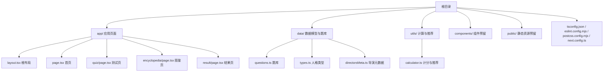
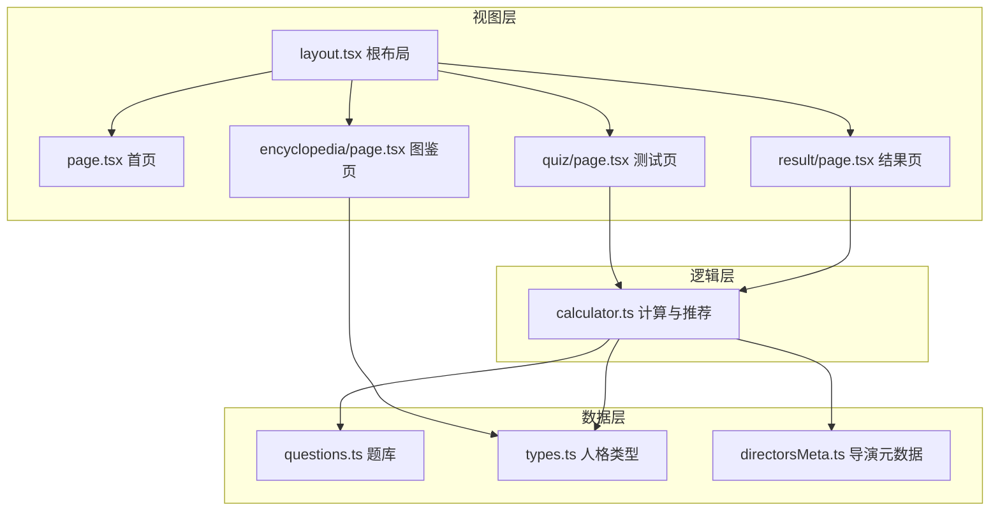
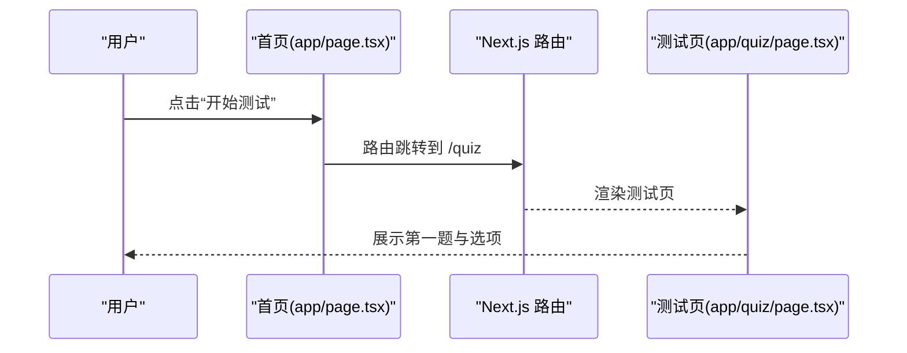
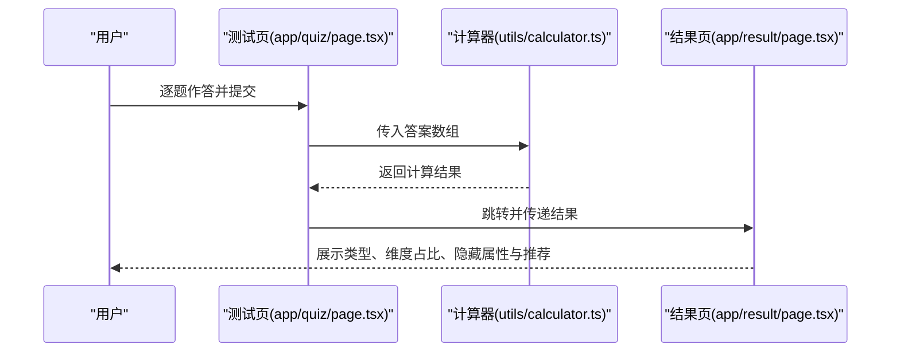
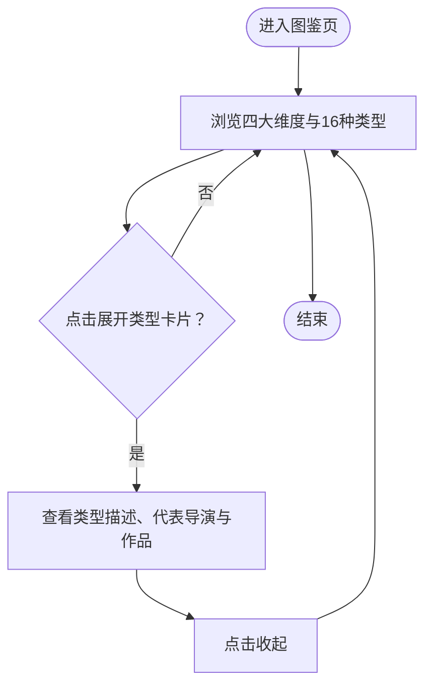
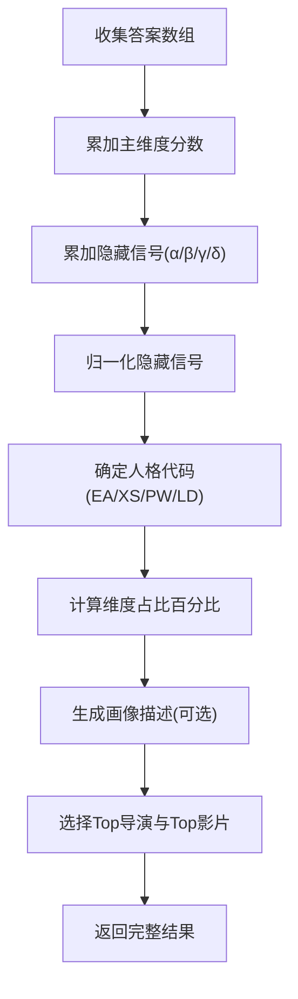

# 快速开始

<cite>
**本文引用的文件**
- [package.json](file://package.json)
- [README.md](file://README.md)
- [next.config.ts](file://next.config.ts)
- [tsconfig.json](file://tsconfig.json)
- [eslint.config.mjs](file://eslint.config.mjs)
- [postcss.config.mjs](file://postcss.config.mjs)
- [app/layout.tsx](file://app/layout.tsx)
- [app/page.tsx](file://app/page.tsx)
- [app/quiz/page.tsx](file://app/quiz/page.tsx)
- [app/encyclopedia/page.tsx](file://app/encyclopedia/page.tsx)
- [app/result/page.tsx](file://app/result/page.tsx)
- [app/globals.css](file://app/globals.css)
- [data/questions.ts](file://data/questions.ts)
- [data/types.ts](file://data/types.ts)
- [data/directorsMeta.ts](file://data/directorsMeta.ts)
- [utils/calculator.ts](file://utils/calculator.ts)
</cite>

## 目录
1. [简介](#简介)
2. [项目结构](#项目结构)
3. [核心组件](#核心组件)
4. [架构总览](#架构总览)
5. [详细组件分析](#详细组件分析)
6. [依赖分析](#依赖分析)
7. [性能考虑](#性能考虑)
8. [故障排除指南](#故障排除指南)
9. [结论](#结论)
10. [附录](#附录)

## 简介
本指南面向新手开发者，帮助你在本地快速搭建并运行 FBTI 项目。你将学到：
- 环境要求与工具链选择（Node.js、包管理器）
- 依赖安装与初始化
- 启动开发服务器、热重载与调试
- 构建与生产部署流程
- 常见问题排查与最佳实践

## 项目结构
FBTI 是基于 Next.js App Router 的前端应用，采用 TypeScript 与 TailwindCSS，核心页面位于 app 目录，业务数据与计算逻辑位于 data 与 utils 目录。

图表来源
- [app/layout.tsx](file://app/layout.tsx)
- [app/page.tsx](file://app/page.tsx)
- [app/quiz/page.tsx](file://app/quiz/page.tsx)
- [app/encyclopedia/page.tsx](file://app/encyclopedia/page.tsx)
- [app/result/page.tsx](file://app/result/page.tsx)
- [data/questions.ts](file://data/questions.ts)
- [data/types.ts](file://data/types.ts)
- [data/directorsMeta.ts](file://data/directorsMeta.ts)
- [utils/calculator.ts](file://utils/calculator.ts)

章节来源
- [package.json](file://package.json)
- [tsconfig.json](file://tsconfig.json)
- [postcss.config.mjs](file://postcss.config.mjs)
- [eslint.config.mjs](file://eslint.config.mjs)
- [next.config.ts](file://next.config.ts)

## 核心组件
- 应用入口与全局样式
  - 根布局与字体加载：[app/layout.tsx](file://app/layout.tsx)
  - 全局样式与变量：[app/globals.css](file://app/globals.css)
- 页面路由
  - 首页（引导页）：[app/page.tsx](file://app/page.tsx)
  - 测试页（答题）：[app/quiz/page.tsx](file://app/quiz/page.tsx)
  - 图鉴页（类型与维度）：[app/encyclopedia/page.tsx](file://app/encyclopedia/page.tsx)
  - 结果页（计分与推荐）：[app/result/page.tsx](file://app/result/page.tsx)
- 数据与逻辑
  - 题库与问题结构：[data/questions.ts](file://data/questions.ts)
  - 人格类型与描述：[data/types.ts](file://data/types.ts)
  - 导演元数据与评分函数：[data/directorsMeta.ts](file://data/directorsMeta.ts)
  - 计算结果与推荐：[utils/calculator.ts](file://utils/calculator.ts)

章节来源
- [app/layout.tsx](file://app/layout.tsx)
- [app/globals.css](file://app/globals.css)
- [app/page.tsx](file://app/page.tsx)
- [app/quiz/page.tsx](file://app/quiz/page.tsx)
- [app/encyclopedia/page.tsx](file://app/encyclopedia/page.tsx)
- [app/result/page.tsx](file://app/result/page.tsx)
- [data/questions.ts](file://data/questions.ts)
- [data/types.ts](file://data/types.ts)
- [data/directorsMeta.ts](file://data/directorsMeta.ts)
- [utils/calculator.ts](file://utils/calculator.ts)

## 架构总览
FBTI 采用“页面驱动”的 Next.js App Router 架构，页面通过客户端组件与服务端元数据协作完成交互与展示；数据层提供题库、类型与导演元数据，计算层负责评分与个性化推荐。

图表来源
- [app/layout.tsx](file://app/layout.tsx)
- [app/page.tsx](file://app/page.tsx)
- [app/quiz/page.tsx](file://app/quiz/page.tsx)
- [app/encyclopedia/page.tsx](file://app/encyclopedia/page.tsx)
- [app/result/page.tsx](file://app/result/page.tsx)
- [data/questions.ts](file://data/questions.ts)
- [data/types.ts](file://data/types.ts)
- [data/directorsMeta.ts](file://data/directorsMeta.ts)
- [utils/calculator.ts](file://utils/calculator.ts)

## 详细组件分析

### 开发服务器与热重载
- 启动命令
  - 使用 npm、yarn、pnpm 或 bun 均可启动开发服务器
  - 示例命令与预期行为
    - npm run dev：启动 Next.js 开发服务器，自动监听文件变更并热重载
    - yarn dev 或 pnpm dev：与 npm run dev 行为一致
    - bun dev：若已安装 bun，也可作为包管理器使用
  - 预期输出
    - 控制台显示“started server on 0.0.0.0:3000, url: http://localhost:3000”
    - 打开浏览器访问 http://localhost:3000 查看首页
- 调试建议
  - 在 app/* 下的页面组件中设置断点进行调试
  - 修改 app/globals.css 或字体加载逻辑后，刷新页面即可看到样式变化

章节来源
- [README.md](file://README.md)
- [package.json](file://package.json)

### 构建与生产运行
- 构建命令
  - npm run build：生成生产构建产物
  - npm start：以生产模式启动服务器（需先执行构建）
- 生产部署
  - 项目自带 Next.js 配置文件，可直接部署至支持 Node.js 的平台
  - 若使用 Vercel，可直接推送仓库，平台自动识别并部署

章节来源
- [package.json](file://package.json)
- [README.md](file://README.md)
- [next.config.ts](file://next.config.ts)

### 页面与交互流程

#### 首页到测试页

图表来源
- [app/page.tsx](file://app/page.tsx)
- [app/quiz/page.tsx](file://app/quiz/page.tsx)

#### 测试页到结果页

图表来源
- [app/quiz/page.tsx](file://app/quiz/page.tsx)
- [utils/calculator.ts](file://utils/calculator.ts)
- [app/result/page.tsx](file://app/result/page.tsx)

#### 图鉴页与类型卡片

图表来源
- [app/encyclopedia/page.tsx](file://app/encyclopedia/page.tsx)
- [data/types.ts](file://data/types.ts)

### 数据模型与计算

#### 题库与问题结构
- 题目类型覆盖二元、多项、带“跳过”选项等
- 支持隐藏信号（α/β/γ/δ），用于刻画用户的隐性偏好
- 图片占位支持单图、分割图、网格布局，并可挂载 TMDB 或 AI 提示

章节来源
- [data/questions.ts](file://data/questions.ts)

#### 人格类型与隐藏属性
- 16 种人格类型包含名称、标签、描述、代表导演与作品
- 隐藏属性 α（时代）、β（形式）、γ（多样性）与类型基因 δ（恐怖/喜剧/科幻/犯罪/动画/纪录片）

章节来源
- [data/types.ts](file://data/types.ts)
- [data/directorsMeta.ts](file://data/directorsMeta.ts)

#### 计算器工作流

图表来源
- [utils/calculator.ts](file://utils/calculator.ts)
- [data/questions.ts](file://data/questions.ts)
- [data/types.ts](file://data/types.ts)
- [data/directorsMeta.ts](file://data/directorsMeta.ts)

## 依赖分析
- 运行时依赖
  - next、react、react-dom：Next.js 与 React 核心
  - framer-motion、html2canvas：动画与截图能力
- 开发依赖
  - typescript、@types/*：类型声明
  - tailwindcss、@tailwindcss/postcss：样式框架
  - eslint 与 eslint-config-next：代码规范
- 构建与工具链
  - tsconfig.json：TypeScript 编译配置
  - eslint.config.mjs：ESLint 配置
  - postcss.config.mjs：PostCSS 插件配置
  - next.config.ts：Next.js 自定义配置入口

章节来源
- [package.json](file://package.json)
- [tsconfig.json](file://tsconfig.json)
- [eslint.config.mjs](file://eslint.config.mjs)
- [postcss.config.mjs](file://postcss.config.mjs)
- [next.config.ts](file://next.config.ts)

## 性能考虑
- 构建优化
  - 使用 Next.js 内置的代码分割与静态导出能力
  - TailwindCSS 按需引入，避免无用样式
- 运行时优化
  - 避免在客户端组件中进行重型计算，必要时使用 useMemo/useCallback
  - 图片占位与字体加载策略已在根布局中配置，减少阻塞
- 开发体验
  - 开启 ESLint 与 TypeScript 检查，提升代码质量与稳定性

## 故障排除指南
- 无法启动开发服务器
  - 确认 Node.js 版本满足项目需求（Next.js 16 需要较新版本 Node.js）
  - 清理缓存后重装依赖：删除 node_modules 与 lock 文件，重新安装
- 端口占用
  - 默认端口 3000 被占用时，可在启动命令中指定端口或关闭占用进程
- 样式不生效
  - 检查 app/globals.css 是否正确导入 Tailwind 指令
  - 确认 PostCSS 插件配置与 Tailwind 版本兼容
- ESLint 报错
  - 使用内置 lint 脚本修复或忽略规则
  - 如需调整规则，请在 eslint.config.mjs 中修改
- 构建失败
  - 检查 TypeScript 编译错误
  - 确保所有页面组件导出正确且路径别名 @/* 配置有效

章节来源
- [README.md](file://README.md)
- [package.json](file://package.json)
- [app/globals.css](file://app/globals.css)
- [postcss.config.mjs](file://postcss.config.mjs)
- [eslint.config.mjs](file://eslint.config.mjs)
- [tsconfig.json](file://tsconfig.json)

## 结论
通过本指南，你已掌握 FBTI 项目的环境准备、安装与启动、开发调试、构建与部署以及常见问题排查方法。建议在本地完成基础功能验证后，逐步扩展数据与交互，完善个性化推荐与展示效果。

## 附录

### 环境要求与安装步骤
- 环境要求
  - Node.js：满足 Next.js 16 的最低版本要求
  - 包管理器：npm、yarn、pnpm 或 bun 任选其一
- 安装步骤
  - 克隆仓库后，进入项目目录
  - 安装依赖：使用 npm install、yarn 或 pnpm install
  - 启动开发服务器：npm run dev（或对应包管理器的 dev 命令）
  - 在浏览器打开 http://localhost:3000 查看首页
- 初始配置
  - TypeScript：tsconfig.json 已启用严格模式与路径别名
  - ESLint：eslint.config.mjs 已集成 Next.js 规则
  - TailwindCSS：postcss.config.mjs 已配置 @tailwindcss/postcss 插件
  - Next.js：next.config.ts 为空配置，可按需扩展

章节来源
- [README.md](file://README.md)
- [package.json](file://package.json)
- [tsconfig.json](file://tsconfig.json)
- [eslint.config.mjs](file://eslint.config.mjs)
- [postcss.config.mjs](file://postcss.config.mjs)
- [next.config.ts](file://next.config.ts)