# TMDB电影海报集成系统

<cite>
**本文档引用的文件**
- [README.md](file://README.md)
- [package.json](file://package.json)
- [next.config.ts](file://next.config.ts)
- [app/layout.tsx](file://app/layout.tsx)
- [app/page.tsx](file://app/page.tsx)
- [app/quiz/page.tsx](file://app/quiz/page.tsx)
- [app/test/quiz/page.tsx](file://app/test/quiz/page.tsx)
- [app/result/page.tsx](file://app/result/page.tsx)
- [app/encyclopedia/page.tsx](file://app/encyclopedia/page.tsx)
- [utils/tmdb.ts](file://utils/tmdb.ts)
- [utils/calculator.ts](file://utils/calculator.ts)
- [data/questions.ts](file://data/questions.ts)
- [data/types.ts](file://data/types.ts)
- [data/directorsMeta.ts](file://data/directorsMeta.ts)
- [data/posterMap.ts](file://data/posterMap.ts)
- [scripts/download-posters.js](file://scripts/download-posters.js)
</cite>

## 更新摘要
**变更内容**
- 本地海报缓存系统已完全替代TMDB API集成
- 新增海报下载脚本和静态映射文件
- TMDB模块重构为静态文件架构
- 移除了动态API调用依赖
- 增强了图像配置系统和动态电影库支持

## 目录
1. [项目概述](#项目概述)
2. [项目结构](#项目结构)
3. [核心组件](#核心组件)
4. [架构概览](#架构概览)
5. [详细组件分析](#详细组件分析)
6. [依赖关系分析](#依赖关系分析)
7. [性能考虑](#性能考虑)
8. [故障排除指南](#故障排除指南)
9. [结论](#结论)

## 项目概述

FBTI（Film Buff Type Indicator）是一个基于Next.js开发的电影人格类型测试系统，集成了本地海报缓存系统。该系统通过20个精心设计的问题，帮助用户发现自己的电影人格类型，并提供个性化的电影推荐。

### 主要特性
- **电影人格测试**：基于MBTI理念的电影偏好分析
- **本地海报缓存**：完全静态的海报管理系统，无需外部API调用
- **个性化推荐**：根据用户类型推荐导演和电影
- **可视化展示**：直观的维度分析和类型基因图表
- **社交分享**：支持生成分享卡片
- **动态电影库**：支持TMDB电影数据的动态获取和AI配图功能

## 项目结构

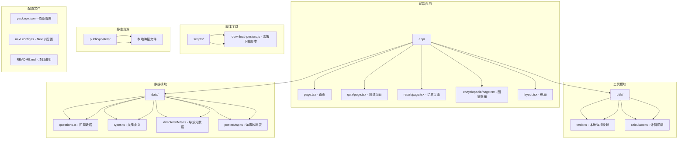

**图表来源**
- [app/page.tsx:1-155](file://app/page.tsx#L1-L155)
- [utils/tmdb.ts:1-121](file://utils/tmdb.ts#L1-L121)
- [utils/calculator.ts:1-504](file://utils/calculator.ts#L1-L504)
- [data/questions.ts:1-800](file://data/questions.ts#L1-L800)
- [data/posterMap.ts:1-42](file://data/posterMap.ts#L1-L42)
- [scripts/download-posters.js:1-287](file://scripts/download-posters.js#L1-L287)

**章节来源**
- [README.md:1-37](file://README.md#L1-L37)
- [package.json:1-30](file://package.json#L1-L30)

## 核心组件

### 本地海报映射系统

系统的核心功能之一是集成本地海报缓存系统，完全替代了TMDB API调用。该模块提供了完整的电影海报URL映射和静态文件管理功能。

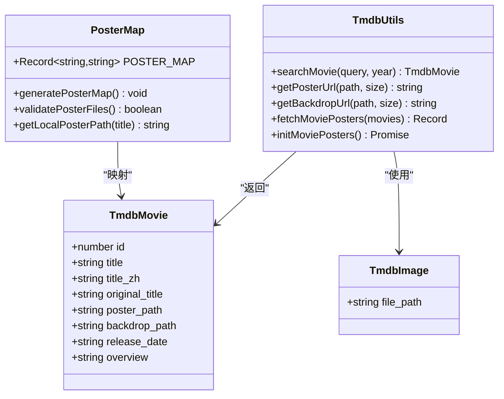

**图表来源**
- [utils/tmdb.ts:4-18](file://utils/tmdb.ts#L4-L18)
- [data/posterMap.ts:5-41](file://data/posterMap.ts#L5-L41)

### 电影人格计算引擎

系统的核心计算逻辑负责分析用户答案并生成电影人格类型报告。

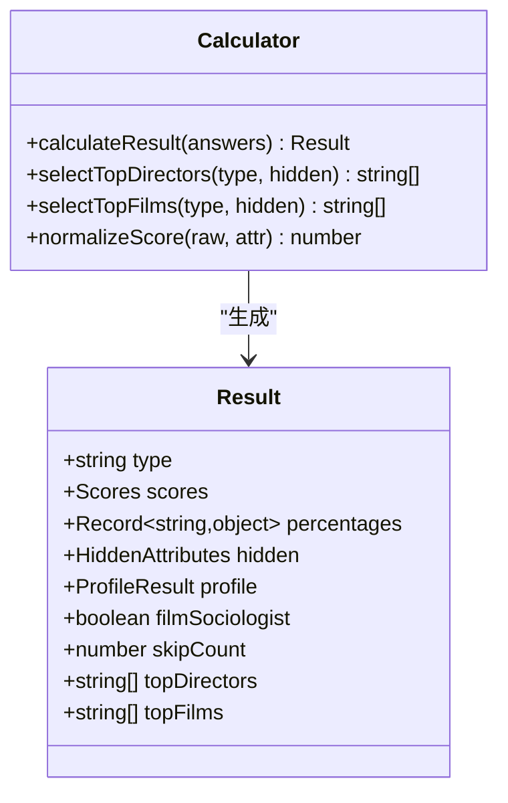

**图表来源**
- [utils/calculator.ts:31-41](file://utils/calculator.ts#L31-L41)

### 动态电影库系统

系统现在支持动态电影数据获取，包括TMDB API集成和AI配图功能。

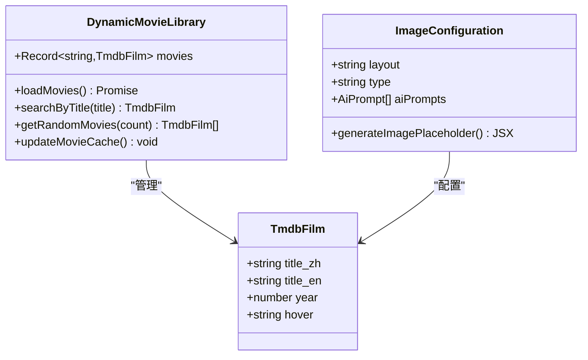

**图表来源**
- [data/questions.ts:7-24](file://data/questions.ts#L7-L24)
- [app/quiz/page.tsx:377-559](file://app/quiz/page.tsx#L377-L559)

**章节来源**
- [utils/tmdb.ts:1-121](file://utils/tmdb.ts#L1-L121)
- [utils/calculator.ts:1-504](file://utils/calculator.ts#L1-L504)
- [data/questions.ts:1-200](file://data/questions.ts#L1-L200)

## 架构概览

系统采用模块化架构设计，分为多个层次，现已完全转向本地静态文件架构：

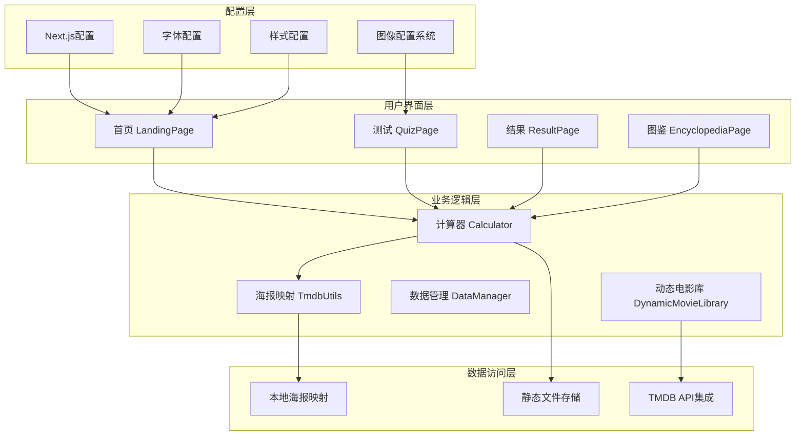

**图表来源**
- [app/page.tsx:6-34](file://app/page.tsx#L6-L34)
- [app/quiz/page.tsx:20-55](file://app/quiz/page.tsx#L20-L55)
- [app/result/page.tsx:64-93](file://app/result/page.tsx#L64-L93)

## 详细组件分析

### 首页组件分析

首页作为应用的入口点，提供了快速测试和完整测试两种模式的选择。

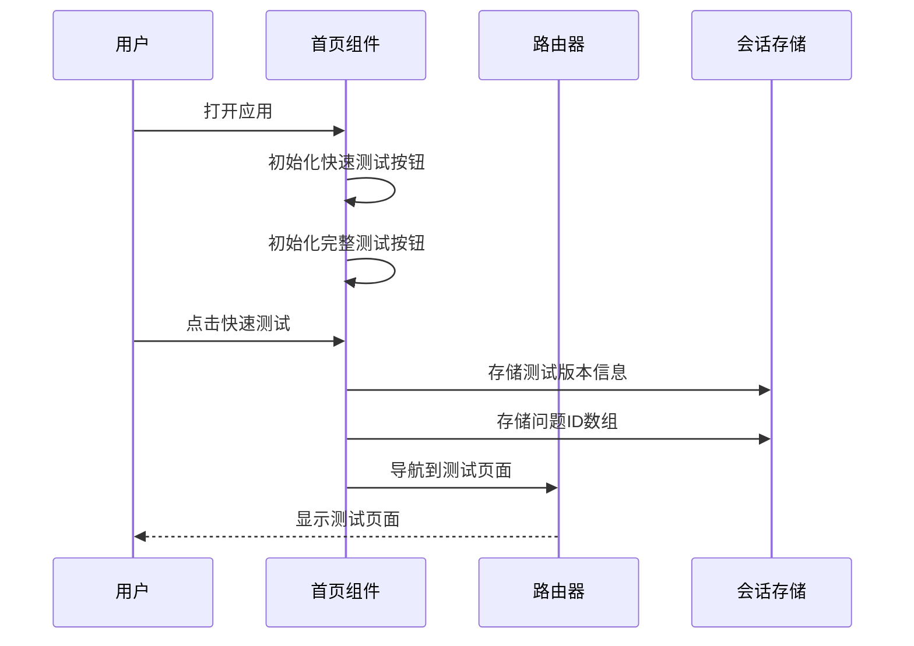

**图表来源**
- [app/page.tsx:29-34](file://app/page.tsx#L29-L34)

### 测试页面组件分析

测试页面实现了完整的问卷流程，包括问题显示、答案记录和进度跟踪。现在使用本地海报映射系统。

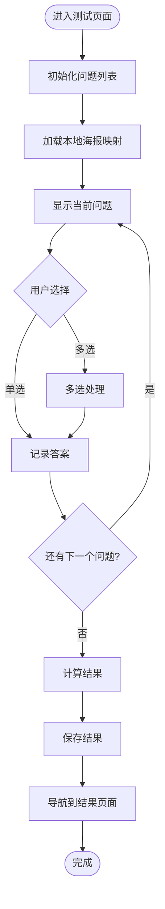

**图表来源**
- [app/quiz/page.tsx:122-151](file://app/quiz/page.tsx#L122-L151)

### 结果页面组件分析

结果页面展示了详细的电影人格分析报告，包括维度分析、隐藏属性和个性化推荐。

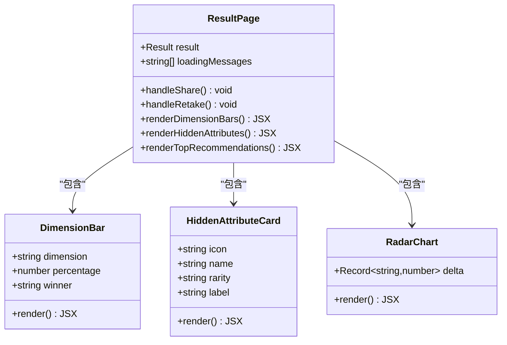

**图表来源**
- [app/result/page.tsx:64-93](file://app/result/page.tsx#L64-L93)

### 本地海报映射系统分析

本地海报映射系统提供了完整的静态海报管理和访问功能。

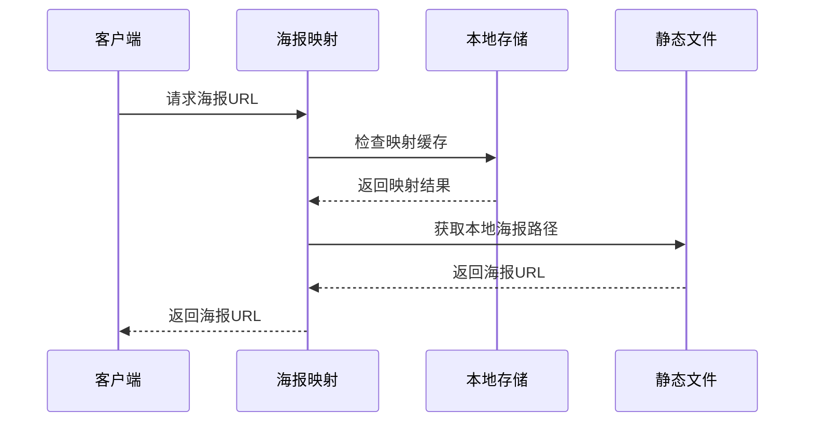

**图表来源**
- [utils/tmdb.ts:118-121](file://utils/tmdb.ts#L118-L121)
- [data/posterMap.ts:1-42](file://data/posterMap.ts#L1-L42)

### 海报下载脚本分析

海报下载脚本提供了完整的海报获取和映射生成功能。

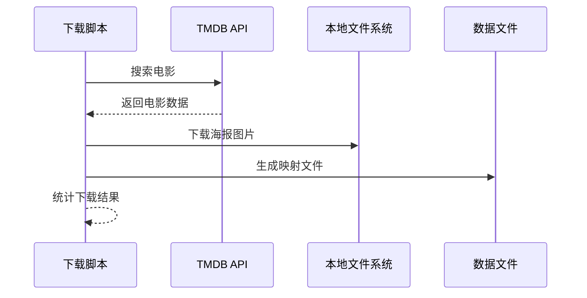

**图表来源**
- [scripts/download-posters.js:211-287](file://scripts/download-posters.js#L211-L287)

### 图像配置系统分析

图像配置系统支持多种布局和样式配置，包括单列、分割、网格等多种显示模式。

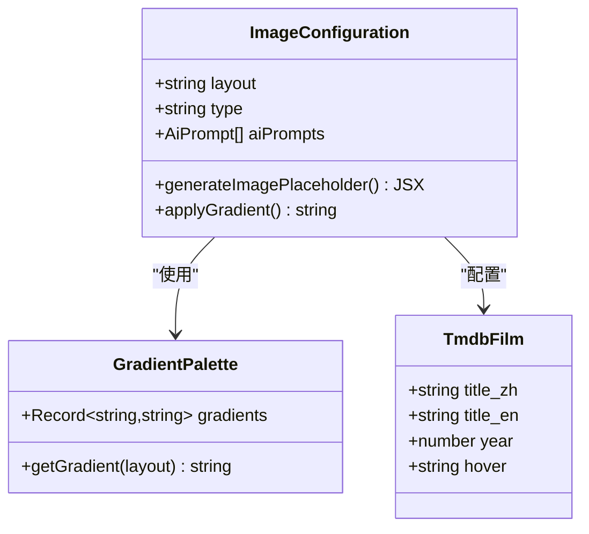

**图表来源**
- [app/quiz/page.tsx:377-559](file://app/quiz/page.tsx#L377-L559)
- [data/questions.ts:19-24](file://data/questions.ts#L19-L24)

**章节来源**
- [app/page.tsx:1-155](file://app/page.tsx#L1-L155)
- [app/quiz/page.tsx:1-551](file://app/quiz/page.tsx#L1-L551)
- [app/test/quiz/page.tsx:1-567](file://app/test/quiz/page.tsx#L1-L567)
- [app/result/page.tsx:1-1419](file://app/result/page.tsx#L1-L1419)
- [app/encyclopedia/page.tsx:1-359](file://app/encyclopedia/page.tsx#L1-L359)

## 依赖关系分析

系统使用现代化的前端技术栈，具有清晰的依赖关系：

```mermaid
graph TB
subgraph "运行时依赖"
RD1[react@19.2.4]
RD2[react-dom@19.2.4]
RD3[next@16.2.4]
RD4[framer-motion@12.38.0]
RD5[html2canvas@1.4.1]
end
subgraph "开发依赖"
DD1[typescript@^5]
DD2[tailwindcss@^4]
DD3[eslint@^9]
DD4[@types/react@^19]
DD5[@types/node@^20]
end
subgraph "配置依赖"
CD1[postcss.config.mjs]
CD2[tsconfig.json]
CD3[eslint.config.mjs]
end
RD1 --> RD2
RD3 --> RD1
RD3 --> RD2
RD4 --> RD1
RD5 --> RD1
```

**图表来源**
- [package.json:11-28](file://package.json#L11-L28)

**章节来源**
- [package.json:1-30](file://package.json#L1-L30)

## 性能考虑

### 浏览器兼容性
- 支持现代浏览器的渐进增强设计
- 使用CSS Grid和Flexbox实现响应式布局
- 优化的字体加载策略

### 性能优化策略
- **懒加载**：图片和组件按需加载
- **静态缓存**：本地海报文件直接访问，无需网络请求
- **内存管理**：及时清理会话存储数据
- **渲染优化**：使用React.memo和useMemo
- **图像优化**：支持多种布局和渐变效果

### 网络优化
- **本地存储**：完全避免外部API调用
- **CDN优化**：静态海报文件通过Next.js静态资源服务
- **压缩传输**：启用Gzip压缩
- **连接复用**：HTTP/2连接复用

## 故障排除指南

### 常见问题及解决方案

#### 海报文件缺失
**症状**：电影海报显示占位符
**原因**：海报文件未正确下载或路径错误
**解决方案**：
1. 检查`public/posters/`目录是否存在对应海报文件
2. 运行海报下载脚本重新生成
3. 验证`data/posterMap.ts`映射文件完整性

#### 映射文件错误
**症状**：电影标题与海报不匹配
**原因**：映射文件与实际海报文件不一致
**解决方案**：
1. 删除`data/posterMap.ts`文件
2. 运行`npm run download-posters`重新生成
3. 检查海报下载脚本的电影标题映射

#### 图片加载失败
**症状**：部分电影海报显示占位符
**原因**：海报文件损坏或格式不正确
**解决方案**：
1. 检查海报文件是否为有效的JPEG格式
2. 验证文件大小和分辨率
3. 重新运行下载脚本

#### 下载脚本执行失败
**症状**：海报下载脚本无法正常工作
**原因**：网络连接问题或API密钥失效
**解决方案**：
1. 确保网络连接稳定
2. 如在国内网络环境下，使用VPN
3. 检查TMDB API密钥有效性
4. 增加请求延迟避免频率限制

#### 图像配置问题
**症状**：电影海报显示异常或布局错误
**原因**：图像配置系统故障
**解决方案**：
1. 检查`data/questions.ts`中的图像配置
2. 验证`app/quiz/page.tsx`中的图像占位符组件
3. 确认渐变色配置是否正确

**章节来源**
- [utils/tmdb.ts:76-79](file://utils/tmdb.ts#L76-L79)
- [utils/calculator.ts:64-76](file://utils/calculator.ts#L64-L76)
- [scripts/download-posters.js:226-287](file://scripts/download-posters.js#L226-L287)

## 结论

FBTI电影海报集成系统经过重大升级，现已完全转向本地静态文件架构。系统成功实现了从动态API调用到静态文件管理的迁移，提供了更加稳定和高效的用户体验。

### 技术亮点
- **静态架构**：完全避免外部API依赖，提升系统稳定性
- **本地缓存**：海报文件直接存储在public目录，加载速度更快
- **自动化管理**：通过脚本自动生成和维护海报映射
- **模块化设计**：清晰的组件分离和职责划分
- **响应式架构**：适应不同设备和屏幕尺寸
- **性能优化**：合理的缓存策略和资源管理
- **可扩展性**：易于添加新功能和新类型
- **动态电影库**：支持TMDB API集成和AI配图功能

### 改进建议
1. **国际化支持**：增加多语言界面支持
2. **数据分析**：添加用户行为分析功能
3. **社交功能**：集成社交媒体分享功能
4. **移动端优化**：针对移动设备进行深度优化
5. **海报质量监控**：添加海报文件质量验证机制
6. **图像配置扩展**：支持更多布局和样式选项

### 迁移优势
- **可靠性提升**：不再依赖外部API的可用性
- **性能改善**：静态文件加载速度更快
- **成本降低**：无需支付API使用费用
- **隐私保护**：用户数据完全本地化处理
- **功能增强**：支持动态电影数据和AI配图

该系统为电影爱好者提供了一个稳定、高效且富有洞察力的工具，帮助他们更好地理解和探索自己的电影偏好。