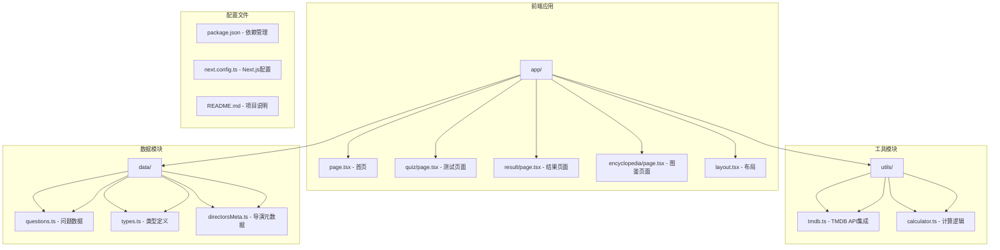
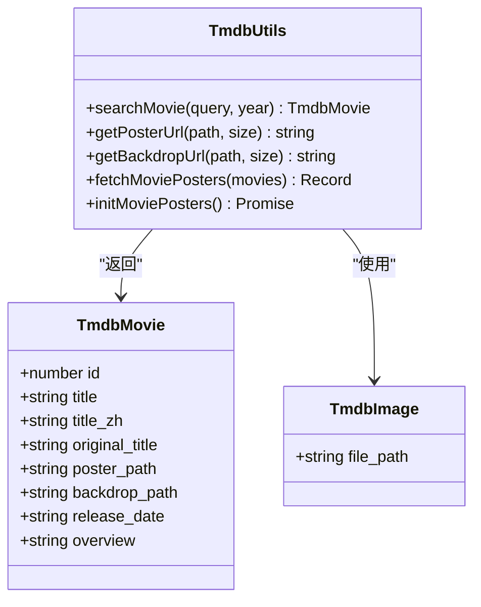
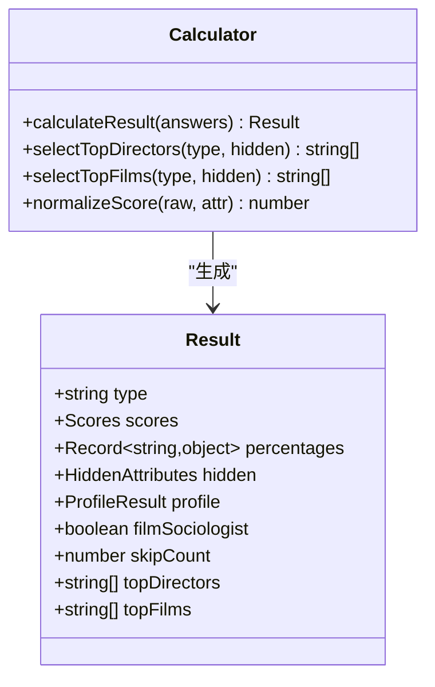
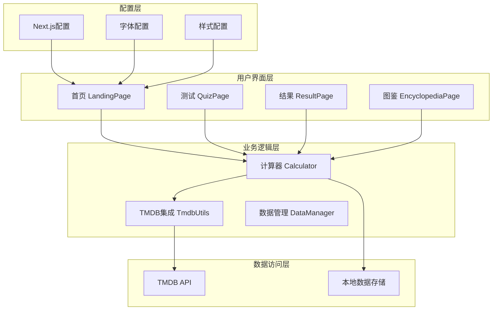
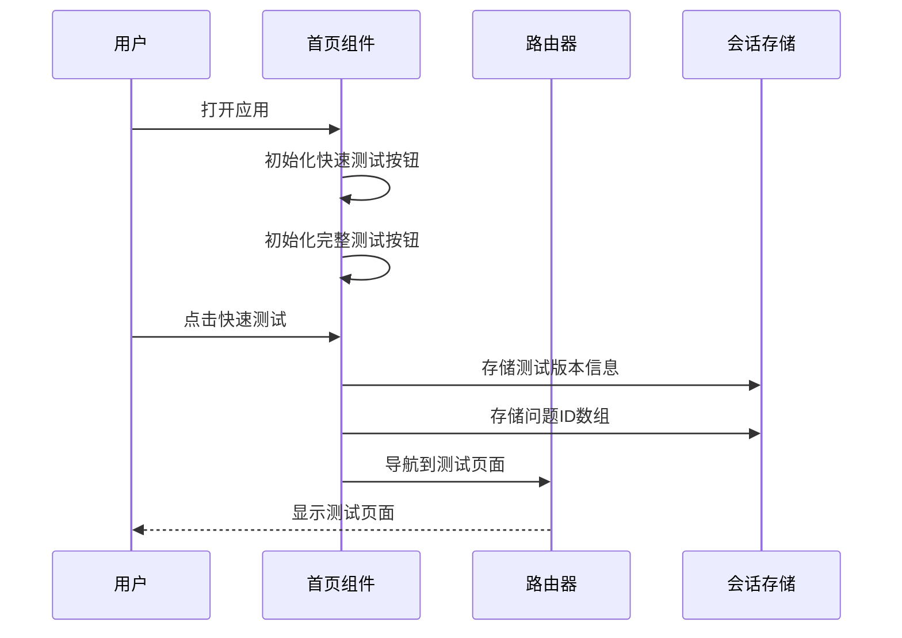
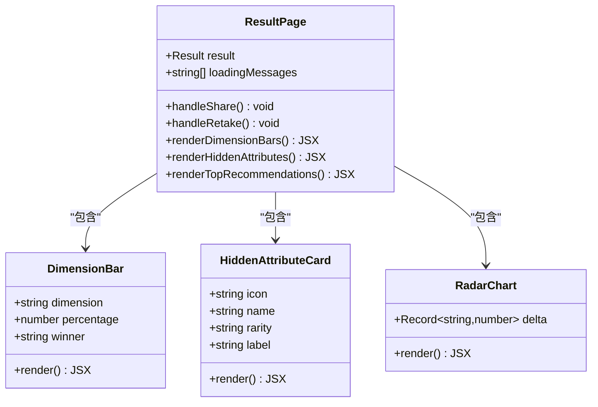
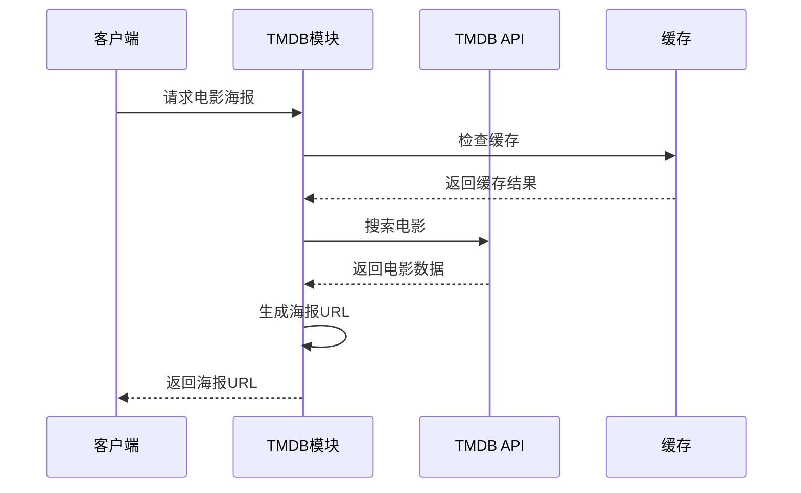

# TMDB电影海报集成系统

<cite>
**本文档引用的文件**
- [README.md](file://README.md)
- [package.json](file://package.json)
- [next.config.ts](file://next.config.ts)
- [app/layout.tsx](file://app/layout.tsx)
- [app/page.tsx](file://app/page.tsx)
- [app/quiz/page.tsx](file://app/quiz/page.tsx)
- [app/result/page.tsx](file://app/result/page.tsx)
- [app/encyclopedia/page.tsx](file://app/encyclopedia/page.tsx)
- [utils/tmdb.ts](file://utils/tmdb.ts)
- [utils/calculator.ts](file://utils/calculator.ts)
- [data/questions.ts](file://data/questions.ts)
- [data/types.ts](file://data/types.ts)
- [data/directorsMeta.ts](file://data/directorsMeta.ts)
</cite>

## 目录
1. [项目概述](#项目概述)
2. [项目结构](#项目结构)
3. [核心组件](#核心组件)
4. [架构概览](#架构概览)
5. [详细组件分析](#详细组件分析)
6. [依赖关系分析](#依赖关系分析)
7. [性能考虑](#性能考虑)
8. [故障排除指南](#故障排除指南)
9. [结论](#结论)

## 项目概述

FBTI（Film Buff Type Indicator）是一个基于Next.js开发的电影人格类型测试系统，集成了TMDB（The Movie Database）电影海报展示功能。该系统通过20个精心设计的问题，帮助用户发现自己的电影人格类型，并提供个性化的电影推荐。

### 主要特性
- **电影人格测试**：基于MBTI理念的电影偏好分析
- **TMDB集成**：自动获取电影海报和相关信息
- **个性化推荐**：根据用户类型推荐导演和电影
- **可视化展示**：直观的维度分析和类型基因图表
- **社交分享**：支持生成分享卡片

## 项目结构



**图表来源**
- [app/page.tsx:1-138](file://app/page.tsx#L1-138)
- [utils/tmdb.ts:1-151](file://utils/tmdb.ts#L1-151)
- [utils/calculator.ts:1-504](file://utils/calculator.ts#L1-504)
- [data/questions.ts:1-800](file://data/questions.ts#L1-800)

**章节来源**
- [README.md:1-37](file://README.md#L1-L37)
- [package.json:1-30](file://package.json#L1-L30)

## 核心组件

### TMDB电影海报集成模块

系统的核心功能之一是集成TMDB API来获取电影海报。该模块提供了完整的电影搜索、海报URL生成和批量海报获取功能。



**图表来源**
- [utils/tmdb.ts:4-18](file://utils/tmdb.ts#L4-L18)

### 电影人格计算引擎

系统的核心计算逻辑负责分析用户答案并生成电影人格类型报告。



**图表来源**
- [utils/calculator.ts:31-41](file://utils/calculator.ts#L31-L41)

**章节来源**
- [utils/tmdb.ts:1-151](file://utils/tmdb.ts#L1-L151)
- [utils/calculator.ts:1-504](file://utils/calculator.ts#L1-L504)

## 架构概览

系统采用模块化架构设计，分为多个层次：



**图表来源**
- [app/page.tsx:6-34](file://app/page.tsx#L6-L34)
- [app/quiz/page.tsx:20-55](file://app/quiz/page.tsx#L20-L55)
- [app/result/page.tsx:64-93](file://app/result/page.tsx#L64-L93)

## 详细组件分析

### 首页组件分析

首页作为应用的入口点，提供了快速测试和完整测试两种模式的选择。



**图表来源**
- [app/page.tsx:29-34](file://app/page.tsx#L29-L34)

### 测试页面组件分析

测试页面实现了完整的问卷流程，包括问题显示、答案记录和进度跟踪。


**图表来源**
- [app/quiz/page.tsx:122-151](file://app/quiz/page.tsx#L122-L151)

### 结果页面组件分析

结果页面展示了详细的电影人格分析报告，包括维度分析、隐藏属性和个性化推荐。



**图表来源**
- [app/result/page.tsx:64-93](file://app/result/page.tsx#L64-L93)

### TMDB集成模块分析

TMDB集成模块提供了完整的电影数据获取和处理功能。



**图表来源**
- [utils/tmdb.ts:92-108](file://utils/tmdb.ts#L92-L108)

**章节来源**
- [app/page.tsx:1-138](file://app/page.tsx#L1-L138)
- [app/quiz/page.tsx:1-528](file://app/quiz/page.tsx#L1-L528)
- [app/result/page.tsx:1-923](file://app/result/page.tsx#L1-L923)
- [app/encyclopedia/page.tsx:1-354](file://app/encyclopedia/page.tsx#L1-L354)

## 依赖关系分析

系统使用现代化的前端技术栈，具有清晰的依赖关系：

```mermaid
graph TB
subgraph "运行时依赖"
RD1[react@19.2.4]
RD2[react-dom@19.2.4]
RD3[next@16.2.4]
RD4[framer-motion@12.38.0]
RD5[html2canvas@1.4.1]
end
subgraph "开发依赖"
DD1[typescript@^5]
DD2[tailwindcss@^4]
DD3[eslint@^9]
DD4[@types/react@^19]
DD5[@types/node@^20]
end
subgraph "配置依赖"
CD1[postcss.config.mjs]
CD2[tsconfig.json]
CD3[eslint.config.mjs]
end
RD1 --> RD2
RD3 --> RD1
RD3 --> RD2
RD4 --> RD1
RD5 --> RD1
```

**图表来源**
- [package.json:11-28](file://package.json#L11-L28)

**章节来源**
- [package.json:1-30](file://package.json#L1-L30)

## 性能考虑

### 浏览器兼容性
- 支持现代浏览器的渐进增强设计
- 使用CSS Grid和Flexbox实现响应式布局
- 优化的字体加载策略

### 性能优化策略
- **懒加载**：图片和组件按需加载
- **缓存机制**：TMDB海报URL预加载缓存
- **内存管理**：及时清理会话存储数据
- **渲染优化**：使用React.memo和useMemo

### 网络优化
- **CDN集成**：使用TMDB官方CDN加速图片加载
- **压缩传输**：启用Gzip压缩
- **连接复用**：HTTP/2连接复用

## 故障排除指南

### 常见问题及解决方案

#### TMDB API错误
**症状**：电影海报无法加载
**原因**：API密钥无效或网络连接问题
**解决方案**：
1. 检查API密钥是否正确配置
2. 验证网络连接状态
3. 查看控制台错误信息

#### 计算结果异常
**症状**：电影人格类型不符合预期
**原因**：答案权重计算或阈值设置问题
**解决方案**：
1. 检查答案权重分配
2. 验证维度阈值设置
3. 确认隐藏属性评分逻辑

#### 图片加载失败
**症状**：部分电影海报显示占位符
**原因**：TMDB图片服务不可用或图片路径错误
**解决方案**：
1. 实现图片加载失败降级策略
2. 添加图片缓存机制
3. 提供本地默认图片

**章节来源**
- [utils/tmdb.ts:76-79](file://utils/tmdb.ts#L76-L79)
- [utils/calculator.ts:64-76](file://utils/calculator.ts#L64-L76)

## 结论

FBTI电影海报集成系统是一个功能完整、架构清晰的电影人格测试应用。系统成功集成了TMDB API，提供了流畅的用户体验和丰富的个性化功能。

### 技术亮点
- **模块化设计**：清晰的组件分离和职责划分
- **响应式架构**：适应不同设备和屏幕尺寸
- **性能优化**：合理的缓存策略和资源管理
- **可扩展性**：易于添加新功能和新类型

### 改进建议
1. **国际化支持**：增加多语言界面支持
2. **数据分析**：添加用户行为分析功能
3. **社交功能**：集成社交媒体分享功能
4. **移动端优化**：针对移动设备进行深度优化

该系统为电影爱好者提供了一个有趣且富有洞察力的工具，帮助他们更好地理解和探索自己的电影偏好。