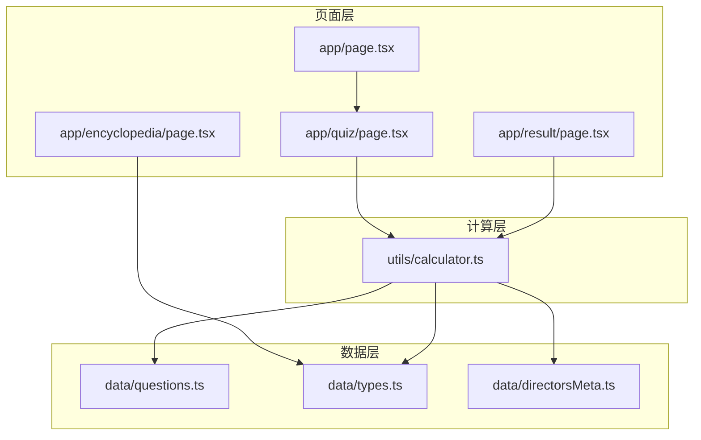
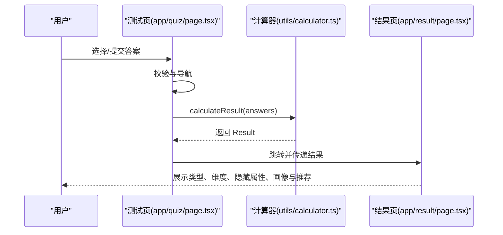
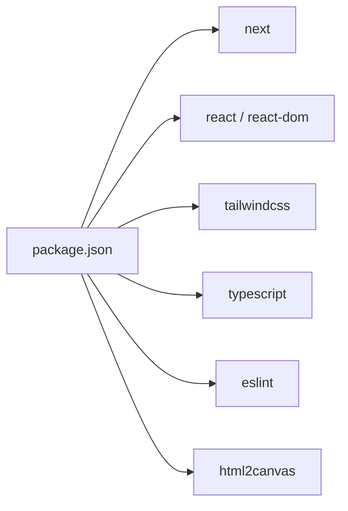

# 扩展开发

<cite>
**本文引用的文件**
- [README.md](file://README.md)
- [package.json](file://package.json)
- [app/page.tsx](file://app/page.tsx)
- [app/quiz/page.tsx](file://app/quiz/page.tsx)
- [app/result/page.tsx](file://app/result/page.tsx)
- [app/encyclopedia/page.tsx](file://app/encyclopedia/page.tsx)
- [data/questions.ts](file://data/questions.ts)
- [data/types.ts](file://data/types.ts)
- [data/directorsMeta.ts](file://data/directorsMeta.ts)
- [utils/calculator.ts](file://utils/calculator.ts)
</cite>

## 目录
1. [简介](#简介)
2. [项目结构](#项目结构)
3. [核心组件](#核心组件)
4. [架构总览](#架构总览)
5. [详细组件分析](#详细组件分析)
6. [依赖分析](#依赖分析)
7. [性能考量](#性能考量)
8. [故障排查指南](#故障排查指南)
9. [结论](#结论)
10. [附录](#附录)

## 简介
本指南面向 FBTI 项目的扩展开发者，提供添加新问题、新类型与自定义推荐算法的完整流程，详述数据模型与计算逻辑的扩展方式，并给出问题设计原则、测试与验证方法、插件化扩展点、第三方服务集成与 API 扩展建议，以及最佳实践与向后兼容性保障策略。目标是帮助你在保持现有体验一致性的前提下，安全、可控地引入新特性与新内容。

## 项目结构
FBTI 是基于 Next.js 的前端应用，采用页面路由与客户端交互结合的架构：
- 页面层：app/ 下的页面组件负责用户交互与展示（首页、测试页、结果页、图鉴页）
- 数据层：data/ 下的数据文件定义问题、类型、元数据
- 计算层：utils/ 下的计算器模块实现评分、归类与个性化推荐
- 样式与依赖：package.json 管理依赖与构建脚本

图表来源
- [app/page.tsx:1-76](file://app/page.tsx#L1-L76)
- [app/quiz/page.tsx:1-395](file://app/quiz/page.tsx#L1-L395)
- [app/result/page.tsx:1-923](file://app/result/page.tsx#L1-L923)
- [app/encyclopedia/page.tsx:1-354](file://app/encyclopedia/page.tsx#L1-L354)
- [data/questions.ts:1-1867](file://data/questions.ts#L1-L1867)
- [data/types.ts:1-428](file://data/types.ts#L1-L428)
- [data/directorsMeta.ts:1-279](file://data/directorsMeta.ts#L1-L279)
- [utils/calculator.ts:1-504](file://utils/calculator.ts#L1-L504)

章节来源
- [README.md:1-37](file://README.md#L1-L37)
- [package.json:1-30](file://package.json#L1-L30)

## 核心组件
- 问题数据模型与问题集合：定义问题类型、选项、隐藏信号、图片占位等
- 人格类型数据模型与类型集合：定义 16 种类型及其代表导演/作品、社交标签等
- 导演与影片元数据：包含时代、风格、多样性等元信息，用于个性化推荐
- 计算器：负责评分、百分比、隐藏属性、画像生成、个性化推荐与“银幕社会学家”彩蛋判定

章节来源
- [data/questions.ts:1-1867](file://data/questions.ts#L1-L1867)
- [data/types.ts:1-428](file://data/types.ts#L1-L428)
- [data/directorsMeta.ts:1-279](file://data/directorsMeta.ts#L1-L279)
- [utils/calculator.ts:1-504](file://utils/calculator.ts#L1-L504)

## 架构总览
FBTI 的核心流程是“答题 -> 计算 -> 结果呈现”。测试页收集答案，计算模块进行评分与个性化推荐，结果页展示类型、维度分析、隐藏属性、画像与推荐。

图表来源
- [app/quiz/page.tsx:69-95](file://app/quiz/page.tsx#L69-L95)
- [utils/calculator.ts:235-444](file://utils/calculator.ts#L235-L444)
- [app/result/page.tsx:64-93](file://app/result/page.tsx#L64-L93)

## 详细组件分析

### 问题系统（Questions）
- 问题接口与选项接口定义了问题类型、主维度、文本、选项、图片占位、profile 标签与多选上限等字段
- 支持二元、多选、二元含跳过、多选等题型；选项类型支持“实质性回答”和“跳过”
- 隐藏信号用于统计隐藏属性（α/β/γ/δ），并支持按类型（如恐怖、纪录片）计数
- 图片占位支持单图、左右分割、网格布局，可挂载 TMDB 或 AI 提示词

扩展要点
- 新增问题时需确保主维度与题型正确，隐藏信号权重合理，避免破坏维度平衡
- 多选题需设置 maxSelect，避免过度膨胀权重
- 图片占位仅用于 UI 呈现，不影响计算逻辑

章节来源
- [data/questions.ts:1-1867](file://data/questions.ts#L1-L1867)

### 人格类型系统（Types）
- 每个类型包含代码、名称、标语、描述、代表导演、代表作品、社交标签
- 类型代码由四个字母组成，分别对应四大维度的赢家
- 类型与隐藏属性、个性化推荐强关联

扩展要点
- 新类型需与隐藏属性阈值匹配，避免出现“无法达到”的类型
- 代表导演/作品需与元数据一致，便于后续个性化推荐

章节来源
- [data/types.ts:1-428](file://data/types.ts#L1-L428)

### 导演与影片元数据（DirectorsMeta/FilmsMeta）
- 导演元数据包含时代、风格、多样性等，用于个性化推荐
- 影片元数据包含年份、风格、类型等，用于个性化推荐
- 推荐算法通过归一化隐藏属性与元数据进行打分

扩展要点
- 新增导演/影片时，需同步更新元数据，确保评分函数可用
- 时代与风格的归一化阈值会影响推荐权重，需谨慎设定

章节来源
- [data/directorsMeta.ts:1-279](file://data/directorsMeta.ts#L1-L279)

### 计算器（Calculator）
- 主要职责：聚合答案、计算维度分数、隐藏属性、百分比、类型、画像、推荐、彩蛋判定
- 多选题按实质性选项数量进行权重分配
- 隐藏属性统计与归一化，生成稀有度标签
- 个性化推荐：根据类型与隐藏属性，结合导演/影片元数据打分，输出 Top3

扩展要点
- 新增维度或隐藏属性时，需同步更新计算与 UI 展示
- 百分比计算基于每对维度的总分，注意极端情况下的平分处理
- 推荐算法权重与阈值需与类型设计相匹配

章节来源
- [utils/calculator.ts:1-504](file://utils/calculator.ts#L1-L504)

### 页面组件（Quiz/Result/Encyclopedia/Home）
- 测试页：支持题型切换、多选限制、跳过项处理、进度条与动画
- 结果页：展示类型、维度分析、隐藏属性、画像、推荐、分享卡片生成
- 图鉴页：展示四大维度、16 种类型、隐藏属性等级、类型基因
- 首页：入口与导航

扩展要点
- 新增问题或类型时，需同步更新 UI 展示与交互逻辑
- 分享卡片生成依赖 html2canvas，需保证 DOM 渲染完成与字体加载

章节来源
- [app/quiz/page.tsx:1-395](file://app/quiz/page.tsx#L1-L395)
- [app/result/page.tsx:1-923](file://app/result/page.tsx#L1-L923)
- [app/encyclopedia/page.tsx:1-354](file://app/encyclopedia/page.tsx#L1-L354)
- [app/page.tsx:1-76](file://app/page.tsx#L1-L76)

## 依赖分析
- 依赖管理：Next.js、React、TailwindCSS、TypeScript
- 运行时依赖：html2canvas 用于分享卡片生成
- 开发依赖：ESLint、Tailwind PostCSS 插件、类型声明

图表来源
- [package.json:1-30](file://package.json#L1-L30)

章节来源
- [package.json:1-30](file://package.json#L1-L30)

## 性能考量
- 计算复杂度：计算模块对每个答案进行 O(1) 的分数累加与隐藏属性统计，整体 O(n)，n 为问题数
- 推荐复杂度：对类型内的导演/影片进行打分排序，复杂度 O(m log m)，m 为类型内元素数
- UI 渲染：分享卡片生成使用 html2canvas，建议在用户操作后延迟触发，避免阻塞主线程
- 图片占位：TMDB/AI 占位仅用于 UI，实际运行中可替换为真实资源或懒加载策略

[本节为通用性能建议，无需特定文件引用]

## 故障排查指南
- 答案为空或异常：检查答案序列是否正确传递至计算模块
- 类型异常或无法达到：检查隐藏属性阈值与类型权重是否匹配
- 推荐为空：检查元数据是否缺失或评分函数是否返回 0
- 分享卡片失败：确认 DOM 已渲染完成且字体加载完毕，避免并发调用
- 多选题权重异常：确认实质性选项数量与权重分配逻辑

章节来源
- [utils/calculator.ts:235-444](file://utils/calculator.ts#L235-L444)
- [app/result/page.tsx:102-134](file://app/result/page.tsx#L102-L134)

## 结论
FBTI 的扩展开发围绕“问题-类型-元数据-计算-展示”五层结构展开。通过规范的问题设计、合理的隐藏属性阈值与权重、严谨的类型与元数据维护，以及对计算与 UI 的一致性校验，可以在不破坏用户体验的前提下，安全地引入新问题、新类型与自定义推荐算法。建议在每次扩展后进行回归测试与性能评估，确保扩展的稳定性与可维护性。

[本节为总结性内容，无需特定文件引用]

## 附录

### 添加新问题的完整流程
- 设计问题
  - 明确主维度与题型（二元/多选/二元含跳过/多选）
  - 编写选项，确保“实质性回答”与“跳过”区分明确
  - 如需隐藏信号，合理设置权重与类型（如恐怖、纪录片等）
  - 如需图片占位，选择合适布局并提供 TMDB 或 AI 提示词
- 更新数据
  - 在问题集合中新增问题条目，确保 id 不冲突
  - 若涉及 profile 标签，补充 profileTags 映射
- 校验与测试
  - 在测试页验证题型与交互
  - 使用少量样本验证隐藏属性统计与百分比计算
  - 检查多选题的权重分配与跳过项处理
- 发布前检查
  - 确认隐藏属性阈值与类型设计一致
  - 确保 UI 展示与交互逻辑正确

章节来源
- [data/questions.ts:1-1867](file://data/questions.ts#L1-L1867)
- [app/quiz/page.tsx:39-95](file://app/quiz/page.tsx#L39-L95)

### 添加新类型与个性化推荐
- 设计类型
  - 确定类型代码与四大维度的赢家组合
  - 编写名称、标语、描述、社交标签
  - 列出代表导演与代表作品
- 更新类型数据
  - 在类型集合中新增类型条目
  - 确保类型代码唯一且与隐藏属性阈值匹配
- 更新元数据
  - 为类型内的导演/影片补充元数据（时代、风格、多样性等）
  - 确保评分函数可用
- 校验与测试
  - 在结果页验证类型展示与推荐
  - 检查隐藏属性与稀有度标签显示
  - 验证分享卡片生成

章节来源
- [data/types.ts:1-428](file://data/types.ts#L1-L428)
- [data/directorsMeta.ts:1-279](file://data/directorsMeta.ts#L1-L279)
- [utils/calculator.ts:446-504](file://utils/calculator.ts#L446-L504)
- [app/result/page.tsx:162-462](file://app/result/page.tsx#L162-L462)

### 修改推荐算法与权重
- 理解当前推荐逻辑
  - 导演评分：时代偏好、风格偏好、多样性偏好，加权求和
  - 影片评分：年份偏好、风格偏好，混合导演评分
  - 归一化：隐藏属性按阈值归一到 0-1 区间
- 修改建议
  - 调整权重：导演评分与影片评分的权重比例
  - 调整阈值：隐藏属性的稀有度阈值
  - 新增维度：如需引入新维度，需同步更新类型与元数据
- 验证方法
  - 对比前后推荐结果，确保趋势合理
  - 使用样例数据验证极端情况（如极端隐藏属性）
  - 检查 UI 展示与分享卡片生成

章节来源
- [data/directorsMeta.ts:235-279](file://data/directorsMeta.ts#L235-L279)
- [utils/calculator.ts:446-504](file://utils/calculator.ts#L446-L504)

### 插件化开发与扩展点
- 数据层扩展点
  - 问题集合：新增问题条目
  - 类型集合：新增类型条目
  - 元数据集合：新增导演/影片元数据
- 计算层扩展点
  - 新增隐藏属性：更新隐藏属性统计与稀有度标签
  - 新增维度：更新百分比计算与类型判定
  - 新增彩蛋：在计算模块中增加判定逻辑
- UI 层扩展点
  - 新增页面：在 app/ 下新增页面组件
  - 新增组件：在 components/ 下新增可复用组件
  - 新增样式：在 app/globals.css 或 Tailwind 配置中扩展
- 第三方服务集成
  - TMDB 集成：在图鉴与结果页中链接 TMDB 搜索
  - 分享卡片：使用 html2canvas 生成 PNG，注意字体与渲染时机
  - 图片占位：支持 TMDB 与 AI 提示词，按布局渲染

章节来源
- [app/encyclopedia/page.tsx:1-354](file://app/encyclopedia/page.tsx#L1-L354)
- [app/result/page.tsx:102-134](file://app/result/page.tsx#L102-L134)
- [data/directorsMeta.ts:1-279](file://data/directorsMeta.ts#L1-L279)

### 测试与验证流程
- 单元测试（建议）
  - 针对计算模块的关键函数进行单元测试（隐藏属性统计、百分比计算、推荐排序）
  - 使用样例数据验证边界条件（极端权重、平分、跳过项）
- 端到端测试（建议）
  - 自动化测试覆盖测试页到结果页的完整流程
  - 验证分享卡片生成与下载
- 回归测试
  - 在每次扩展后运行回归测试，确保不破坏既有功能
- 用户验收测试
  - 邀请少量用户参与测试，收集反馈并优化体验

[本节为通用测试建议，无需特定文件引用]

### 最佳实践与向后兼容性
- 版本控制
  - 使用语义化版本管理，重大变更升级主版本
- 数据迁移
  - 新增字段时提供默认值，避免破坏既有数据
  - 逐步引入新类型与问题，避免一次性大规模变更
- UI 一致性
  - 保持界面风格与交互一致性，避免破坏用户习惯
- 文档与注释
  - 为新增功能编写文档与注释，便于后续维护
- 性能监控
  - 关注计算与渲染性能，必要时进行优化

[本节为通用最佳实践建议，无需特定文件引用]