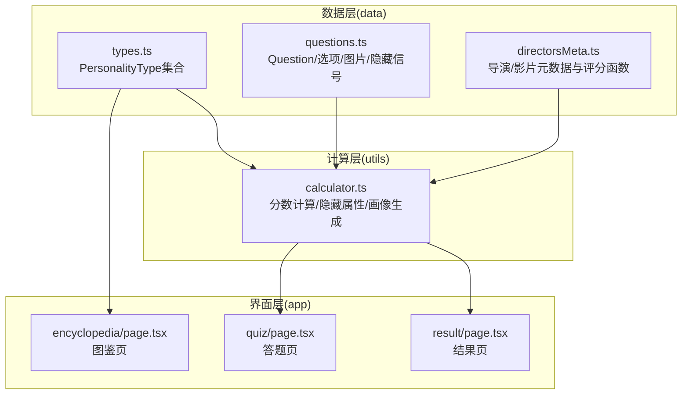
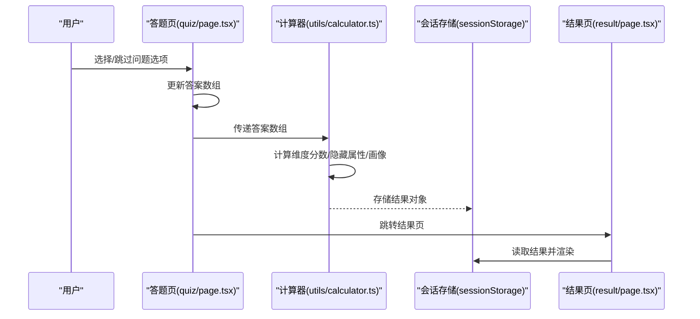
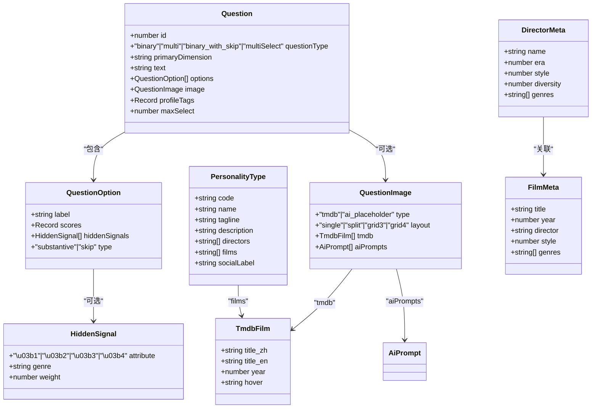
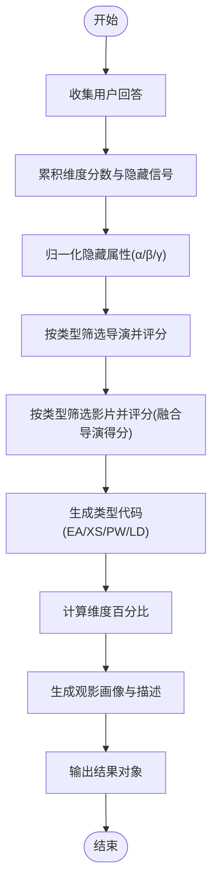
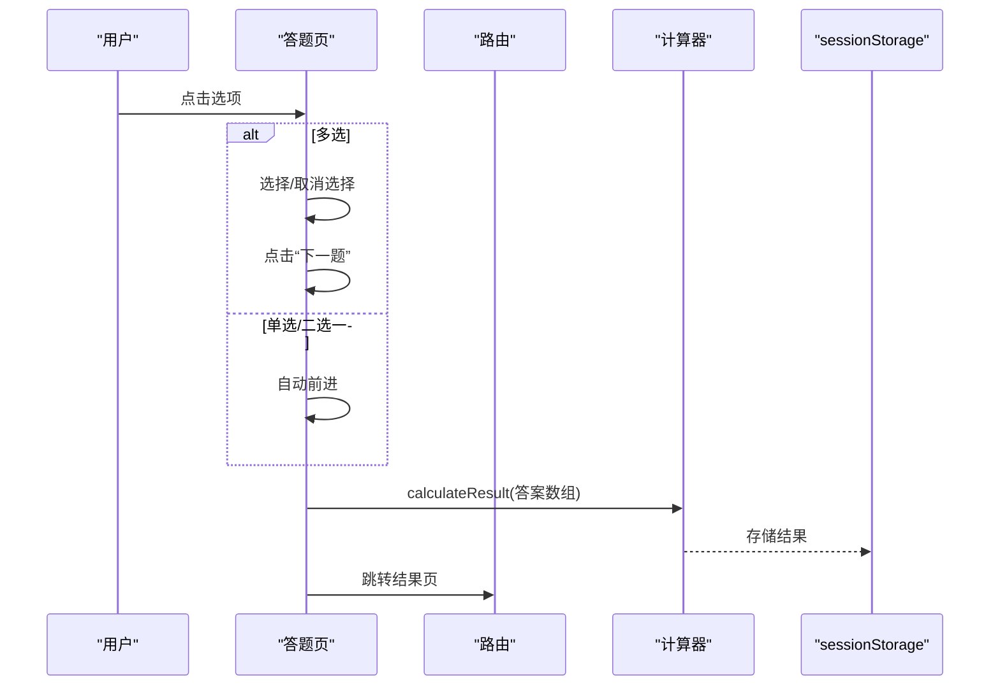
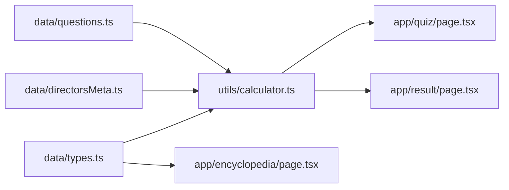

# 扩展数据模型

<cite>
**本文引用的文件**
- [data/types.ts](file://data/types.ts)
- [data/questions.ts](file://data/questions.ts)
- [data/directorsMeta.ts](file://data/directorsMeta.ts)
- [utils/calculator.ts](file://utils/calculator.ts)
- [app/quiz/page.tsx](file://app/quiz/page.tsx)
- [app/result/page.tsx](file://app/result/page.tsx)
- [app/encyclopedia/page.tsx](file://app/encyclopedia/page.tsx)
- [package.json](file://package.json)
</cite>

## 目录
1. [简介](#简介)
2. [项目结构](#项目结构)
3. [核心组件](#核心组件)
4. [架构总览](#架构总览)
5. [详细组件分析](#详细组件分析)
6. [依赖分析](#依赖分析)
7. [性能考虑](#性能考虑)
8. [故障排查指南](#故障排查指南)
9. [结论](#结论)
10. [附录](#附录)

## 简介
本指南面向FBTI项目的扩展需求，围绕现有数据模型进行系统化扩展设计与演进。目标包括：
- 明确现有数据模型的架构与职责边界（Question、PersonalityType、TmdbFilm等）
- 提供扩展点与演进原则（向后兼容、数据一致性、平滑迁移）
- 制定从需求分析到实现与测试的完整流程
- 定义新增字段、关系映射与约束
- 规范数据验证、默认值与错误处理
- 设计数据迁移策略、版本管理与备份恢复
- 提供测试方法、性能监控与维护建议

## 项目结构
FBTI采用Next.js应用结构，数据模型集中于data目录，计算逻辑位于utils，UI页面位于app目录。整体呈现“数据-计算-界面”三层架构。

图表来源
- [data/types.ts:1-428](file://data/types.ts#L1-L428)
- [data/questions.ts:1-800](file://data/questions.ts#L1-L800)
- [data/directorsMeta.ts:1-279](file://data/directorsMeta.ts#L1-L279)
- [utils/calculator.ts:1-504](file://utils/calculator.ts#L1-L504)
- [app/quiz/page.tsx:1-395](file://app/quiz/page.tsx#L1-L395)
- [app/result/page.tsx:1-923](file://app/result/page.tsx#L1-L923)
- [app/encyclopedia/page.tsx:1-354](file://app/encyclopedia/page.tsx#L1-L354)

章节来源
- [package.json:1-30](file://package.json#L1-L30)

## 核心组件
- PersonalityType：定义16种电影人格类型，包含代码、名称、标语、描述、代表导演与影片、社交标签等字段。
- Question/QuestionOption/QuestionImage/TmdbFilm：定义问卷问题、选项、图片占位布局与TMDB信息结构。
- HiddenSignal：定义隐藏属性（α/β/γ/δ）及其权重，用于驱动个性化推荐与画像。
- DirectorMeta/FilmMeta：导演与影片元数据，含时代、风格、多样性、类型等维度，配合评分函数驱动个性化推荐。
- 计算器：负责收集用户回答、累积维度分数、计算隐藏属性、生成画像与Top推荐。

章节来源
- [data/types.ts:1-428](file://data/types.ts#L1-L428)
- [data/questions.ts:1-800](file://data/questions.ts#L1-L800)
- [data/directorsMeta.ts:1-279](file://data/directorsMeta.ts#L1-L279)
- [utils/calculator.ts:1-504](file://utils/calculator.ts#L1-L504)

## 架构总览
FBTI的数据流从问卷页面收集用户回答，经计算器聚合维度分数与隐藏属性，最终在结果页呈现类型、画像、推荐与分享卡片；图鉴页提供类型与隐藏属性的静态浏览。

图表来源
- [app/quiz/page.tsx:69-95](file://app/quiz/page.tsx#L69-L95)
- [utils/calculator.ts:235-444](file://utils/calculator.ts#L235-L444)
- [app/result/page.tsx:72-93](file://app/result/page.tsx#L72-L93)

## 详细组件分析

### 数据模型类图

图表来源
- [data/questions.ts:1-800](file://data/questions.ts#L1-L800)
- [data/types.ts:1-428](file://data/types.ts#L1-L428)
- [data/directorsMeta.ts:1-279](file://data/directorsMeta.ts#L1-L279)

章节来源
- [data/questions.ts:1-800](file://data/questions.ts#L1-L800)
- [data/types.ts:1-428](file://data/types.ts#L1-L428)
- [data/directorsMeta.ts:1-279](file://data/directorsMeta.ts#L1-L279)

### 计算流程与隐藏属性
- 隐藏属性α/β/γ/δ通过问题选项中的HiddenSignal累积，分别对应“时代偏好”、“形式偏好”、“国际偏好”、“类型基因”。
- 计算器对每个维度分数进行归一化与百分比计算，并据此生成类型代码与画像描述。
- 个性化推荐基于PersonalityType内的导演/影片列表，结合导演元数据与影片元数据进行评分。

图表来源
- [utils/calculator.ts:235-444](file://utils/calculator.ts#L235-L444)
- [data/directorsMeta.ts:242-279](file://data/directorsMeta.ts#L242-L279)

章节来源
- [utils/calculator.ts:235-444](file://utils/calculator.ts#L235-L444)
- [data/directorsMeta.ts:242-279](file://data/directorsMeta.ts#L242-L279)

### 问答交互序列

图表来源
- [app/quiz/page.tsx:39-95](file://app/quiz/page.tsx#L39-L95)
- [utils/calculator.ts:235-444](file://utils/calculator.ts#L235-L444)

章节来源
- [app/quiz/page.tsx:39-95](file://app/quiz/page.tsx#L39-L95)

## 依赖分析
- 数据层依赖：utils/calculator.ts同时依赖data/questions.ts、data/directorsMeta.ts与data/types.ts。
- 界面层依赖：app/quiz/page.tsx依赖data/questions.ts与utils/calculator.ts；app/result/page.tsx依赖utils/calculator.ts与data/types.ts；app/encyclopedia/page.tsx依赖data/types.ts。
- 运行时依赖：package.json声明React、Next.js、TailwindCSS与开发工具链。

图表来源
- [data/questions.ts:1-800](file://data/questions.ts#L1-L800)
- [data/directorsMeta.ts:1-279](file://data/directorsMeta.ts#L1-L279)
- [data/types.ts:1-428](file://data/types.ts#L1-L428)
- [utils/calculator.ts:1-504](file://utils/calculator.ts#L1-L504)
- [app/quiz/page.tsx:1-395](file://app/quiz/page.tsx#L1-L395)
- [app/result/page.tsx:1-923](file://app/result/page.tsx#L1-L923)
- [app/encyclopedia/page.tsx:1-354](file://app/encyclopedia/page.tsx#L1-L354)

章节来源
- [package.json:1-30](file://package.json#L1-L30)

## 性能考虑
- 计算复杂度：当前计算为线性规模（与问题数量成正比），隐藏属性归一化与Top推荐排序为O(n log n)，总体可接受。
- 渲染优化：结果页使用html2canvas生成分享卡片，建议在用户触发下载时异步执行并限制并发。
- 数据体积：PersonalityType与元数据集较小，适合前端打包；若扩展为动态加载，可考虑懒加载与CDN缓存。
- 缓存策略：sessionStorage用于短期结果缓存，避免重复计算；可引入本地持久化以支持断点续答。

## 故障排查指南
- 答案缺失或格式异常
  - 现象：维度分数异常、类型判定错误、Top推荐为空。
  - 排查：检查答案数组是否包含有效选项索引；确认QuestionOption的scores与hiddenSignals字段存在且权重合法。
  - 参考：[utils/calculator.ts:269-344](file://utils/calculator.ts#L269-L344)
- 隐藏属性负值
  - 现象：α/β/γ出现负数导致归一化异常。
  - 处理：计算后对隐藏属性进行非负裁剪。
  - 参考：[utils/calculator.ts:346-352](file://utils/calculator.ts#L346-L352)
- 多选权重
  - 现象：多选题权重分配不合理。
  - 处理：根据选择数量进行均分权重，确保公平性。
  - 参考：[utils/calculator.ts:293-294](file://utils/calculator.ts#L293-L294)
- TMDB链接失效
  - 现象：点击“代表导演/作品”无法跳转。
  - 处理：校验查询参数编码与TMDB接口变更；必要时增加降级提示。
  - 参考：[app/result/page.tsx:306-331](file://app/result/page.tsx#L306-L331)

章节来源
- [utils/calculator.ts:269-352](file://utils/calculator.ts#L269-L352)
- [app/result/page.tsx:306-331](file://app/result/page.tsx#L306-L331)

## 结论
FBTI的数据模型以“类型-维度-隐藏属性-元数据”为核心，具备良好的扩展性。通过明确的演进原则与流程规范，可在保持向后兼容的前提下安全地引入新字段、关系与约束，实现数据一致性与平滑迁移。

## 附录

### 扩展数据模型的演进原则
- 向后兼容
  - 新增字段需提供默认值，避免破坏既有逻辑。
  - 旧数据结构保留读取路径，新增字段仅在新版本生效。
- 数据一致性
  - 使用强类型接口约束字段类型与取值范围。
  - 对外部依赖（如TMDB）进行容错与降级处理。
- 平滑迁移
  - 引入版本号字段，逐步替换旧键值。
  - 提供迁移脚本与回滚策略，记录迁移日志。

### 模型扩展流程
- 需求分析
  - 明确业务目标与用户场景，识别需要扩展的实体与关系。
  - 评估影响范围与风险，制定版本发布计划。
- 接口设计
  - 在data目录新增或修改接口定义，确保字段命名与语义清晰。
  - 定义默认值与约束条件，补充注释说明用途与取值范围。
- 实现与测试
  - 修改utils/calculator.ts以适配新字段与计算逻辑。
  - 在app/quiz与app/result中更新UI与交互，确保数据正确传递与显示。
  - 编写单元测试与集成测试，覆盖边界条件与错误分支。
- 部署与监控
  - 发布灰度版本，观察指标与日志。
  - 设置告警阈值，快速响应异常。
  - 收集用户反馈，迭代优化。

### 新增字段与关系映射示例
- 新增PersonalityType字段
  - 字段：如“偏好类型”、“评分标准”等，需在接口中声明并在PersonalityType集合中初始化。
  - 关系：与QuestionImage中的tmdb字段类似，作为类型层面的元数据。
- 新增Question字段
  - 字段：如“难度等级”、“适用人群”等，用于筛选或排序。
  - 关系：与QuestionOption的scores并列，不影响现有评分逻辑。
- 新增HiddenSignal类型
  - 字段：新增attribute枚举值或genre扩展，需在计算器中增加权重与归一化处理。
  - 关系：与现有α/β/γ/δ并行，保持向后兼容。

### 数据验证规则、默认值与错误处理
- 验证规则
  - 必填字段：id、text、options等必须存在。
  - 取值范围：权重应在合理区间，超出范围进行裁剪或报错。
  - 类型一致：字符串、数字、布尔等字段类型严格校验。
- 默认值
  - HiddenSignal.weight默认为0；HiddenSignal.genre可为空。
  - 多选题maxSelect默认未设置，表示不限制。
- 错误处理
  - 无效索引：忽略不存在的选项索引，避免崩溃。
  - 跳过项：skip类型不计入主维度分数，但可能影响特殊逻辑（如L+0.5）。
  - 异常捕获：结果页生成分享卡片时捕获异常并提示用户重试。

### 数据迁移策略、版本管理与备份恢复
- 版本管理
  - 在PersonalityType与Question中引入version字段，标识数据结构版本。
  - 通过迁移脚本将旧数据转换为新结构，记录迁移状态。
- 备份恢复
  - sessionStorate中的结果对象定期导出为JSON文件，便于恢复。
  - 服务端可引入轻量级持久化，支持断点续答与历史记录。
- 回滚策略
  - 保留旧版本数据结构与读取逻辑，新版本仅写入新结构。
  - 出现问题时可快速回滚至旧版本，保证服务可用。

### 测试方法、性能监控与维护
- 测试方法
  - 单元测试：针对calculateResult与评分函数编写用例，覆盖边界与异常。
  - 集成测试：模拟完整答题流程，验证结果一致性与UI渲染。
  - A/B测试：对新字段进行灰度发布，对比指标差异。
- 性能监控
  - 关键指标：计算耗时、渲染时延、分享卡片生成成功率。
  - 监控告警：超时、异常率、用户中断率。
- 维护建议
  - 定期审查接口定义，清理废弃字段。
  - 优化Top推荐算法，提升个性化质量。
  - 增强国际化支持，扩展多语言描述。