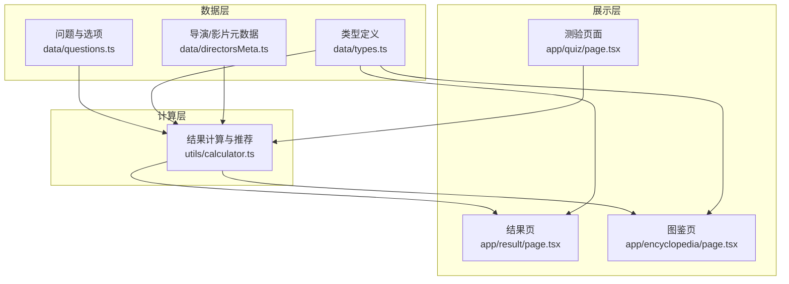
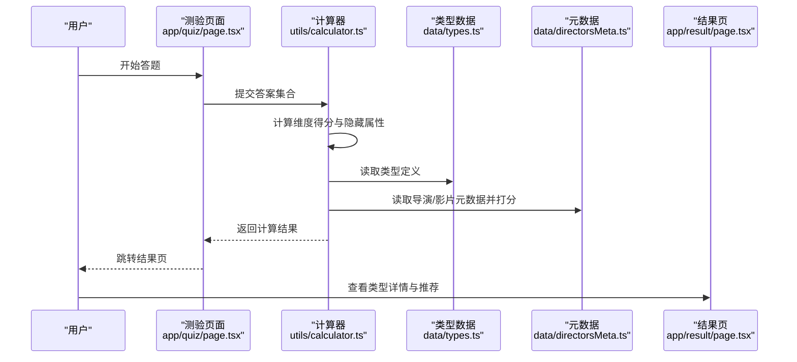
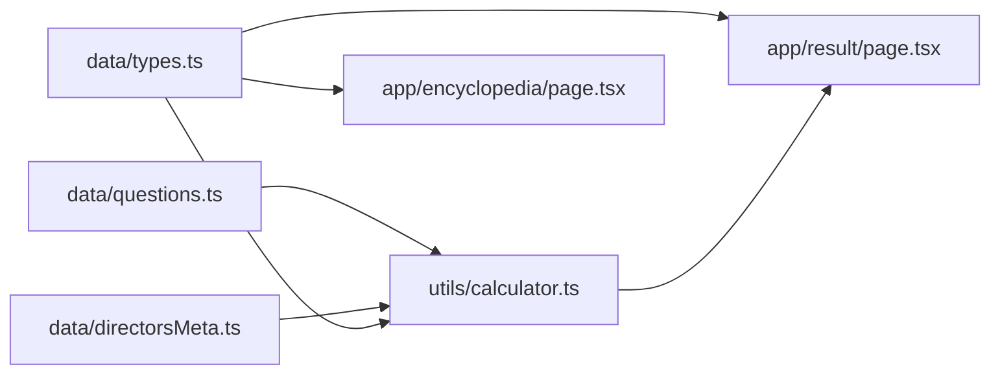

# 添加新类型

<cite>
**本文引用的文件**
- [data/types.ts](file://data/types.ts)
- [utils/calculator.ts](file://utils/calculator.ts)
- [data/questions.ts](file://data/questions.ts)
- [data/directorsMeta.ts](file://data/directorsMeta.ts)
- [app/result/page.tsx](file://app/result/page.tsx)
- [app/quiz/page.tsx](file://app/quiz/page.tsx)
- [app/encyclopedia/page.tsx](file://app/encyclopedia/page.tsx)
</cite>

## 目录
1. [简介](#简介)
2. [项目结构](#项目结构)
3. [核心组件](#核心组件)
4. [架构总览](#架构总览)
5. [详细组件分析](#详细组件分析)
6. [依赖分析](#依赖分析)
7. [性能考量](#性能考量)
8. [故障排查指南](#故障排查指南)
9. [结论](#结论)
10. [附录](#附录)

## 简介
本指南面向为 FBTI（电影人格类型）项目新增“新电影人格类型”的维护者与贡献者，目标是帮助你以严谨、可复用的方式完成从类型设计、编码实现到上线验证的全流程。文档围绕以下关键点展开：
- PersonalityType 接口的结构设计与字段职责
- 类型编码规则（typeCode）与四维度字母组合含义
- 16 种标准类型的构成原理与组合方式
- 新增类型流程：从类型定位、维度权重分析到描述文案编写
- 类型命名规范、维度解释说明与隐藏属性配置
- 类型测试验证、与其他类型的对比分析与用户体验优化建议
- 类型扩展对推荐算法的影响与性能考虑

## 项目结构
FBTI 采用前端 Next.js 应用，核心数据与逻辑分布如下：
- 数据层
  - 问题与选项：data/questions.ts
  - 类型定义：data/types.ts
  - 导演/影片元数据与评分函数：data/directorsMeta.ts
- 计算层
  - 结果计算与个性化推荐：utils/calculator.ts
- 展示层
  - 测验页面：app/quiz/page.tsx
  - 结果页：app/result/page.tsx
  - 图鉴页：app/encyclopedia/page.tsx

图表来源
- [data/questions.ts:1-800](file://data/questions.ts#L1-L800)
- [data/types.ts:1-428](file://data/types.ts#L1-L428)
- [data/directorsMeta.ts:1-279](file://data/directorsMeta.ts#L1-L279)
- [utils/calculator.ts:1-504](file://utils/calculator.ts#L1-L504)
- [app/quiz/page.tsx:1-395](file://app/quiz/page.tsx#L1-L395)
- [app/result/page.tsx:1-923](file://app/result/page.tsx#L1-L923)
- [app/encyclopedia/page.tsx:1-211](file://app/encyclopedia/page.tsx#L1-L211)

章节来源
- [data/questions.ts:1-800](file://data/questions.ts#L1-L800)
- [data/types.ts:1-428](file://data/types.ts#L1-L428)
- [data/directorsMeta.ts:1-279](file://data/directorsMeta.ts#L1-L279)
- [utils/calculator.ts:1-504](file://utils/calculator.ts#L1-L504)
- [app/quiz/page.tsx:1-395](file://app/quiz/page.tsx#L1-L395)
- [app/result/page.tsx:1-923](file://app/result/page.tsx#L1-L923)
- [app/encyclopedia/page.tsx:1-211](file://app/encyclopedia/page.tsx#L1-L211)

## 核心组件
- PersonalityType 接口
  - 字段：code、name、tagline、description、directors、films、socialLabel
  - 作用：承载每种类型的基础信息与推荐清单
- 计算器（calculateResult）
  - 输入：答题记录（含多选权重、跳过项处理）
  - 输出：类型代码、维度得分、百分比、隐藏属性、观影画像、Top 导演/影片
- 个性化推荐
  - 基于用户隐藏属性（α/β/γ/δ）与类型元数据（导演/影片）进行打分与排序

章节来源
- [data/types.ts:1-11](file://data/types.ts#L1-L11)
- [utils/calculator.ts:235-444](file://utils/calculator.ts#L235-L444)
- [data/directorsMeta.ts:235-279](file://data/directorsMeta.ts#L235-L279)

## 架构总览
类型创建与结果呈现的关键流程如下：

图表来源
- [app/quiz/page.tsx:69-95](file://app/quiz/page.tsx#L69-L95)
- [utils/calculator.ts:235-444](file://utils/calculator.ts#L235-L444)
- [data/types.ts:11-428](file://data/types.ts#L11-L428)
- [data/directorsMeta.ts:235-279](file://data/directorsMeta.ts#L235-L279)
- [app/result/page.tsx:64-149](file://app/result/page.tsx#L64-L149)

## 详细组件分析

### PersonalityType 接口与类型编码规则
- 接口字段
  - code：类型代码（4 字母编码）
  - name：类型名称
  - tagline：标语
  - description：类型描述
  - directors：代表导演（用于个性化推荐）
  - films：代表作品（用于个性化推荐）
  - socialLabel：社交表现标签
- 编码规则
  - code 由四个字母组成，分别对应四维：EA、XS、PW、LD
  - 每个字母取值来自其对应的维度两侧字母（例如 EA 维度取 E 或 A）
  - 16 种标准类型通过四维两两比较的赢家组合而成

章节来源
- [data/types.ts:1-11](file://data/types.ts#L1-L11)
- [utils/calculator.ts:354-360](file://utils/calculator.ts#L354-L360)

### 四维度与标准类型构成原理
- EA 维度：E（共情） vs A（解析）
- XS 维度：X（拓荒） vs S（深耕）
- PW 维度：P（微光） vs W（广角）
- LD 维度：L（向阳） vs D（逐暗）

标准类型通过以下组合生成（示例片段）：
- EXPL、EXPD、EXWL、EXWD
- ESPL、ESPD、ESWL、ESWD
- AXPL、AXPD、AXWL、AXWD
- ASPL、ASPD、ASWL、ASWD

章节来源
- [utils/calculator.ts:354-360](file://utils/calculator.ts#L354-L360)
- [data/types.ts:11-428](file://data/types.ts#L11-L428)

### 新增类型流程（从设计到上线）
- 步骤一：类型定位与命名
  - 明确目标受众与偏好倾向（如“喜欢宏大叙事但不追求煽情”）
  - 依据四维度选择字母组合（如 EXWL）
  - 制定名称、标语与描述文案
- 步骤二：维度权重分析
  - 分析该类型在 EA/XS/PW/LD 四维度上的倾向
  - 对照现有类型，避免重复或过度相似
- 步骤三：隐藏属性配置
  - α（时代偏好）、β（风格偏好）、γ（文化多样性）、δ（类型基因）
  - 在类型元数据中配置 directors 与 films，并确保元数据完整
- 步骤四：描述文案编写
  - 使用统一风格：强调“你是什么样的人”“你为什么喜欢这类电影”
  - 保持与现有类型一致的语气与长度
- 步骤五：测试与验证
  - 在测验中设置引导性问题，验证类型识别准确性
  - 对比相近类型，确保边界清晰
  - 检查推荐导演/影片是否合理
- 步骤六：用户体验优化
  - 结果页展示维度条形图与隐藏属性徽章
  - 提供“查看图鉴”入口，便于用户横向对比

章节来源
- [data/types.ts:11-428](file://data/types.ts#L11-L428)
- [data/directorsMeta.ts:22-116](file://data/directorsMeta.ts#L22-L116)
- [app/result/page.tsx:162-462](file://app/result/page.tsx#L162-L462)

### 类型命名规范与维度解释
- 命名规范
  - 采用“动词+名词”或“形容词+名词”的组合，体现类型的核心特征
  - 避免与现有类型重名；若需近似，应突出差异化
- 维度解释
  - EA：共情 vs 解析
  - XS：拓荒 vs 深耕
  - PW：微光 vs 广角
  - LD：向阳 vs 逐暗
- 文案风格
  - 以“你”为主语，强调个人偏好与情感共鸣
  - 适当使用比喻与意象，增强画面感与记忆点

章节来源
- [app/result/page.tsx:17-62](file://app/result/page.tsx#L17-L62)
- [data/types.ts:11-428](file://data/types.ts#L11-L428)

### 隐藏属性配置详解
- α（时间穿越者）：偏好经典/当代的倾向
- β（形式感应器）：偏好故事性/技术性的倾向
- γ（文化通行证）：偏好主流/国际化的倾向
- δ（类型基因）：对各类型（恐怖、喜剧、科幻、犯罪、动画、纪录）的偏好强度
- 配置要点
  - 在类型定义中提供代表导演与作品
  - 在元数据中完善导演/影片的 era、style、diversity、year、genres 等字段
  - 通过评分函数（scoreDirector、scoreFilm）实现个性化推荐

章节来源
- [utils/calculator.ts:446-493](file://utils/calculator.ts#L446-L493)
- [data/directorsMeta.ts:235-279](file://data/directorsMeta.ts#L235-L279)

### 类型测试与对比分析
- 测试方法
  - 设计一组引导性问题，使用户在 EA/XS/PW/LD 维度上明确倾向
  - 设置“跳过”问题，观察对维度得分与隐藏属性的影响
  - 对比相近类型（如 EXWL vs EXWD），确保边界清晰
- 对比分析
  - 以 EA 维度为例，共情型（E）与解析型（A）在“重看动机”“配乐感知”等问题上应有明显差异
  - 以 XS 维度为例，拓荒型（X）与深耕型（S）在“陌生语言电影”“电影节态度”等问题上应有不同倾向
- 用户体验优化
  - 结果页展示维度条形图与隐藏属性徽章，帮助用户理解自身偏好
  - 提供“生成分享卡片”功能，便于传播与二次创作

章节来源
- [app/quiz/page.tsx:69-95](file://app/quiz/page.tsx#L69-L95)
- [app/result/page.tsx:233-398](file://app/result/page.tsx#L233-L398)

## 依赖分析
- 类型数据依赖
  - data/types.ts 作为类型定义中心，被 app/result/page.tsx 与 utils/calculator.ts 引用
- 计算器依赖
  - 读取 data/questions.ts 的问题与选项，结合 data/directorsMeta.ts 的元数据进行打分
- 展示层依赖
  - app/result/page.tsx 与 app/encyclopedia/page.tsx 依赖 data/types.ts 进行类型展示与导航

图表来源
- [data/questions.ts:1-800](file://data/questions.ts#L1-L800)
- [data/directorsMeta.ts:1-279](file://data/directorsMeta.ts#L1-L279)
- [data/types.ts:1-428](file://data/types.ts#L1-L428)
- [utils/calculator.ts:1-504](file://utils/calculator.ts#L1-L504)
- [app/result/page.tsx:1-923](file://app/result/page.tsx#L1-L923)
- [app/encyclopedia/page.tsx:1-211](file://app/encyclopedia/page.tsx#L1-L211)

章节来源
- [data/questions.ts:1-800](file://data/questions.ts#L1-L800)
- [data/directorsMeta.ts:1-279](file://data/directorsMeta.ts#L1-L279)
- [data/types.ts:1-428](file://data/types.ts#L1-L428)
- [utils/calculator.ts:1-504](file://utils/calculator.ts#L1-L504)
- [app/result/page.tsx:1-923](file://app/result/page.tsx#L1-L923)
- [app/encyclopedia/page.tsx:1-211](file://app/encyclopedia/page.tsx#L1-L211)

## 性能考量
- 计算复杂度
  - 维度得分与隐藏属性计算为 O(n)，n 为问题数量
  - 个性化推荐涉及类型内导演/影片打分，整体为 O(m)，m 为类型内导演/影片数量
- 优化建议
  - 限制类型内导演/影片数量，避免过多计算
  - 对隐藏属性阈值与归一化范围进行合理设定，减少极端值影响
  - 在结果页中对推荐列表进行懒加载或分页展示，提升首屏性能

章节来源
- [utils/calculator.ts:235-444](file://utils/calculator.ts#L235-L444)
- [data/directorsMeta.ts:235-279](file://data/directorsMeta.ts#L235-L279)

## 故障排查指南
- 类型无法识别
  - 检查类型 code 是否符合四维度组合规则
  - 确认 data/types.ts 中是否存在该 code 的键
- 推荐为空或不合理
  - 检查类型内的 directors 与 films 是否存在于 data/directorsMeta.ts 与 data/directorsMeta.ts 中
  - 核对隐藏属性阈值与归一化范围
- 结果页显示异常
  - 检查 sessionStorage 中 fbti_result 是否正确存储
  - 确认 app/result/page.tsx 的渲染逻辑与数据结构一致

章节来源
- [utils/calculator.ts:446-493](file://utils/calculator.ts#L446-L493)
- [app/result/page.tsx:72-93](file://app/result/page.tsx#L72-L93)

## 结论
新增电影人格类型需要在“设计—实现—验证—上线”的闭环中严格把控。通过遵循 PersonalityType 接口规范、合理配置四维度与隐藏属性、编写高质量描述文案，并结合测验与结果页的用户体验优化，可以确保新类型既具备理论一致性，又能在实际使用中获得良好反馈。同时，对推荐算法与性能的持续优化，将为用户提供更稳定、更个性化的观影体验。

## 附录
- 术语表
  - EA：感知模式（E 共情 vs A 解析）
  - XS：探索方式（X 拓荒 vs S 深耕）
  - PW：叙事引力（P 微光 vs W 广角）
  - LD：影调趋向（L 向阳 vs D 逐暗）
  - α：时间穿越者（时代偏好）
  - β：形式感应器（风格偏好）
  - γ：文化通行证（文化多样性）
  - δ：类型基因（类型偏好强度）