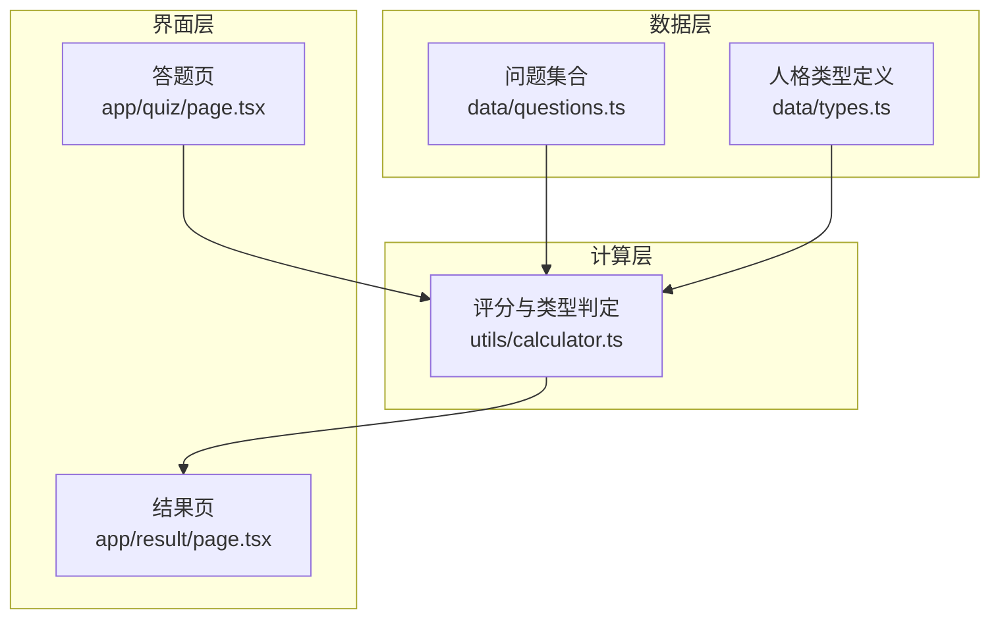
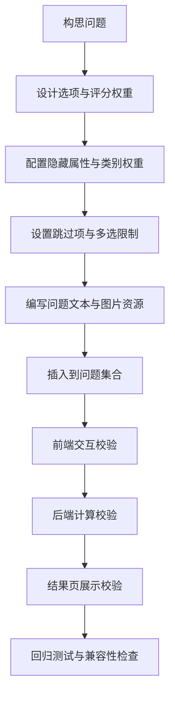
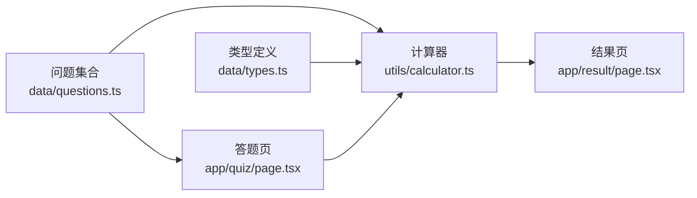

# 添加新问题

<cite>
**本文引用的文件**
- [data/types.ts](file://data/types.ts)
- [data/questions.ts](file://data/questions.ts)
- [utils/calculator.ts](file://utils/calculator.ts)
- [app/quiz/page.tsx](file://app/quiz/page.tsx)
- [app/result/page.tsx](file://app/result/page.tsx)
- [package.json](file://package.json)
- [README.md](file://README.md)
</cite>

## 目录
1. [简介](#简介)
2. [项目结构](#项目结构)
3. [核心组件](#核心组件)
4. [架构总览](#架构总览)
5. [详细组件分析](#详细组件分析)
6. [依赖分析](#依赖分析)
7. [性能考量](#性能考量)
8. [故障排查指南](#故障排查指南)
9. [结论](#结论)
10. [附录](#附录)

## 简介
本指南面向为 FBTI 项目新增“问题”的贡献者，系统阐述问题数据结构的设计原理、设计原则、新增流程、模板示例、最佳实践与常见陷阱，并给出验证方法、测试策略与向后兼容性建议。读者无需深入前端或算法背景，即可基于本文完成高质量的问题扩展。

## 项目结构
FBTI 的问题数据与计算逻辑主要位于以下模块：
- 问题数据与类型定义：data/questions.ts、data/types.ts
- 计算与评分：utils/calculator.ts
- 交互页面：app/quiz/page.tsx（答题）、app/result/page.tsx（结果）

图表来源
- [data/questions.ts:1-42](file://data/questions.ts#L1-L42)
- [utils/calculator.ts:235-444](file://utils/calculator.ts#L235-L444)
- [app/quiz/page.tsx:19-95](file://app/quiz/page.tsx#L19-L95)
- [app/result/page.tsx:336-408](file://app/result/page.tsx#L336-L408)

章节来源
- [data/questions.ts:1-42](file://data/questions.ts#L1-L42)
- [utils/calculator.ts:235-444](file://utils/calculator.ts#L235-L444)
- [app/quiz/page.tsx:19-95](file://app/quiz/page.tsx#L19-L95)
- [app/result/page.tsx:336-408](file://app/result/page.tsx#L336-L408)

## 核心组件
- 问题数据结构（Question）：包含 id、questionType、primaryDimension、text、options、image、profileTags、maxSelect 等字段。
- 选项结构（QuestionOption）：包含 label、scores、hiddenSignals、type（substantive/skip）。
- 隐藏信号（HiddenSignal）：用于记录隐藏属性与类别权重，支持 α、β、γ、δ 四类。
- 计算器（calculateResult）：聚合选项得分、隐藏属性、生成类型与百分比、生成画像描述、筛选推荐导演/电影。

章节来源
- [data/questions.ts:33-42](file://data/questions.ts#L33-L42)
- [data/questions.ts:26-31](file://data/questions.ts#L26-L31)
- [data/questions.ts:1-5](file://data/questions.ts#L1-L5)
- [utils/calculator.ts:235-444](file://utils/calculator.ts#L235-L444)

## 架构总览
问题从“构思—设计—实现—验证—上线”的闭环如下：

图表来源
- [data/questions.ts:44-1866](file://data/questions.ts#L44-L1866)
- [app/quiz/page.tsx:39-95](file://app/quiz/page.tsx#L39-L95)
- [utils/calculator.ts:235-444](file://utils/calculator.ts#L235-L444)
- [app/result/page.tsx:336-408](file://app/result/page.tsx#L336-L408)

## 详细组件分析

### 问题数据结构与字段详解
- id：问题唯一编号，用于追踪与统计。新增时请遵循“递增且连续”的规则，避免跳号导致后续统计与埋点异常。
- questionType：问题类型，支持 binary、multi、binary_with_skip、multiSelect。
- primaryDimension：主维度标识，支持 EA、XS、PW、LD、none。用于最终类型判定与百分比计算。
- text：问题正文，需保持简洁、中性、可理解，避免引导性表述。
- options：选项数组，每个选项包含 label、scores、hiddenSignals、type。
- image：可选图片资源，支持 TMDB 或 AI 占位，布局包括 single、split、grid3、grid4。
- profileTags：可选，用于将选项映射到画像标签（Q50-Q53、Q51-Q52）。
- maxSelect：仅 multiSelect 类型生效，限制最多可选数量。

章节来源
- [data/questions.ts:33-42](file://data/questions.ts#L33-L42)
- [data/questions.ts:26-31](file://data/questions.ts#L26-L31)
- [data/questions.ts:19-24](file://data/questions.ts#L19-L24)

### 选项与评分权重设计
- label：选项文案，应避免暗示正确与否；尽量中性描述。
- scores：键为维度字母（E/A/X/S/P/W/L/D），值为该选项对相应维度的权重贡献。多选时按“有效选项数量的倒数”进行加权。
- hiddenSignals：用于记录隐藏属性与类别权重，支持 α、β、γ、δ 四类；genre 可限定类别（如 horror/comedy/scifi 等）。
- type：substantive 表示计入主维度与隐藏属性；skip 表示跳过计分，仅用于 binary_with_skip 的“不适用/不知道”等场景。

章节来源
- [data/questions.ts:26-31](file://data/questions.ts#L26-L31)
- [data/questions.ts:1-5](file://data/questions.ts#L1-L5)

### 设计原则与平衡策略
- 四大维度覆盖平衡：确保每个维度在问题集合中均有代表性问题，避免过度偏向某一侧。
- 可理解性：问题与选项应通俗易懂，避免术语堆砌或歧义。
- 避免引导性：不要通过措辞暗示“正确答案”，保持中性与开放。
- 选项数量与质量：单选建议 2 个，多选建议 3-5 个，兼顾可决策性与信息量。
- 跳过项的使用：仅在 binary_with_skip 类型中使用 skip，作为“不适用/不知道/不感兴趣”等兜底选项。

章节来源
- [data/questions.ts:35-36](file://data/questions.ts#L35-L36)
- [data/questions.ts:30](file://data/questions.ts#L30)

### 新增问题流程（从构思到上线）
- 步骤一：构思问题
  - 明确问题要测量的维度与意图，参考现有问题的风格与长度。
  - 确保问题与选项不带有倾向性，避免“暗示正确答案”。
- 步骤二：设计选项与评分权重
  - 为每个选项分配 scores，确保至少一个维度有正权重。
  - 多选题使用 multiSelect，并设置 maxSelect 限制。
  - 对于 binary_with_skip，保留 skip 作为兜底选项。
- 步骤三：配置隐藏属性与类别权重
  - 如需记录隐藏属性（α/β/γ/δ），在 hiddenSignals 中设置 weight 与可选 genre。
  - 注意隐藏属性的累积与阈值（见“隐藏属性与稀有度”）。
- 步骤四：配置跳过项与多选限制
  - binary_with_skip：skip 仅在该类型中使用，且不计入主维度计分。
  - multiSelect：maxSelect 控制最多可选数量，前端与后端均会校验。
- 步骤五：编写问题文本与图片资源
  - text 保持简洁、中性、可理解。
  - 如需图片，选择合适的布局（single/split/grid3/grid4），并提供 TMDB 或 AI 提示。
- 步骤六：插入到问题集合
  - 在 data/questions.ts 中按顺序插入新问题对象，确保 id 递增且连续。
- 步骤七：前端交互校验
  - 在 app/quiz/page.tsx 中确认交互逻辑（单选/多选/跳过）正常。
- 步骤八：后端计算校验
  - 在 utils/calculator.ts 中确认 scores、hiddenSignals、profileTags、百分比计算与类型判定逻辑正常。
- 步骤九：结果页展示校验
  - 在 app/result/page.tsx 中确认隐藏属性、画像标签、推荐导演/电影等展示正常。
- 步骤十：回归测试与兼容性检查
  - 运行本地开发服务器，完成一轮完整答题，检查跳过率、隐藏属性、类型与百分比是否合理。
  - 确认跳过比例不超过阈值（例如超过 25% 会提示“多看几部电影再来测”）。

章节来源
- [app/quiz/page.tsx:39-95](file://app/quiz/page.tsx#L39-L95)
- [utils/calculator.ts:235-444](file://utils/calculator.ts#L235-L444)
- [app/result/page.tsx:336-408](file://app/result/page.tsx#L336-L408)

### 问题模板示例与最佳实践
- 模板一：二元选择（binary）
  - 适用于对比两类倾向的问题，如“你更倾向于…？”。
  - 选项分别指向不同维度，避免引导性。
- 模板二：多选（multi）
  - 适用于“你更看重哪些方面？”等问题，建议 3-5 个选项。
  - 可结合 profileTags 将选项映射到画像标签。
- 模板三：多选（multiSelect + maxSelect）
  - 适用于“请选择最符合的 1-N 个选项”，限制 maxSelect 以控制回答复杂度。
- 模板四：二元选择含跳过（binary_with_skip）
  - 适用于“你对这个话题没有特别想法”等兜底场景，skip 不计入主维度计分。
- 图片资源
  - single：单图占位；split：左右分栏；grid3/grid4：网格布局。
  - TMDB：展示真实电影海报与标题；AI 提示：用于生成风格化占位图。
- 最佳实践
  - 问题与选项尽量使用“你”“我”等第一人称，增强代入感。
  - 选项长度适中，避免过长影响阅读。
  - 多选题的选项应相互独立，避免重复或互相包含。

章节来源
- [data/questions.ts:44-1866](file://data/questions.ts#L44-L1866)
- [app/quiz/page.tsx:176-181](file://app/quiz/page.tsx#L176-L181)

### 常见陷阱与规避
- 陷阱一：引导性表述
  - 避免在问题或选项中暗示“正确答案”，例如“你一定更喜欢…”。
- 陷阱二：维度权重失衡
  - 确保每个维度在问题集合中有代表性覆盖，避免某一侧权重过大。
- 陷阱三：隐藏属性滥用
  - 仅在必要时使用 hiddenSignals，避免为每个问题都添加隐藏属性。
- 陷阱四：跳过项误用
  - skip 仅用于 binary_with_skip；多选题请使用 maxSelect 控制数量。
- 陷阱五：id 跳号
  - 新增问题请保持 id 递增且连续，避免统计与埋点异常。

章节来源
- [data/questions.ts:35-42](file://data/questions.ts#L35-L42)
- [app/quiz/page.tsx:56-60](file://app/quiz/page.tsx#L56-L60)

### 问题 ID 分配规则
- 严格递增：新增问题的 id 必须大于当前最大 id，且与前序 id 连续。
- 便于统计：连续的 id 有利于统计分析与埋点追踪。
- 建议命名：按“Q序号”命名，如 Q1、Q2、…，并在注释中标注所属维度与题量。

章节来源
- [data/questions.ts:44-1866](file://data/questions.ts#L44-L1866)

### 多选题配置（maxSelect）与跳过选项（skip）
- multiSelect
  - 使用 maxSelect 限制最多可选数量，前端与后端均会校验。
  - 多选时，每个被选选项的权重按“1/有效选项数量”计算，避免放大效应。
- skip
  - 仅在 binary_with_skip 类型中使用，表示“不适用/不知道/不感兴趣”等。
  - skip 不计入主维度计分，但特殊题（如 Q48）对隐藏属性有额外处理。

章节来源
- [data/questions.ts:41](file://data/questions.ts#L41)
- [data/questions.ts:30](file://data/questions.ts#L30)
- [app/quiz/page.tsx:43-52](file://app/quiz/page.tsx#L43-L52)
- [utils/calculator.ts:293-294](file://utils/calculator.ts#L293-L294)
- [utils/calculator.ts:282-288](file://utils/calculator.ts#L282-L288)

### 验证方法与测试策略
- 前端验证
  - 在 app/quiz/page.tsx 中确认交互逻辑：单选自动前进、多选按钮启用、跳过项行为正确。
- 后端验证
  - 在 utils/calculator.ts 中确认：scores 累加、hiddenSignals 累加、百分比计算、类型判定、画像标签生成、topDirectors/topFilms 选择。
- 结果页验证
  - 在 app/result/page.tsx 中确认：隐藏属性展示、稀有度标签、画像描述、推荐导演/电影、跳过提示。
- 测试策略
  - 单题测试：针对新增问题单独答题，观察隐藏属性与类型变化。
  - 跳过率测试：故意选择 skip，确认跳过计数与提示。
  - 边界测试：maxSelect 超限、多选权重、隐藏属性阈值。
  - 回归测试：新增问题前后，整体类型分布与百分比应保持稳定。

章节来源
- [app/quiz/page.tsx:39-95](file://app/quiz/page.tsx#L39-L95)
- [utils/calculator.ts:235-444](file://utils/calculator.ts#L235-L444)
- [app/result/page.tsx:336-408](file://app/result/page.tsx#L336-L408)

### 向后兼容性考虑
- 字段兼容：新增字段（如 profileTags、maxSelect）不影响既有逻辑，但需确保默认值安全。
- 计算兼容：hiddenSignals 的新增类别（如 genre）需在计算中进行健壮性检查。
- 展示兼容：结果页对隐藏属性与画像标签的展示应具备容错能力。
- 数据迁移：若未来调整 hiddenSignals 的含义，需提供迁移策略与版本说明。

章节来源
- [utils/calculator.ts:320-326](file://utils/calculator.ts#L320-L326)
- [app/result/page.tsx:336-408](file://app/result/page.tsx#L336-L408)

## 依赖分析
- 问题数据依赖计算器进行评分与类型判定。
- 计算器依赖问题集合、导演/电影元数据与类型定义。
- 界面层依赖问题集合与计算器输出。

图表来源
- [data/questions.ts:1-42](file://data/questions.ts#L1-L42)
- [utils/calculator.ts:235-444](file://utils/calculator.ts#L235-L444)
- [app/quiz/page.tsx:19-95](file://app/quiz/page.tsx#L19-L95)
- [app/result/page.tsx:336-408](file://app/result/page.tsx#L336-L408)

章节来源
- [data/questions.ts:1-42](file://data/questions.ts#L1-L42)
- [utils/calculator.ts:235-444](file://utils/calculator.ts#L235-L444)
- [app/quiz/page.tsx:19-95](file://app/quiz/page.tsx#L19-L95)
- [app/result/page.tsx:336-408](file://app/result/page.tsx#L336-L408)

## 性能考量
- 问题集合规模：当前问题数量较大，建议在新增时保持结构一致性，避免引入复杂嵌套。
- 计算复杂度：计算过程为线性扫描，时间复杂度 O(N)，N 为答题数量。
- 前端渲染：多选题与图片资源较多时，建议优化图片懒加载与布局计算。

## 故障排查指南
- 问题无法显示
  - 检查 id 是否连续、questionType 是否合法、options 数量是否合理。
- 选项不计分
  - 检查 scores 键是否为有效维度字母，hiddenSignals 是否正确设置。
- 跳过项无效
  - 确认 questionType 为 binary_with_skip，且选项 type 为 skip。
- 多选超限
  - 检查 maxSelect 设置，前端与后端均会限制。
- 结果异常
  - 检查 hiddenSignals 的 genre 是否存在于计算逻辑中，确认百分比与类型判定逻辑。

章节来源
- [app/quiz/page.tsx:39-95](file://app/quiz/page.tsx#L39-L95)
- [utils/calculator.ts:235-444](file://utils/calculator.ts#L235-L444)
- [app/result/page.tsx:336-408](file://app/result/page.tsx#L336-L408)

## 结论
新增问题的关键在于“结构化设计 + 平衡覆盖 + 可理解表述 + 严谨验证”。遵循本文的流程与原则，可确保新增问题在功能、体验与计算层面均达到预期，并为后续扩展与维护奠定良好基础。

## 附录
- 开发与运行
  - 本地启动：参考 README 的开发命令。
  - 依赖管理：package.json 中列出的依赖与脚本。

章节来源
- [README.md:1-37](file://README.md#L1-L37)
- [package.json:1-30](file://package.json#L1-L30)