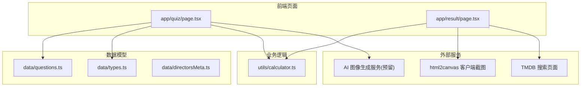
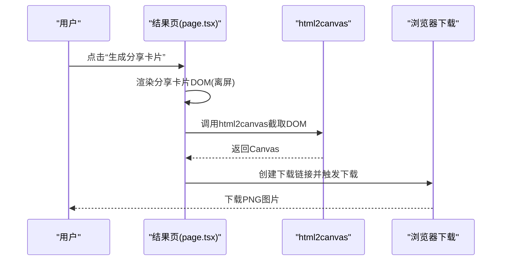
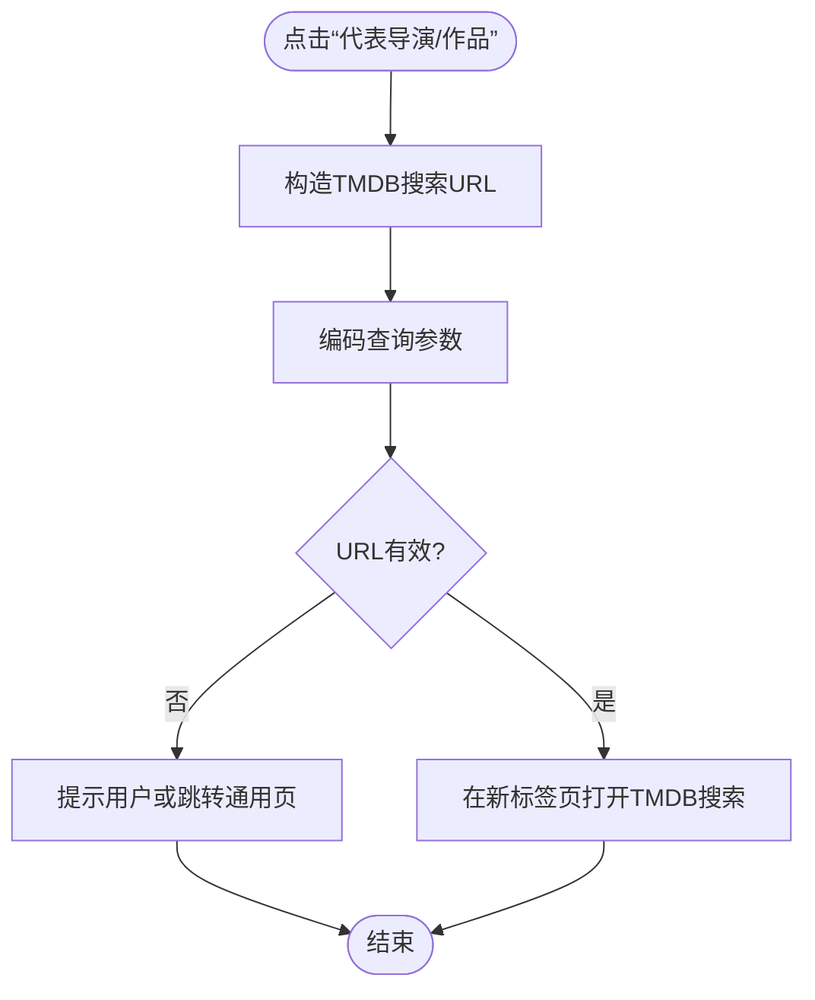
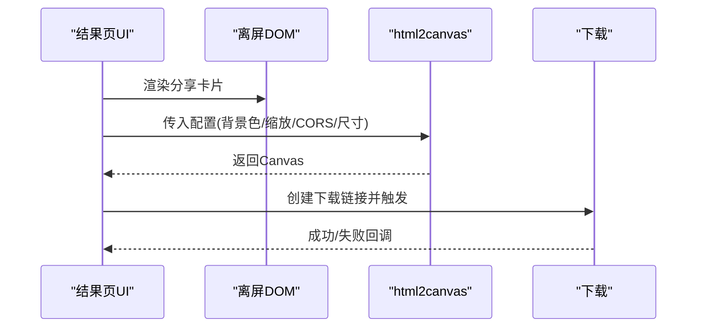
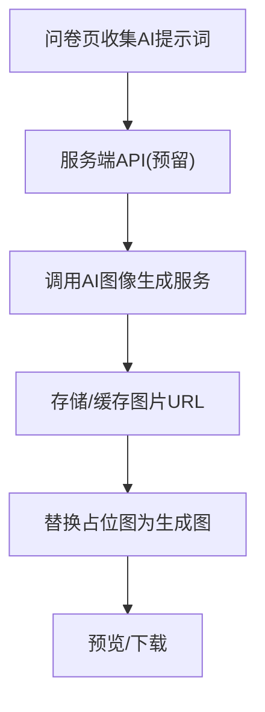
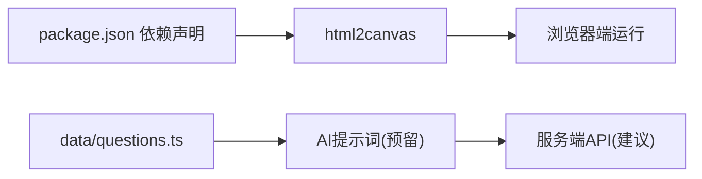

# 第三方服务集成

<cite>
**本文引用的文件**
- [README.md](file://README.md)
- [package.json](file://package.json)
- [next.config.ts](file://next.config.ts)
- [app/result/page.tsx](file://app/result/page.tsx)
- [app/quiz/page.tsx](file://app/quiz/page.tsx)
- [utils/calculator.ts](file://utils/calculator.ts)
- [data/questions.ts](file://data/questions.ts)
- [data/types.ts](file://data/types.ts)
- [data/directorsMeta.ts](file://data/directorsMeta.ts)
- [CLAUDE.md](file://CLAUDE.md)
</cite>

## 目录
1. [简介](#简介)
2. [项目结构](#项目结构)
3. [核心组件](#核心组件)
4. [架构总览](#架构总览)
5. [详细组件分析](#详细组件分析)
6. [依赖分析](#依赖分析)
7. [性能考虑](#性能考虑)
8. [故障排查指南](#故障排查指南)
9. [结论](#结论)
10. [附录](#附录)

## 简介
本指南面向FBTI项目的第三方服务集成，围绕现有集成进行系统化梳理，并给出新增服务的端到端集成流程与最佳实践。当前项目已包含两类与外部服务相关的集成能力：
- TMDB API集成：通过链接跳转访问TMDB搜索页面，用于“代表导演/作品”展示与跳转。
- html2canvas截图服务：在客户端使用html2canvas将结果页分享卡片渲染为图片并下载。

同时，项目在问卷中预留了AI图像生成占位与提示词字段，为后续接入AI图像生成服务提供基础数据结构支持。

## 项目结构
项目采用Next.js应用结构，前端页面位于app目录，业务计算逻辑位于utils，数据模型位于data目录。与第三方服务集成相关的交互主要发生在结果页（分享卡片生成）与问卷页（占位图与AI提示词）。

图表来源
- [app/quiz/page.tsx:1-395](file://app/quiz/page.tsx#L1-L395)
- [app/result/page.tsx:1-923](file://app/result/page.tsx#L1-L923)
- [utils/calculator.ts:1-504](file://utils/calculator.ts#L1-L504)
- [data/questions.ts:1-800](file://data/questions.ts#L1-L800)
- [data/types.ts:1-428](file://data/types.ts#L1-L428)
- [data/directorsMeta.ts:1-19](file://data/directorsMeta.ts#L1-L19)

章节来源
- [README.md:1-37](file://README.md#L1-L37)
- [package.json:1-30](file://package.json#L1-L30)
- [next.config.ts:1-8](file://next.config.ts#L1-L8)

## 核心组件
- 结果页分享卡片生成：负责将结果页的HTML片段渲染为图片并下载，使用html2canvas完成截图。
- 问卷页占位图与AI提示词：提供占位图布局与AI提示词的数据结构，便于后续接入AI图像生成服务。
- 计算器：负责根据用户回答计算最终结果，包括类型、百分比、隐藏属性、画像描述等；为TMDB跳转提供“代表导演/作品”列表。

章节来源
- [app/result/page.tsx:102-134](file://app/result/page.tsx#L102-L134)
- [app/quiz/page.tsx:301-395](file://app/quiz/page.tsx#L301-L395)
- [utils/calculator.ts:235-444](file://utils/calculator.ts#L235-L444)

## 架构总览
FBTI的第三方服务集成采用“前端直连 + 数据模型抽象”的轻量架构：
- 前端直连：结果页通过html2canvas在浏览器端生成图片；TMDB通过外链跳转，无需服务端代理。
- 数据模型抽象：问卷数据结构统一了TMDB占位与AI提示词，便于未来扩展。
- 计算层：计算器集中处理评分、归一化、类型判定与推荐列表生成，确保与外部服务的数据格式一致。

图表来源
- [app/result/page.tsx:102-134](file://app/result/page.tsx#L102-L134)

## 详细组件分析

### TMDB 集成（外链跳转）
- 设计要点
  - 使用外链跳转至TMDB搜索页面，URL参数由“代表导演/作品”名称构造。
  - 无需服务端代理，降低延迟与复杂度。
- 数据来源
  - “代表导演/作品”列表由计算器生成，作为TMDB跳转的输入。
- 异常处理
  - 若名称为空或编码失败，需保证URL可用性与可读性。
- 性能与体验
  - 外链跳转即时，无需等待服务响应。

图表来源
- [app/result/page.tsx:305-332](file://app/result/page.tsx#L305-L332)
- [utils/calculator.ts:440-443](file://utils/calculator.ts#L440-L443)

章节来源
- [app/result/page.tsx:291-334](file://app/result/page.tsx#L291-L334)
- [utils/calculator.ts:440-443](file://utils/calculator.ts#L440-L443)

### html2canvas 截图服务（客户端直连）
- 设计要点
  - 在浏览器端渲染离屏DOM，调用html2canvas生成Canvas，再以PNG格式下载。
  - 关键参数：背景色、缩放、CORS、尺寸与滚动偏移。
- 错误处理
  - 截图失败时记录错误日志并恢复UI状态。
- 性能优化
  - 控制缩放比例与字体加载时机，避免渲染抖动。
  - 使用离屏容器减少对可视区域的影响。

图表来源
- [app/result/page.tsx:102-134](file://app/result/page.tsx#L102-L134)

章节来源
- [app/result/page.tsx:102-134](file://app/result/page.tsx#L102-L134)

### AI 图像生成服务（预留与扩展）
- 设计要点
  - 问卷数据结构已预留AI提示词字段，支持左右分屏或单图布局。
  - 建议在服务端或边缘层对接AI服务，避免在客户端暴露敏感凭据。
- 数据模型
  - 提示词位置支持left/right/single，便于组合生成。
- 集成流程（建议）
  - 服务端API：接收提示词，调用AI服务生成图片，返回URL。
  - 前端：将占位图替换为AI生成图片，或在加载态显示骨架屏。

图表来源
- [app/quiz/page.tsx:301-395](file://app/quiz/page.tsx#L301-L395)
- [data/questions.ts:14-24](file://data/questions.ts#L14-L24)

章节来源
- [app/quiz/page.tsx:301-395](file://app/quiz/page.tsx#L301-L395)
- [data/questions.ts:14-24](file://data/questions.ts#L14-L24)

## 依赖分析
- html2canvas：用于客户端截图，版本在package.json中声明。
- TMDB：通过外链跳转，无额外依赖。
- AI服务：当前未实现，预留数据结构，后续需引入服务端SDK或HTTP客户端。

图表来源
- [package.json:11-17](file://package.json#L11-L17)
- [data/questions.ts:14-24](file://data/questions.ts#L14-L24)

章节来源
- [package.json:11-17](file://package.json#L11-L17)
- [data/questions.ts:14-24](file://data/questions.ts#L14-L24)

## 性能考虑
- html2canvas
  - 缩放比例与字体加载：合理设置缩放与等待字体加载，避免模糊或抖动。
  - DOM复杂度：尽量简化离屏DOM结构，减少重绘与回流。
- TMDB外链
  - 无网络请求，仅影响用户体验与跳转速度。
- AI服务
  - 异步生成与缓存：生成图片后缓存URL，避免重复请求。
  - 边缘加速：在CDN或边缘节点缓存静态资源，缩短首屏时间。

## 故障排查指南
- html2canvas截图失败
  - 现象：无法生成图片或下载失败。
  - 排查：检查离屏DOM是否存在、字体是否加载完成、CORS是否允许、Canvas尺寸是否正确。
  - 日志：查看控制台错误信息，确认异常堆栈。
- TMDB跳转异常
  - 现象：外链无法打开或参数编码错误。
  - 排查：确认查询参数编码、目标URL可用性。
- AI服务未生效
  - 现象：占位图未替换。
  - 排查：确认服务端API是否实现、提示词是否正确传递、生成结果是否返回URL。

章节来源
- [app/result/page.tsx:113-134](file://app/result/page.tsx#L113-L134)
- [app/result/page.tsx:305-332](file://app/result/page.tsx#L305-L332)
- [app/quiz/page.tsx:301-395](file://app/quiz/page.tsx#L301-L395)

## 结论
FBTI项目当前的第三方服务集成以“前端直连 + 数据模型抽象”为核心，实现了轻量高效的TMDB跳转与html2canvas截图。AI图像生成服务已具备数据结构基础，建议在服务端实现API，结合缓存与CDN提升性能与稳定性。后续新增服务可遵循统一接口设计、异常处理与性能优化的最佳实践，确保系统一致性与可维护性。

## 附录

### 新服务集成流程（从调研到上线）
- 调研与需求
  - 明确服务功能、数据格式、限流与配额策略。
- 接口设计
  - 抽象统一数据格式：定义输入输出结构，确保与现有数据模型兼容。
  - 设计错误码与重试策略：区分网络错误、业务错误与超时。
- 实现
  - 服务端：封装SDK或HTTP客户端，实现鉴权、限流与重试。
  - 前端：替换占位图或补充UI，确保加载态与错误态友好。
- 测试
  - 单元测试：覆盖关键分支与边界条件。
  - 集成测试：模拟服务端与第三方API，验证端到端流程。
- 部署
  - 配置环境变量与密钥管理，启用CDN与缓存。
  - 监控与日志：埋点关键指标，建立告警与追踪。

### 认证机制
- 服务端鉴权：使用环境变量或密钥管理服务存储凭据，避免硬编码。
- 请求签名：对关键请求进行签名，防止篡改。
- 令牌刷新：对短期令牌实现自动刷新与重试。

### API限制与重试策略
- 限流：根据第三方API速率限制设置队列与并发上限。
- 退避重试：指数退避+抖动，避免雪崩效应。
- 超时与熔断：设置合理超时与熔断阈值，保护下游系统。

### 数据缓存
- 本地缓存：浏览器端缓存常用图片与中间结果，减少重复请求。
- 服务端缓存：Redis/Memcached缓存热点数据，降低第三方API压力。
- CDN：静态资源与生成图片通过CDN分发，提升访问速度。

### 异步处理与性能优化
- 异步生成：AI图片生成采用异步队列，完成后通知前端更新。
- 预加载：提前加载字体与关键资源，减少首屏等待。
- 分片与懒加载：对长列表与大图采用分片与懒加载策略。

### 服务监控、日志与故障排查
- 指标埋点：请求量、成功率、耗时、重试次数、缓存命中率。
- 日志规范：统一结构化日志，包含traceId、服务名、参数与错误详情。
- 故障排查：建立快速定位流程，结合日志与监控仪表盘快速止损。

### 集成测试策略与模拟服务
- 单元测试：针对计算与数据转换逻辑编写单元测试。
- 集成测试：使用Mock服务模拟第三方API，覆盖正常与异常路径。
- 端到端测试：在真实浏览器中验证html2canvas截图与TMDB跳转流程。

### 生产环境部署指南
- 环境隔离：开发/测试/生产环境分离，配置独立的密钥与域名。
- 安全加固：启用HTTPS、CORS白名单、敏感信息脱敏。
- 可观测性：接入APM与日志平台，建立SLA与告警策略。