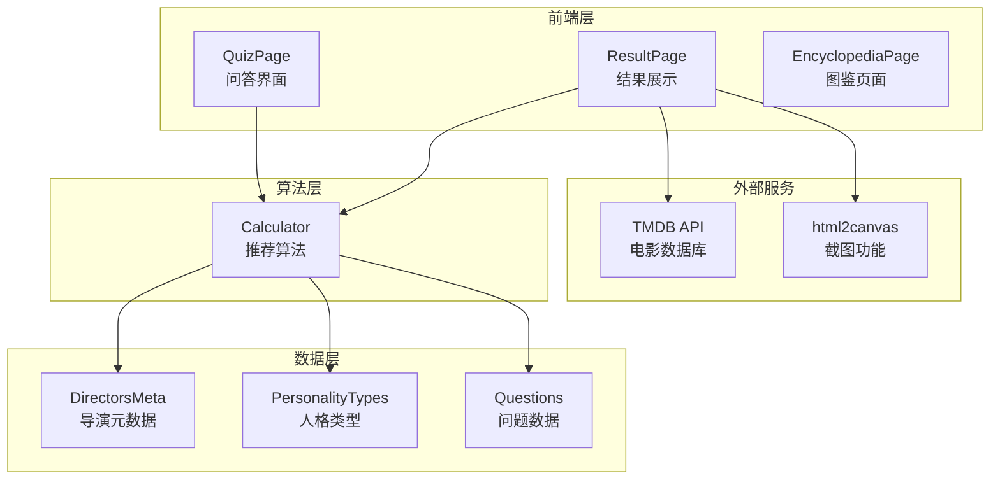
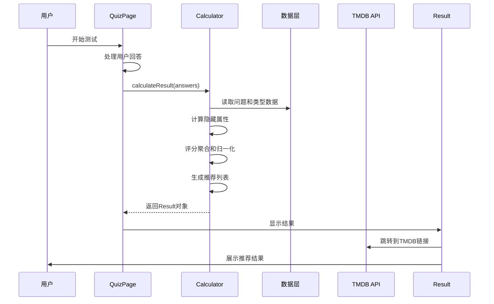
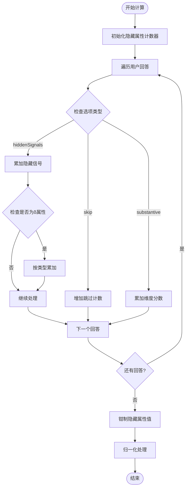
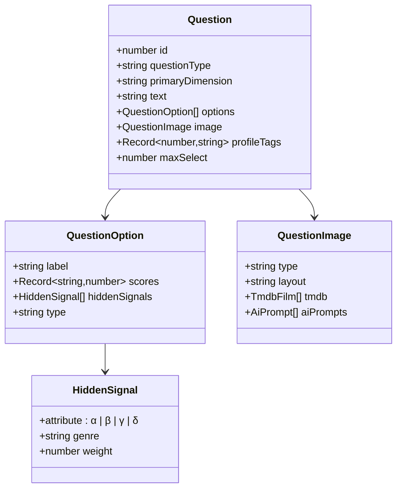
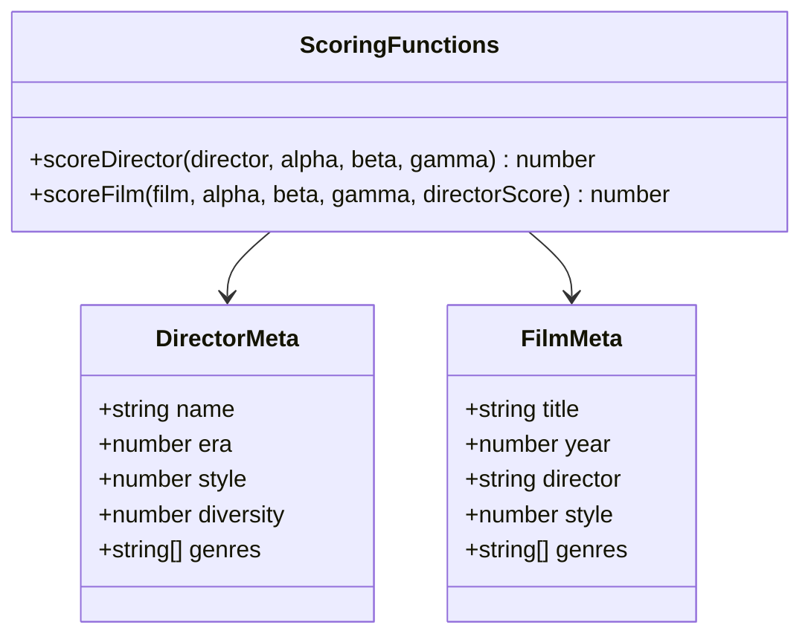
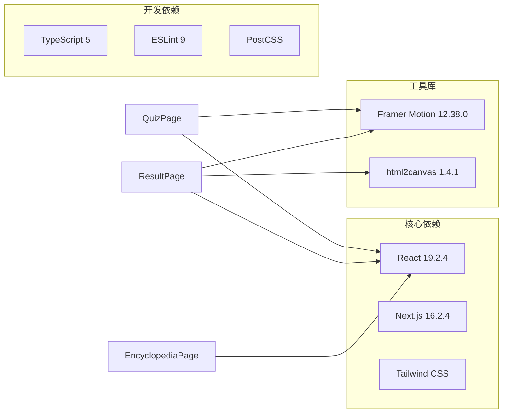

# 自定义推荐算法

<cite>
**本文档引用的文件**
- [README.md](file://README.md)
- [package.json](file://package.json)
- [data/types.ts](file://data/types.ts)
- [data/questions.ts](file://data/questions.ts)
- [data/directorsMeta.ts](file://data/directorsMeta.ts)
- [utils/calculator.ts](file://utils/calculator.ts)
- [app/quiz/page.tsx](file://app/quiz/page.tsx)
- [app/result/page.tsx](file://app/result/page.tsx)
- [app/encyclopedia/page.tsx](file://app/encyclopedia/page.tsx)
</cite>

## 目录
1. [项目概述](#项目概述)
2. [项目结构](#项目结构)
3. [核心组件](#核心组件)
4. [架构概览](#架构概览)
5. [详细组件分析](#详细组件分析)
6. [依赖关系分析](#依赖关系分析)
7. [性能考虑](#性能考虑)
8. [故障排除指南](#故障排除指南)
9. [结论](#结论)

## 项目概述

FBTI（Film Buff Type Indicator）是一个基于MBTI理论的电影人格测试应用，通过用户的观影偏好和电影感知模式来识别其电影人格类型。该项目实现了复杂的推荐算法，能够根据用户的选择动态生成个性化的导演和电影推荐。

### 主要特性
- **多维度人格测试**：基于四大维度（E/A、X/S、P/W、L/D）的电影人格分类
- **隐藏属性系统**：α、β、γ、δ四个隐藏属性的深度分析
- **个性化推荐**：基于用户偏好生成导演和电影推荐
- **TMDB集成功能**：与The Movie Database API的无缝集成
- **可视化展示**：丰富的图表和数据可视化组件

## 项目结构

**图表来源**
- [app/quiz/page.tsx:19-395](file://app/quiz/page.tsx#L19-L395)
- [app/result/page.tsx:64-462](file://app/result/page.tsx#L64-L462)
- [utils/calculator.ts:235-444](file://utils/calculator.ts#L235-L444)

**章节来源**
- [README.md:1-37](file://README.md#L1-L37)
- [package.json:1-30](file://package.json#L1-L30)

## 核心组件

### 1. 推荐算法核心

推荐算法位于 `utils/calculator.ts` 文件中，实现了完整的评分聚合和推荐生成逻辑。

### 2. 数据模型

系统使用了多个核心数据接口：
- `Scores`: 主要维度分数（E、A、X、S、P、W、L、D）
- `HiddenAttributes`: 隐藏属性（α、β、γ、δ）
- `Result`: 最终结果对象

### 3. 人格类型系统

`data/types.ts` 定义了16种电影人格类型，每种类型包含：
- 代码标识符
- 名称和标语
- 描述信息
- 代表导演列表
- 代表电影列表
- 社交标签

**章节来源**
- [utils/calculator.ts:5-41](file://utils/calculator.ts#L5-L41)
- [data/types.ts:1-428](file://data/types.ts#L1-L428)

## 架构概览

**图表来源**
- [app/quiz/page.tsx:87-95](file://app/quiz/page.tsx#L87-L95)
- [utils/calculator.ts:235-444](file://utils/calculator.ts#L235-L444)
- [app/result/page.tsx:306-331](file://app/result/page.tsx#L306-L331)

## 详细组件分析

### 推荐算法实现

#### 1. 隐藏属性计算

隐藏属性是推荐算法的核心，系统通过用户的选择来计算以下四个属性：

**图表来源**
- [utils/calculator.ts:269-344](file://utils/calculator.ts#L269-L344)
- [utils/calculator.ts:346-352](file://utils/calculator.ts#L346-L352)

#### 2. 评分聚合方法

系统采用加权平均的方法来计算最终的推荐分数：

**导演评分计算**：
- 时代偏好权重：30%
- 形式偏好权重：40%
- 文化偏好权重：30%

**电影评分计算**：
- 时代偏好权重：25%
- 形式偏好权重：35%
- 导演影响权重：40%

#### 3. 推荐排序算法

推荐算法使用以下步骤进行排序：

1. **归一化处理**：将原始隐藏属性值转换为0-1范围
2. **权重分配**：根据属性重要性分配权重
3. **相似度计算**：计算用户偏好与目标对象的相似度
4. **排序输出**：按相似度降序排列

**章节来源**
- [data/directorsMeta.ts:242-278](file://data/directorsMeta.ts#L242-L278)
- [utils/calculator.ts:446-493](file://utils/calculator.ts#L446-L493)

### 数据模型设计

#### 1. 问题系统

`data/questions.ts` 定义了完整的问答系统：

**图表来源**
- [data/questions.ts:33-42](file://data/questions.ts#L33-L42)
- [data/questions.ts:26-31](file://data/questions.ts#L26-L31)
- [data/questions.ts:1-5](file://data/questions.ts#L1-L5)

#### 2. 元数据系统

`data/directorsMeta.ts` 提供了详细的电影元数据：

**图表来源**
- [data/directorsMeta.ts:5-19](file://data/directorsMeta.ts#L5-L19)
- [data/directorsMeta.ts:242-278](file://data/directorsMeta.ts#L242-L278)

**章节来源**
- [data/questions.ts:1-800](file://data/questions.ts#L1-L800)
- [data/directorsMeta.ts:1-279](file://data/directorsMeta.ts#L1-L279)

### 前端集成

#### 1. 问答界面

`app/quiz/page.tsx` 实现了交互式的问答界面：

- 支持多种题型：二元选择、多项选择、可跳过选项
- 实时进度跟踪和动画效果
- 响应式设计适配移动端

#### 2. 结果展示

`app/result/page.tsx` 提供了丰富的结果展示：

- 电影人格类型识别
- 维度分析图表
- 隐藏属性徽章
- 类型基因雷达图
- TMDB链接集成

#### 3. 图鉴页面

`app/encyclopedia/page.tsx` 展示了完整的电影人格体系：

- 四大维度详解
- 16种人格类型
- 隐藏属性体系
- 类型基因说明

**章节来源**
- [app/quiz/page.tsx:19-395](file://app/quiz/page.tsx#L19-L395)
- [app/result/page.tsx:64-923](file://app/result/page.tsx#L64-L923)
- [app/encyclopedia/page.tsx:120-354](file://app/encyclopedia/page.tsx#L120-L354)

## 依赖关系分析

**图表来源**
- [package.json:11-28](file://package.json#L11-L28)

**章节来源**
- [package.json:1-30](file://package.json#L1-L30)

## 性能考虑

### 1. 算法优化

- **归一化阈值**：使用预设阈值快速判断稀有度等级
- **权重分配**：合理分配各维度权重避免过度偏向
- **缓存机制**：利用sessionStorage缓存计算结果

### 2. 前端性能

- **懒加载**：图片和组件按需加载
- **动画优化**：使用CSS过渡而非JavaScript动画
- **内存管理**：及时清理定时器和事件监听器

### 3. 数据访问优化

- **本地数据**：所有核心数据存储在本地，减少网络请求
- **批量处理**：一次性计算所有推荐结果
- **增量更新**：支持部分数据更新而不重载整个应用

## 故障排除指南

### 1. 常见问题

**问题1：推荐结果不符合预期**
- 检查隐藏属性权重设置
- 验证用户回答的合理性
- 确认归一化参数正确

**问题2：性能问题**
- 检查是否有过多的重渲染
- 验证数据结构是否优化
- 确认缓存机制正常工作

**问题3：TMDB集成问题**
- 验证URL构建逻辑
- 检查编码处理
- 确认外部链接有效性

### 2. 调试建议

- 使用浏览器开发者工具监控性能
- 添加日志记录关键计算步骤
- 实施单元测试覆盖核心算法

**章节来源**
- [utils/calculator.ts:499-503](file://utils/calculator.ts#L499-L503)

## 结论

FBTI项目展示了如何将复杂的推荐算法与用户体验设计相结合。通过精心设计的数据模型、高效的算法实现和直观的界面展示，该项目成功地为用户提供了个性化的电影推荐体验。

### 技术亮点

1. **多维度分析**：同时考虑用户偏好、隐藏属性和电影特征
2. **实时响应**：即时计算和展示推荐结果
3. **可扩展性**：模块化设计便于算法改进和功能扩展
4. **用户体验**：流畅的交互和丰富的可视化展示

### 未来发展

- 集成更多外部数据源
- 实现机器学习增强的推荐算法
- 添加用户反馈收集机制
- 支持A/B测试和效果评估