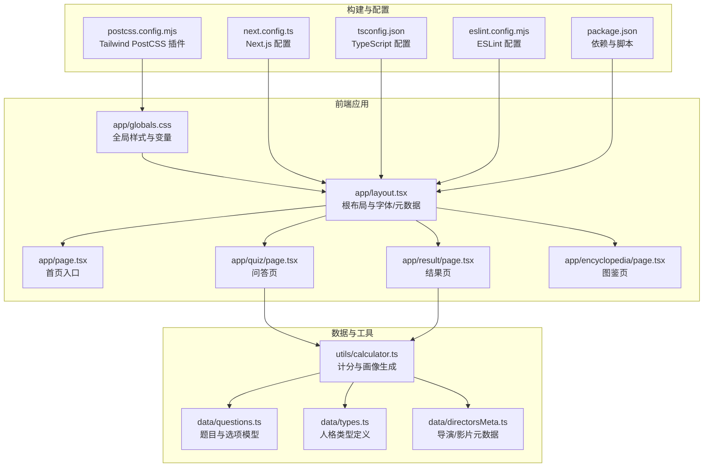
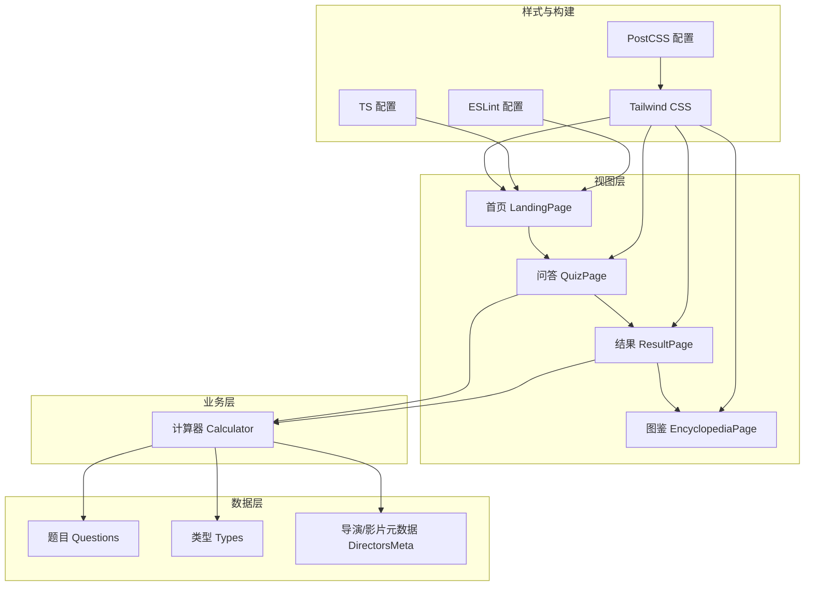
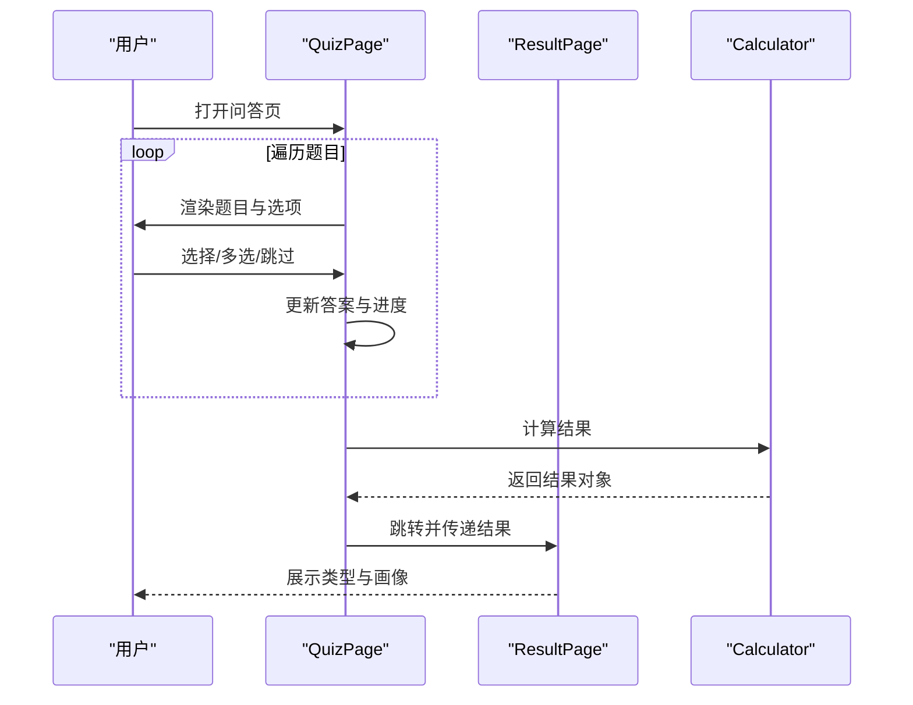
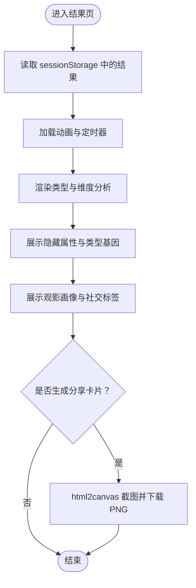
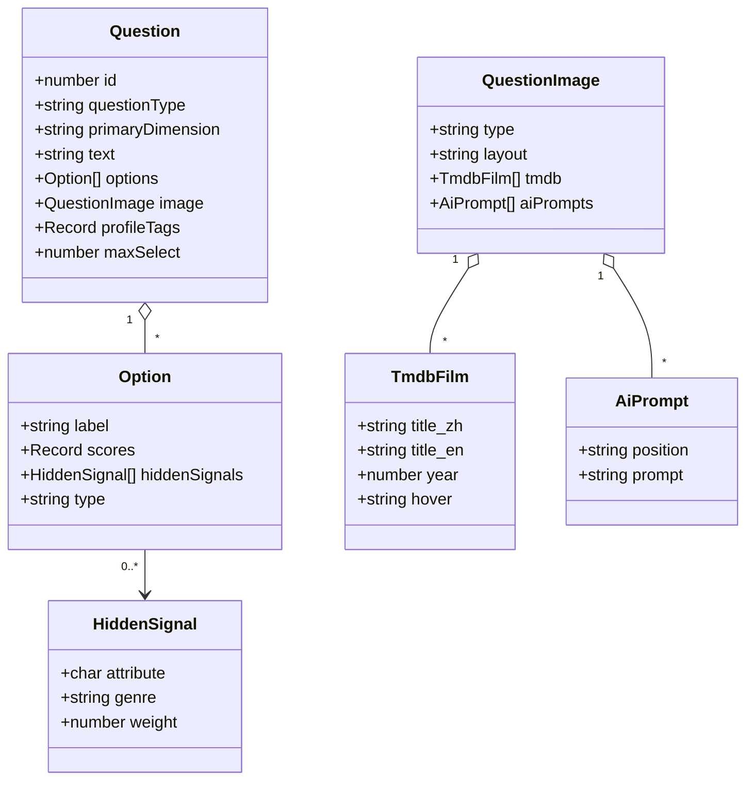
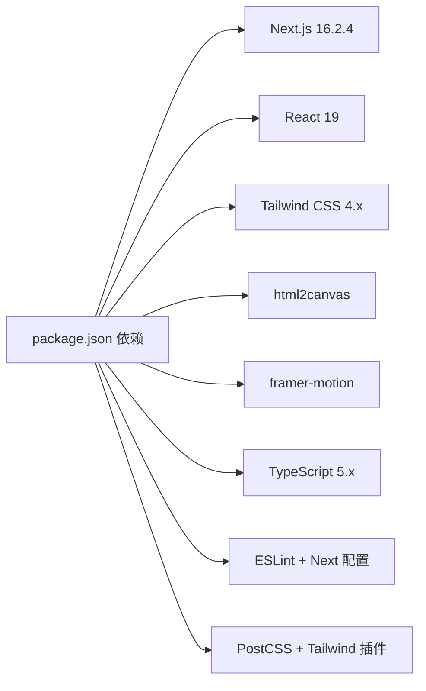

# 技术架构

<cite>
**本文引用的文件**
- [package.json](file://package.json)
- [next.config.ts](file://next.config.ts)
- [tsconfig.json](file://tsconfig.json)
- [postcss.config.mjs](file://postcss.config.mjs)
- [eslint.config.mjs](file://eslint.config.mjs)
- [app/layout.tsx](file://app/layout.tsx)
- [app/globals.css](file://app/globals.css)
- [app/page.tsx](file://app/page.tsx)
- [app/quiz/page.tsx](file://app/quiz/page.tsx)
- [app/encyclopedia/page.tsx](file://app/encyclopedia/page.tsx)
- [app/result/page.tsx](file://app/result/page.tsx)
- [data/questions.ts](file://data/questions.ts)
- [data/types.ts](file://data/types.ts)
- [data/directorsMeta.ts](file://data/directorsMeta.ts)
- [utils/calculator.ts](file://utils/calculator.ts)
</cite>

## 目录
1. [引言](#引言)
2. [项目结构](#项目结构)
3. [核心组件](#核心组件)
4. [架构总览](#架构总览)
5. [详细组件分析](#详细组件分析)
6. [依赖分析](#依赖分析)
7. [性能考量](#性能考量)
8. [故障排查指南](#故障排查指南)
9. [结论](#结论)
10. [附录](#附录)

## 引言
本项目为“FBTI（Film Buff Type Indicator）影迷类型指标”应用，采用 Next.js 16.2.4 构建，基于 App Router 模式组织页面路由与布局，结合 React 19、TypeScript 5.x 与 Tailwind CSS 4.x 技术栈，实现从问卷答题到结果呈现的完整流程。系统通过“维度-类型-隐藏属性”的多层模型，输出个性化的电影人格画像，并提供可分享的可视化卡片。

## 项目结构
项目采用 Next.js App Router 的目录约定式路由，页面位于 app 目录下，数据与工具逻辑分别置于 data 与 utils 目录，样式通过 Tailwind CSS 与全局 CSS 实现，TypeScript 提供类型安全，ESLint 与 Next.js 配置保障代码质量与构建一致性。

图表来源
- [app/layout.tsx:1-53](file://app/layout.tsx#L1-L53)
- [app/page.tsx:1-76](file://app/page.tsx#L1-L76)
- [app/quiz/page.tsx:1-395](file://app/quiz/page.tsx#L1-L395)
- [app/result/page.tsx:1-923](file://app/result/page.tsx#L1-L923)
- [app/encyclopedia/page.tsx:1-354](file://app/encyclopedia/page.tsx#L1-L354)
- [app/globals.css:1-51](file://app/globals.css#L1-L51)
- [data/questions.ts:1-800](file://data/questions.ts#L1-L800)
- [data/types.ts:1-428](file://data/types.ts#L1-L428)
- [data/directorsMeta.ts:1-279](file://data/directorsMeta.ts#L1-L279)
- [utils/calculator.ts:1-504](file://utils/calculator.ts#L1-L504)
- [next.config.ts:1-8](file://next.config.ts#L1-L8)
- [tsconfig.json:1-35](file://tsconfig.json#L1-L35)
- [postcss.config.mjs:1-8](file://postcss.config.mjs#L1-L8)
- [eslint.config.mjs:1-19](file://eslint.config.mjs#L1-L19)
- [package.json:1-30](file://package.json#L1-L30)

章节来源
- [package.json:1-30](file://package.json#L1-L30)
- [next.config.ts:1-8](file://next.config.ts#L1-L8)
- [tsconfig.json:1-35](file://tsconfig.json#L1-L35)
- [postcss.config.mjs:1-8](file://postcss.config.mjs#L1-L8)
- [eslint.config.mjs:1-19](file://eslint.config.mjs#L1-L19)

## 核心组件
- 根布局与字体：在根布局中引入 Google Fonts 字体变量，统一页面字体族；全局 CSS 定义颜色变量与基础排版。
- 页面路由：首页负责引导用户进入问答或图鉴；问答页支持多种题型与进度反馈；结果页展示类型、维度分析、隐藏属性与画像；图鉴页展示全部类型与隐藏属性体系。
- 数据模型：questions 定义题目、选项、隐藏信号与图片占位；types 定义 16 种人格类型；directorsMeta 提供导演/影片元数据用于个性化推荐。
- 计算器：根据用户答案计算维度得分、隐藏属性、画像标签与个性化导演/影片推荐，并生成分享卡片。

章节来源
- [app/layout.tsx:1-53](file://app/layout.tsx#L1-L53)
- [app/globals.css:1-51](file://app/globals.css#L1-L51)
- [app/page.tsx:1-76](file://app/page.tsx#L1-L76)
- [app/quiz/page.tsx:1-395](file://app/quiz/page.tsx#L1-L395)
- [app/result/page.tsx:1-923](file://app/result/page.tsx#L1-L923)
- [app/encyclopedia/page.tsx:1-354](file://app/encyclopedia/page.tsx#L1-L354)
- [data/questions.ts:1-800](file://data/questions.ts#L1-L800)
- [data/types.ts:1-428](file://data/types.ts#L1-L428)
- [data/directorsMeta.ts:1-279](file://data/directorsMeta.ts#L1-L279)
- [utils/calculator.ts:1-504](file://utils/calculator.ts#L1-L504)

## 架构总览
系统采用前后端一体化的客户端渲染架构，数据在客户端完成采集、计算与展示。构建链路由 Next.js 提供，TypeScript 进行类型检查，Tailwind CSS 提供原子化样式，ESLint 保障代码规范。

图表来源
- [app/page.tsx:1-76](file://app/page.tsx#L1-L76)
- [app/quiz/page.tsx:1-395](file://app/quiz/page.tsx#L1-L395)
- [app/result/page.tsx:1-923](file://app/result/page.tsx#L1-L923)
- [app/encyclopedia/page.tsx:1-354](file://app/encyclopedia/page.tsx#L1-L354)
- [utils/calculator.ts:1-504](file://utils/calculator.ts#L1-L504)
- [data/questions.ts:1-800](file://data/questions.ts#L1-L800)
- [data/types.ts:1-428](file://data/types.ts#L1-L428)
- [data/directorsMeta.ts:1-279](file://data/directorsMeta.ts#L1-L279)
- [postcss.config.mjs:1-8](file://postcss.config.mjs#L1-L8)
- [tsconfig.json:1-35](file://tsconfig.json#L1-L35)
- [eslint.config.mjs:1-19](file://eslint.config.mjs#L1-L19)

## 详细组件分析

### 根布局与样式系统
- 字体与元数据：根布局引入 Playfair Display、Inter、Noto Serif SC、Noto Sans SC 字体变量，设置页面元信息与基础 HTML 结构。
- 全局样式：通过 CSS 变量集中管理主题色，定义滚动条与选择高亮等通用样式；字体族通过变量控制，确保一致性。

章节来源
- [app/layout.tsx:1-53](file://app/layout.tsx#L1-L53)
- [app/globals.css:1-51](file://app/globals.css#L1-L51)

### 首页与导航
- 首页提供测试入口与图鉴入口，使用 Tailwind 原子类实现响应式布局与交互效果，路由通过 Next.js 导航器进行页面跳转。

章节来源
- [app/page.tsx:1-76](file://app/page.tsx#L1-L76)

### 问答流程与交互
- 支持二选一、多选、带“跳过”选项等多种题型；多选需满足最大选择数量限制；二选一自动前进，多选需显式下一步。
- 进度条与页码显示；返回主页时弹出确认模态框，避免误操作丢失进度。
- 答题完成后将结果存入 sessionStorage，并跳转至结果页。

图表来源
- [app/quiz/page.tsx:1-395](file://app/quiz/page.tsx#L1-L395)
- [app/result/page.tsx:1-923](file://app/result/page.tsx#L1-L923)
- [utils/calculator.ts:1-504](file://utils/calculator.ts#L1-L504)

章节来源
- [app/quiz/page.tsx:1-395](file://app/quiz/page.tsx#L1-L395)

### 结果页与分享卡片
- 加载动画与延迟展示，提升交互体验；展示类型代码、名称、标语、描述、维度占比、隐藏属性、类型基因雷达图、观影画像与社交标签。
- 使用 html2canvas 将结果页渲染为图片并下载，分享卡片包含完整的维度分析与类型基因可视化。

图表来源
- [app/result/page.tsx:1-923](file://app/result/page.tsx#L1-L923)
- [utils/calculator.ts:1-504](file://utils/calculator.ts#L1-L504)

章节来源
- [app/result/page.tsx:1-923](file://app/result/page.tsx#L1-L923)

### 图鉴页与类型体系
- 展示四大维度与 16 种人格类型，支持展开查看详情与代表导演/作品；展示隐藏属性等级与类型基因分布。

章节来源
- [app/encyclopedia/page.tsx:1-354](file://app/encyclopedia/page.tsx#L1-L354)
- [data/types.ts:1-428](file://data/types.ts#L1-L428)

### 数据模型与计分逻辑
- 题目模型：定义题型、主维度、文本、选项、图片占位与画像标签；选项包含得分权重与隐藏信号。
- 类型模型：定义 16 种人格类型及其代表导演/影片与社交标签。
- 导演/影片元数据：提供导演/影片的年代、风格、多样性等元信息，用于个性化推荐。
- 计算器：聚合答案，计算维度得分、隐藏属性稀有度、百分比、画像标签、电影社会学家彩蛋、跳题统计与个性化导演/影片推荐。

图表来源
- [data/questions.ts:1-800](file://data/questions.ts#L1-L800)

章节来源
- [data/questions.ts:1-800](file://data/questions.ts#L1-L800)
- [data/types.ts:1-428](file://data/types.ts#L1-L428)
- [data/directorsMeta.ts:1-279](file://data/directorsMeta.ts#L1-L279)
- [utils/calculator.ts:1-504](file://utils/calculator.ts#L1-L504)

## 依赖分析
- 运行时依赖：Next.js 16.2.4、React 19、Tailwind CSS 4.x、html2canvas、framer-motion。
- 开发依赖：TypeScript 5.x、ESLint 与 Next.js ESLint 配置、Tailwind PostCSS 插件。
- 构建与运行脚本：dev、build、start、lint。

图表来源
- [package.json:1-30](file://package.json#L1-L30)

章节来源
- [package.json:1-30](file://package.json#L1-L30)

## 性能考量
- 客户端渲染与静态资源：利用 Next.js 的 App Router 与静态资源优化，减少服务端压力。
- 动画与交互：使用轻量动画与过渡，避免过度重绘；结果页的 html2canvas 截图在后台执行，避免阻塞主线程。
- 样式体积：Tailwind 原子类按需使用，配合 PostCSS 去除未使用样式；全局变量集中管理，降低重复定义。
- TypeScript 严格模式：提升类型安全，减少运行时错误，间接提升性能稳定性。
- ESLint 与增量编译：在开发阶段快速发现问题，减少构建时间。

## 故障排查指南
- 问答无法前进：检查题型与选择数量限制；多选需满足 maxSelect；二选一自动前进，多选需点击下一步。
- 结果页空白：确认 sessionStorage 中是否存在 fbti_result；若不存在则重定向至首页。
- 分享卡片失败：确认 html2canvas 调用参数与字体加载完成；确保目标元素可见且已渲染。
- 样式异常：检查 Tailwind 配置与全局 CSS 变量；确认字体变量已在根布局中注入。
- 类型计算异常：核对答案结构与 hiddenSignals 权重；确认维度得分与百分比计算逻辑。

章节来源
- [app/quiz/page.tsx:1-395](file://app/quiz/page.tsx#L1-L395)
- [app/result/page.tsx:1-923](file://app/result/page.tsx#L1-L923)
- [app/globals.css:1-51](file://app/globals.css#L1-L51)
- [postcss.config.mjs:1-8](file://postcss.config.mjs#L1-L8)
- [eslint.config.mjs:1-19](file://eslint.config.mjs#L1-L19)

## 结论
FBTI 应用以 Next.js 16.2.4 为核心，结合 React 19、TypeScript 5.x 与 Tailwind CSS 4.x，构建了从问卷到结果的完整客户端体验。通过清晰的数据模型与计算器逻辑，实现了多维度的电影人格分析与个性化推荐，并提供了可分享的可视化卡片。整体架构简洁、扩展性强，适合进一步引入服务端功能或数据持久化。

## 附录
- 技术选型说明
  - Next.js 16.2.4：提供 App Router、SSR/SSG 能力与现代化构建工具链。
  - React 19：最新版本 React，具备更好的并发特性与性能优化。
  - TypeScript 5.x：严格的类型系统，提升代码质量与可维护性。
  - Tailwind CSS 4.x：原子化样式，便于主题定制与响应式设计。
  - html2canvas：用于生成分享卡片，提升社交传播体验。
  - framer-motion：提供流畅的动画与过渡效果，增强交互体验。
- 构建与开发工具
  - Next.js 配置：保持默认配置，必要时扩展插件与中间件。
  - TypeScript 配置：启用严格模式与增量编译，提升开发效率。
  - PostCSS 配置：集成 Tailwind 插件，按需生成样式。
  - ESLint 配置：基于 Next.js 推荐规则，覆盖核心 Web Vitals 与 TypeScript。