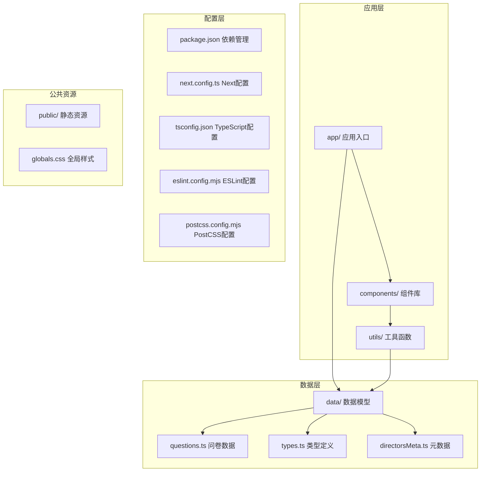
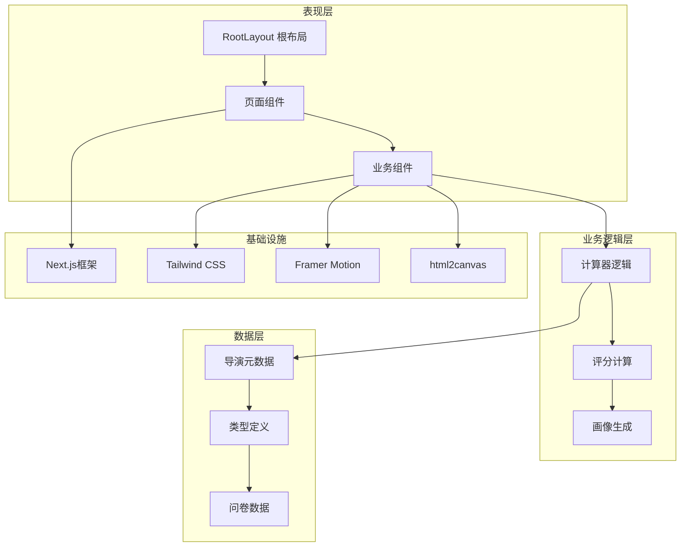
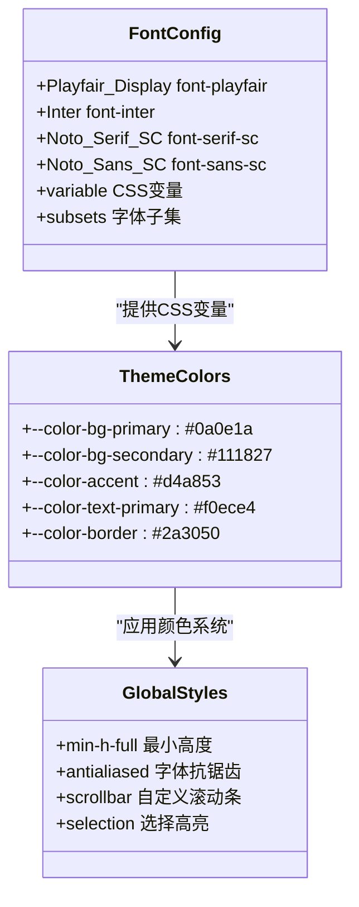
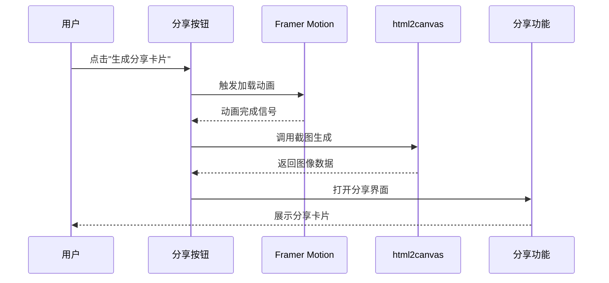
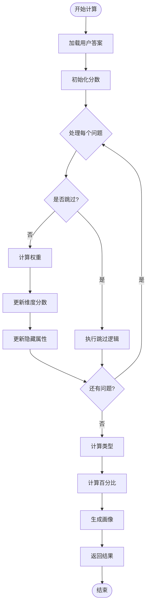
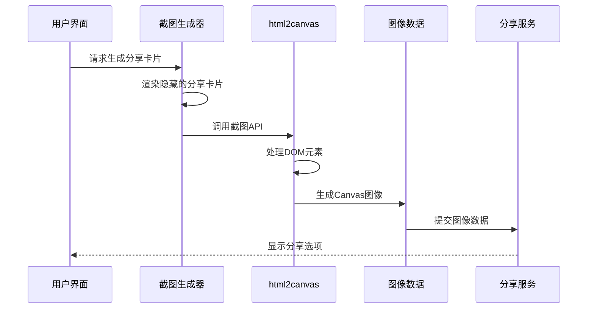

# 技术栈详解

<cite>
**本文档引用的文件**
- [package.json](file://package.json)
- [next.config.ts](file://next.config.ts)
- [tsconfig.json](file://tsconfig.json)
- [postcss.config.mjs](file://postcss.config.mjs)
- [eslint.config.mjs](file://eslint.config.mjs)
- [app/layout.tsx](file://app/layout.tsx)
- [app/globals.css](file://app/globals.css)
- [data/types.ts](file://data/types.ts)
- [data/questions.ts](file://data/questions.ts)
- [data/directorsMeta.ts](file://data/directorsMeta.ts)
- [utils/calculator.ts](file://utils/calculator.ts)
- [app/result/page.tsx](file://app/result/page.tsx)
</cite>

## 目录
1. [简介](#简介)
2. [项目结构](#项目结构)
3. [核心组件](#核心组件)
4. [架构概览](#架构概览)
5. [详细组件分析](#详细组件分析)
6. [依赖分析](#依赖分析)
7. [性能考虑](#性能考虑)
8. [故障排除指南](#故障排除指南)
9. [结论](#结论)
10. [附录](#附录)

## 简介
本项目采用现代化前端技术栈，围绕 FBTI（Film Buff Type Indicator）这一"影迷类型指标"应用展开。技术栈以 Next.js 16.2.4 的 App Router 架构为核心，结合 React 19 的最新特性、TypeScript 5.x 提供的类型安全保障，构建高性能、可维护的单页应用。样式系统基于 Tailwind CSS 4.x 的原子化方法论，配合 PostCSS 实现现代化的样式预处理。动画交互通过 Framer Motion 提供流畅的用户体验，截图分享功能集成 html2canvas 实现 HTML 到图像的转换。

## 项目结构
项目采用基于功能的模块化组织方式，核心目录结构如下：



**图表来源**
- [package.json:1-30](file://package.json#L1-L30)
- [app/layout.tsx:1-53](file://app/layout.tsx#L1-L53)
- [app/globals.css:1-51](file://app/globals.css#L1-L51)

**章节来源**
- [package.json:1-30](file://package.json#L1-L30)
- [next.config.ts:1-8](file://next.config.ts#L1-L8)
- [tsconfig.json:1-35](file://tsconfig.json#L1-L35)

## 核心组件
项目的核心技术组件包括：

### Next.js 16.2.4 App Router
- **文件系统路由**：基于 app/ 目录的约定式路由
- **布局系统**：全局根布局管理元数据和字体加载
- **静态生成**：支持静态页面生成和动态路由
- **增量静态再生**：提升页面更新效率

### React 19 最新特性
- **并发特性**：利用 React 19 的并发渲染能力
- **改进的 Suspense**：更好的异步数据加载体验
- **性能优化**：减少不必要的重渲染

### TypeScript 5.x 类型安全
- **严格模式**：启用严格类型检查
- **路径映射**：使用 @/* 作为项目根路径别名
- **插件支持**：集成 Next.js TypeScript 插件

**章节来源**
- [app/layout.tsx:1-53](file://app/layout.tsx#L1-L53)
- [tsconfig.json:1-35](file://tsconfig.json#L1-L35)
- [package.json:11-28](file://package.json#L11-L28)

## 架构概览
应用采用分层架构设计，确保关注点分离和代码可维护性：



**图表来源**
- [utils/calculator.ts:235-444](file://utils/calculator.ts#L235-L444)
- [data/directorsMeta.ts:21-116](file://data/directorsMeta.ts#L21-L116)
- [data/types.ts:1-428](file://data/types.ts#L1-L428)

## 详细组件分析

### 样式系统与主题配置
项目采用 Tailwind CSS 4.x 的原子化样式方法，结合自定义主题配置实现统一的设计系统：

#### 字体系统配置


**图表来源**
- [app/layout.tsx:10-30](file://app/layout.tsx#L10-L30)
- [app/globals.css:3-12](file://app/globals.css#L3-L12)

#### 响应式设计策略
- **移动端优先**：基于 Tailwind 的响应式断点系统
- **自适应布局**：使用 CSS Grid 和 Flexbox 实现灵活布局
- **暗色模式**：通过 CSS 变量实现完整的暗色主题支持

**章节来源**
- [app/layout.tsx:1-53](file://app/layout.tsx#L1-L53)
- [app/globals.css:1-51](file://app/globals.css#L1-L51)

### 动画与交互系统
Framer Motion 在项目中提供流畅的动画体验：

#### 动画组件集成


**图表来源**
- [app/result/page.tsx:419-462](file://app/result/page.tsx#L419-L462)

#### 动画特性应用
- **过渡动画**：按钮悬停和点击反馈
- **加载指示器**：异步操作的视觉反馈
- **页面切换**：平滑的路由导航体验

**章节来源**
- [app/result/page.tsx:419-486](file://app/result/page.tsx#L419-L486)

### 数据处理与算法引擎
项目的核心算法基于复杂的评分系统和个性化推荐：

#### 评分计算流程


**图表来源**
- [utils/calculator.ts:235-444](file://utils/calculator.ts#L235-L444)

#### 隐藏属性系统
- **α (Alpha) 属性**：时代偏好（经典 vs 现代）
- **β (Beta) 属性**：风格偏好（写实 vs 技术）
- **γ (Gamma) 属性**：多样性偏好（主流 vs 国际）
- **δ (Delta) 属性**：类型偏好（恐怖、喜剧、科幻等）

**章节来源**
- [utils/calculator.ts:16-41](file://utils/calculator.ts#L16-L41)
- [utils/calculator.ts:43-76](file://utils/calculator.ts#L43-L76)

### 截图分享功能
html2canvas 集成实现 HTML 内容到图像的转换：

#### 截图工作流程


**图表来源**
- [app/result/page.tsx:454-486](file://app/result/page.tsx#L454-L486)

**章节来源**
- [app/result/page.tsx:419-486](file://app/result/page.tsx#L419-L486)

## 依赖分析

### 核心依赖关系
```mermaid
graph TB
subgraph "运行时依赖"
NEXT[Next.js 16.2.4]
REACT[React 19.2.4]
DOM[React DOM 19.2.4]
FRAMER[Framer Motion 12.38.0]
HTML2CANVAS[html2canvas 1.4.1]
end
subgraph "开发依赖"
TAILWIND[Tailwind CSS 4.x]
POSTCSS[PostCSS]
ESLINT[ESLint 9.x]
TYPESCRIPT[TypeScript 5.x]
TYPES_REACT[@types/react]
TYPES_NODE[@types/node]
end
subgraph "配置依赖"
NEXT_CONFIG[Next配置]
TS_CONFIG[TypeScript配置]
ESLINT_CONFIG[ESLint配置]
POSTCSS_CONFIG[PostCSS配置]
end
NEXT --> REACT
NEXT --> DOM
REACT --> FRAMER
REACT --> HTML2CANVAS
TAILWIND --> POSTCSS
ESLINT --> TYPESCRIPT
TYPESCRIPT --> TS_CONFIG
NEXT --> NEXT_CONFIG
TAILWIND --> POSTCSS_CONFIG
ESLINT --> ESLINT_CONFIG
TYPESCRIPT --> TS_CONFIG
```

**图表来源**
- [package.json:11-28](file://package.json#L11-L28)
- [postcss.config.mjs:1-8](file://postcss.config.mjs#L1-L8)
- [eslint.config.mjs:1-19](file://eslint.config.mjs#L1-L19)

### 版本兼容性矩阵
| 技术组件 | 当前版本 | 最小兼容版本 | 主要影响 |
|---------|----------|-------------|----------|
| Next.js | 16.2.4 | 16.0.0 | App Router、Server Components |
| React | 19.2.4 | 18.0.0 | 并发特性、Suspense 改进 |
| TypeScript | 5.x | 4.9.0 | 模块解析、装饰器支持 |
| Tailwind CSS | 4.x | 3.0.0 | 原子化方法论、新语法 |
| Framer Motion | 12.38.0 | 10.0.0 | 动画性能、新API |

**章节来源**
- [package.json:11-28](file://package.json#L11-L28)

## 性能考虑
项目在多个层面实现了性能优化：

### 构建时优化
- **Tree Shaking**：TypeScript 编译配置启用模块摇树优化
- **代码分割**：Next.js 自动进行路由级别的代码分割
- **静态资源优化**：自动压缩和优化图片资源

### 运行时优化
- **懒加载**：使用 React.lazy 和 Suspense 实现组件懒加载
- **缓存策略**：合理使用浏览器缓存和 CDN
- **内存管理**：避免不必要的状态提升和重复渲染

### 样式性能
- **原子化CSS**：Tailwind CSS 减少自定义样式的体积
- **按需生成**：仅生成实际使用的CSS类
- **CSS变量**：使用CSS变量实现主题切换的高效性

## 故障排除指南

### 常见问题诊断
1. **TypeScript 类型错误**
   - 检查 tsconfig.json 的严格模式配置
   - 确认所有依赖都有对应的 @types 包
   - 验证路径映射配置正确性

2. **样式不生效**
   - 确认 Tailwind CSS 已正确安装和配置
   - 检查 CSS 变量命名是否符合约定
   - 验证 PostCSS 配置文件格式

3. **动画性能问题**
   - 使用 Framer Motion 的 motion 原生组件
   - 避免在动画过程中进行昂贵的计算
   - 合理使用 transform 和 opacity 属性

**章节来源**
- [tsconfig.json:7-23](file://tsconfig.json#L7-L23)
- [eslint.config.mjs:5-16](file://eslint.config.mjs#L5-L16)

## 结论
FBTI 项目展现了现代前端开发的最佳实践，通过精心选择的技术栈实现了高性能、可维护且具有良好用户体验的应用。Next.js 16.2.4 的 App Router 架构提供了优秀的开发体验，React 19 的并发特性提升了应用性能，TypeScript 5.x 确保了代码质量。Tailwind CSS 4.x 的原子化方法论简化了样式管理，Framer Motion 和 html2canvas 为用户提供了丰富的交互体验。

## 附录

### 开发工具链配置
- **ESLint**：使用 eslint-config-next 提供的规则集
- **TypeScript**：启用严格模式和增量编译
- **PostCSS**：配置 Tailwind CSS 预处理器

### 升级路径建议
1. **Next.js 升级**：遵循官方迁移指南，逐步升级到 17.x
2. **React 升级**：保持与 Next.js 版本兼容，测试并发特性
3. **TypeScript 升级**：先升级到 5.5.x，再考虑 6.x
4. **Tailwind CSS 升级**：注意新版本的语法变更和弃用功能

**章节来源**
- [eslint.config.mjs:1-19](file://eslint.config.mjs#L1-L19)
- [tsconfig.json:16-23](file://tsconfig.json#L16-L23)