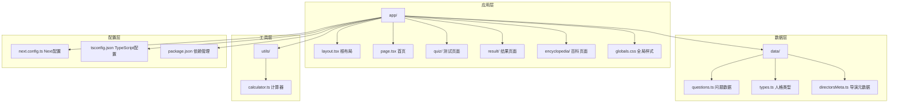
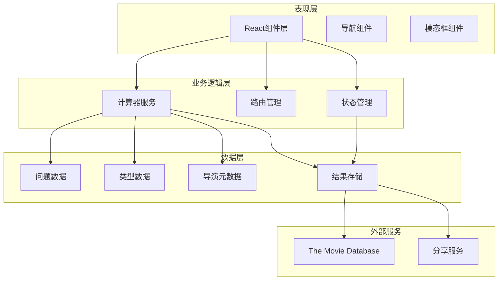
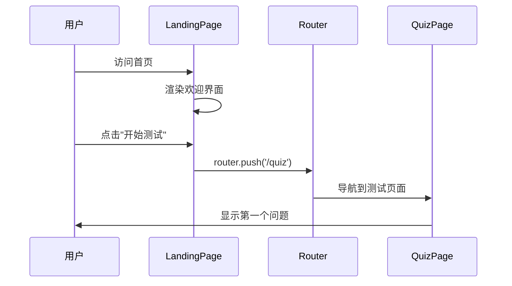
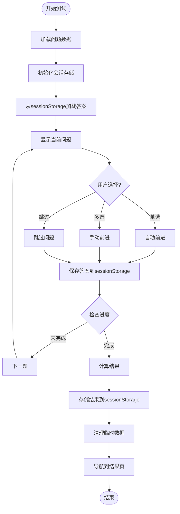
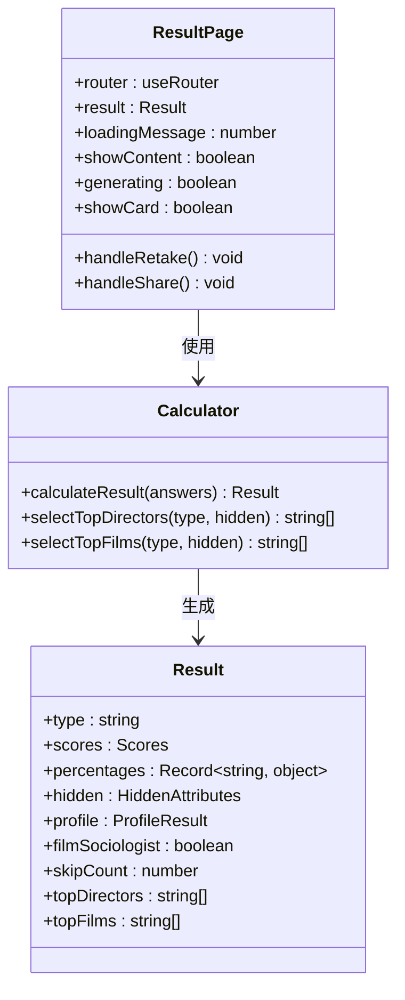
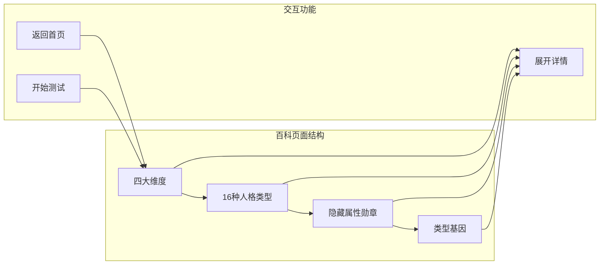
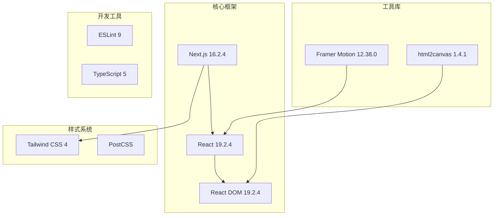
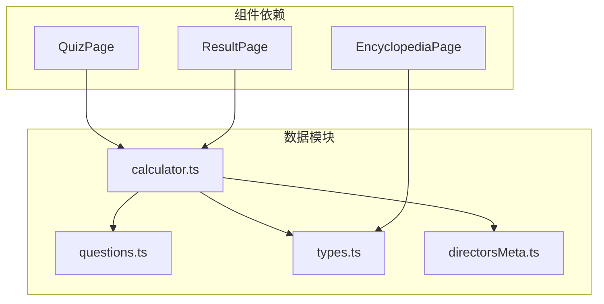

# 整体架构设计

<cite>
**本文档引用的文件**
- [app/layout.tsx](file://app/layout.tsx)
- [app/page.tsx](file://app/page.tsx)
- [app/quiz/page.tsx](file://app/quiz/page.tsx)
- [app/result/page.tsx](file://app/result/page.tsx)
- [app/encyclopedia/page.tsx](file://app/encyclopedia/page.tsx)
- [app/globals.css](file://app/globals.css)
- [data/questions.ts](file://data/questions.ts)
- [data/types.ts](file://data/types.ts)
- [data/directorsMeta.ts](file://data/directorsMeta.ts)
- [utils/calculator.ts](file://utils/calculator.ts)
- [package.json](file://package.json)
- [next.config.ts](file://next.config.ts)
- [tsconfig.json](file://tsconfig.json)
</cite>

## 更新摘要
**变更内容**
- 更新测验页面组件的会话存储集成架构
- 增强进度跟踪和状态管理机制
- 改进错误处理和数据持久化策略
- 优化用户体验和导航流程

## 目录
1. [引言](#引言)
2. [项目结构](#项目结构)
3. [核心组件](#核心组件)
4. [架构概览](#架构概览)
5. [详细组件分析](#详细组件分析)
6. [依赖分析](#依赖分析)
7. [性能考虑](#性能考虑)
8. [故障排除指南](#故障排除指南)
9. [结论](#结论)

## 引言

FBTI（Film Buff Type Indicator）是一个基于Next.js App Router构建的单页应用，旨在通过20个精心设计的问题帮助用户发现自己的电影人格类型。该项目采用现代化的前端技术栈，结合深度的电影文化知识，为用户提供个性化的电影体验。

本项目的核心设计理念是"每个人都是一个电影院"，通过科学的测试流程和丰富的电影知识库，让用户能够深入了解自己的观影偏好和电影人格特征。应用采用响应式设计，支持多种设备访问，并提供了完整的电影知识查询功能。

## 项目结构

FBTI项目遵循Next.js App Router的目录结构组织，采用功能模块化的设计原则：

**图表来源**
- [app/layout.tsx:1-53](file://app/layout.tsx#L1-L53)
- [app/page.tsx:1-76](file://app/page.tsx#L1-L76)
- [app/quiz/page.tsx:1-528](file://app/quiz/page.tsx#L1-L528)
- [app/result/page.tsx:1-800](file://app/result/page.tsx#L1-L800)
- [app/encyclopedia/page.tsx:1-354](file://app/encyclopedia/page.tsx#L1-L354)

**章节来源**
- [app/layout.tsx:1-53](file://app/layout.tsx#L1-L53)
- [app/globals.css:1-51](file://app/globals.css#L1-L51)
- [package.json:1-30](file://package.json#L1-L30)

## 核心组件

### 根布局组件（RootLayout）

根布局组件是整个应用的基础设施，负责全局样式注入、字体加载和基础HTML结构设置：

- **字体加载策略**：使用Next.js内置的Google Fonts集成，动态加载Playfair Display、Inter、Noto Serif SC、Noto Sans SC四种字体
- **全局样式注入**：通过CSS变量定义主题色彩，确保一致的视觉体验
- **响应式设计**：采用Tailwind CSS框架，支持移动端优先的设计理念
- **无障碍访问**：提供适当的语义化HTML结构和可访问性属性

### 页面路由结构

应用采用App Router的文件系统路由约定，每个页面对应一个独立的路由：

- **首页**：`/` - 应用入口点，提供测试和百科导航
- **测试页面**：`/quiz` - 20个问题的交互式测试界面
- **结果页面**：`/result` - 分析结果展示和分享功能
- **百科页面**：`/encyclopedia` - 电影人格类型和知识查询

**章节来源**
- [app/layout.tsx:32-52](file://app/layout.tsx#L32-L52)
- [app/page.tsx:6-75](file://app/page.tsx#L6-L75)

## 架构概览

FBTI采用分层架构设计，将业务逻辑、数据处理和用户界面清晰分离：

**图表来源**
- [app/quiz/page.tsx:19-95](file://app/quiz/page.tsx#L19-L95)
- [app/result/page.tsx:64-93](file://app/result/page.tsx#L64-L93)
- [utils/calculator.ts:235-444](file://utils/calculator.ts#L235-L444)

### 数据流向

应用的数据流遵循单向数据流原则，从用户交互到数据处理再到结果展示：

1. **用户交互**：用户在测试页面进行选择和操作
2. **状态更新**：React状态管理更新当前问题和答案
3. **数据计算**：计算器服务处理答案并生成结果
4. **结果存储**：使用sessionStorage持久化结果
5. **UI更新**：结果页面渲染分析结果和个性化推荐

**章节来源**
- [app/quiz/page.tsx:69-95](file://app/quiz/page.tsx#L69-L95)
- [app/result/page.tsx:72-93](file://app/result/page.tsx#L72-L93)

## 详细组件分析

### 首页组件（LandingPage）

首页作为应用的入口点，承担着引导用户进入测试流程的重要职责：

**图表来源**
- [app/page.tsx:50-66](file://app/page.tsx#L50-L66)

首页的主要功能包括：
- **视觉设计**：采用渐变背景和装饰元素营造电影氛围
- **导航控制**：提供测试和百科两个主要入口
- **响应式布局**：适配不同屏幕尺寸的显示需求

**章节来源**
- [app/page.tsx:1-138](file://app/page.tsx#L1-L138)

### 测试页面组件（QuizPage）

**更新** 测验页面组件经历了重大架构改进，现在集成了完整的会话存储机制、优化的进度跟踪和增强的错误处理能力。

测试页面是应用的核心交互组件，实现了复杂的问答流程和状态管理：

**图表来源**
- [app/quiz/page.tsx:19-95](file://app/quiz/page.tsx#L19-L95)

测试页面的关键特性：
- **会话存储集成**：使用sessionStorage持久化问题ID、答案和临时数据
- **多类型问题支持**：支持二元选择、多选、二元带跳过等多种问题类型
- **动画过渡效果**：使用CSS动画提供流畅的页面切换体验
- **进度跟踪**：实时显示测试进度和剩余题目数量
- **模态框确认**：防止用户意外退出测试流程
- **错误处理增强**：JSON解析错误的优雅降级和数据恢复机制

**章节来源**
- [app/quiz/page.tsx:19-528](file://app/quiz/page.tsx#L19-L528)

### 结果页面组件（ResultPage）

结果页面负责展示复杂的分析结果和个性化推荐：

**图表来源**
- [app/result/page.tsx:64-134](file://app/result/page.tsx#L64-L134)
- [utils/calculator.ts:31-41](file://utils/calculator.ts#L31-L41)

结果页面的核心功能：
- **动态加载效果**：使用定时器和动画提供渐进式内容展示
- **个性化推荐**：基于用户结果生成导演和电影推荐
- **分享功能**：使用html2canvas生成可分享的图片卡片
- **详细分析**：展示四大维度的百分比分布和隐藏属性

**章节来源**
- [app/result/page.tsx:64-800](file://app/result/page.tsx#L64-L800)

### 百科页面组件（EncyclopediaPage）

百科页面提供完整的电影知识查询功能：

**图表来源**
- [app/encyclopedia/page.tsx:120-352](file://app/encyclopedia/page.tsx#L120-L352)

百科页面的设计特点：
- **网格布局**：使用响应式网格展示16种人格类型
- **交互式详情**：点击类型卡片展开详细信息
- **分类展示**：将电影知识按维度、类型、属性进行分类
- **导航便利**：提供快速返回和开始测试的导航链接

**章节来源**
- [app/encyclopedia/page.tsx:120-354](file://app/encyclopedia/page.tsx#L120-L354)

## 依赖分析

### 技术栈依赖

FBTI项目采用现代化的前端技术栈，各依赖包的作用如下：

**图表来源**
- [package.json:11-28](file://package.json#L11-L28)

### 数据依赖关系

应用的数据层采用模块化设计，各数据模块之间的依赖关系清晰明确：

**图表来源**
- [utils/calculator.ts:1-4](file://utils/calculator.ts#L1-L4)
- [app/quiz/page.tsx:5-6](file://app/quiz/page.tsx#L5-L6)
- [app/result/page.tsx:6-8](file://app/result/page.tsx#L6-L8)

**章节来源**
- [package.json:11-28](file://package.json#L11-L28)
- [data/questions.ts:1-42](file://data/questions.ts#L1-L42)
- [data/types.ts:1-9](file://data/types.ts#L1-L9)
- [data/directorsMeta.ts:1-19](file://data/directorsMeta.ts#L1-L19)

## 性能考虑

### 字体加载优化

应用采用了智能的字体加载策略，通过CSS变量和渐进式增强确保良好的用户体验：

- **字体预加载**：使用Next.js的Google Fonts集成自动预加载关键字体
- **变量字体**：通过CSS变量实现字体的动态切换和主题化
- **降级方案**：在字体加载失败时提供系统默认字体作为后备

### 图片和资源优化

- **懒加载策略**：使用Next.js的图像优化组件自动处理图片懒加载
- **格式转换**：支持现代图片格式（WebP）以减少文件大小
- **响应式图片**：根据设备像素密度提供合适的图片尺寸

### JavaScript性能优化

- **代码分割**：利用Next.js的自动代码分割减少初始包大小
- **状态管理**：使用React的useState和useEffect避免不必要的重渲染
- **内存管理**：合理清理定时器和事件监听器防止内存泄漏
- **会话存储优化**：使用JSON序列化减少存储开销

## 故障排除指南

### 常见问题诊断

**问题1：字体加载缓慢**
- 检查网络连接和CDN可用性
- 验证Google Fonts的访问权限
- 考虑使用本地字体文件作为后备方案

**问题2：测试数据不显示**
- 确认questions.ts文件的导入路径正确
- 检查数据格式是否符合接口定义
- 验证TypeScript编译是否成功

**问题3：结果页面空白**
- 检查sessionStorage中是否有fbti_result数据
- 验证Result接口定义与实际数据结构匹配
- 确认计算函数返回的数据格式正确

**问题4：分享功能失败**
- 检查html2canvas的版本兼容性
- 验证DOM元素的可见性和样式设置
- 确认字体加载完成后再执行截图操作

**问题5：会话存储数据丢失**
- 检查浏览器的隐私设置和存储限制
- 验证JSON序列化/反序列化的正确性
- 确认sessionStorage的键值命名一致性

**章节来源**
- [app/result/page.tsx:102-134](file://app/result/page.tsx#L102-L134)
- [app/quiz/page.tsx:87-92](file://app/quiz/page.tsx#L87-L92)

## 结论

FBTI项目展现了现代前端开发的最佳实践，通过合理的架构设计和组件化开发，成功构建了一个功能完整、用户体验优秀的电影人格测试应用。

项目的主要优势包括：

1. **清晰的架构分层**：表现层、业务逻辑层、数据层职责明确
2. **响应式设计**：全面支持移动设备和桌面设备
3. **丰富的交互体验**：流畅的动画过渡和直观的用户界面
4. **可扩展的数据模型**：支持电影知识的持续扩展和更新
5. **完善的错误处理**：健壮的状态管理和异常情况处理
6. **会话存储集成**：提供断点续测和数据持久化能力

**更新** 最新的架构改进显著增强了应用的稳定性和用户体验，特别是会话存储集成提供了更好的数据持久化和错误恢复能力。

未来可以考虑的改进方向：
- 添加用户账户系统以保存测试历史
- 实现更复杂的个性化推荐算法
- 增加社交分享和社区互动功能
- 优化移动端的触摸交互体验
- 增强离线数据同步和缓存策略

通过持续的迭代和优化，FBTI项目有望成为电影文化领域的标杆应用。