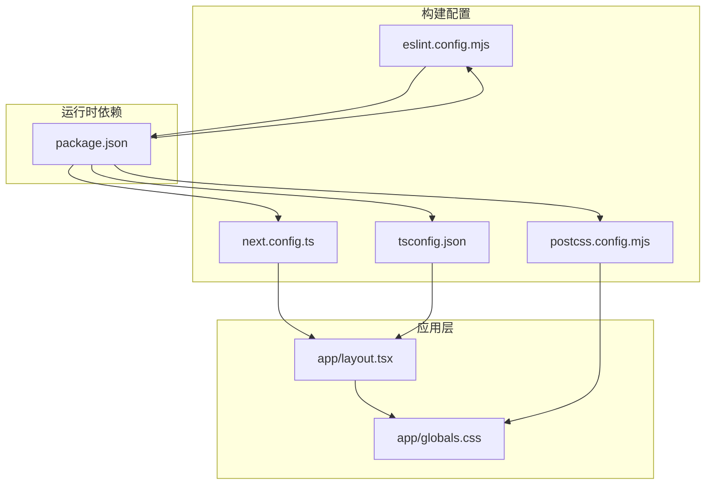
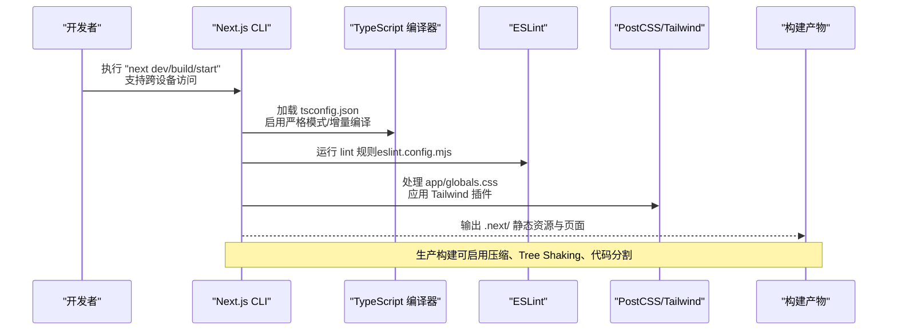
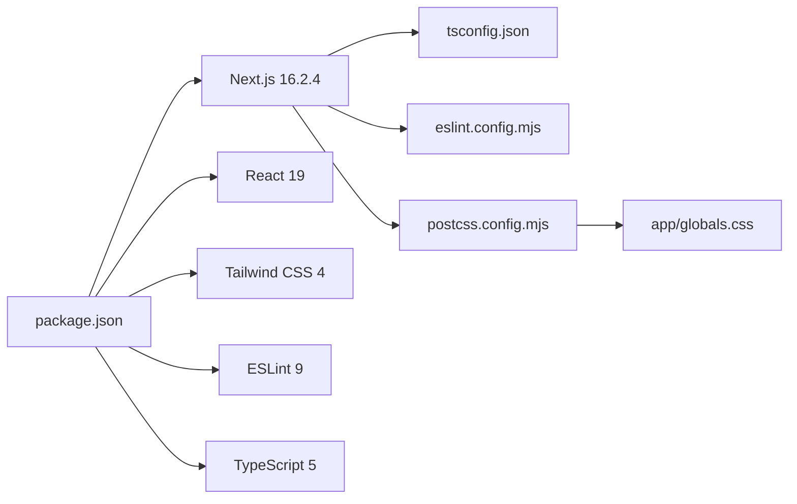

# 构建配置

<cite>
**本文引用的文件**
- [next.config.ts](file://next.config.ts)
- [tsconfig.json](file://tsconfig.json)
- [eslint.config.mjs](file://eslint.config.mjs)
- [postcss.config.mjs](file://postcss.config.mjs)
- [package.json](file://package.json)
- [app/layout.tsx](file://app/layout.tsx)
- [app/globals.css](file://app/globals.css)
</cite>

## 更新摘要
**变更内容**
- 更新Next.js开发服务器配置，添加跨设备测试支持
- 新增开发来源白名单配置说明
- 扩展开发环境差异化配置章节
- 更新故障排查指南，增加跨设备访问相关问题

## 目录
1. [简介](#简介)
2. [项目结构](#项目结构)
3. [核心组件](#核心组件)
4. [架构总览](#架构总览)
5. [详细组件分析](#详细组件分析)
6. [依赖关系分析](#依赖关系分析)
7. [性能考量](#性能考量)
8. [故障排查指南](#故障排查指南)
9. [结论](#结论)
10. [附录](#附录)

## 简介
本文件面向FBTI项目，系统化梳理与Next.js 16.2.4相关的构建配置，覆盖以下方面：
- Next.js构建配置（当前包含开发来源白名单配置，可扩展实验性功能、性能优化与输出目录）
- TypeScript编译配置（目标、模块、路径映射、严格模式等）
- ESLint代码规范配置（基于Next.js官方配置组合）
- PostCSS与Tailwind CSS插件链、浏览器兼容与CSS优化
- 开发/生产环境差异（热重载、代码分割、缓存策略、跨设备测试支持）
- 构建性能优化技巧、错误排查与常见问题解决方案

## 项目结构
FBTI采用Next.js App Router结构，关键配置集中在根目录的四个文件：next.config.ts、tsconfig.json、eslint.config.mjs、postcss.config.mjs；样式通过app/globals.css与Tailwind CSS集成；包管理在package.json中统一声明。

**图表来源**
- [next.config.ts:1-9](file://next.config.ts#L1-L9)
- [tsconfig.json:1-35](file://tsconfig.json#L1-L35)
- [eslint.config.mjs:1-19](file://eslint.config.mjs#L1-L19)
- [postcss.config.mjs:1-8](file://postcss.config.mjs#L1-L8)
- [package.json:1-31](file://package.json#L1-L31)
- [app/layout.tsx:1-53](file://app/layout.tsx#L1-L53)
- [app/globals.css:1-364](file://app/globals.css#L1-L364)

**章节来源**
- [next.config.ts:1-9](file://next.config.ts#L1-L9)
- [tsconfig.json:1-35](file://tsconfig.json#L1-L35)
- [eslint.config.mjs:1-19](file://eslint.config.mjs#L1-L19)
- [postcss.config.mjs:1-8](file://postcss.config.mjs#L1-L8)
- [package.json:1-31](file://package.json#L1-L31)
- [app/layout.tsx:1-53](file://app/layout.tsx#L1-L53)
- [app/globals.css:1-364](file://app/globals.css#L1-L364)

## 核心组件
- Next.js构建配置（next.config.ts）：当前包含开发来源白名单配置，支持跨设备测试；保留扩展点用于启用实验性功能、性能优化与输出目录定制。
- TypeScript编译配置（tsconfig.json）：启用严格模式、增量编译、模块解析为bundler、路径映射@/*至根目录，并使用Next.js内置TS插件。
- ESLint配置（eslint.config.mjs）：组合eslint-config-next的核心Web Vitals规则与TypeScript规则，覆盖默认忽略项。
- PostCSS配置（postcss.config.mjs）：仅启用Tailwind CSS PostCSS插件，实现原子化CSS与响应式设计。
- 包管理（package.json）：声明Next.js 16.2.4、React 19、Tailwind CSS 4、ESLint 9、TypeScript 5等依赖，脚本涵盖dev/build/start/lint。

**章节来源**
- [next.config.ts:1-9](file://next.config.ts#L1-L9)
- [tsconfig.json:1-35](file://tsconfig.json#L1-L35)
- [eslint.config.mjs:1-19](file://eslint.config.mjs#L1-L19)
- [postcss.config.mjs:1-8](file://postcss.config.mjs#L1-L8)
- [package.json:1-31](file://package.json#L1-L31)

## 架构总览
下图展示从开发到生产的构建流程与关键配置交互：

**图表来源**
- [package.json:5-10](file://package.json#L5-L10)
- [tsconfig.json:1-35](file://tsconfig.json#L1-L35)
- [eslint.config.mjs:1-19](file://eslint.config.mjs#L1-L19)
- [postcss.config.mjs:1-8](file://postcss.config.mjs#L1-L8)
- [app/globals.css:1-364](file://app/globals.css#L1-L364)

## 详细组件分析

### Next.js 构建配置（next.config.ts）
- 当前状态：包含开发来源白名单配置，支持跨设备测试与开发环境访问。
- 开发来源白名单（allowedDevOrigins）：
  - `8.152.155.189`：远程开发服务器IP地址，支持外网访问测试
  - `localhost`：本地开发环境标准回环地址
  - `192.168.1.205`：内网开发服务器IP地址，支持局域网设备访问
- 可扩展方向（建议）：
  - 实验性功能：如ppr、cachedNavigations、optimisticClientCache、prefetchInlining、optimizeCss等。
  - 性能优化：如swcMinify、experimental.turbo、output.standalone等。
  - 输出目录：如outputDir、distDir、assetPrefix等。
  - 图片优化：images配置（已在TypeScript环境变量中注入）。
- 注意事项：若启用实验性功能，需结合版本支持与稳定性评估。

**章节来源**
- [next.config.ts:1-9](file://next.config.ts#L1-L9)

### TypeScript 配置（tsconfig.json）
- 编译目标与库：target ES2017，lib包含dom、dom.iterable、esnext。
- 严格模式：strict=true，提升类型安全。
- 模块系统：module=esnext，moduleResolution=bundler，适配现代打包器。
- 路径映射：paths["@/*": ["./*"]]，便于相对路径导入。
- 其他关键项：noEmit、esModuleInterop、resolveJsonModule、isolatedModules、incremental、jsx=react-jsx、plugins包含Next内置TS插件。
- include/exclude：包含Next类型生成目录与ts/tsx/mjs文件，排除node_modules。

**章节来源**
- [tsconfig.json:1-35](file://tsconfig.json#L1-L35)

### ESLint 配置（eslint.config.mjs）
- 组合规则：
  - eslint-config-next/core-web-vitals：核心Web Vitals指标规则。
  - eslint-config-next/typescript：TypeScript相关规则。
- 默认忽略：覆盖默认忽略项（.next、out、build、next-env.d.ts），确保构建产物不被扫描。
- 建议：如需自定义规则，可在数组末尾追加自定义配置对象。

**章节来源**
- [eslint.config.mjs:1-19](file://eslint.config.mjs#L1-L19)

### PostCSS 与 Tailwind CSS 配置（postcss.config.mjs）
- 插件链：仅启用 "@tailwindcss/postcss"，实现Tailwind CSS原语与工具类。
- 样式入口：app/globals.css通过@import引入tailwindcss，随后定义主题变量与通用样式。
- 浏览器兼容：由Tailwind CSS与PostCSS生态共同保障，无需额外polyfill。
- CSS优化策略：利用Tailwind工具类减少重复样式；在生产构建中可配合Next.js的CSS优化开关（见下一节"性能考量"）。

**章节来源**
- [postcss.config.mjs:1-8](file://postcss.config.mjs#L1-L8)
- [app/globals.css:1-364](file://app/globals.css#L1-L364)

### 开发与生产环境差异
- 开发环境（next dev）：
  - 启用热重载与Fast Refresh（可通过CLI参数控制）。
  - Source Map默认开启，便于调试。
  - 支持HTTPS自签名证书（实验性）。
  - **新增**：开发来源白名单允许跨设备访问，支持团队协作测试。
- 生产环境（next build/start）：
  - 产物压缩与Tree Shaking（可选）。
  - 代码分割按路由自动进行（App Router特性）。
  - 缓存策略：静态资源带强缓存策略，HTML与动态路由按需缓存。
- 与配置的关系：
  - next.config.ts可启用optimizeCss、swcMinify等生产优化。
  - tsconfig.json的noEmit与incremental提升开发体验与构建速度。
  - eslint.config.mjs在CI中执行，保证代码质量。

**章节来源**
- [package.json:5-10](file://package.json#L5-L10)
- [next.config.ts:1-9](file://next.config.ts#L1-L9)
- [tsconfig.json:1-35](file://tsconfig.json#L1-L35)
- [eslint.config.mjs:1-19](file://eslint.config.mjs#L1-L19)

## 依赖关系分析
- 依赖声明：Next.js 16.2.4、React 19、Tailwind CSS 4、ESLint 9、TypeScript 5。
- 构建链路：TypeScript编译（tsconfig.json）→ ESLint（eslint.config.mjs) → PostCSS/Tailwind（postcss.config.mjs）→ Next.js打包（next.config.ts）→ 产物输出。
- 脚本命令：dev/build/start/lint分别对应开发、构建、启动与代码检查。

**图表来源**
- [package.json:11-30](file://package.json#L11-L30)
- [tsconfig.json:1-35](file://tsconfig.json#L1-L35)
- [eslint.config.mjs:1-19](file://eslint.config.mjs#L1-L19)
- [postcss.config.mjs:1-8](file://postcss.config.mjs#L1-L8)
- [app/globals.css:1-364](file://app/globals.css#L1-L364)

**章节来源**
- [package.json:1-31](file://package.json#L1-L31)

## 性能考量
- TypeScript增量编译（incremental）与noEmit：提升开发阶段编译速度与类型检查效率。
- ESLint在CI中执行，避免在开发时阻塞。
- PostCSS/Tailwind：通过原子化CSS减少冗余样式，配合生产构建的CSS优化（可在next.config.ts中启用）。
- 代码分割：App Router按路由自动分割，减少首屏体积。
- 缓存策略：静态资源强缓存，动态路由按需缓存；可结合CDN与HTTP缓存头进一步优化。
- 实验性优化（建议在next.config.ts中按需启用）：
  - optimizeCss：生产环境启用CSS优化。
  - swcMinify：启用SWC压缩器。
  - experimental.turbo：使用Turbopack加速开发与构建。
  - output.standalone：输出独立运行时以提升部署灵活性。

**章节来源**
- [tsconfig.json:1-35](file://tsconfig.json#L1-L35)
- [eslint.config.mjs:1-19](file://eslint.config.mjs#L1-L19)
- [postcss.config.mjs:1-8](file://postcss.config.mjs#L1-L8)
- [next.config.ts:1-9](file://next.config.ts#L1-L9)

## 故障排查指南
- TypeScript编译错误
  - 症状：类型检查失败或构建中断。
  - 排查：确认tsconfig.json的strict、module、moduleResolution、jsx等设置是否与项目一致；检查paths映射是否正确。
  - 参考：[tsconfig.json:1-35](file://tsconfig.json#L1-L35)
- ESLint规则冲突
  - 症状：编辑器提示或CI报错。
  - 排查：确认eslint.config.mjs是否正确组合core-web-vitals与typescript规则；检查全局忽略项是否覆盖了需要扫描的目录。
  - 参考：[eslint.config.mjs:1-19](file://eslint.config.mjs#L1-L19)
- PostCSS/Tailwind样式异常
  - 症状：样式未生效或工具类无效。
  - 排查：确认postcss.config.mjs仅包含"@tailwindcss/postcss"；检查app/globals.css中的@import顺序与变量定义。
  - 参考：[postcss.config.mjs:1-8](file://postcss.config.mjs#L1-L8)、[app/globals.css:1-364](file://app/globals.css#L1-L364)
- 构建缓慢或内存占用高
  - 症状：开发/构建耗时长。
  - 排查：启用incremental与swcMinify（在next.config.ts中）；减少不必要的include/exclude；清理node_modules后重新安装。
  - 参考：[tsconfig.json:1-35](file://tsconfig.json#L1-L35)、[package.json:1-31](file://package.json#L1-L31)
- 开发环境热重载失效
  - 症状：修改代码后无刷新。
  - 排查：确认next dev正常启动；检查Fast Refresh相关参数；必要时禁用server端Fast Refresh（通过CLI参数）。
  - 参考：[package.json:5-10](file://package.json#L5-L10)
- **新增**：跨设备访问问题
  - 症状：其他设备无法访问开发服务器或出现CORS错误。
  - 排查：确认next.config.ts中的allowedDevOrigins配置是否包含目标设备IP；检查防火墙设置；验证网络连接；确认开发服务器监听所有接口（0.0.0.0）。
  - 解决方案：在next.config.ts中添加或调整allowedDevOrigins数组；使用`next dev --host 0.0.0.0`启动开发服务器；检查端口占用情况。

**章节来源**
- [tsconfig.json:1-35](file://tsconfig.json#L1-L35)
- [eslint.config.mjs:1-19](file://eslint.config.mjs#L1-L19)
- [postcss.config.mjs:1-8](file://postcss.config.mjs#L1-L8)
- [app/globals.css:1-364](file://app/globals.css#L1-L364)
- [package.json:5-10](file://package.json#L5-L10)
- [next.config.ts:1-9](file://next.config.ts#L1-L9)

## 结论
FBTI项目已具备清晰的构建基础：严格的TypeScript配置、完善的ESLint规则与Tailwind CSS集成。最新的配置更新增加了跨设备测试支持，通过allowedDevOrigins白名单配置，有效支持团队协作开发与多设备测试场景。建议在next.config.ts中逐步启用生产优化与实验性功能，结合增量编译与代码分割策略，持续优化开发体验与构建性能。同时，保持对样式与规则的最小化配置，确保可维护性与一致性。

## 附录
- 常用命令
  - 开发：next dev（支持跨设备访问）
  - 构建：next build
  - 启动：next start
  - 代码检查：eslint
- 关键文件清单
  - next.config.ts：Next.js构建配置扩展点，包含开发来源白名单
  - tsconfig.json：TypeScript编译与路径映射
  - eslint.config.mjs：ESLint规则与忽略项
  - postcss.config.mjs：PostCSS插件链
  - app/globals.css：全局样式与Tailwind入口
  - package.json：依赖与脚本