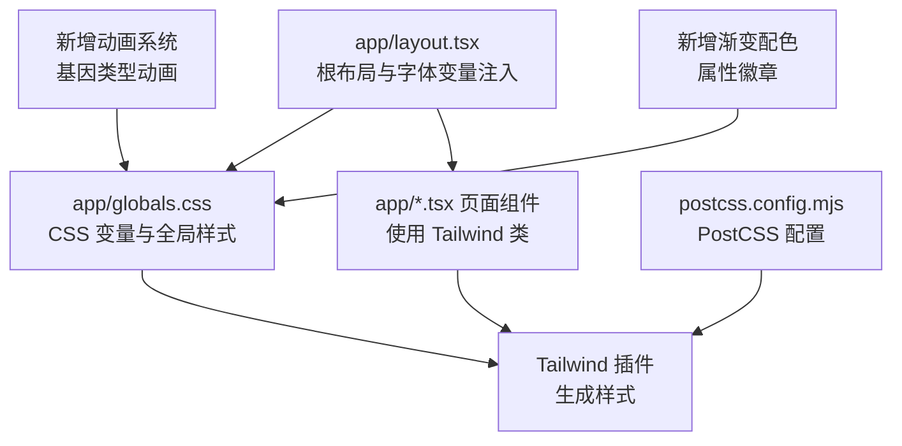
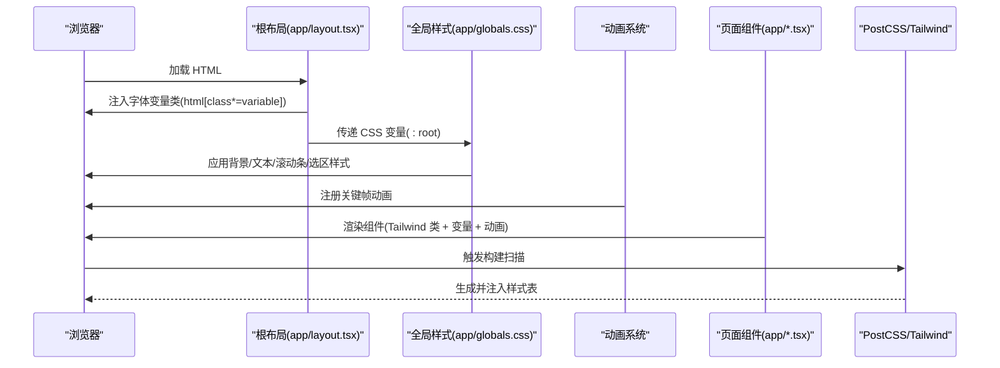
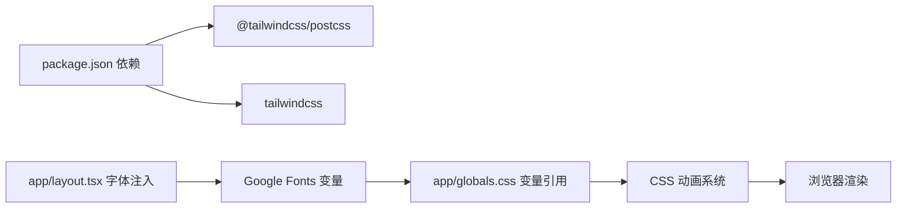

# 样式系统

<cite>
**本文引用的文件**
- [app/globals.css](file://app/globals.css)
- [app/layout.tsx](file://app/layout.tsx)
- [postcss.config.mjs](file://postcss.config.mjs)
- [package.json](file://package.json)
- [app/page.tsx](file://app/page.tsx)
- [app/quiz/page.tsx](file://app/quiz/page.tsx)
- [app/result/page.tsx](file://app/result/page.tsx)
- [app/encyclopedia/page.tsx](file://app/encyclopedia/page.tsx)
- [data/types.ts](file://data/types.ts)
</cite>

## 更新摘要
**变更内容**
- 新增完整的CSS动画系统，包含六种基因类型视觉效果（恐怖、喜剧、科幻、犯罪、动画、纪录片）
- 新增α、β、γ专属属性的高级渐变配色系统
- 新增移动端默认动画支持
- 新增基因标签样式和分享卡片中的基因标签样式
- 更新基因类型动画效果和属性徽章的视觉设计

## 目录
1. [简介](#简介)
2. [项目结构](#项目结构)
3. [核心组件](#核心组件)
4. [架构总览](#架构总览)
5. [详细组件分析](#详细组件分析)
6. [依赖分析](#依赖分析)
7. [性能考虑](#性能考虑)
8. [故障排查指南](#故障排查指南)
9. [结论](#结论)
10. [附录](#附录)

## 简介
本文件系统化梳理 FBTI 项目的样式系统，重点覆盖 Tailwind CSS 的配置与使用策略、自定义颜色与字体系统、暗色主题设计理念与实现、全局样式组织方式、字体加载策略、常用样式类与设计规范，以及性能优化与最佳实践。**更新内容**包括新增的完整CSS动画系统，涵盖六种基因类型视觉效果和α、β、γ专属属性的高级渐变配色系统，为用户提供丰富的交互体验和视觉反馈。

## 项目结构
FBTI 的样式系统围绕 Next.js 应用布局与 PostCSS 插件展开，采用"变量驱动 + 组件内 Tailwind 类"的混合策略：
- 布局层：通过根布局注入 Google Fonts 变量，并在 HTML 上挂载字体变量类名，确保全局可用。
- 全局层：通过 CSS 变量集中管理颜色与字体族，配合基础排版与滚动条样式。
- 组件层：在页面组件中直接使用 Tailwind 工具类，结合变量与自定义类实现统一风格。
- 动画层：新增完整的CSS动画系统，提供基因类型和属性徽章的视觉反馈。
- 构建层：PostCSS 集成 Tailwind 插件，自动扫描并生成所需样式。

**图表来源**
- [app/layout.tsx:1-53](file://app/layout.tsx#L1-L53)
- [app/globals.css:1-51](file://app/globals.css#L1-L51)
- [postcss.config.mjs:1-8](file://postcss.config.mjs#L1-L8)

**章节来源**
- [app/layout.tsx:1-53](file://app/layout.tsx#L1-L53)
- [app/globals.css:1-51](file://app/globals.css#L1-L51)
- [postcss.config.mjs:1-8](file://postcss.config.mjs#L1-L8)

## 核心组件
- Tailwind CSS 版本与构建链
  - 使用 Tailwind v4 插件与 PostCSS 集成，构建时自动扫描组件中的类名生成样式。
  - 项目未显式配置 tailwind.config.ts，采用默认行为，适合快速迭代与最小配置。
- 字体系统
  - 通过 next/font/google 注入 Playfair Display、Inter、Noto Serif SC、Noto Sans SC 的 CSS 变量，挂载至 html 根节点，确保全局可用。
  - 在全局 CSS 中以变量形式组合字体族，形成优先级链路，兼顾中英文字体体验。
- 自定义颜色与变量
  - 在 :root 定义背景、文本、强调色、边框等变量，统一用于 body、滚动条与选区高亮。
  - 组件内使用 Tailwind 色彩类与十六进制值混合，保证一致性与灵活性。
- 暗色主题
  - 主背景色 #0a0e1a 提供深邃的影院氛围，强调金色（#d4a853）作为品牌强调色，营造"暗夜金箔"的质感。
  - 文本主色采用浅灰，确保在深色背景下具备良好对比度与可读性。
- **新增动画系统**
  - 六种基因类型动画效果：恐怖（雷电）、喜剧（冒泡）、科幻（闪烁）、犯罪（流血）、动画（辉光脉动）、纪录片（呼吸发光）。
  - α、β、γ专属属性渐变配色系统，提供高级视觉层次。
  - 移动端默认动画支持，确保在移动设备上的流畅体验。

**章节来源**
- [package.json:11-29](file://package.json#L11-L29)
- [postcss.config.mjs:1-8](file://postcss.config.mjs#L1-L8)
- [app/layout.tsx:10-30](file://app/layout.tsx#L10-L30)
- [app/globals.css:3-12](file://app/globals.css#L3-L12)
- [app/globals.css:14-18](file://app/globals.css#L14-L18)
- [app/globals.css:52-176](file://app/globals.css#L52-L176)
- [app/globals.css:244-363](file://app/globals.css#L244-L363)

## 架构总览
下图展示样式系统在运行时的关键交互：根布局注入字体变量，全局 CSS 通过变量统一颜色与字体，页面组件使用 Tailwind 类与变量实现一致风格，PostCSS 插件负责构建期样式生成，新增动画系统提供丰富的视觉反馈。

**图表来源**
- [app/layout.tsx:43-51](file://app/layout.tsx#L43-L51)
- [app/globals.css:14-18](file://app/globals.css#L14-L18)
- [postcss.config.mjs:1-8](file://postcss.config.mjs#L1-L8)

## 详细组件分析

### 根布局与字体系统
- 字体变量注入
  - 通过 next/font/google 为 Playfair Display、Inter、Noto Serif SC、Noto Sans SC 生成 CSS 变量，并在 html 上挂载对应变量类，确保全局可用。
  - 字体权重与子集按需配置，减少初始加载体积。
- 抗锯齿与基础排版
  - 在根布局中为 body 添加抗锯齿类，提升文本清晰度。
  - 全局 CSS 将字体族组合为变量，形成中英文字体优先级链路。

**章节来源**
- [app/layout.tsx:10-30](file://app/layout.tsx#L10-L30)
- [app/layout.tsx:47](file://app/layout.tsx#L47)
- [app/globals.css:14-18](file://app/globals.css#L14-L18)

### 全局样式组织
- CSS 变量集中管理
  - :root 定义背景、文本、强调色、边框等变量，组件与全局样式统一引用，便于主题切换与品牌更新。
- 滚动条与选区高亮
  - 自定义滚动条宽度、轨道与滑块颜色，适配暗色主题。
  - ::selection 定义选区高亮色与反色文本，提升阅读体验。
- 字体类封装
  - .font-playfair 与 .font-serif-sc 将变量字体组合为可复用类，简化组件书写。
- **新增动画系统**
  - 关键帧动画注册：spin、lightning、bubble、flicker、bleed、glow-pulse、breathe-glow、mobile-glow、alpha-shimmer、beta-pulse、gamma-breathe。
  - 基因类型动画：每种基因类型拥有独特的颜色变量和悬停动画效果。
  - 属性徽章渐变：α、β、γ专属渐变配色，支持文本渐变和图标动画。

**章节来源**
- [app/globals.css:3-12](file://app/globals.css#L3-L12)
- [app/globals.css:28-46](file://app/globals.css#L28-L46)
- [app/globals.css:20-26](file://app/globals.css#L20-L26)
- [app/globals.css:48-51](file://app/globals.css#L48-L51)
- [app/globals.css:52-176](file://app/globals.css#L52-L176)
- [app/globals.css:244-363](file://app/globals.css#L244-L363)

### 页面组件中的样式使用
- landing 页
  - 使用背景装饰与模糊圆实现"影院氛围"，强调品牌色与对比度。
  - 按钮类名体现交互状态（hover、focus），并使用品牌强调色与边框过渡。
- quiz 页
  - 进度条、按钮、模态框均使用 Tailwind 类与变量色，保持统一风格。
  - 动画与过渡通过工具类实现，避免额外 JS。
- result 页
  - 分享卡片生成时指定背景色与字体等待，确保导出图像一致性。
  - 使用变量色与 Tailwind 色板混合，突出关键信息与稀有度等级。
  - **新增基因雷达图**：使用 SVG 和 CSS 动画实现交互式基因强度可视化。
  - **新增属性徽章**：展示α、β、γ专属属性的稀有度和等级。
- encyclopedia 页
  - **新增类型基因展示**：使用基因标签样式展示六种基因类型及其描述。
  - **新增基因标签样式**：.gene-label 提供统一的基因类型视觉呈现。

**章节来源**
- [app/page.tsx:10-76](file://app/page.tsx#L10-L76)
- [app/quiz/page.tsx:124-200](file://app/quiz/page.tsx#L124-L200)
- [app/quiz/page.tsx:264-299](file://app/quiz/page.tsx#L264-L299)
- [app/result/page.tsx:102-134](file://app/result/page.tsx#L102-L134)
- [app/result/page.tsx:162-200](file://app/result/page.tsx#L162-L200)
- [app/result/page.tsx:910-942](file://app/result/page.tsx#L910-L942)
- [app/result/page.tsx:953-1051](file://app/result/page.tsx#L953-L1051)
- [app/encyclopedia/page.tsx:311-333](file://app/encyclopedia/page.tsx#L311-L333)

### 设计系统与常用样式规范
- 颜色系统
  - 主背景：#0a0e1a；卡片背景：#1a1f35；边框：#2a3050；强调色：#d4a853；强调 hover：#e6bd6a。
  - 文本主色：#f0ece4；次要文本：#9ca3af；灰色系用于弱提示与禁用态。
- 字体系统
  - 正文字体：Noto Sans SC（多权重）+ Inter（拉丁）+ 系统字体。
  - 标题字体：Playfair Display + Noto Serif SC（衬线）。
- 稀有度与等级
  - common/uncommon/rare/legendary 对应不同背景、文本与边框色，用于图鉴与属性展示。
- **新增基因类型系统**
  - 幽谷（恐怖）：#a855f7，雷电效果动画
  - 浮生（喜剧）：#fbbf24，冒泡效果动画
  - 异境（科幻）：#06b6d4，闪烁效果动画
  - 暗局（犯罪）：#dc2626，流血效果动画
  - 织梦（动画）：#f472b6，辉光脉动动画
  - 拾真（纪录片）：#10b981，呼吸发光动画
- **新增属性徽章系统**
  - α（时间穿越者）：铂金渐变，alpha-shimmer 动画
  - β（形式感应器）：紫晶渐变，beta-pulse 动画
  - γ（文化通行证）：翡翠渐变，gamma-breathe 动画
- 交互与状态
  - hover、focus、disabled 状态通过 Tailwind 类与变量色统一管理，确保一致性与可访问性。
  - **新增动画状态**：基因类型悬停动画和属性徽章图标动画。

**章节来源**
- [app/globals.css:3-12](file://app/globals.css#L3-L12)
- [app/encyclopedia/page.tsx:73-98](file://app/encyclopedia/page.tsx#L73-L98)
- [app/encyclopedia/page.tsx:171-175](file://app/encyclopedia/page.tsx#L171-L175)
- [app/result/page.tsx:488-500](file://app/result/page.tsx#L488-L500)
- [app/globals.css:52-176](file://app/globals.css#L52-L176)
- [app/globals.css:244-363](file://app/globals.css#L244-L363)

## 依赖分析
- 构建依赖
  - @tailwindcss/postcss：将 Tailwind 集成到 PostCSS 流水线。
  - tailwindcss：核心样式生成器。
- 运行时依赖
  - next/font/google：按需加载 Google Fonts，支持变量字体与子集裁剪。
- **新增动画依赖**
  - CSS 关键帧动画：通过 @keyframes 定义，无需额外 JavaScript 依赖。
  - 移动端适配：媒体查询支持不同设备的动画表现。
- 关系图

**图表来源**
- [package.json:18-29](file://package.json#L18-L29)
- [app/layout.tsx:10-30](file://app/layout.tsx#L10-L30)
- [app/globals.css:14-18](file://app/globals.css#L14-L18)

**章节来源**
- [package.json:18-29](file://package.json#L18-L29)
- [app/layout.tsx:10-30](file://app/layout.tsx#L10-L30)
- [app/globals.css:14-18](file://app/globals.css#L14-L18)

## 性能考虑
- 字体加载
  - 使用 next/font/google 的变量字体与子集裁剪，减少初始下载体积与阻塞。
  - 在结果页导出分享卡片前等待字体 ready，避免截取空白字符。
- 样式体积
  - 采用默认 Tailwind 行为，避免过度配置导致的样式膨胀。
  - 通过 CSS 变量集中管理颜色，减少重复定义与构建扫描范围。
- **新增动画性能**
  - 使用纯 CSS 关键帧动画，避免 JavaScript 动画的性能开销。
  - 移动端默认动画使用简单的亮度变化，减少计算复杂度。
  - 动画使用 transform 和 filter 属性，利用 GPU 加速。
- 交互与动画
  - 使用 Tailwind 过渡类与 transform 动画，避免复杂 JS 动画带来的性能开销。
  - **新增基因类型动画**：每种动画都经过优化，确保在低端设备上也能流畅运行。
- 暗色主题渲染
  - 深色背景与强调色组合在现代设备上渲染成本低，注意避免过度阴影与模糊造成性能下降。

**章节来源**
- [app/layout.tsx:10-30](file://app/layout.tsx#L10-L30)
- [app/result/page.tsx:109-111](file://app/result/page.tsx#L109-L111)
- [app/page.tsx:10-22](file://app/page.tsx#L10-L22)
- [app/globals.css:222-230](file://app/globals.css#L222-L230)

## 故障排查指南
- 字体未生效
  - 检查根布局是否正确挂载字体变量类，确认 html 上存在对应变量类名。
  - 确认全局 CSS 中字体链路是否引用了正确的变量名。
- 颜色不一致
  - 检查 :root 变量是否正确，组件中是否优先使用变量而非硬编码色值。
  - 确认 Tailwind 色板与变量色混用时的优先级。
- 滚动条样式异常
  - 确认浏览器支持 WebKit 滚动条伪元素，且变量值正确。
- 导出图片背景色错误
  - 结果页导出时需显式设置背景色与等待字体加载，避免截取到透明背景。
- **新增动画问题**
  - 基因类型动画不显示：检查 .gene-label 类是否正确应用，确认 CSS 变量是否定义。
  - 属性徽章动画异常：确认 .attr-alpha-icon、.attr-beta-icon、.attr-gamma-icon 类是否正确使用。
  - 移动端动画无效：检查媒体查询是否正确，确认设备宽度断点设置。
- 构建报错
  - 确认 PostCSS 配置中已启用 Tailwind 插件，版本与 Tailwind 匹配。

**章节来源**
- [app/layout.tsx:43-51](file://app/layout.tsx#L43-L51)
- [app/globals.css:14-18](file://app/globals.css#L14-L18)
- [app/globals.css:28-46](file://app/globals.css#L28-L46)
- [app/result/page.tsx:114-123](file://app/result/page.tsx#L114-L123)
- [postcss.config.mjs:1-8](file://postcss.config.mjs#L1-L8)
- [app/globals.css:52-176](file://app/globals.css#L52-L176)
- [app/globals.css:244-363](file://app/globals.css#L244-L363)

## 结论
FBTI 的样式系统以"变量驱动 + 组件内 Tailwind 类"为核心，结合 next/font/google 的变量字体与暗色主题，实现了高性能、可维护且富有电影质感的视觉体系。**更新后的系统**通过新增的完整CSS动画系统，为用户提供了丰富的交互体验，包括六种基因类型的独特视觉效果和α、β、γ专属属性的高级渐变配色。通过 CSS 变量集中管理颜色与字体，配合页面组件中的工具类与自定义类，既保证了设计一致性，又便于扩展与维护。建议在后续迭代中继续沿用变量与工具类混合策略，并在新增页面时遵循现有颜色与字体规范，确保整体风格统一。

## 附录
- 常用样式类参考
  - 背景色：背景主色、卡片背景、边框色
  - 强调色：品牌强调色与 hover 状态
  - 文本色：主文本、次文本、弱提示
  - 字体类：标题字体、正文字体、衬线字体
  - **新增基因标签类**：.gene-label、.gene-horror、.gene-comedy、.gene-scifi、.gene-crime、.gene-animation、.gene-documentary
  - **新增属性徽章类**：.attr-alpha、.attr-beta、.attr-gamma、.attr-alpha-icon、.attr-beta-icon、.attr-gamma-icon
- 设计系统规范
  - 颜色：主背景、卡片、边框、强调、次文本
  - 字体：Playfair Display、Inter、Noto Serif SC、Noto Sans SC
  - 稀有度：common、uncommon、rare、legendary 的背景、文本、边框映射
  - **新增基因类型**：幽谷（恐怖）、浮生（喜剧）、异境（科幻）、暗局（犯罪）、织梦（动画）、拾真（纪录片）
  - **新增属性徽章**：α（时间穿越者）、β（形式感应器）、γ（文化通行证）
- 最佳实践
  - 优先使用变量而非硬编码色值
  - 在页面组件中统一使用 Tailwind 工具类
  - 导出图片前等待字体加载并设置背景色
  - 控制动画与阴影数量，避免影响性能
  - **新增动画最佳实践**：使用 transform 和 filter 属性进行硬件加速，避免复杂的布局重排
  - **新增移动端适配**：为移动设备提供简化的动画效果，确保性能和用户体验