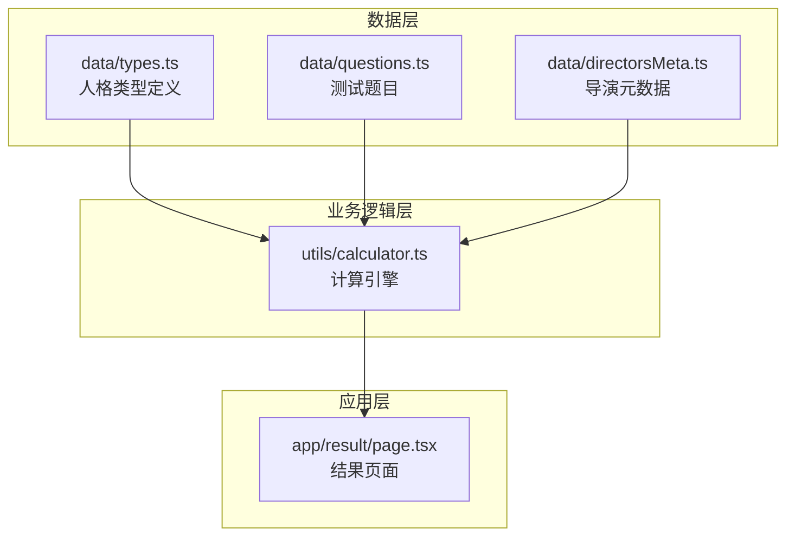
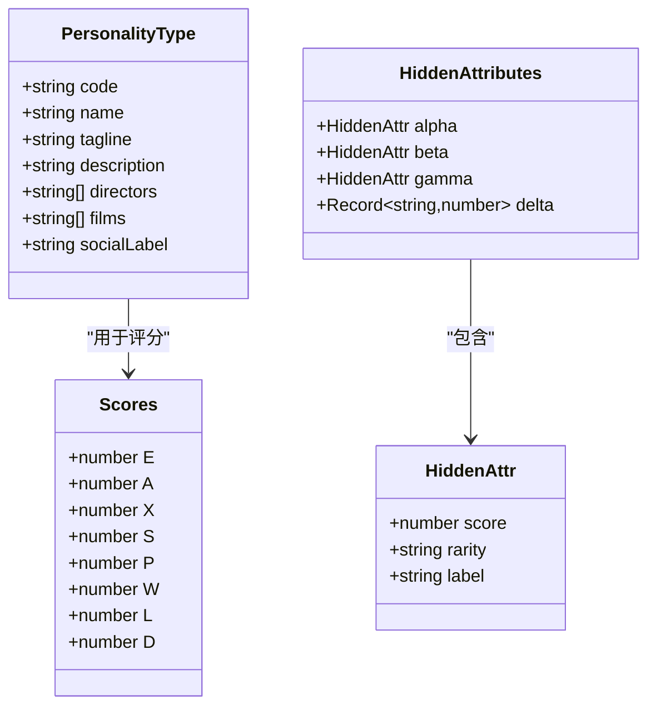
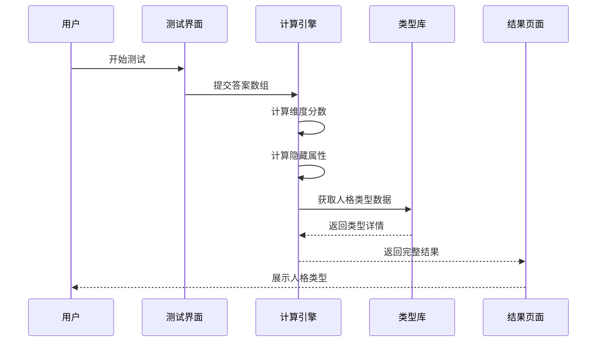
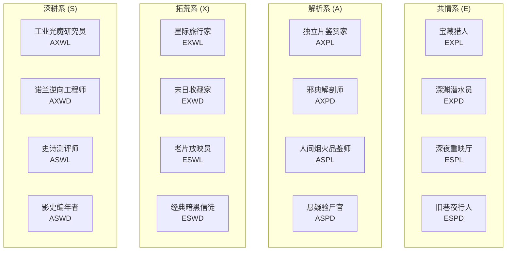
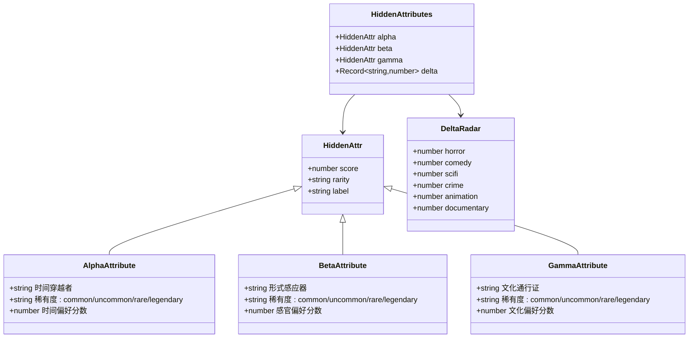
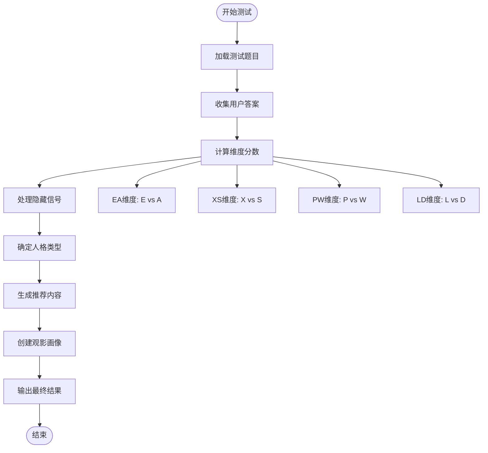
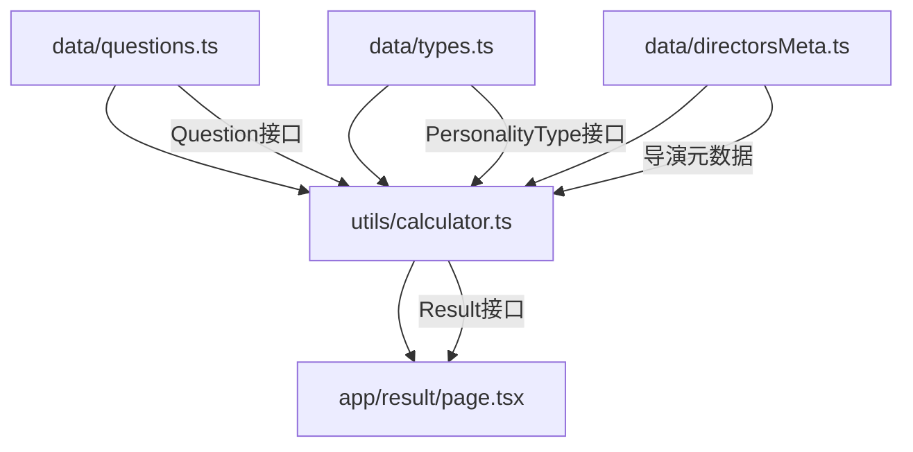
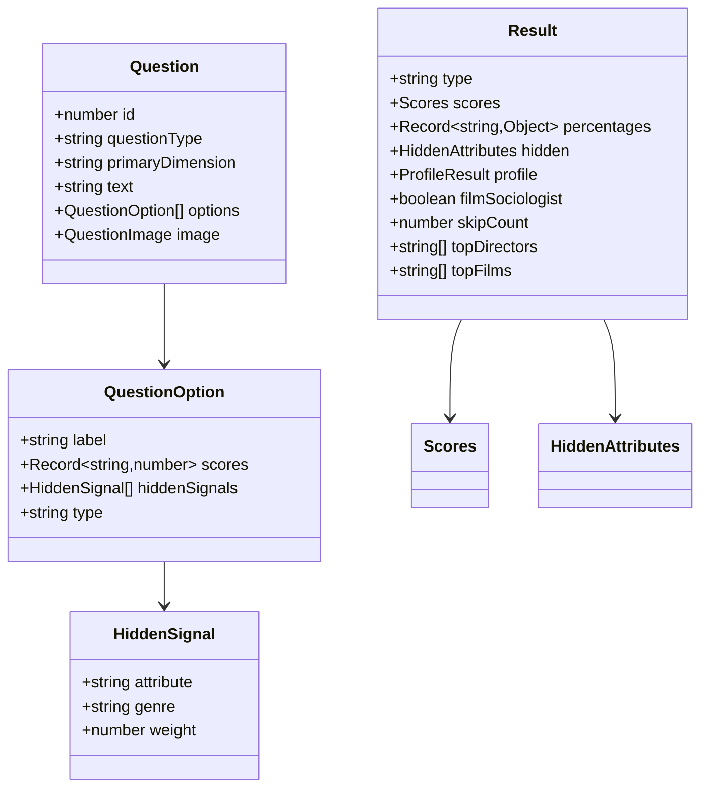

# 人格类型定义

<cite>
**本文档引用的文件**
- [types.ts](file://data/types.ts)
- [questions.ts](file://data/questions.ts)
- [calculator.ts](file://utils/calculator.ts)
- [directorsMeta.ts](file://data/directorsMeta.ts)
- [page.tsx](file://app/result/page.tsx)
</cite>

## 目录
1. [简介](#简介)
2. [项目结构](#项目结构)
3. [核心组件](#核心组件)
4. [架构概览](#架构概览)
5. [详细组件分析](#详细组件分析)
6. [依赖关系分析](#依赖关系分析)
7. [性能考虑](#性能考虑)
8. [故障排除指南](#故障排除指南)
9. [结论](#结论)
10. [附录](#附录)

## 简介
FBTI（Film Buff Type Indicator）项目是一个基于16种电影人格类型的个性化电影推荐系统。该项目通过四个核心维度（EA、XS、PW、LD）的组合，为用户提供个性化的电影人格类型识别，并结合隐藏属性系统提供深度的观影洞察。

## 项目结构
项目采用模块化架构，主要包含以下核心模块：

**图表来源**
- [types.ts:1-428](file://data/types.ts#L1-L428)
- [questions.ts:44-1867](file://data/questions.ts#L44-L1867)
- [calculator.ts:1-504](file://utils/calculator.ts#L1-L504)

**章节来源**
- [types.ts:1-428](file://data/types.ts#L1-L428)
- [questions.ts:44-1867](file://data/questions.ts#L44-L1867)
- [calculator.ts:1-504](file://utils/calculator.ts#L1-L504)

## 核心组件

### 人格类型接口定义
PersonalityType接口定义了电影人格类型的核心结构：

**图表来源**
- [types.ts:1-9](file://data/types.ts#L1-L9)
- [calculator.ts:5-41](file://utils/calculator.ts#L5-L41)

### 四大维度系统
FBTI项目采用四维人格分析系统：

| 维度 | 缩写 | 含义 | 极端表现 |
|------|------|------|----------|
| EA | 感知模式 | E-共情 vs A-解析 | 情感共鸣 vs 理性分析 |
| XS | 探索方式 | X-拓荒 vs S-深耕 | 跨界探索 vs 专业深耕 |
| PW | 叙事引力 | P-微光 vs W-广角 | 个人特写 vs 宏观全景 |
| LD | 影调趋向 | L-向阳 vs D-逐暗 | 温暖希望 vs 黑暗现实 |

**章节来源**
- [calculator.ts:235-444](file://utils/calculator.ts#L235-L444)
- [page.tsx:17-42](file://app/result/page.tsx#L17-L42)

## 架构概览

### 数据流架构

**图表来源**
- [calculator.ts:235-444](file://utils/calculator.ts#L235-L444)
- [page.tsx:64-148](file://app/result/page.tsx#L64-L148)

### 16种人格类型矩阵

**图表来源**
- [types.ts:11-427](file://data/types.ts#L11-L427)

**章节来源**
- [types.ts:11-427](file://data/types.ts#L11-L427)

## 详细组件分析

### 人格类型数据模型

#### 共情系 (E) 类型
共情系类型强调情感体验和人文关怀：

| 类型 | 代码 | 特征关键词 | 主要导演 | 代表作品 |
|------|------|------------|----------|----------|
| 宝藏猎人 | EXPL | 温暖小片、真实温度 | 是枝裕和、侯孝贤 | 小偷家族、海街日记 |
| 深渊潜水员 | EXPD | 暗黑题材、探索欲望 | 拉斯·冯·提尔、朴赞郁 | 仲夏夜惊魂、老男孩 |
| 深夜重映厅 | ESPL | 经典重看、情感安全 | 宫崎骏、是枝裕和 | 龙猫、情书 |
| 旧巷夜行人 | ESPD | 暗色调、经典作品 | 王家卫、大卫·林奇 | 花样年华、穆赫兰道 |

#### 解析系 (A) 类型
解析系类型注重技术分析和学术研究：

| 类型 | 代码 | 特征关键词 | 主要导演 | 代表作品 |
|------|------|------------|----------|----------|
| 独立片鉴赏家 | AXPL | 叙事密码、技术分析 | 理查德·林克莱特、格蕾塔·葛韦格 | 爱在黎明破晓前、伯德小姐 |
| 邪典解剖师 | AXPD | 邪典cult、智力玩具 | 园子温、大卫·柯南伯格 | 亡命驾驶、切肤之爱 |
| 人间烟火品鉴师 | ASPL | 品味年份、细分领域 | 小津安二郎、许鞍华 | 东京物语、桃姐 |
| 悬疑验尸官 | ASPD | 悬疑考古、反转分析 | 希区柯克、大卫·芬奇 | 迷魂记、消失的爱人 |

#### 拓荒系 (X) 类型
拓荒系类型追求跨界探索和多元体验：

| 类型 | 代码 | 特征关键词 | 主要导演 | 代表作品 |
|------|------|------------|----------|----------|
| 星际旅行家 | EXWL | 宏大叙事、世界探索 | 斯皮尔伯格、吉尔莫·德尔·托罗 | 银翼杀手2049、潘神的迷宫 |
| 末日收藏家 | EXWD | 反乌托邦、文明崩塌 | 奉俊昊、雷德利·斯科特 | 寄生虫、银翼杀手 |
| 老片放映员 | ESWL | 经典重看、时间验证 | 弗兰克·德拉邦特、罗伯特·泽米吉斯 | 肖申克的救赎、阿甘正传 |
| 经典暗黑信徒 | ESWD | 暗黑史诗、经典重读 | 科波拉、斯科塞斯 | 教父、好家伙 |

#### 深耕系 (S) 类型
深耕系类型专注于专业领域和深度研究：

| 类型 | 代码 | 特征关键词 | 主要导演 | 代表作品 |
|------|------|------------|----------|----------|
| 工业光魔研究员 | AXWL | 技术细节、特效分析 | 詹姆斯·卡梅隆、彼得·杰克逊 | 阿凡达、指环王3 |
| 诺兰逆向工程师 | AXWD | 复杂叙事、智力挑战 | 克里斯托弗·诺兰、大卫·芬奇 | 信条、搏击俱乐部 |
| 史诗测评师 | ASWL | 综合评分、技术分析 | 库布里克、里恩 | 2001太空漫游、阿拉伯的劳伦斯 |
| 影史编年者 | ASWD | 影史脉络、流派传承 | 弗里茨·朗、安德烈·塔可夫斯基 | 大都会、潜行者 |

**章节来源**
- [types.ts:11-427](file://data/types.ts#L11-L427)

### 隐藏属性系统

隐藏属性系统提供深度的个性化洞察，包含四个维度：

**图表来源**
- [calculator.ts:16-21](file://utils/calculator.ts#L16-L21)
- [calculator.ts:43-62](file://utils/calculator.ts#L43-L62)

#### 隐藏属性详解

| 属性 | 符号 | 含义 | 稀有度等级 | 影响范围 |
|------|------|------|------------|----------|
| α | 时间穿越者 | 对经典/历史电影的偏好程度 | 2-5(罕见) 5-8(稀有) 8+(传奇) | 时代偏好、经典重读 |
| β | 形式感应器 | 对电影技术层面的关注程度 | 3-7(罕见) 7-12(稀有) 12+(传奇) | 技术分析、视听偏好 |
| γ | 文化通行证 | 对国际/非主流电影的接受程度 | 1-3(罕见) 3-5(稀有) 5+(传奇) | 文化多样性、地域偏好 |
| δ | 类型基因雷达 | 对特定电影类型的敏感度 | 按类型计分 | 流派偏好、类型敏感度 |

**章节来源**
- [calculator.ts:16-62](file://utils/calculator.ts#L16-L62)
- [directorsMeta.ts:22-116](file://data/directorsMeta.ts#L22-L116)

### 计算引擎工作流程

**图表来源**
- [calculator.ts:235-444](file://utils/calculator.ts#L235-L444)

**章节来源**
- [calculator.ts:235-444](file://utils/calculator.ts#L235-L444)

## 依赖关系分析

### 数据依赖关系

**图表来源**
- [questions.ts:33-42](file://data/questions.ts#L33-L42)
- [types.ts:1-9](file://data/types.ts#L1-L9)
- [directorsMeta.ts:5-11](file://data/directorsMeta.ts#L5-L11)

### 关键接口关系

**图表来源**
- [questions.ts:33-42](file://data/questions.ts#L33-L42)
- [questions.ts:26-31](file://data/questions.ts#L26-L31)
- [questions.ts:1-5](file://data/questions.ts#L1-L5)
- [calculator.ts:31-41](file://utils/calculator.ts#L31-L41)

**章节来源**
- [questions.ts:1-42](file://data/questions.ts#L1-L42)
- [calculator.ts:31-41](file://utils/calculator.ts#L31-L41)

## 性能考虑

### 计算复杂度分析
- **评分计算**: O(n) - n为题目数量，每个题目进行常数时间的分数累加
- **隐藏属性计算**: O(m) - m为隐藏信号数量，按权重累加
- **类型确定**: O(1) - 四个维度的简单比较操作
- **推荐生成**: O(k log k) - k为类型导演/电影数量，使用排序算法

### 优化策略
1. **缓存机制**: 已计算的结果可缓存到sessionStorage避免重复计算
2. **增量更新**: 隐藏属性按需更新，避免全量重算
3. **懒加载**: 推荐内容按需加载，提升首屏性能
4. **内存管理**: 及时清理不再使用的中间结果

## 故障排除指南

### 常见问题及解决方案

#### 1. 结果计算异常
**症状**: 计算结果为空或显示错误
**原因**: 
- 未正确提交答案数组
- 题目数据格式错误
- session存储损坏

**解决方法**:
- 检查答案数组格式是否符合AnswerEntry结构
- 验证题目ID与选项索引的有效性
- 清除sessionStorage中的fbti_result数据

#### 2. 隐藏属性显示异常
**症状**: 隐藏属性分数显示为负数或异常值
**原因**: 
- 隐藏信号权重计算错误
- 分数归一化过程异常

**解决方法**:
- 检查hiddenSignals数组中的weight值
- 验证normalizeScore函数的阈值设置
- 确认分数截断逻辑(最小值为0)

#### 3. 推荐内容不准确
**症状**: 推荐的导演或电影与用户偏好不符
**原因**:
- 隐藏属性权重分配不合理
- 导演/电影元数据缺失
- 归一化参数设置不当

**解决方法**:
- 调整hidden属性的权重系数
- 补充缺失的导演/电影元数据
- 优化normalizeScore函数的阈值

**章节来源**
- [calculator.ts:346-352](file://utils/calculator.ts#L346-L352)
- [calculator.ts:499-503](file://utils/calculator.ts#L499-L503)

## 结论
FBTI项目通过精心设计的四维人格分析系统和隐藏属性机制，为用户提供了深度个性化的电影体验。16种人格类型的划分不仅体现了电影欣赏的不同维度，还通过隐藏属性系统揭示了用户的深层偏好。该系统具有良好的扩展性，可以进一步丰富人格类型、优化计算算法，并增强用户体验。

## 附录

### 实际应用场景示例

#### 场景1：新用户测试
1. 用户访问测试页面，回答14道EA维度题目
2. 系统计算情感偏好分数
3. 用户继续回答14道XS维度题目
4. 系统计算探索方式分数
5. 重复PW和LD维度的测试
6. 系统生成最终人格类型和推荐内容

#### 场景2：个性化推荐
1. 系统根据隐藏属性调整推荐权重
2. 使用导演元数据进行风格匹配
3. 结合电影元数据进行时代偏好匹配
4. 输出Top 3导演和Top 3电影推荐

#### 场景3：社交分享
1. 用户生成分享卡片
2. 系统渲染包含所有个人信息的海报
3. 支持下载高清PNG格式分享

**章节来源**
- [page.tsx:64-461](file://app/result/page.tsx#L64-L461)