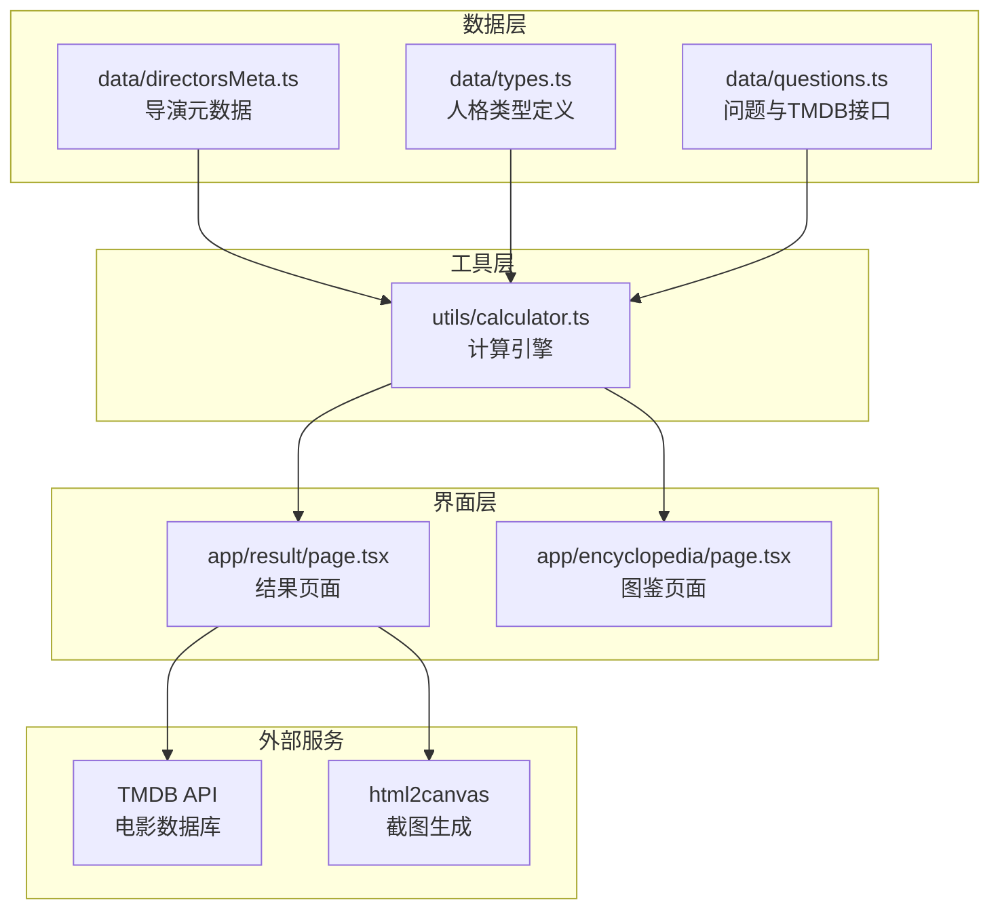
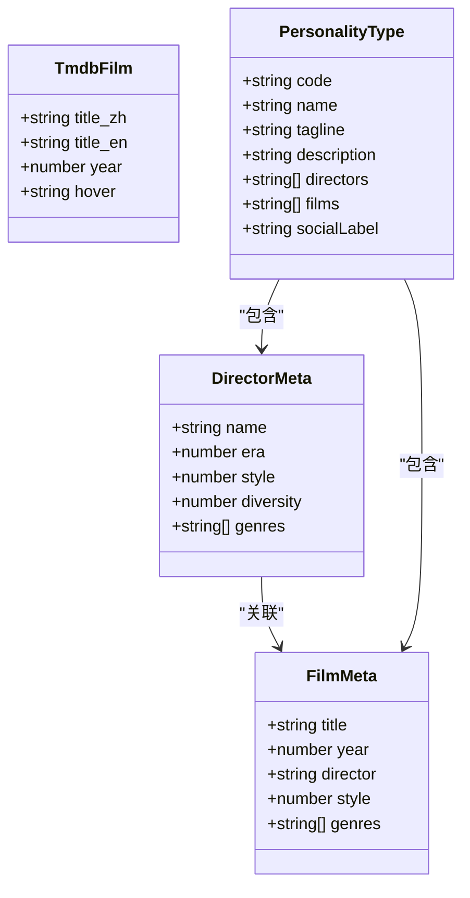
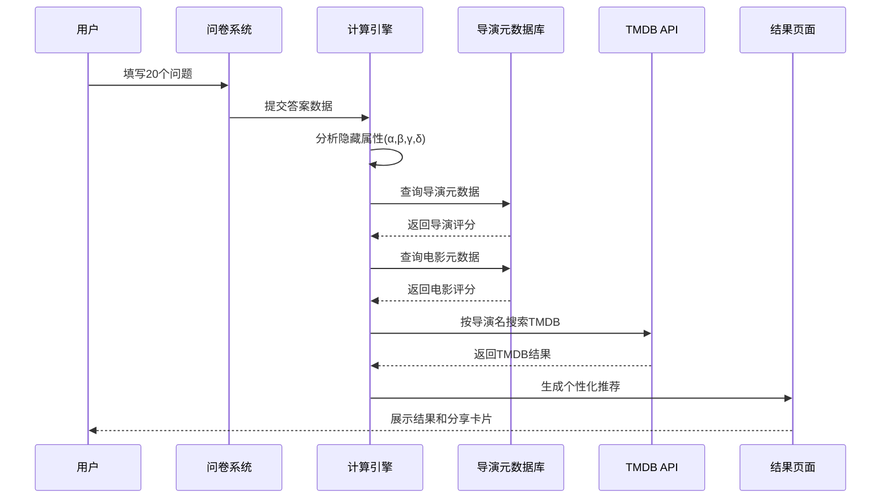
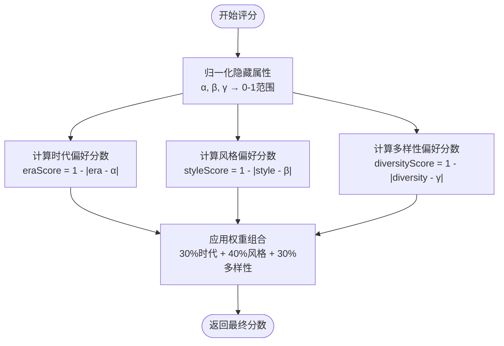
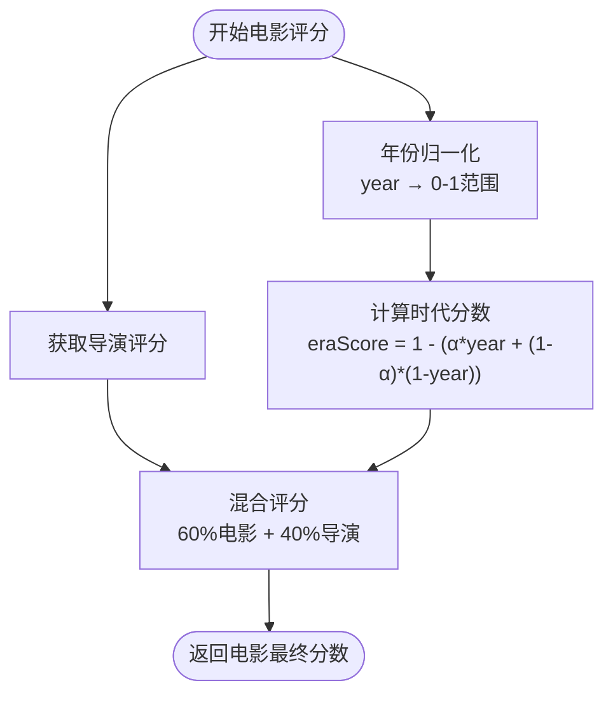
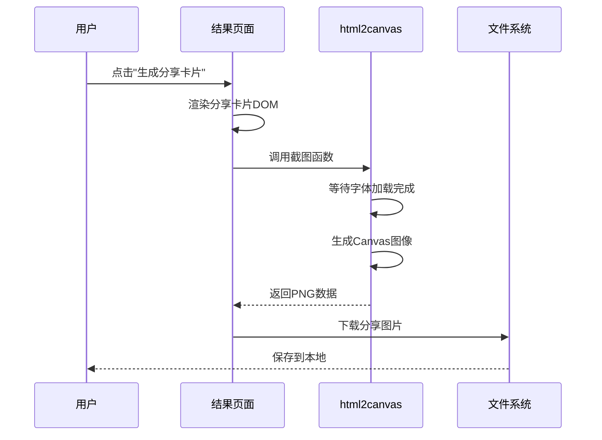
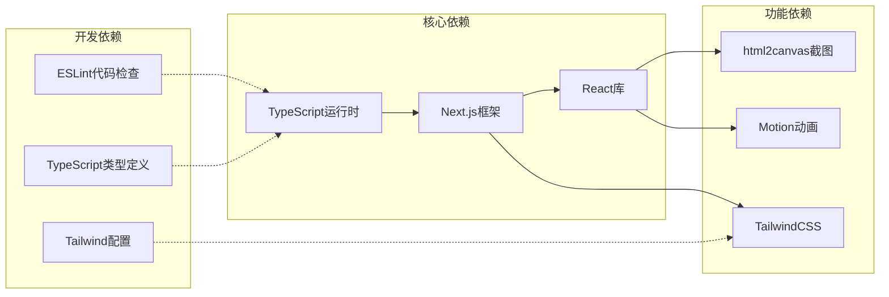

# 导演元数据结构

<cite>
**本文档引用的文件**
- [data/directorsMeta.ts](file://data/directorsMeta.ts)
- [data/types.ts](file://data/types.ts)
- [data/questions.ts](file://data/questions.ts)
- [utils/calculator.ts](file://utils/calculator.ts)
- [app/result/page.tsx](file://app/result/page.tsx)
- [package.json](file://package.json)
</cite>

## 目录
1. [简介](#简介)
2. [项目结构](#项目结构)
3. [核心组件](#核心组件)
4. [架构概览](#架构概览)
5. [详细组件分析](#详细组件分析)
6. [依赖分析](#依赖分析)
7. [性能考虑](#性能考虑)
8. [故障排除指南](#故障排除指南)
9. [结论](#结论)
10. [附录](#附录)

## 简介

FBTI项目通过深度分析用户的观影偏好，生成个性化的电影人格画像。导演元数据结构是整个系统的核心基础，它定义了如何描述和筛选导演及其作品，为个性化推荐提供数据支撑。

该项目采用四维人格理论，通过20个关键问题评估用户在以下四个维度上的倾向：
- EA维度：共情（E）vs 解析（A）
- XS维度：拓荒（X）vs 深耕（S）  
- PW维度：微光（P）vs 广角（W）
- LD维度：向阳（L）vs 逐暗（D）

## 项目结构

**图表来源**
- [data/directorsMeta.ts:1-279](file://data/directorsMeta.ts#L1-L279)
- [utils/calculator.ts:1-504](file://utils/calculator.ts#L1-L504)
- [app/result/page.tsx:1-923](file://app/result/page.tsx#L1-L923)

**章节来源**
- [data/directorsMeta.ts:1-279](file://data/directorsMeta.ts#L1-L279)
- [utils/calculator.ts:1-504](file://utils/calculator.ts#L1-L504)
- [app/result/page.tsx:1-923](file://app/result/page.tsx#L1-L923)

## 核心组件

### 导演元数据接口设计

导演元数据结构采用简洁而强大的设计，支持精确的个性化推荐：

**图表来源**
- [data/directorsMeta.ts:5-19](file://data/directorsMeta.ts#L5-L19)
- [data/questions.ts:7-12](file://data/questions.ts#L7-L12)
- [data/types.ts:1-9](file://data/types.ts#L1-L9)

### 数据模型特点

1. **多维度评分系统**：每个导演和电影都具备三个核心维度的数值化特征
2. **层次化组织**：支持按人格类型进行分组管理
3. **可扩展性设计**：预留了类型标签和社交标签字段
4. **国际化支持**：TMDB接口同时支持中英文标题

**章节来源**
- [data/directorsMeta.ts:1-279](file://data/directorsMeta.ts#L1-L279)
- [data/questions.ts:7-12](file://data/questions.ts#L7-L12)

## 架构概览

**图表来源**
- [utils/calculator.ts:446-493](file://utils/calculator.ts#L446-L493)
- [data/directorsMeta.ts:242-278](file://data/directorsMeta.ts#L242-L278)
- [app/result/page.tsx:305-316](file://app/result/page.tsx#L305-L316)

## 详细组件分析

### 导演元数据评分算法

评分算法是整个系统的核心，它将用户的隐藏属性与导演特征进行匹配：

**图表来源**
- [data/directorsMeta.ts:242-259](file://data/directorsMeta.ts#L242-L259)

评分算法的关键特性：
- **时代偏好**：α值越高，越偏好经典导演（1970年前）
- **风格偏好**：β值越高，越偏好形式主义导演
- **多样性偏好**：γ值越高，越偏好国际/独立电影导演
- **权重分配**：时代30% + 风格40% + 多样性30%

**章节来源**
- [data/directorsMeta.ts:235-278](file://data/directorsMeta.ts#L235-L278)

### 电影元数据评分算法

电影评分在导演评分基础上增加年份因素：

**图表来源**
- [data/directorsMeta.ts:265-278](file://data/directorsMeta.ts#L265-L278)

**章节来源**
- [data/directorsMeta.ts:261-278](file://data/directorsMeta.ts#L261-L278)

### TMDB接口设计

TMDB接口为个性化推荐提供了强大的外部数据源：

| 字段名称 | 类型 | 描述 | 示例 |
|---------|------|------|------|
| title_zh | string | 中文标题 | "寄生虫" |
| title_en | string | 英文标题 | "Parasite" |
| year | number | 上映年份 | 2019 |
| hover | string | 悬停提示文本 | "韩国社会讽刺喜剧" |

**章节来源**
- [data/questions.ts:7-12](file://data/questions.ts#L7-L12)

### 社交分享功能

社交分享功能通过html2canvas将结果页面转换为高质量图片：

**图表来源**
- [app/result/page.tsx:102-134](file://app/result/page.tsx#L102-L134)
- [package.json:13](file://package.json#L13)

**章节来源**
- [app/result/page.tsx:102-134](file://app/result/page.tsx#L102-L134)
- [package.json:13](file://package.json#L13)

## 依赖分析

**图表来源**
- [package.json:11-29](file://package.json#L11-L29)

**章节来源**
- [package.json:11-29](file://package.json#L11-L29)

## 性能考虑

### 缓存策略

1. **会话存储缓存**：结果数据存储在sessionStorage中，避免重复计算
2. **静态数据缓存**：导演和电影元数据作为静态常量，无需网络请求
3. **字体延迟加载**：分享卡片中字体等待加载完成，确保截图质量

### 性能优化建议

1. **懒加载模块**：将html2canvas等重型库按需加载
2. **图片优化**：使用WebP格式和适当的尺寸
3. **内存管理**：及时清理DOM引用和事件监听器

## 故障排除指南

### 常见问题及解决方案

| 问题类型 | 症状 | 解决方案 |
|---------|------|----------|
| 分享卡片空白 | 生成的图片是空白 | 检查DOM元素是否正确渲染，确认字体加载完成 |
| 导航异常 | 页面跳转到首页 | 检查sessionStorage中是否有fbti_result数据 |
| 评分异常 | 推荐结果不符合预期 | 验证隐藏属性归一化逻辑，检查权重设置 |
| TMDB链接失效 | 点击导演名无法跳转 | 检查TMDB搜索URL格式，确认网络连接正常 |

**章节来源**
- [app/result/page.tsx:102-134](file://app/result/page.tsx#L102-L134)

## 结论

FBTI项目的导演元数据结构设计体现了数据驱动的个性化推荐理念。通过精心设计的评分算法和完善的元数据模型，系统能够：

1. **精确刻画用户偏好**：通过四个隐藏属性全面描述用户的观影倾向
2. **智能匹配导演资源**：基于多维度评分实现精准的导演和电影推荐
3. **提供优质的用户体验**：结合社交分享功能增强用户参与度
4. **保持系统的可扩展性**：模块化设计便于后续功能扩展

这套元数据结构为构建专业的电影推荐系统奠定了坚实的基础。

## 附录

### 扩展新导演元数据的指导原则

1. **数据完整性**：确保每个字段都有合理值
2. **一致性原则**：保持评分范围和含义的一致性
3. **代表性原则**：选择具有典型特征的导演作为样本
4. **可验证性**：评分应能通过实际作品得到验证

### 最佳实践

1. **定期更新数据**：随着新导演出现及时补充元数据
2. **质量控制**：建立数据审核机制，确保评分准确性
3. **A/B测试**：对新的评分规则进行实验验证
4. **用户反馈**：收集用户对推荐结果的反馈，持续优化算法