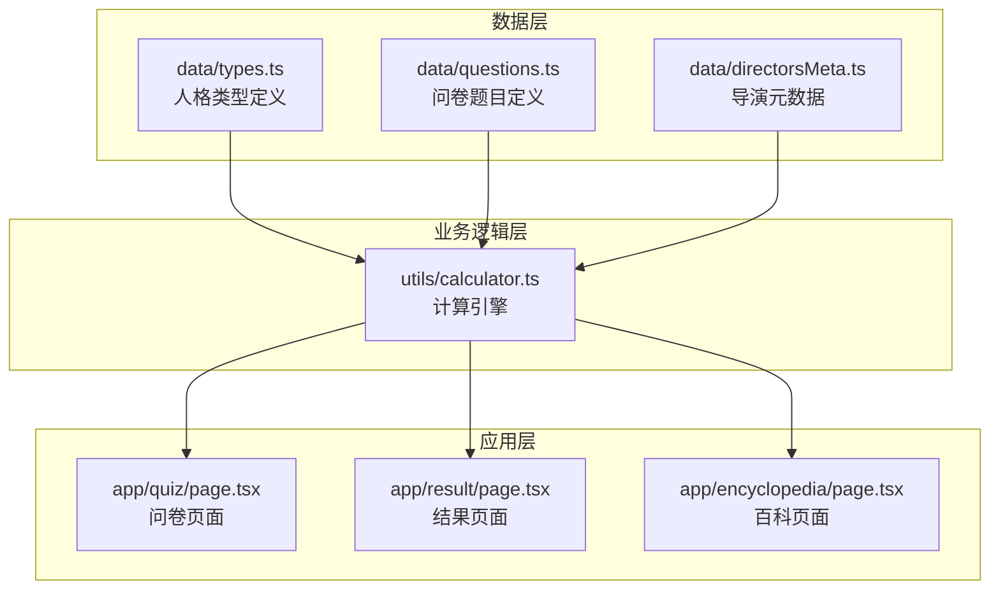
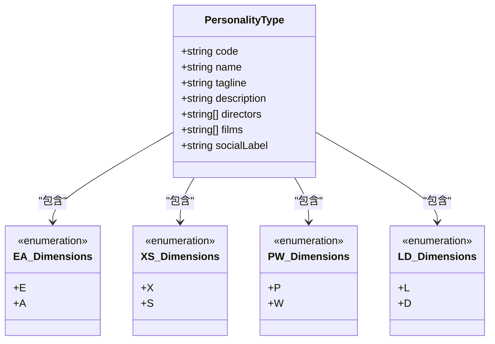
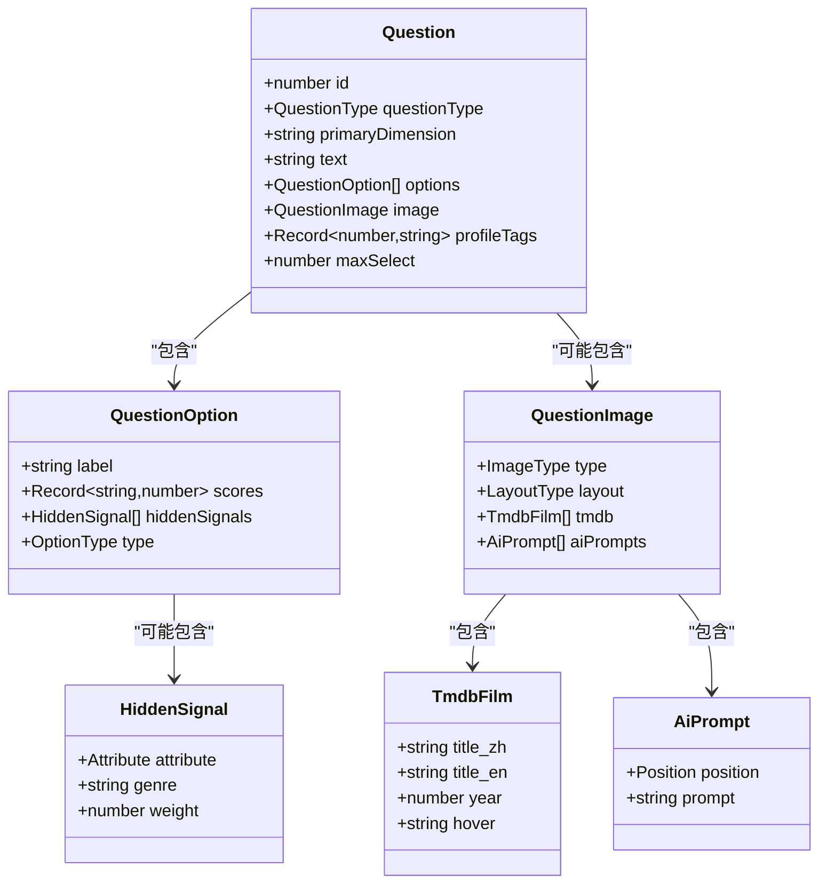
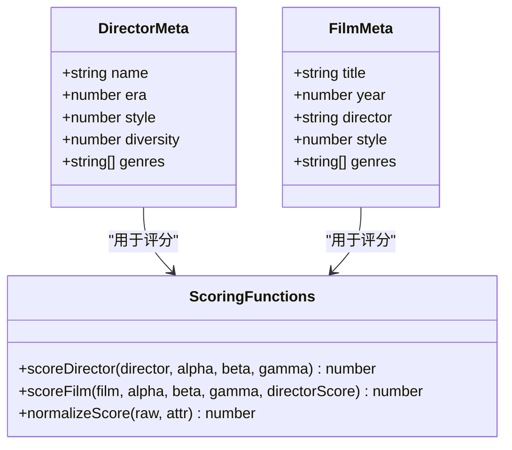
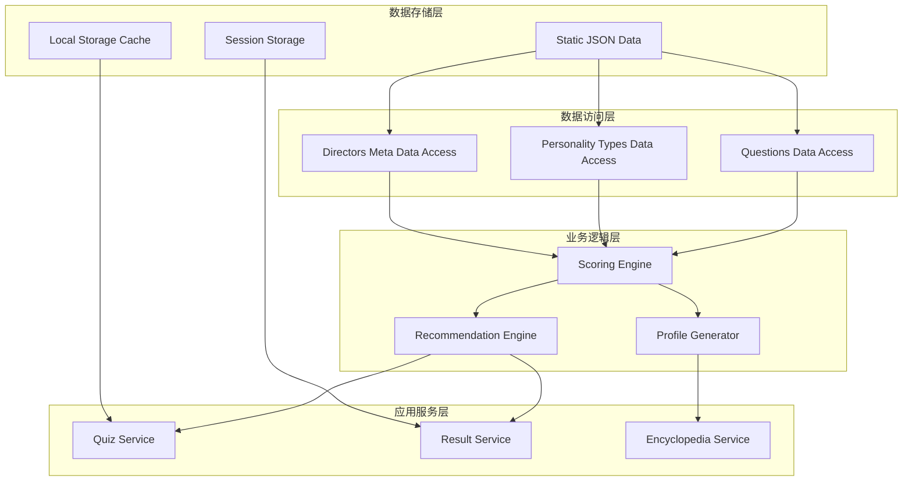
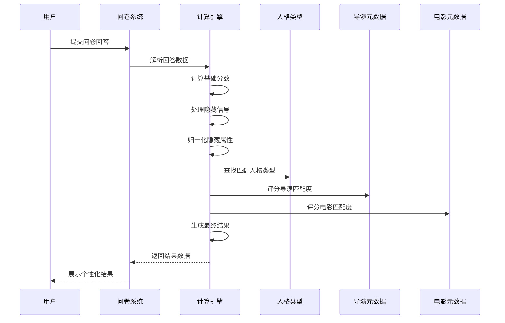
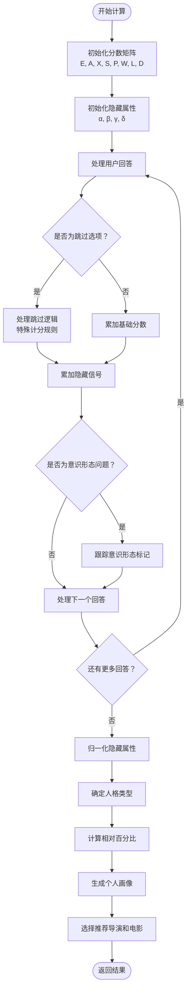
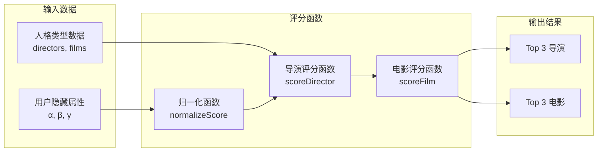
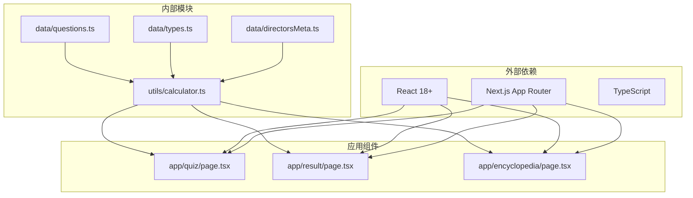
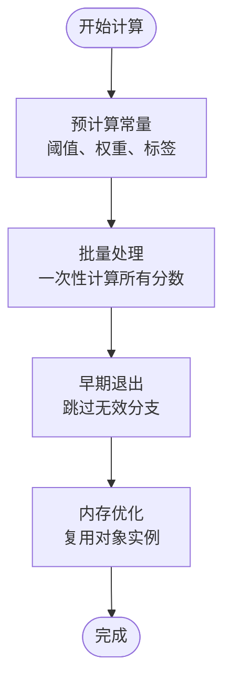

# 数据模型设计

<cite>
**本文档引用的文件**
- [data/types.ts](file://data/types.ts)
- [data/questions.ts](file://data/questions.ts)
- [data/directorsMeta.ts](file://data/directorsMeta.ts)
- [utils/calculator.ts](file://utils/calculator.ts)
</cite>

## 目录
1. [简介](#简介)
2. [项目结构](#项目结构)
3. [核心组件](#核心组件)
4. [架构概览](#架构概览)
5. [详细组件分析](#详细组件分析)
6. [依赖分析](#依赖分析)
7. [性能考虑](#性能考虑)
8. [故障排除指南](#故障排除指南)
9. [结论](#结论)
10. [附录](#附录)

## 简介

FBTI（电影人格测试）项目是一个基于问卷调查的电影偏好分析系统。该项目通过42道精心设计的问题，收集用户的电影观看偏好数据，运用复杂的评分算法生成个性化的电影人格类型，并提供相应的电影推荐。

本项目采用四维人格理论框架，将用户分为8种不同的电影人格类型，每种类型都对应独特的电影偏好模式和观影体验。系统不仅能够识别用户的电影偏好，还能深入分析用户的隐藏属性（α、β、γ、δ），为用户提供个性化的电影推荐和观影建议。

## 项目结构

项目采用模块化设计，主要包含以下核心模块：



**图表来源**
- [data/types.ts:1-428](file://data/types.ts#L1-L428)
- [data/questions.ts:1-1867](file://data/questions.ts#L1-L1867)
- [data/directorsMeta.ts:1-279](file://data/directorsMeta.ts#L1-L279)
- [utils/calculator.ts:1-504](file://utils/calculator.ts#L1-L504)

**章节来源**
- [data/types.ts:1-428](file://data/types.ts#L1-L428)
- [data/questions.ts:1-1867](file://data/questions.ts#L1-L1867)
- [data/directorsMeta.ts:1-279](file://data/directorsMeta.ts#L1-L279)
- [utils/calculator.ts:1-504](file://utils/calculator.ts#L1-L504)

## 核心组件

### 人格类型模型

系统定义了8种核心人格类型，每种类型都有其独特的特征和偏好模式：



**图表来源**
- [data/types.ts:1-428](file://data/types.ts#L1-L428)

每种人格类型都包含以下关键字段：
- **code**: 类型代码（如 EXPL、ESPD 等）
- **name**: 类型名称（如 "宝藏猎人"、"旧巷夜行人"）
- **tagline**: 类型标语
- **description**: 详细描述
- **directors**: 匹配的导演列表
- **films**: 匹配的电影列表
- **socialLabel**: 社交标签描述

**章节来源**
- [data/types.ts:1-428](file://data/types.ts#L1-L428)

### 问卷数据模型

问卷系统采用灵活的数据结构，支持多种题型和复杂的数据关联：



**图表来源**
- [data/questions.ts:1-1867](file://data/questions.ts#L1-L1867)

**章节来源**
- [data/questions.ts:1-1867](file://data/questions.ts#L1-L1867)

### 导演元数据模型

导演和电影元数据采用统一的评分系统，支持基于隐藏属性的智能推荐：



**图表来源**
- [data/directorsMeta.ts:1-279](file://data/directorsMeta.ts#L1-L279)

**章节来源**
- [data/directorsMeta.ts:1-279](file://data/directorsMeta.ts#L1-L279)

## 架构概览

系统采用分层架构设计，确保数据模型的清晰分离和业务逻辑的可维护性：



**图表来源**
- [utils/calculator.ts:1-504](file://utils/calculator.ts#L1-L504)
- [data/questions.ts:1-1867](file://data/questions.ts#L1-L1867)
- [data/types.ts:1-428](file://data/types.ts#L1-L428)
- [data/directorsMeta.ts:1-279](file://data/directorsMeta.ts#L1-L279)

## 详细组件分析

### 计算引擎分析

计算引擎是系统的核心，负责处理用户回答并生成最终结果：



**图表来源**
- [utils/calculator.ts:235-444](file://utils/calculator.ts#L235-L444)

#### 分数计算流程

系统采用多维度评分机制，每个问题的回答都会影响不同的维度分数：



**图表来源**
- [utils/calculator.ts:269-444](file://utils/calculator.ts#L269-L444)

**章节来源**
- [utils/calculator.ts:1-504](file://utils/calculator.ts#L1-L504)

### 隐藏属性系统

隐藏属性系统是FBTI的独特创新，通过四个维度深入分析用户的电影偏好：

| 属性 | 含义 | 计分范围 | 稀有度等级 |
|------|------|----------|------------|
| α (Alpha) | 时代偏好 | 0-10 | 常见/不常见/稀有/传奇 |
| β (Beta) | 技术偏好 | 0-15 | 常见/不常见/稀有/传奇 |
| γ (Gamma) | 地域偏好 | 0-8 | 常见/不常见/稀有/传奇 |
| δ (Delta) | 类型偏好 | 0-∞ | 无稀有度分级 |

**章节来源**
- [utils/calculator.ts:16-21](file://utils/calculator.ts#L16-L21)
- [utils/calculator.ts:43-76](file://utils/calculator.ts#L43-L76)

### 推荐算法分析

系统采用混合推荐策略，结合用户的人格类型和隐藏属性进行智能推荐：



**图表来源**
- [data/directorsMeta.ts:242-279](file://data/directorsMeta.ts#L242-L279)
- [utils/calculator.ts:450-493](file://utils/calculator.ts#L450-L493)

**章节来源**
- [data/directorsMeta.ts:235-279](file://data/directorsMeta.ts#L235-L279)
- [utils/calculator.ts:446-493](file://utils/calculator.ts#L446-L493)

## 依赖分析

系统采用松耦合设计，各模块间的依赖关系清晰明确：



**图表来源**
- [data/questions.ts:1-1867](file://data/questions.ts#L1-L1867)
- [data/types.ts:1-428](file://data/types.ts#L1-L428)
- [data/directorsMeta.ts:1-279](file://data/directorsMeta.ts#L1-L279)
- [utils/calculator.ts:1-504](file://utils/calculator.ts#L1-L504)

**章节来源**
- [data/questions.ts:1-1867](file://data/questions.ts#L1-L1867)
- [data/types.ts:1-428](file://data/types.ts#L1-L428)
- [data/directorsMeta.ts:1-279](file://data/directorsMeta.ts#L1-L279)
- [utils/calculator.ts:1-504](file://utils/calculator.ts#L1-L504)

## 性能考虑

### 数据结构优化

系统采用静态数据文件设计，具有以下性能优势：

1. **内存效率**: 所有数据在应用启动时加载到内存，避免重复IO操作
2. **查询速度**: 使用对象查找而非数组遍历，时间复杂度O(1)
3. **缓存友好**: 数据结构扁平化，减少嵌套层级

### 计算优化策略



**章节来源**
- [utils/calculator.ts:43-76](file://utils/calculator.ts#L43-L76)
- [utils/calculator.ts:499-503](file://utils/calculator.ts#L499-L503)

### 缓存策略

系统实现多层次缓存机制：

1. **静态数据缓存**: 问卷、人格类型、导演元数据在应用启动时缓存
2. **计算结果缓存**: 用户结果在本地存储中缓存，避免重复计算
3. **推荐结果缓存**: 导航和百科页面的推荐结果使用客户端缓存

## 故障排除指南

### 常见问题诊断

| 问题类型 | 症状 | 可能原因 | 解决方案 |
|----------|------|----------|----------|
| 数据加载失败 | 页面空白或错误 | JSON格式错误 | 检查数据文件语法 |
| 计算结果异常 | 分数异常或类型错误 | 输入数据格式错误 | 验证问卷数据结构 |
| 推荐结果为空 | 导演或电影列表为空 | 隐藏属性归一化失败 | 检查归一化函数 |
| 性能问题 | 页面加载缓慢 | 数据量过大 | 实施数据分片策略 |

### 调试工具

系统提供以下调试功能：

1. **分数追踪**: 记录每个维度的详细得分过程
2. **隐藏属性监控**: 实时显示隐藏属性的计算结果
3. **推荐评分**: 显示推荐项目的详细评分来源

**章节来源**
- [utils/calculator.ts:235-444](file://utils/calculator.ts#L235-L444)

## 结论

FBTI项目的数据模型设计体现了现代Web应用的最佳实践，通过精心设计的数据结构、灵活的评分算法和智能的推荐系统，为用户提供了深度个性化的电影体验。

系统的核心优势包括：

1. **模块化设计**: 清晰的数据分离和职责划分
2. **扩展性**: 支持新类型、新问题和新元数据的添加
3. **性能优化**: 静态数据加载和智能缓存策略
4. **用户体验**: 直观的结果展示和个性化推荐

未来可以考虑的改进方向：
- 增加动态数据源支持
- 实现更复杂的机器学习推荐算法
- 添加用户反馈机制
- 扩展移动端适配

## 附录

### 数据验证规则

系统实施以下数据验证机制：

1. **类型检查**: 所有接口字段都有明确的类型定义
2. **范围验证**: 数值字段有合理的上下限
3. **完整性检查**: 关键字段不能为空
4. **一致性验证**: 相关字段间保持逻辑一致

### 示例数据结构

以下是一个典型的人格类型数据示例：

```typescript
{
  code: "EXPL",
  name: "宝藏猎人",
  tagline: "全世界的温暖小片，都是我的私人宝藏。",
  description: "你是那种在某个深夜偶然点开一部冰岛短片，看完默默流泪...",
  directors: ["是枝裕和", "阿巴斯·基亚罗斯塔米", "阿基·考里斯马基"],
  films: ["小偷家族", "樱桃的滋味", "海街日记"],
  socialLabel: "朋友圈里的宝藏片推荐官..."
}
```

### 版本管理策略

系统采用以下版本管理原则：

1. **向后兼容**: 新增字段时保持向后兼容
2. **数据迁移**: 重大变更时提供数据迁移脚本
3. **版本标注**: 在数据文件中记录版本信息
4. **回滚机制**: 支持快速回滚到之前的版本