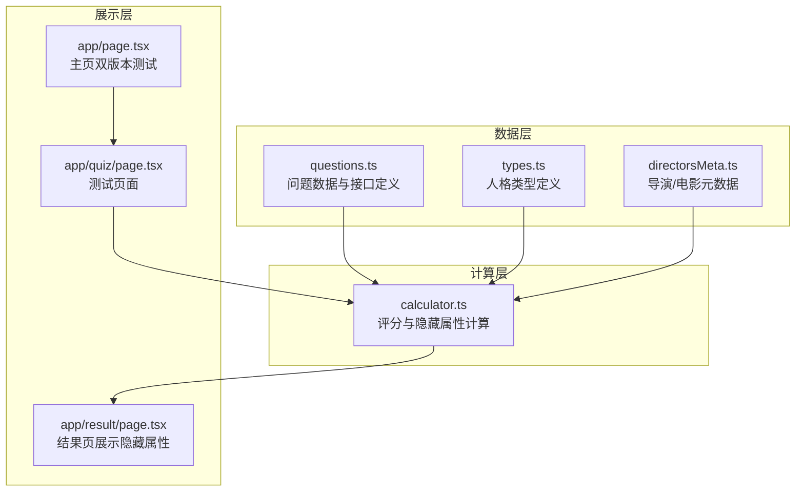
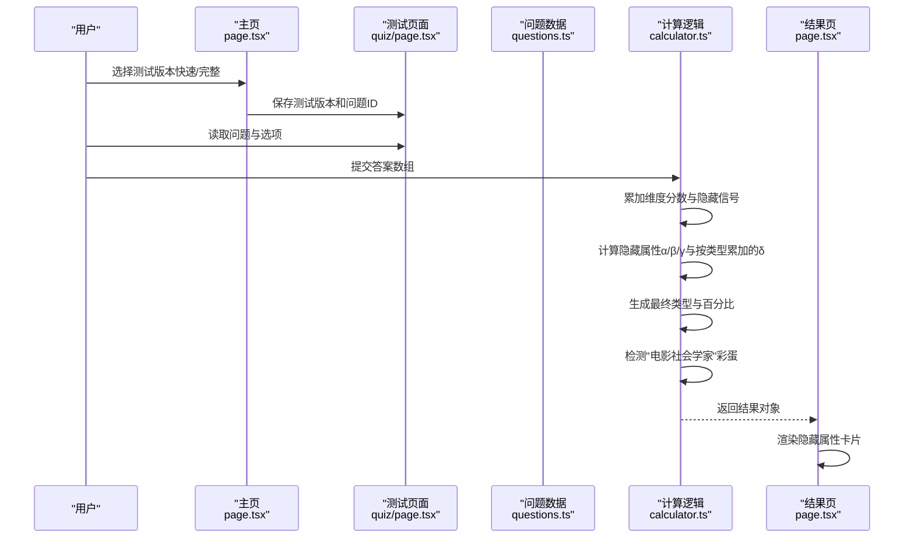
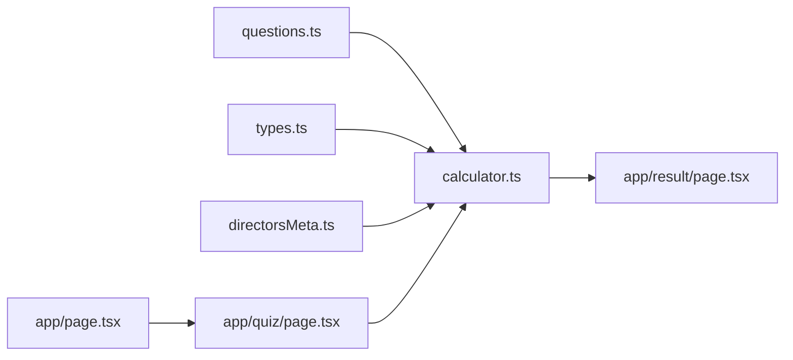

# 问题数据结构

<cite>
**本文引用的文件**
- [types.ts](file://data/types.ts)
- [questions.ts](file://data/questions.ts)
- [calculator.ts](file://utils/calculator.ts)
- [directorsMeta.ts](file://data/directorsMeta.ts)
- [page.tsx](file://app/result/page.tsx)
- [page.tsx](file://app/quiz/page.tsx)
- [page.tsx](file://app/page.tsx)
</cite>

## 更新摘要
**变更内容**
- 新增双版本测试系统（快速版24题和完整版40题）支持
- 新增电影个性分析问题（Q50-Q53）用于生成个性化推荐
- 新增"电影社会学家"彩蛋机制的实现
- 新增"电影图鉴"功能的集成
- 更新问题数据结构以支持新的测试模式

## 目录
1. [简介](#简介)
2. [项目结构](#项目结构)
3. [核心组件](#核心组件)
4. [架构概览](#架构概览)
5. [详细组件分析](#详细组件分析)
6. [双版本测试系统](#双版本测试系统)
7. [电影个性分析系统](#电影个性分析系统)
8. [依赖分析](#依赖分析)
9. [性能考虑](#性能考虑)
10. [故障排除指南](#故障排除指南)
11. [结论](#结论)

## 简介
本文件为 FBTI 项目的问题数据结构设计文档，重点阐述 Question 接口及其相关数据模型的完整字段定义，包括 QuestionOption 和 HiddenSignal 的结构设计，以及 QuestionImage 的布局系统。文档还解释了问题与四大维度（EA、XS、PW、LD）的映射关系，并说明 profileTags 和 maxSelect 等特殊字段的应用方式。通过结合实际代码示例，帮助开发者和产品人员快速理解并正确使用问题数据结构。

**更新** 本版本文档已更新以支持新增的双版本测试系统和电影个性分析功能。

## 项目结构
FBTI 项目采用按功能模块划分的组织方式：
- data 目录包含问题数据、类型定义和元数据
- utils 目录包含计算逻辑
- app 目录包含前端页面（结果页用于展示隐藏属性）

**图表来源**
- [questions.ts:1-42](file://data/questions.ts#L1-L42)
- [calculator.ts:1-41](file://utils/calculator.ts#L1-L41)
- [directorsMeta.ts:1-20](file://data/directorsMeta.ts#L1-L20)
- [page.tsx:336-372](file://app/result/page.tsx#L336-L372)
- [page.tsx:20-528](file://app/quiz/page.tsx#L20-L528)
- [page.tsx:1-137](file://app/page.tsx#L1-L137)

**章节来源**
- [questions.ts:1-42](file://data/questions.ts#L1-L42)
- [calculator.ts:1-41](file://utils/calculator.ts#L1-L41)

## 核心组件
本节概述问题数据结构的核心接口及职责：
- Question：问题实体，包含题型、主维度、文本、选项、图片、profileTags、maxSelect 等字段
- QuestionOption：问题选项，包含标签、维度分数、隐藏信号、类型
- HiddenSignal：隐藏属性信号，包含 attribute、genre、weight 三要素
- QuestionImage：问题图片，包含类型、布局、tmdb 或 aiPrompts 数据
- TmdbFilm、AiPrompt：图片资源的数据载体

**章节来源**
- [questions.ts:1-42](file://data/questions.ts#L1-L42)

## 架构概览
问题数据结构在系统中的流转如下：
- 问题数据由 data/questions.ts 提供
- 用户答题后，utils/calculator.ts 计算维度分数、隐藏属性和最终类型
- app/result/page.tsx 展示隐藏属性卡片（α、β、γ）

**图表来源**
- [questions.ts:44-1867](file://data/questions.ts#L44-L1867)
- [calculator.ts:235-444](file://utils/calculator.ts#L235-L444)
- [page.tsx:336-372](file://app/result/page.tsx#L336-L372)
- [page.tsx:20-528](file://app/quiz/page.tsx#L20-L528)
- [page.tsx:1-137](file://app/page.tsx#L1-L137)

## 详细组件分析

### Question 接口字段详解
- id：问题编号，用于定位和追踪
- questionType：问题类型，支持 binary、multi、binary_with_skip、multiSelect
- primaryDimension：主维度，支持 EA、XS、PW、LD、none
- text：问题文本
- options：选项数组，每个元素为 QuestionOption
- image：可选的图片配置，见 QuestionImage
- profileTags：可选的画像标签映射，用于结果页个性化展示
- maxSelect：可选的最大选择数，仅在 multiSelect 类型生效

**章节来源**
- [questions.ts:33-42](file://data/questions.ts#L33-L42)

### QuestionOption 接口字段详解
- label：选项文本
- scores：维度分数映射，键为维度标识（如 E、A、X、S、P、W、L、D），值为权重
- hiddenSignals：可选的隐藏信号数组，用于累积隐藏属性
- type：选项类型，substantive 表示有效选项，skip 表示跳过

**章节来源**
- [questions.ts:26-31](file://data/questions.ts#L26-L31)

### HiddenSignal 设计原理
HiddenSignal 用于在用户回答过程中累积隐藏属性，其字段含义如下：
- attribute：隐藏属性标识，取值为 α、β、γ、δ 四种之一
  - α：时间穿越者（偏好年代）
  - β：形式感应器（偏好形式/技术）
  - γ：文化通行证（偏好国际/独立）
  - δ：类型偏好（按类型累加）
- genre：可选的类型标签，当前支持 horror、comedy、scifi、crime、animation、documentary
- weight：权重，用于累计隐藏属性得分

隐藏属性的累积与归一化逻辑：
- α/β/γ 在计算器中进行归一化并映射到稀有度标签
- δ 按类型累加，最终在结果页展示

**章节来源**
- [questions.ts:1-5](file://data/questions.ts#L1-L5)
- [calculator.ts:306-329](file://utils/calculator.ts#L306-L329)
- [calculator.ts:446-453](file://utils/calculator.ts#L446-L453)
- [calculator.ts:471-473](file://utils/calculator.ts#L471-L473)
- [page.tsx:344-372](file://app/result/page.tsx#L344-L372)

### QuestionImage 布局系统
- type：图片类型，支持 tmdb 和 ai_placeholder
  - tmdb：使用 TMDB 电影数据，配合 hover 文案
  - ai_placeholder：使用 AI 提示词生成图片
- layout：布局类型，支持 single、split、grid3、grid4
- tmdb：当 type 为 tmdb 时，提供 TmdbFilm 数组
- aiPrompts：当 type 为 ai_placeholder 时，提供 AiPrompt 数组，包含 position（left/right/single）和 prompt

**章节来源**
- [questions.ts:19-24](file://data/questions.ts#L19-L24)

### 问题与四大维度的映射关系
- EA 维度：感受流 vs 拆片流（E/A）
- XS 维度：拓荒者 vs 考古者（X/S）
- PW 维度：特写镜头 vs 全景镜头（P/W）
- LD 维度：柔光 vs 硬光（L/D）

维度分数映射：
- E/A：E 与 A 两两对比
- X/S：X 与 S 两两对比
- P/W：P 与 W 两两对比
- L/D：L 与 D 两两对比

**章节来源**
- [questions.ts:35-36](file://data/questions.ts#L35-L36)
- [calculator.ts:354-379](file://utils/calculator.ts#L354-L379)

### 特殊字段：profileTags 与 maxSelect
- profileTags：用于在结果页展示画像标签，键为选项索引，值为标签字符串
- maxSelect：仅在 multiSelect 类型下生效，限制最多可选数量

**章节来源**
- [questions.ts:40-41](file://data/questions.ts#L40-L41)

### 典型问题构建示例（基于代码路径）
以下示例展示了不同类型问题的构建方式，均来源于仓库中的实际问题定义：

- binary 类型（二选一）
  - 示例路径：[binary 示例:47-105](file://data/questions.ts#L47-L105)
  - 特点：仅有两个选项，分别对应 EA 维度的 E/A 分数

- multi 类型（多选）
  - 示例路径：[multi 示例:320-350](file://data/questions.ts#L320-L350)
  - 特点：多个选项，可同时选择多个，分数按维度累加

- binary_with_skip 类型（二选一含跳过）
  - 示例路径：[binary_with_skip 示例:223-260](file://data/questions.ts#L223-L260)
  - 特点：第三个选项为 skip，不计入主维度分数；另有图片配置

- multiSelect 类型（多选且限制数量）
  - 示例路径：[multiSelect 示例:352-384](file://data/questions.ts#L352-L384)
  - 特点：设置 maxSelect 限制最多选择数量；选项中包含隐藏信号

- 带图片的问题
  - tmdb 类型：示例路径 [tmdb 图片示例:248-260](file://data/questions.ts#L248-L260)
  - ai_placeholder 类型：示例路径 [ai 图片示例:132-143](file://data/questions.ts#L132-L143)
  - split 布局：示例路径 [split 布局示例:520-535](file://data/questions.ts#L520-L535)

**章节来源**
- [questions.ts:47-105](file://data/questions.ts#L47-L105)
- [questions.ts:223-260](file://data/questions.ts#L223-L260)
- [questions.ts:352-384](file://data/questions.ts#L352-L384)
- [questions.ts:248-260](file://data/questions.ts#L248-L260)
- [questions.ts:132-143](file://data/questions.ts#L132-L143)
- [questions.ts:520-535](file://data/questions.ts#L520-L535)

## 双版本测试系统

### 快速版测试（24题）
快速版测试针对每个维度精选5道代表性问题，加上4道观影画像题，共计24题，预计用时约18分钟。

**快速版问题选择策略**：
- EA 维度：1, 2, 7, 8, 9（感受流vs拆片流的核心问题）
- XS 维度：11, 12, 16, 19, 20（拓荒者vs考古者的关键问题）
- PW 维度：21, 26, 28, 29, 30（特写镜头vs全景镜头的重要问题）
- LD 维度：31, 33, 34, 37, 40（柔光vs硬光的基础问题）
- 观影画像题：50, 51, 52, 53（生成个性化推荐）

### 完整版测试（40题）
完整版测试包含所有1867道问题，覆盖更全面的观影偏好分析，预计用时约40分钟。

### 测试版本管理
- 通过 sessionStorage 存储测试版本信息（"quick" 或 "full"）
- 通过 sessionStorage 存储问题ID数组，支持动态筛选问题
- 主页提供版本选择界面，显示预计用时和题目数量

**章节来源**
- [page.tsx:9-24](file://app/page.tsx#L9-L24)
- [page.tsx:29-34](file://app/page.tsx#L29-L34)
- [page.tsx:20-528](file://app/quiz/page.tsx#L20-L528)

## 电影个性分析系统

### 观影画像题（Q50-Q53）
新增的4道观影画像题用于生成个性化的电影推荐：

- Q50：影厅偏好（识别巨幕信徒、声控画质党、性价比玩家等）
- Q51：观影环境（影院原教旨主义者、沙发哲学家、场景切换大师等）
- Q52：观影社交（独行侠、散场话事人、集体共振追求者等）
- Q53：购票习惯（首映场占座王、随心所欲派、口碑鉴定师等）

### 个性化推荐机制
- 通过 profileTags 字段为每个选项分配标签
- 计算器根据选择的标签生成个性化的电影推荐
- 支持基于隐藏属性（α、β、γ）的导演和电影推荐

### "电影社会学家"彩蛋
检测机制：
- 识别意识形态相关问题（Q10, 27, 37, 38, 45, 46）
- 统计选择"黑暗"维度（D）的选项数量
- 当满足条件时触发"电影社会学家"彩蛋

**章节来源**
- [questions.ts:1816-1867](file://data/questions.ts#L1816-L1867)
- [calculator.ts:264-394](file://utils/calculator.ts#L264-L394)

## 依赖分析
问题数据结构与其他模块的耦合关系如下：
- data/questions.ts：提供问题数据与接口定义
- utils/calculator.ts：消费问题数据，计算维度分数、隐藏属性与最终类型
- data/directorsMeta.ts：提供导演/电影元数据，参与隐藏属性的归一化与推荐
- app/result/page.tsx：展示隐藏属性卡片（α、β、γ）
- app/quiz/page.tsx：处理双版本测试的动态问题加载
- app/page.tsx：提供测试版本选择界面

**图表来源**
- [questions.ts:1-42](file://data/questions.ts#L1-L42)
- [calculator.ts:1-41](file://utils/calculator.ts#L1-L41)
- [directorsMeta.ts:1-20](file://data/directorsMeta.ts#L1-L20)
- [page.tsx:336-372](file://app/result/page.tsx#L336-L372)
- [page.tsx:20-528](file://app/quiz/page.tsx#L20-L528)
- [page.tsx:1-137](file://app/page.tsx#L1-L137)

**章节来源**
- [calculator.ts:1-41](file://utils/calculator.ts#L1-L41)
- [directorsMeta.ts:1-20](file://data/directorsMeta.ts#L1-L20)

## 性能考虑
- 问题数据加载：questions.ts 作为静态数组，建议在应用启动时一次性加载，避免重复解析
- 计算复杂度：计算维度分数与隐藏属性为 O(N)（N 为回答数量），在移动端设备上仍可保持良好性能
- 图片资源：tmdb 类型使用外部数据，需注意网络请求与缓存策略；ai_placeholder 使用提示词生成，需控制并发与延迟
- 测试版本优化：快速版测试通过问题ID过滤减少渲染负担
- 个性化推荐：导演和电影推荐采用预计算和缓存策略

## 故障排除指南
- 选项类型错误
  - 现象：跳过选项（skip）意外计入维度分数
  - 排查：确认 QuestionOption.type 是否为 skip；检查计算器中对 skip 的处理逻辑
  - 参考路径：[跳过处理逻辑:282-291](file://utils/calculator.ts#L282-L291)

- 隐藏属性未更新
  - 现象：结果页未显示隐藏属性或数值异常
  - 排查：确认 HiddenSignal 的 attribute、genre、weight 设置是否正确；检查 δ 类型累加逻辑
  - 参考路径：[隐藏信号累积:306-329](file://utils/calculator.ts#L306-L329)

- profileTags 未显示
  - 现象：结果页画像标签为空
  - 排查：确认 Question.profileTags 是否存在且与选项索引一致；检查计算器中对 profileTags 的提取逻辑
  - 参考路径：[画像标签提取:340-343](file://utils/calculator.ts#L340-L343)

- multiSelect 选择数超限
  - 现象：用户选择超过 maxSelect
  - 排查：在前端校验选择数量；确保 maxSelect 正确传递至计算逻辑
  - 参考路径：[多选权重计算:293-294](file://utils/calculator.ts#L293-L294)

- 测试版本问题
  - 现象：快速版测试显示完整题目或相反
  - 排查：确认 sessionStorage 中的 fbti_question_ids 和 fbti_quiz_version 是否正确设置
  - 参考路径：[版本管理:29-34](file://app/page.tsx#L29-L34)

- "电影社会学家"彩蛋未触发
  - 现象：满足条件但未显示彩蛋
  - 排查：确认 ideologyQIds 列表和计数逻辑；检查选项维度分数
  - 参考路径：[彩蛋检测:381-394](file://utils/calculator.ts#L381-L394)

**章节来源**
- [calculator.ts:282-291](file://utils/calculator.ts#L282-L291)
- [calculator.ts:306-329](file://utils/calculator.ts#L306-L329)
- [calculator.ts:340-343](file://utils/calculator.ts#L340-L343)
- [calculator.ts:293-294](file://utils/calculator.ts#L293-L294)
- [page.tsx:29-34](file://app/page.tsx#L29-L34)
- [calculator.ts:381-394](file://utils/calculator.ts#L381-L394)

## 结论
FBTI 项目的问题数据结构通过清晰的接口定义与严格的计算流程，实现了对用户观影偏好的多维度刻画。HiddenSignal 机制为隐藏属性的累积提供了灵活扩展，结合 profileTags 与图片布局系统，进一步增强了用户体验。

**更新** 新增的双版本测试系统显著提升了用户体验，快速版测试满足了用户的即时需求，完整版测试提供了更深入的分析。电影个性分析系统通过 Q50-Q53 问题生成个性化的电影推荐，"电影社会学家"彩蛋增加了趣味性和互动性。

建议在后续迭代中：
- 对问题数据进行版本化管理，便于灰度发布与回滚
- 增加问题数据的校验与默认值处理，提升健壮性
- 优化图片资源加载策略，减少首屏延迟
- 扩展个性化推荐算法，提高推荐质量
- 增加测试版本的A/B测试能力，优化用户体验