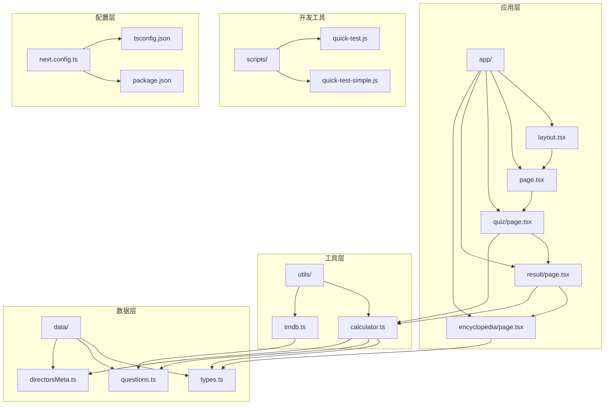
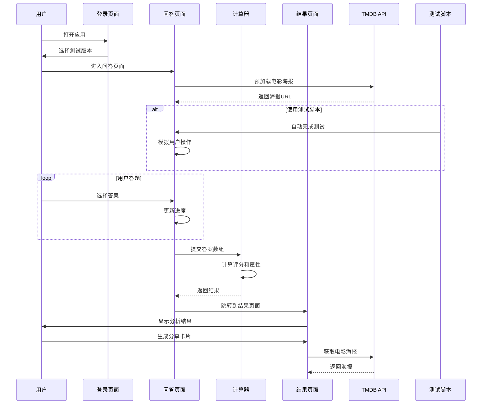
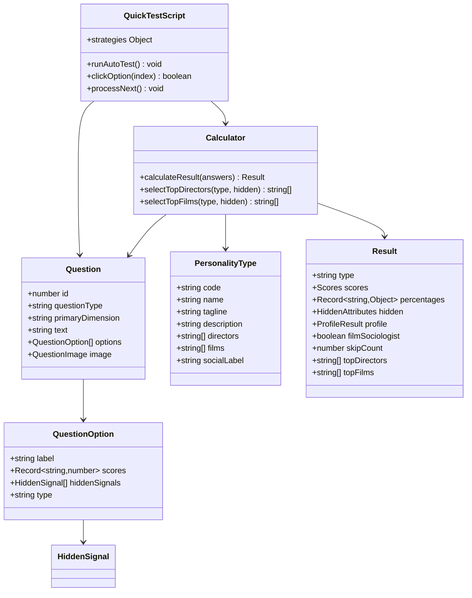
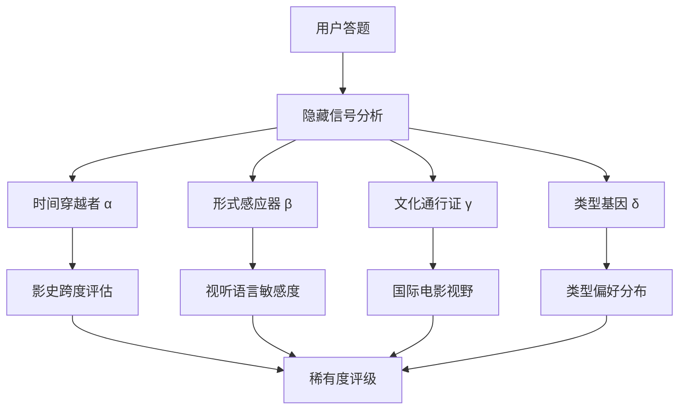
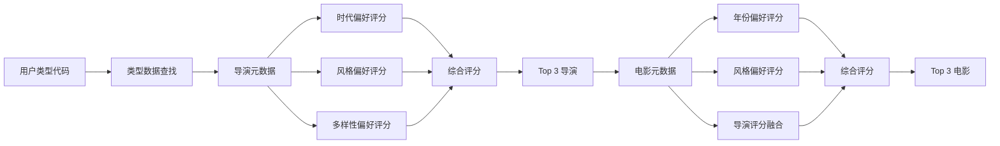
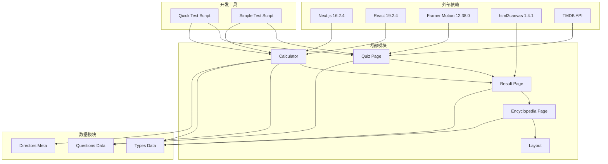

# 双版本测试系统

<cite>
**本文档引用的文件**
- [README.md](file://README.md)
- [package.json](file://package.json)
- [app/layout.tsx](file://app/layout.tsx)
- [app/page.tsx](file://app/page.tsx)
- [app/quiz/page.tsx](file://app/quiz/page.tsx)
- [app/result/page.tsx](file://app/result/page.tsx)
- [app/encyclopedia/page.tsx](file://app/encyclopedia/page.tsx)
- [utils/calculator.ts](file://utils/calculator.ts)
- [utils/tmdb.ts](file://utils/tmdb.ts)
- [data/types.ts](file://data/types.ts)
- [data/questions.ts](file://data/questions.ts)
- [data/directorsMeta.ts](file://data/directorsMeta.ts)
- [next.config.ts](file://next.config.ts)
- [tsconfig.json](file://tsconfig.json)
- [scripts/quick-test-simple.js](file://scripts/quick-test-simple.js)
- [scripts/quick-test.js](file://scripts/quick-test.js)
</cite>

## 更新摘要
**变更内容**
- 新增开发测试自动化脚本章节
- 添加快速测试脚本功能说明
- 更新测试策略和使用方法
- 增强开发工具链文档

## 目录
1. [项目概述](#项目概述)
2. [项目结构](#项目结构)
3. [核心组件](#核心组件)
4. [架构概览](#架构概览)
5. [详细组件分析](#详细组件分析)
6. [开发测试自动化](#开发测试自动化)
7. [依赖关系分析](#依赖关系分析)
8. [性能考虑](#性能考虑)
9. [故障排除指南](#故障排除指南)
10. [结论](#结论)

## 项目概述

FBTI（Film Buff Type Indicator）是一个基于电影人格类型的双版本测试系统。该项目灵感来源于MBTI性格测试，专门为电影爱好者设计，通过20道精心设计的问题来识别用户的电影人格类型。

### 主要特性

- **双版本测试**：提供快速测试（18道题，约18分钟）和完整版测试（80+道题，约40分钟）
- **四大维度分析**：感知模式、探索方式、叙事引力、影调趋向
- **隐藏属性系统**：时间穿越者、形式感应器、文化通行证
- **个性化推荐**：基于用户类型生成导演和电影推荐
- **分享功能**：支持生成电影人格分享卡片
- **开发测试自动化**：内置脚本支持快速测试和策略验证

## 项目结构

**图表来源**
- [app/layout.tsx:1-53](file://app/layout.tsx#L1-L53)
- [utils/calculator.ts:1-504](file://utils/calculator.ts#L1-L504)
- [data/types.ts:1-428](file://data/types.ts#L1-L428)
- [scripts/quick-test.js:1-154](file://scripts/quick-test.js#L1-L154)
- [scripts/quick-test-simple.js:1-64](file://scripts/quick-test-simple.js#L1-L64)

**章节来源**
- [README.md:1-37](file://README.md#L1-L37)
- [package.json:1-32](file://package.json#L1-L32)

## 核心组件

### 1. 应用布局系统

应用采用Next.js App Router架构，使用根布局组件管理全局样式和字体。

### 2. 测试流程组件

- **主页**：提供快速测试和完整版测试入口
- **问答页面**：处理20道测试题的交互
- **结果页面**：展示电影人格分析和个性化推荐
- **图鉴页面**：展示所有电影人格类型和隐藏属性

### 3. 数据管理系统

- **问题数据**：包含20道测试题及其选项
- **类型数据**：16种电影人格类型及其特征
- **元数据**：导演和电影的详细信息

### 4. 计算引擎

- **评分算法**：计算用户在四大维度上的得分
- **隐藏属性**：分析用户的时间、形式和文化偏好
- **个性化推荐**：基于用户类型生成推荐

### 5. 开发测试自动化

- **快速测试脚本**：支持多种测试策略的自动化脚本
- **简化测试脚本**：基础版本的快速测试实现
- **策略配置**：支持first、random、alternate、skipFirst四种策略

**章节来源**
- [app/page.tsx:1-138](file://app/page.tsx#L1-L138)
- [app/quiz/page.tsx:1-395](file://app/quiz/page.tsx#L1-L395)
- [app/result/page.tsx:1-923](file://app/result/page.tsx#L1-L923)
- [app/encyclopedia/page.tsx:1-354](file://app/encyclopedia/page.tsx#L1-L354)
- [scripts/quick-test.js:14-153](file://scripts/quick-test.js#L14-L153)
- [scripts/quick-test-simple.js:11-63](file://scripts/quick-test-simple.js#L11-L63)

## 架构概览

**图表来源**
- [app/quiz/page.tsx:29-34](file://app/quiz/page.tsx#L29-L34)
- [utils/calculator.ts:235-444](file://utils/calculator.ts#L235-L444)
- [utils/tmdb.ts:111-151](file://utils/tmdb.ts#L111-L151)
- [scripts/quick-test.js:68-144](file://scripts/quick-test.js#L68-L144)

## 详细组件分析

### 测试系统架构

**图表来源**
- [data/questions.ts:33-42](file://data/questions.ts#L33-L42)
- [data/types.ts:1-9](file://data/types.ts#L1-L9)
- [utils/calculator.ts:31-41](file://utils/calculator.ts#L31-L41)
- [scripts/quick-test.js:14-36](file://scripts/quick-test.js#L14-L36)

### 四大维度系统

FBTI系统基于四个核心维度来分析用户的电影偏好：

#### 1. 感知模式 (EA)
- **E (共情)**：通过情感和直觉感受电影
- **A (解析)**：通过理性和技法解读电影

#### 2. 探索方式 (XS)
- **X (拓荒)**：跨越文化和类型的边界
- **S (深耕)**：在一个领域越走越深

#### 3. 叙事引力 (PW)
- **P (微光)**：聚焦个人的内心旅程
- **W (广角)**：展开时代的全景格局

#### 4. 影调趋向 (LD)
- **L (向阳)**：向往温暖和希望
- **D (逐暗)**：深入黑暗与反思

### 隐藏属性系统

**图表来源**
- [utils/calculator.ts:16-21](file://utils/calculator.ts#L16-L21)
- [utils/calculator.ts:64-76](file://utils/calculator.ts#L64-L76)

### 个性化推荐算法

**图表来源**
- [utils/calculator.ts:450-493](file://utils/calculator.ts#L450-L493)
- [data/directorsMeta.ts:293-336](file://data/directorsMeta.ts#L293-L336)

## 开发测试自动化

### 快速测试脚本系统

FBTI项目包含两个专门的JavaScript脚本，用于简化开发测试流程和验证系统功能：

#### 快速测试脚本 (quick-test.js)

这是一个功能完整的自动化测试脚本，支持多种测试策略：

**主要功能**：
- 自动完成所有测试题目
- 支持多种测试策略配置
- 实时进度监控和日志输出
- 错误处理和重试机制

**支持的测试策略**：
- **first**：总是选择第一个选项
- **random**：随机选择选项（默认）
- **alternate**：交替选择不同选项
- **skipFirst**：优先选择skip选项

**使用方法**：
1. 在浏览器中打开FBTI测试页面
2. 打开浏览器开发者工具 (F12)
3. 切换到Console标签
4. 复制粘贴脚本内容并回车
5. 脚本会自动完成所有测试题目

#### 简化测试脚本 (quick-test-simple.js)

这是一个基础版本的快速测试实现，专注于简化操作流程：

**主要特点**：
- 更简单的逻辑实现
- 固定的随机选择策略
- 较短的执行时间
- 适合快速验证基本功能

**使用场景**：
- 快速验证测试流程
- 基础功能测试
- 开发调试阶段

**章节来源**
- [scripts/quick-test.js:1-154](file://scripts/quick-test.js#L1-L154)
- [scripts/quick-test-simple.js:1-64](file://scripts/quick-test-simple.js#L1-L64)

### 测试策略详解

#### 策略1：first策略
- **行为**：始终选择第一个可用选项
- **用途**：快速完成测试，验证基本流程
- **适用场景**：功能验证、性能测试

#### 策略2：random策略（默认）
- **行为**：随机选择选项
- **用途**：模拟真实用户行为
- **适用场景**：用户体验测试、数据收集

#### 策略3：alternate策略
- **行为**：在选项间交替选择
- **用途**：测试多选功能
- **适用场景**：多选题测试、边界条件验证

#### 策略4：skipFirst策略
- **行为**：优先选择skip选项（如果存在）
- **用途**：测试skip功能
- **适用场景**：skip功能测试、特殊逻辑验证

**章节来源**
- [scripts/quick-test.js:18-36](file://scripts/quick-test.js#L18-L36)
- [scripts/quick-test.js:118-120](file://scripts/quick-test.js#L118-L120)

## 依赖关系分析

**图表来源**
- [package.json:11-28](file://package.json#L11-L28)
- [utils/calculator.ts:1-3](file://utils/calculator.ts#L1-L3)
- [scripts/quick-test.js:14-153](file://scripts/quick-test.js#L14-L153)
- [scripts/quick-test-simple.js:11-63](file://scripts/quick-test-simple.js#L11-L63)

**章节来源**
- [package.json:1-32](file://package.json#L1-L32)
- [next.config.ts:1-8](file://next.config.ts#L1-L8)

## 性能考虑

### 1. 渲染优化

- **客户端渲染**：使用React客户端组件减少服务器负载
- **懒加载**：图片和组件按需加载
- **缓存策略**：使用sessionStorage存储临时数据

### 2. 数据优化

- **预加载机制**：在问答页面初始化时预加载电影海报
- **数据压缩**：使用紧凑的数据结构存储问题和类型信息
- **内存管理**：及时清理临时数据和事件监听器

### 3. 网络优化

- **API限制**：TMDB API调用次数控制在合理范围内
- **错误处理**：网络请求失败时提供降级方案
- **并发处理**：批量处理多个API请求

### 4. 开发测试优化

- **脚本执行效率**：优化DOM查询和事件处理
- **内存使用**：避免创建不必要的对象和闭包
- **错误恢复**：提供重试机制和降级策略

## 故障排除指南

### 常见问题及解决方案

#### 1. 电影海报加载失败

**症状**：问答页面显示占位符而非电影海报

**原因**：
- TMDB API访问失败
- 网络连接问题
- API密钥无效

**解决方案**：
- 检查网络连接
- 验证API密钥有效性
- 使用备用占位符

#### 2. 测试结果异常

**症状**：计算结果不符合预期

**原因**：
- 问卷数据格式错误
- 计算逻辑异常
- 缓存数据污染

**解决方案**：
- 清除浏览器缓存
- 检查数据格式
- 重新运行计算函数

#### 3. 分享功能失效

**症状**：无法生成分享卡片

**原因**：
- html2canvas渲染错误
- 字体加载延迟
- Canvas绘制失败

**解决方案**：
- 确保字体完全加载
- 增加重试机制
- 检查Canvas兼容性

#### 4. 测试脚本执行失败

**症状**：快速测试脚本无法正常工作

**原因**：
- DOM元素选择器不匹配
- 页面结构变化
- JavaScript执行权限问题

**解决方案**：
- 检查页面元素是否可见
- 更新选择器匹配规则
- 确认脚本执行环境
- 使用简化脚本作为备选

**章节来源**
- [app/quiz/page.tsx:29-34](file://app/quiz/page.tsx#L29-L34)
- [utils/tmdb.ts:57-80](file://utils/tmdb.ts#L57-L80)
- [app/result/page.tsx:102-134](file://app/result/page.tsx#L102-L134)
- [scripts/quick-test.js:73-97](file://scripts/quick-test.js#L73-L97)

## 结论

FBTI双版本测试系统是一个功能完整、架构清晰的电影人格分析平台。系统通过精心设计的双版本测试流程，为用户提供个性化的电影体验分析和推荐。

### 系统优势

1. **用户体验友好**：简洁直观的界面设计，流畅的交互体验
2. **算法科学严谨**：基于四大维度和隐藏属性的综合分析
3. **个性化程度高**：结合用户偏好生成定制化推荐
4. **扩展性强**：模块化设计便于功能扩展和维护
5. **开发效率高**：内置测试脚本支持快速验证和调试

### 技术亮点

1. **响应式设计**：适配各种设备和屏幕尺寸
2. **性能优化**：合理的数据加载和缓存策略
3. **错误处理**：完善的异常处理和降级机制
4. **可访问性**：良好的键盘导航和屏幕阅读器支持
5. **自动化测试**：支持多种策略的自动化测试脚本

### 开发工具特色

1. **灵活的测试策略**：支持多种测试策略满足不同需求
2. **实时反馈机制**：详细的日志输出和进度跟踪
3. **错误恢复能力**：具备重试和降级机制
4. **易于使用**：简单明了的使用方法和配置选项

该系统为电影爱好者提供了一个深入了解自己观影偏好的工具，同时也为电影推荐和营销提供了有价值的参考数据。新增的开发测试自动化功能进一步提升了系统的开发效率和质量保证能力。