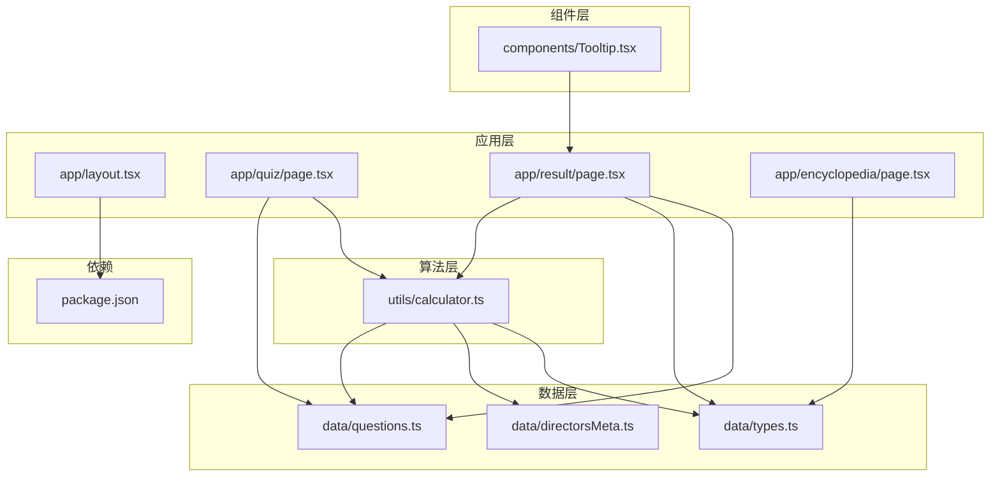
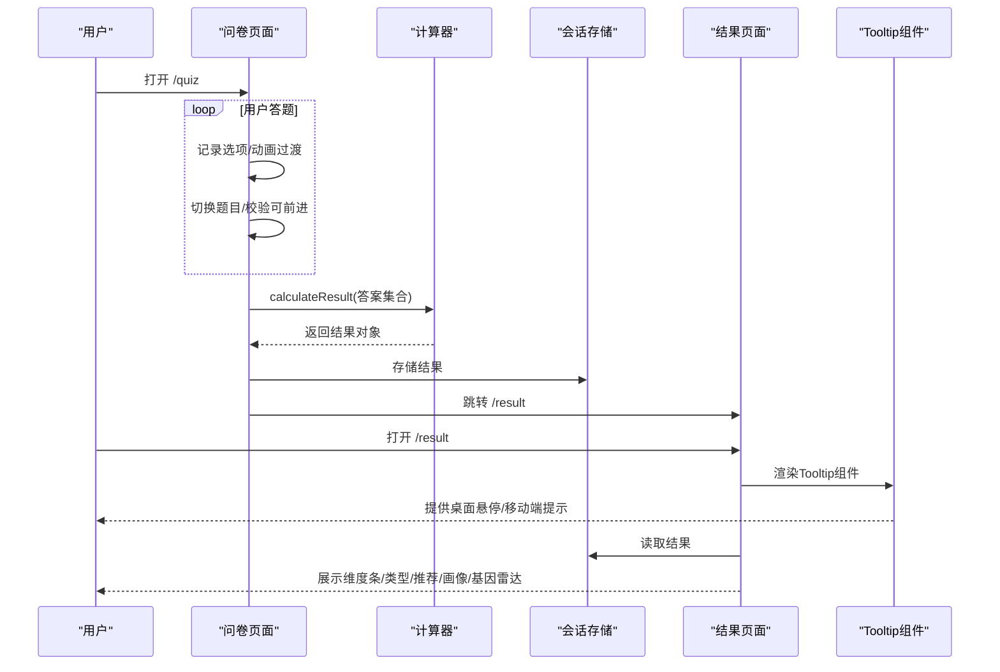
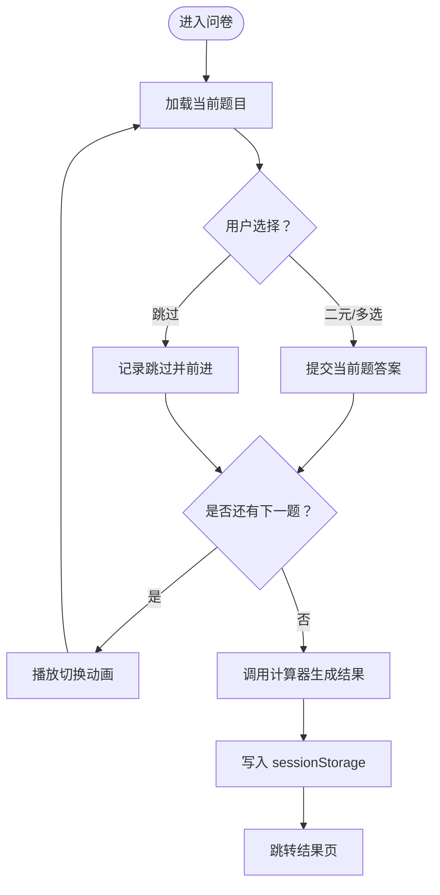
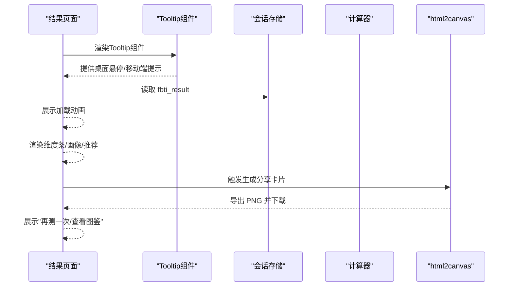
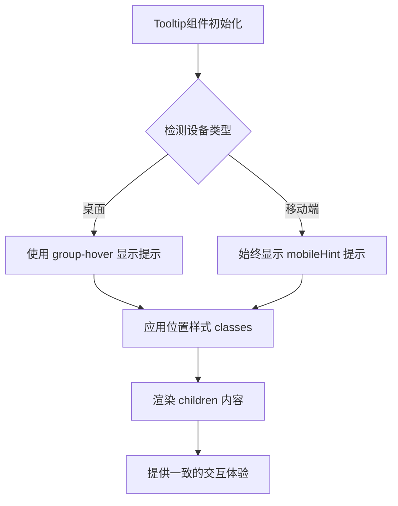
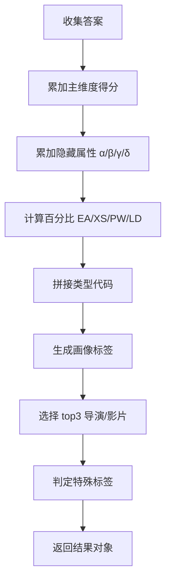
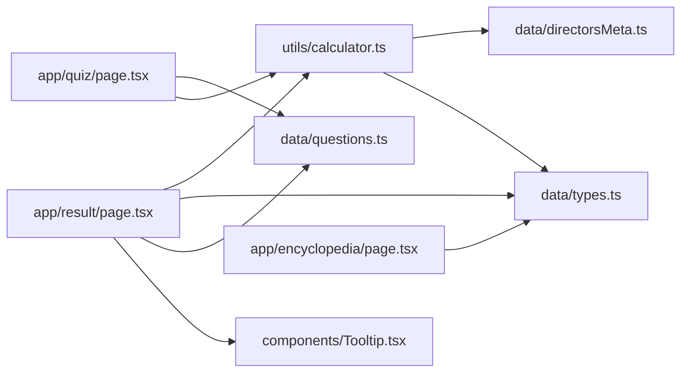

# 核心功能模块

<cite>
**本文引用的文件**
- [README.md](file://README.md)
- [package.json](file://package.json)
- [app/layout.tsx](file://app/layout.tsx)
- [app/quiz/page.tsx](file://app/quiz/page.tsx)
- [app/result/page.tsx](file://app/result/page.tsx)
- [app/encyclopedia/page.tsx](file://app/encyclopedia/page.tsx)
- [components/Tooltip.tsx](file://components/Tooltip.tsx)
- [data/types.ts](file://data/types.ts)
- [data/questions.ts](file://data/questions.ts)
- [data/directorsMeta.ts](file://data/directorsMeta.ts)
- [utils/calculator.ts](file://utils/calculator.ts)
</cite>

## 更新摘要
**变更内容**
- 新增Tooltip组件，提供桌面悬停交互和移动端触摸交互的上下文帮助功能
- 在结果页面的多个关键交互元素中集成了Tooltip组件
- 支持响应式设计，桌面端显示悬停提示，移动端显示始终可见的提示文字
- 提供灵活的位置配置和样式定制能力

## 目录
1. [简介](#简介)
2. [项目结构](#项目结构)
3. [核心组件](#核心组件)
4. [架构总览](#架构总览)
5. [详细组件分析](#详细组件分析)
6. [依赖关系分析](#依赖关系分析)
7. [性能考量](#性能考量)
8. [故障排查指南](#故障排查指南)
9. [结论](#结论)
10. [附录](#附录)

## 简介
本项目是"电影人格测试"（FBTI）应用，目标是通过20道精心设计的问题，帮助用户识别其"电影人格类型"，并提供结果分析、个性化推荐与电影百科全书式的知识入口。系统包含三大核心功能：
- 电影人格测试：交互式问卷，支持单选、多选、二选一含跳过、多选含上限等题型，动态进度与动画过渡。
- 结果分析展示：计算维度得分与类型代码，生成可视化维度条、隐藏属性徽章、类型基因雷达图、观影画像与社交标签，并支持生成分享卡片。
- 电影百科全书：展示全部16种类型、四大维度、隐藏属性等级与类型基因，便于用户探索与回顾。

系统采用 Next.js 16 应用路由模式，数据层由 TypeScript 类型与纯数据文件构成，计算逻辑集中于工具模块，UI 通过 React 组件实现，整体强调可读性、可扩展性与良好的用户体验。

**更新** 新增Tooltip组件，提供桌面悬停交互和移动端触摸交互的上下文帮助功能，已在多个界面元素中集成使用，提升了用户体验的一致性和交互的友好性。

## 项目结构
项目采用基于功能的目录组织，核心页面位于 app/ 下，数据与算法分别位于 data/ 与 utils/，样式与全局资源位于 app/globals.css 与 public/，字体通过 Next.js Google Fonts 提供。新增的Tooltip组件位于 components/ 目录下，为整个应用提供统一的交互提示功能。

**图表来源**
- [app/layout.tsx:1-53](file://app/layout.tsx#L1-L53)
- [app/quiz/page.tsx:1-395](file://app/quiz/page.tsx#L1-L395)
- [app/result/page.tsx:1-1052](file://app/result/page.tsx#L1-L1052)
- [app/encyclopedia/page.tsx:1-359](file://app/encyclopedia/page.tsx#L1-L359)
- [components/Tooltip.tsx:1-52](file://components/Tooltip.tsx#L1-L52)
- [data/types.ts:1-428](file://data/types.ts#L1-L428)
- [data/questions.ts:1-1867](file://data/questions.ts#L1-L1867)
- [data/directorsMeta.ts:1-279](file://data/directorsMeta.ts#L1-L279)
- [utils/calculator.ts:1-504](file://utils/calculator.ts#L1-L504)
- [package.json:1-30](file://package.json#L1-L30)

**章节来源**
- [README.md:1-37](file://README.md#L1-L37)
- [package.json:1-30](file://package.json#L1-L30)

## 核心组件
- 问卷页面（QuizPage）
  - 支持多种题型：二元、多选、二元含跳过、多选含上限；记录答案并进行动画过渡；支持返回主页的二次确认。
  - 计算完成后将结果存入 sessionStorage 并跳转至结果页。
- 结果页面（ResultPage）
  - 加载 sessionStorage 中的结果，显示加载动画与最终结果；展示维度条、类型描述、代表导演与作品、社交标签、隐藏属性徽章、类型基因雷达图、观影画像与社交标签；支持生成分享卡片。
  - **新增** 集成Tooltip组件，为关键操作按钮提供上下文帮助，包括分享卡片生成、返回首页和查看图鉴等操作。
- 百科全书页面（EncyclopediaPage）
  - 展示四大维度、16种类型、隐藏属性等级与类型基因；支持展开查看类型详情与代表作品/导演；提供回到首页与开始测试的导航。
- **新增** Tooltip组件
  - 提供桌面悬停交互和移动端触摸交互的上下文帮助功能
  - 支持多种位置配置（top、bottom、left、right）
  - 响应式设计：桌面端显示悬停提示，移动端显示始终可见的提示文字
  - 支持自定义样式和位置，提供一致的用户体验

**章节来源**
- [app/quiz/page.tsx:1-395](file://app/quiz/page.tsx#L1-L395)
- [app/result/page.tsx:1-1052](file://app/result/page.tsx#L1-L1052)
- [app/encyclopedia/page.tsx:1-359](file://app/encyclopedia/page.tsx#L1-L359)
- [components/Tooltip.tsx:1-52](file://components/Tooltip.tsx#L1-L52)

## 架构总览
系统采用"页面组件 + 数据模型 + 计算器 + 通用组件"的分层架构：
- 页面组件负责用户交互与视图渲染；
- 数据模型提供问题、类型、导演/影片元数据；
- 计算器负责评分、百分比、隐藏属性、画像与推荐生成；
- **新增** 通用组件层提供可复用的UI组件，如Tooltip组件。

**图表来源**
- [app/quiz/page.tsx:69-95](file://app/quiz/page.tsx#L69-L95)
- [utils/calculator.ts:235-444](file://utils/calculator.ts#L235-L444)
- [app/result/page.tsx:72-93](file://app/result/page.tsx#L72-L93)
- [components/Tooltip.tsx:28-50](file://components/Tooltip.tsx#L28-L50)

## 详细组件分析

### 问卷页面（QuizPage）
- 功能要点
  - 题型适配：二元、多选、二元含跳过、多选含上限；多选题需点击"下一题"按钮提交。
  - 答案持久化：当前题的答案在切换题目时合并进答案数组，支持返回上一题恢复选择。
  - 动画与过渡：题目切换使用淡入/位移动画，避免快速切换造成视觉不适。
  - 返回主页：点击"返回主页"弹出确认模态，防止误操作丢失进度。
  - 计算与跳转：最后一题提交后调用计算器生成结果，写入 sessionStorage 并跳转结果页。
- 用户交互流程
  - 进入页面 → 显示当前题与进度条 → 点击选项（二元自动前进，多选手动提交）→ 切换题目 → 最后一题提交 → 跳转结果页。
- 性能与可用性
  - 使用 useCallback 缓解重复渲染；动画时禁用交互，避免并发状态冲突。
  - 多选题限制选择数量，防止过度分散注意力。

**图表来源**
- [app/quiz/page.tsx:39-95](file://app/quiz/page.tsx#L39-L95)

**章节来源**
- [app/quiz/page.tsx:1-395](file://app/quiz/page.tsx#L1-L395)

### 结果页面（ResultPage）
- 功能要点
  - 加载与展示：从 sessionStorage 读取结果，显示加载动画与最终内容；维度条按 EA/XS/PW/LD 四对维度展示百分比与倾向描述。
  - 类型与画像：展示类型名称、标语、描述、社交标签；根据画像标签生成个性化描述。
  - 推荐与链接：展示代表导演与作品，点击跳转 TMDB；支持生成分享卡片（html2canvas）。
  - 隐藏属性与类型基因：展示 α/β/γ 徽章与 δ 基因雷达图；高稀有度徽章高亮显示。
  - 特殊标签：若满足条件，显示"银幕社会学家"隐藏标签。
  - **新增** Tooltip集成：在三个关键操作按钮上集成Tooltip组件，提供上下文帮助。
- 分享卡片生成
  - 使用 html2canvas 对离屏渲染的卡片进行截图，导出 PNG 文件；等待字体加载与 DOM 渲染稳定后执行。
- 用户交互流程
  - 进入结果页 → 加载动画 → 展示维度条/类型/画像/推荐 → 点击"生成分享卡片" → 下载 PNG → "再测一次"或"查看图鉴"。

**图表来源**
- [app/result/page.tsx:72-93](file://app/result/page.tsx#L72-L93)
- [app/result/page.tsx:102-134](file://app/result/page.tsx#L102-L134)
- [components/Tooltip.tsx:28-50](file://components/Tooltip.tsx#L28-L50)

**章节来源**
- [app/result/page.tsx:1-1052](file://app/result/page.tsx#L1-L1052)

### 百科全书页面（EncyclopediaPage）
- 功能要点
  - 四大维度：EA/XS/PW/LD 的左右对比说明。
  - 16种类型：网格展示，点击展开查看类型描述、代表导演与代表作品。
  - 隐藏属性：α/β/γ 的等级与描述，按稀有度着色。
  - 类型基因：δ 的六项类型偏好，用于理解用户对类型偏好的倾向。
- 用户交互流程
  - 浏览维度 → 查看类型 → 展开查看详情 → 返回首页或开始测试。

**章节来源**
- [app/encyclopedia/page.tsx:1-359](file://app/encyclopedia/page.tsx#L1-L359)

### Tooltip组件（新增）
- 功能特性
  - **桌面悬停交互**：使用 `group-hover` 伪类在桌面端显示悬停提示，支持透明度渐变过渡效果。
  - **移动端触摸交互**：始终显示提示文字，确保移动端用户的可访问性。
  - **响应式设计**：使用 Tailwind CSS 的 `md:` 前缀实现桌面端隐藏、移动端显示的响应式行为。
  - **灵活位置配置**：支持 top、bottom、left、right 四个方向的位置设置。
  - **样式定制**：支持自定义样式类，提供一致的视觉风格。
- 技术实现
  - 使用 `group` 容器和 `group-hover` 伪类实现悬停效果。
  - 通过 `positionClasses` 和 `arrowClasses` 对象管理不同位置的定位和箭头样式。
  - 使用 `mobileHint` 属性提供移动端始终可见的提示文字。
  - 支持 `position` 属性控制提示框相对于触发元素的位置。
- 使用场景
  - 在结果页面的关键操作按钮上提供上下文帮助。
  - 为复杂的交互元素提供简短的使用说明。
  - 保持界面简洁的同时提供必要的用户指导。

**图表来源**
- [components/Tooltip.tsx:28-50](file://components/Tooltip.tsx#L28-L50)

**章节来源**
- [components/Tooltip.tsx:1-52](file://components/Tooltip.tsx#L1-L52)

### 计算器（utils/calculator.ts）
- 功能要点
  - 主维度计分：E/A、X/S、P/W、L/D 四对维度累加得分。
  - 百分比计算：每对维度按各自总分计算赢家占比。
  - 隐藏属性：α（时代）、β（形式）、γ（多样性），以及 δ（类型基因）按权重累计。
  - 类型判定：由四对维度赢家拼接形成类型代码。
  - 画像生成：根据 Q50-Q53 的标签组合生成观影画像描述。
  - 推荐生成：基于类型与隐藏属性，对导演与影片进行打分排序，输出前三。
  - 特殊标签：满足条件时标记"银幕社会学家"。
- 算法细节
  - 隐藏属性归一化：以"传说阈值"为上限归一到 0-1 区间。
  - 导演/影片评分：导演评分与影片评分混合，影片评分融合导演评分权重。
  - 多选题权重：按"实质性选择数量"的倒数分配权重，避免多选放大效应。
  - 跳过处理：部分题目的跳过会影响特定维度（如 Q48 跳过影响 L）。
- 复杂度分析
  - 计算阶段：O(Q + T + D + F)，其中 Q 为题数，T 为类型数，D/F 为导演/影片元数据规模。
  - 排序阶段：对导演/影片打分后排序，复杂度 O(D log D) 与 O(F log F)。

**图表来源**
- [utils/calculator.ts:235-444](file://utils/calculator.ts#L235-L444)
- [utils/calculator.ts:446-493](file://utils/calculator.ts#L446-L493)

**章节来源**
- [utils/calculator.ts:1-504](file://utils/calculator.ts#L1-L504)

### 数据模型（data/）
- 问题与选项（data/questions.ts）
  - 定义题型、维度、文本、选项与隐藏信号；支持图片占位（TMDB 或 AI 提示词）。
  - 隐藏信号：α/β/γ/δ 用于隐藏属性与类型基因的累积。
- 类型与画像（data/types.ts）
  - 定义 16 种类型代码、名称、标语、描述、社交标签、代表导演与影片。
- 导演/影片元数据（data/directorsMeta.ts）
  - 导演元数据：时代、风格、多样性、类型；提供导演评分函数。
  - 影片元数据：年份、风格、类型；提供影片评分函数，融合导演评分。

**章节来源**
- [data/questions.ts:1-1867](file://data/questions.ts#L1-L1867)
- [data/types.ts:1-428](file://data/types.ts#L1-L428)
- [data/directorsMeta.ts:1-279](file://data/directorsMeta.ts#L1-L279)

## 依赖关系分析
- 组件依赖
  - 问卷页面依赖问题数据与计算器；结果页面依赖计算器、类型数据与问题数据；百科页面依赖类型数据。
  - **新增** 结果页面依赖 Tooltip 组件，提供增强的用户交互体验。
- 外部依赖
  - html2canvas 用于生成分享卡片；Next.js 字体与 TailwindCSS 提供样式基础。
- 数据耦合
  - 计算器与数据层强耦合：问题、类型、元数据均作为输入参与计算；修改任一层需同步更新另一层。

**图表来源**
- [app/quiz/page.tsx:5-6](file://app/quiz/page.tsx#L5-L6)
- [app/result/page.tsx:6-11](file://app/result/page.tsx#L6-L11)
- [app/encyclopedia/page.tsx](file://app/encyclopedia/page.tsx#L5)
- [utils/calculator.ts:1-3](file://utils/calculator.ts#L1-L3)
- [components/Tooltip.tsx:10](file://components/Tooltip.tsx#L10)

**章节来源**
- [package.json:11-28](file://package.json#L11-L28)

## 性能考量
- 渲染优化
  - 使用 useCallback 缓解重复渲染；动画期间禁用交互，减少状态抖动。
  - 结果页使用离屏渲染分享卡片，避免阻塞主线程。
  - **新增** Tooltip 组件使用 CSS 过渡而非 JavaScript 动画，减少重排重绘。
- 计算优化
  - 多选题权重按实质性选择数量分配，避免放大效应；隐藏属性归一化减少极端值影响。
  - 导演/影片评分仅对类型相关条目进行，避免全量扫描。
- 资源加载
  - 字体延迟加载与 html2canvas 等待字体准备，确保截图质量。
  - **新增** Tooltip 组件使用内联样式，避免额外的样式文件请求。
- 可扩展性
  - 通过增加问题与类型数据即可扩展维度与类型；算法层保持稳定接口。
  - **新增** Tooltip 组件提供统一的交互模式，便于在其他页面中复用。

## 故障排查指南
- 无法进入结果页
  - 检查 sessionStorage 是否存在 fbti_result；若不存在，页面会重定向至首页。
- 分享卡片为空或异常
  - 确认已等待字体加载与 DOM 渲染稳定；检查 html2canvas 配置与权限。
- 题目跳过导致维度异常
  - 某些题目的跳过会额外影响特定维度（如 Q48 跳过影响 L），请在结果页查看跳过提示。
- 类型基因雷达图显示异常
  - 确认隐藏属性 δ 的键值与数据一致；最大值用于归一化雷达半径。
- **新增** Tooltip 组件显示异常
  - 检查 Tooltip 组件的导入路径是否正确。
  - 确认 Tailwind CSS 的响应式前缀配置正常工作。
  - 验证 group 容器的使用是否正确，确保 hover 效果正常触发。

**章节来源**
- [app/result/page.tsx:72-93](file://app/result/page.tsx#L72-L93)
- [app/result/page.tsx:102-134](file://app/result/page.tsx#L102-L134)
- [utils/calculator.ts:282-288](file://utils/calculator.ts#L282-L288)
- [components/Tooltip.tsx:28-50](file://components/Tooltip.tsx#L28-L50)

## 结论
FBTI 项目通过清晰的分层架构与严谨的数据驱动计算，实现了从"问题采集—评分计算—结果展示—知识入口"的完整闭环。系统在用户体验与算法实现之间取得良好平衡：交互流畅、结果直观、扩展性强。

**更新** 新增的Tooltip组件进一步提升了用户体验，通过提供桌面悬停交互和移动端触摸交互的上下文帮助，使应用的交互更加友好和一致。该组件的设计充分考虑了响应式需求，确保在不同设备上都能提供最佳的用户体验。

建议后续可在以下方面进一步完善：
- 增加本地化与国际化支持；
- 优化移动端交互细节；
- 引入 A/B 测试框架评估问题有效性；
- 增加用户反馈与错误上报机制；
- **新增** 扩展Tooltip组件的功能，支持更多自定义选项和主题样式。

## 附录
- 使用场景举例
  - 新用户首次体验：完成问卷 → 查看结果 → 生成分享卡片 → 浏览百科 → 再测一次。
  - 影迷回顾：浏览百科 → 按类型/维度筛选 → 查看代表作品 → 跳转 TMDB。
  - **新增** 用户学习：通过Tooltip组件了解各个功能的作用和使用方法。
- 功能扩展建议
  - 增加"我的收藏"：允许用户收藏类型/导演/影片，形成个人档案。
  - 增加"类型对比"：支持同时比较多个类型，辅助选择。
  - 增加"类型生成器"：允许用户自定义类型描述与代表作品，提升参与感。
  - **新增** 增加Tooltip组件的配置选项：支持自定义样式、位置和触发方式。
  - **新增** 在更多页面中集成Tooltip组件：为复杂功能提供上下文帮助。