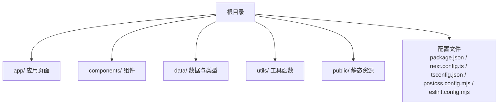
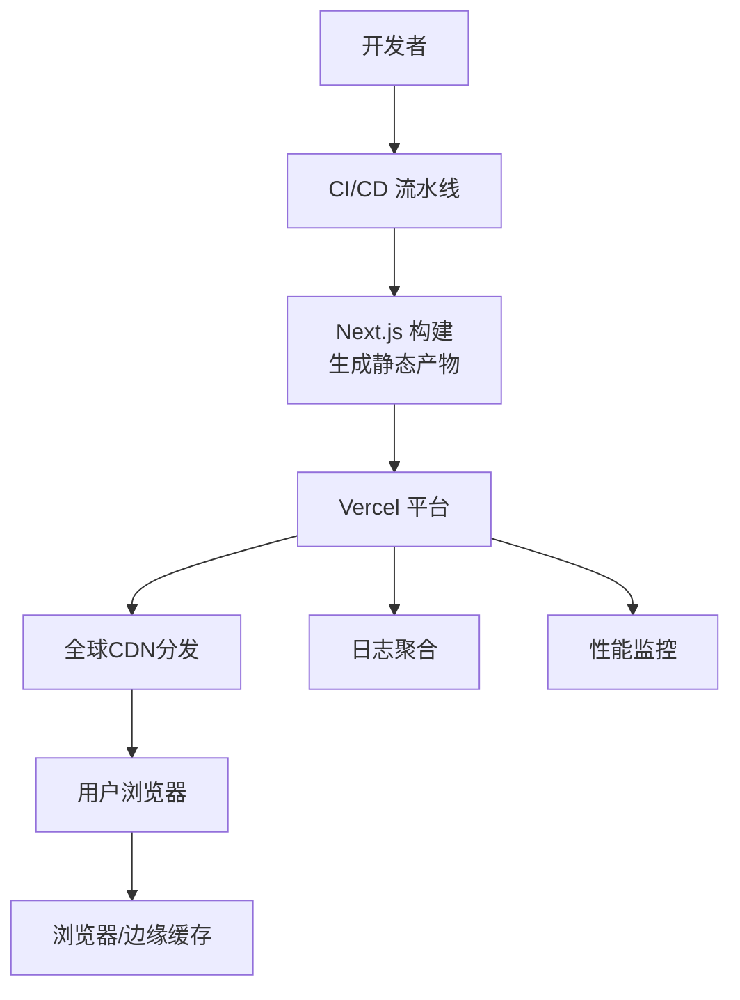
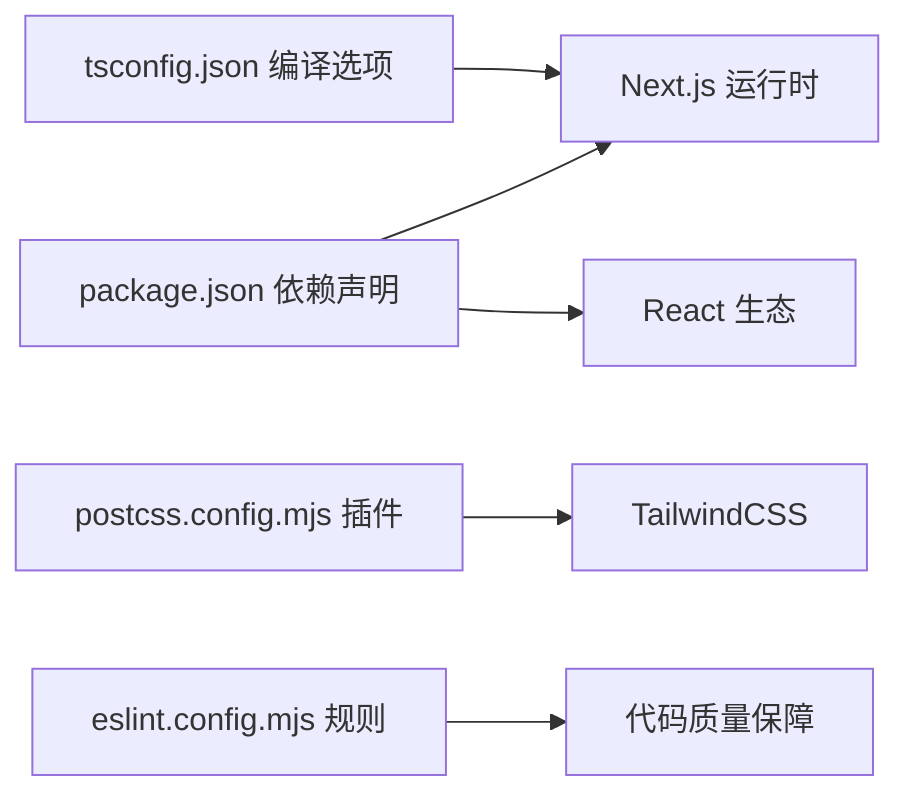

# 部署与运维

<cite>
**本文引用的文件**
- [package.json](file://package.json)
- [next.config.ts](file://next.config.ts)
- [tsconfig.json](file://tsconfig.json)
- [postcss.config.mjs](file://postcss.config.mjs)
- [eslint.config.mjs](file://eslint.config.mjs)
- [README.md](file://README.md)
- [AGENTS.md](file://AGENTS.md)
- [CLAUDE.md](file://CLAUDE.md)
</cite>

## 目录
1. [简介](#简介)
2. [项目结构](#项目结构)
3. [核心组件](#核心组件)
4. [架构总览](#架构总览)
5. [详细组件分析](#详细组件分析)
6. [依赖分析](#依赖分析)
7. [性能考虑](#性能考虑)
8. [故障排除指南](#故障排除指南)
9. [结论](#结论)
10. [附录](#附录)

## 简介
本文件面向FBTI项目的生产部署与运维团队，提供基于仓库现有配置的可执行方案与最佳实践建议。当前仓库为一个基于Next.js的应用，采用TypeScript与TailwindCSS，并通过Vercel作为首选部署平台。本文将围绕以下主题展开：生产构建配置、Vercel部署与环境变量、域名与CDN策略、Docker容器化部署指引、性能监控与日志管理、错误追踪、负载均衡与缓存优化、备份恢复与安全加固、故障排除与容量规划。

## 项目结构
仓库采用标准的Next.js应用布局，包含应用页面、全局样式、工具函数与数据模型等模块。核心构建与运行脚本集中在包管理配置中，框架与工具链版本在依赖声明中明确。

**章节来源**
- [package.json:1-30](file://package.json#L1-L30)
- [next.config.ts:1-8](file://next.config.ts#L1-L8)
- [tsconfig.json:1-35](file://tsconfig.json#L1-L35)
- [postcss.config.mjs:1-8](file://postcss.config.mjs#L1-L8)
- [eslint.config.mjs:1-19](file://eslint.config.mjs#L1-L19)

## 核心组件
- 构建与运行脚本
  - 开发模式：使用Next.js开发服务器启动应用。
  - 生产构建：生成静态产物以供生产环境运行。
  - 启动服务：以生产模式启动Next.js服务端渲染与静态资源服务。
  - 代码质量：集成ESLint规则集，确保代码规范与核心Web性能指标。
- 框架与工具链
  - Next.js版本与React版本在依赖中声明，确保与官方文档一致。
  - TypeScript启用严格模式与增量编译，提升开发体验与构建稳定性。
  - TailwindCSS通过PostCSS插件集成，支持原子化样式与按需优化。
- 配置扩展点
  - Next.js配置文件留有扩展空间，可用于生产级优化（如重写、重定向、headers、安全策略等）。
  - ESLint配置已启用Next.js核心Web性能规则，建议结合CI进行强制校验。

**章节来源**
- [package.json:5-10](file://package.json#L5-L10)
- [package.json:11-28](file://package.json#L11-L28)
- [tsconfig.json:2-24](file://tsconfig.json#L2-L24)
- [postcss.config.mjs:1-8](file://postcss.config.mjs#L1-L8)
- [eslint.config.mjs:1-19](file://eslint.config.mjs#L1-L19)
- [next.config.ts:3-5](file://next.config.ts#L3-L5)

## 架构总览
下图展示了从源码到生产运行的关键路径：本地开发与CI构建、Next.js产物生成、Vercel平台托管与CDN分发、客户端访问与缓存命中。

[本图为概念性架构示意，不直接映射具体源码文件，故无“图示来源”]

## 详细组件分析

### Vercel部署配置与环境变量
- 部署入口
  - 参考官方文档与仓库注释，推荐通过Vercel平台一键部署，便于自动构建与域名绑定。
- 环境变量
  - 在Vercel控制台或CLI中配置环境变量，建议区分环境（如NEXT_PUBLIC_ENV用于前端可见变量，后端敏感变量置于私有域）。
  - 建议在仓库中添加环境变量清单与用途说明，便于审计与交接。
- 域名与CDN
  - 使用Vercel提供的自定义域名与HTTPS证书，结合边缘缓存策略提升首屏性能。
  - 对于多区域访问，可利用Vercel的地理路由与就近节点优化延迟。

**章节来源**
- [README.md:32-36](file://README.md#L32-L36)

### Docker容器化部署指引
- 构建阶段
  - 使用多阶段构建：基础镜像安装依赖，构建产物仅复制至精简运行时镜像，降低镜像体积与攻击面。
- 运行阶段
  - 以非root用户运行容器，限制权限；设置只读文件系统与最小能力集。
  - 将Next.js的生产启动命令作为容器入口点，暴露必要端口并配置健康检查。
- 配置与卷
  - 将环境变量注入容器；避免将构建产物或临时文件写入容器层。
  - 日志输出到stdout/stderr，交由平台日志系统统一收集。

**章节来源**
- [package.json:7-8](file://package.json#L7-L8)

### 性能监控、日志管理与错误追踪
- 性能监控
  - 利用Vercel内置性能指标与日志，结合浏览器核心Web性能指标（CLS、FID、LCP）进行持续观测。
  - 在Next.js中启用客户端与服务端性能埋点，记录关键请求耗时与错误率。
- 日志管理
  - 容器化场景下，将日志输出到标准流，配合平台日志聚合服务实现集中检索与告警。
  - 对敏感信息进行脱敏处理，避免在日志中泄露凭证或令牌。
- 错误追踪
  - 在客户端与服务端分别集成错误上报（如Sentry），确保异常捕获与上下文信息完整。
  - 对高频错误建立阈值告警，结合时间序列分析定位回归问题。

**章节来源**
- [eslint.config.mjs:2-3](file://eslint.config.mjs#L2-L3)

### 负载均衡、CDN与缓存策略
- 负载均衡
  - Vercel提供全球负载均衡与自动扩缩容，建议结合灰度发布与蓝绿部署策略逐步放量。
- CDN与缓存
  - 静态资源与构建产物由CDN缓存；动态内容设置合理Cache-Control与边缘缓存策略。
  - 对于需要实时性的接口，采用条件缓存或短生命周期缓存，避免陈旧数据影响用户体验。
- 边缘计算
  - 利用边缘函数（Edge Functions）在靠近用户的节点执行轻量逻辑，减少回源与跨域延迟。

**章节来源**
- [README.md:32-36](file://README.md#L32-L36)

### 备份恢复、安全加固与合规
- 备份恢复
  - 对应用源码与配置进行版本化管理；对数据库与对象存储中的用户数据制定定期备份策略与恢复演练计划。
- 安全加固
  - 依赖扫描与漏洞修复：在CI中集成依赖扫描与自动修复流程。
  - 最小权限原则：容器与平台账号均遵循最小权限；密钥轮换与访问审计常态化。
  - 内容安全策略（CSP）、HTTP安全头与HTTPS强制策略在Next.js中通过headers配置实现。
- 合规性检查
  - 建立合规清单（如隐私政策、Cookie策略、第三方组件合规审查），并在发布前完成合规性检查与审计记录。

**章节来源**
- [next.config.ts:3-5](file://next.config.ts#L3-L5)

### 故障排除、性能调优与容量规划
- 故障排除
  - 优先查看平台日志与错误追踪系统的聚合报告，定位异常请求与错误堆栈。
  - 使用浏览器开发者工具与网络面板验证缓存命中与资源加载情况。
- 性能调优
  - 优化图片与字体加载（如WebP、子集化字体），减少主线程阻塞。
  - 分析慢查询与长尾请求，结合CDN与边缘缓存策略降低回源压力。
- 容量规划
  - 基于历史流量与峰值预测，评估CPU、内存与带宽需求；结合弹性伸缩策略应对突发流量。

**章节来源**
- [eslint.config.mjs:1-19](file://eslint.config.mjs#L1-L19)

## 依赖分析
- 语言与构建
  - TypeScript严格模式与增量编译提升构建效率与类型安全。
  - PostCSS与TailwindCSS插件集成，支持原子化样式与按需优化。
- Lint与质量
  - ESLint规则集覆盖Next.js核心Web性能指标，建议在CI中强制执行。
- 运行时与框架
  - Next.js与React版本在依赖中声明，确保与官方文档一致，避免运行时差异导致的问题。

**图示来源**
- [package.json:11-28](file://package.json#L11-L28)
- [tsconfig.json:2-24](file://tsconfig.json#L2-L24)
- [postcss.config.mjs:1-8](file://postcss.config.mjs#L1-L8)
- [eslint.config.mjs:1-19](file://eslint.config.mjs#L1-L19)

**章节来源**
- [package.json:11-28](file://package.json#L11-L28)
- [tsconfig.json:2-24](file://tsconfig.json#L2-L24)
- [postcss.config.mjs:1-8](file://postcss.config.mjs#L1-L8)
- [eslint.config.mjs:1-19](file://eslint.config.mjs#L1-L19)

## 性能考虑
- 构建优化
  - 启用增量编译与严格类型检查，缩短开发迭代周期。
  - 在CI中预热依赖缓存，减少重复安装时间。
- 运行时优化
  - 利用Next.js的静态生成与服务端渲染能力，结合CDN缓存与边缘计算，降低延迟。
  - 对图片与字体进行压缩与格式优化，减少传输体积。
- 监控与告警
  - 建立核心Web性能指标阈值与告警机制，持续跟踪用户体验。

**章节来源**
- [tsconfig.json:7-15](file://tsconfig.json#L7-L15)
- [eslint.config.mjs:2-3](file://eslint.config.mjs#L2-L3)

## 故障排除指南
- 常见问题定位
  - 构建失败：检查依赖版本与Node.js版本兼容性，确认CI缓存未污染。
  - 运行时错误：查看平台日志与错误追踪系统，定位异常请求与堆栈。
  - 性能退化：分析慢查询与长尾请求，检查缓存命中率与CDN状态。
- 快速恢复
  - 回滚至上一稳定版本，同时修复问题并重新发布。
  - 对高可用部署，使用蓝绿或金丝雀发布策略，降低变更风险。

**章节来源**
- [eslint.config.mjs:1-19](file://eslint.config.mjs#L1-L19)

## 结论
本文件基于仓库现有配置，给出了面向生产的部署与运维实践建议。对于Vercel平台，建议充分利用其自动化构建、全球CDN与可观测性能力；对于容器化部署，建议采用多阶段构建与最小权限运行策略。通过完善的性能监控、日志管理与错误追踪体系，以及安全加固与合规流程，可显著提升系统的稳定性与可维护性。

## 附录
- 版本与约定
  - Next.js与React版本在依赖中声明，建议与官方文档保持一致。
  - 严格模式与增量编译已在TypeScript配置中启用，有助于提升开发与构建效率。
- 开发者提示
  - AGENTS.md与CLAUDE.md提供了关于Next.js版本差异与图像使用的注意事项，建议在开发过程中遵循。

**章节来源**
- [package.json:14-16](file://package.json#L14-L16)
- [AGENTS.md:1-6](file://AGENTS.md#L1-L6)
- [CLAUDE.md:1-7](file://CLAUDE.md#L1-L7)