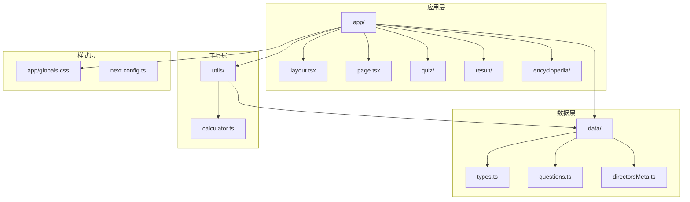
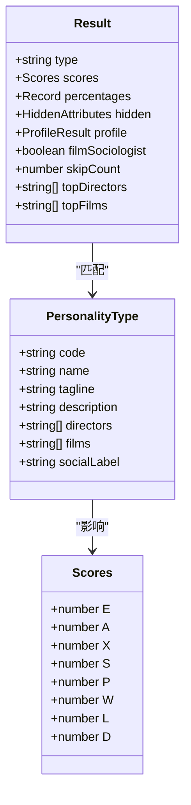
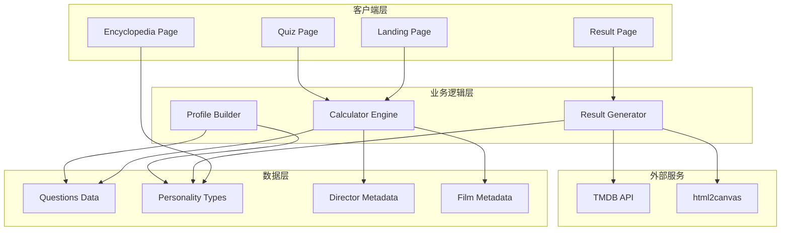
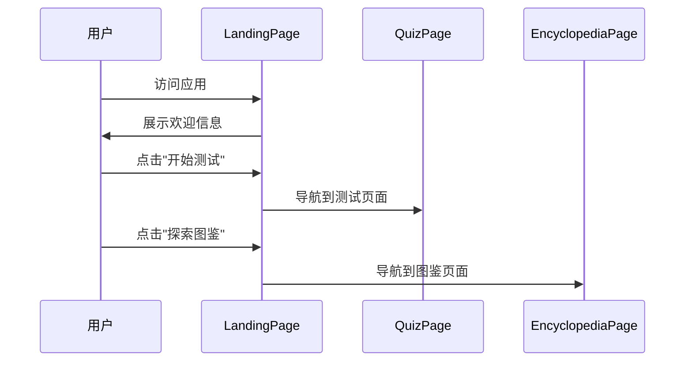
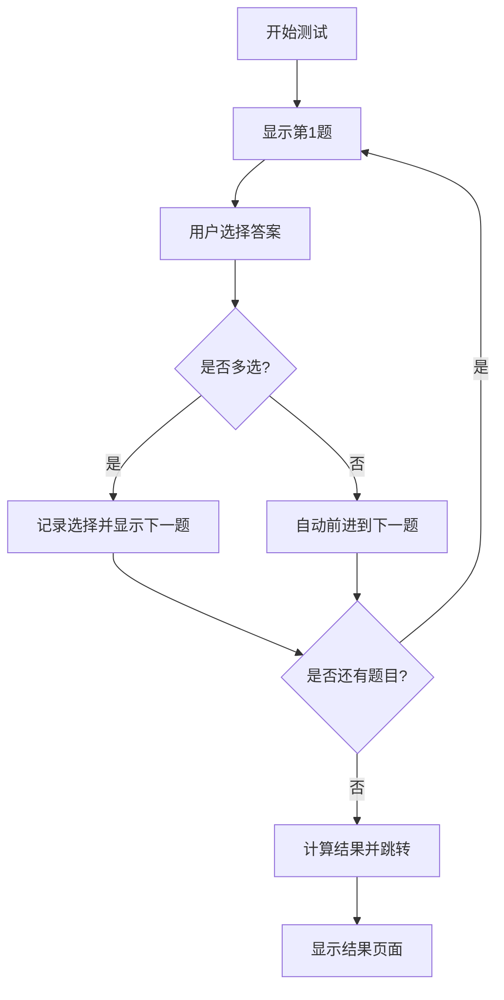
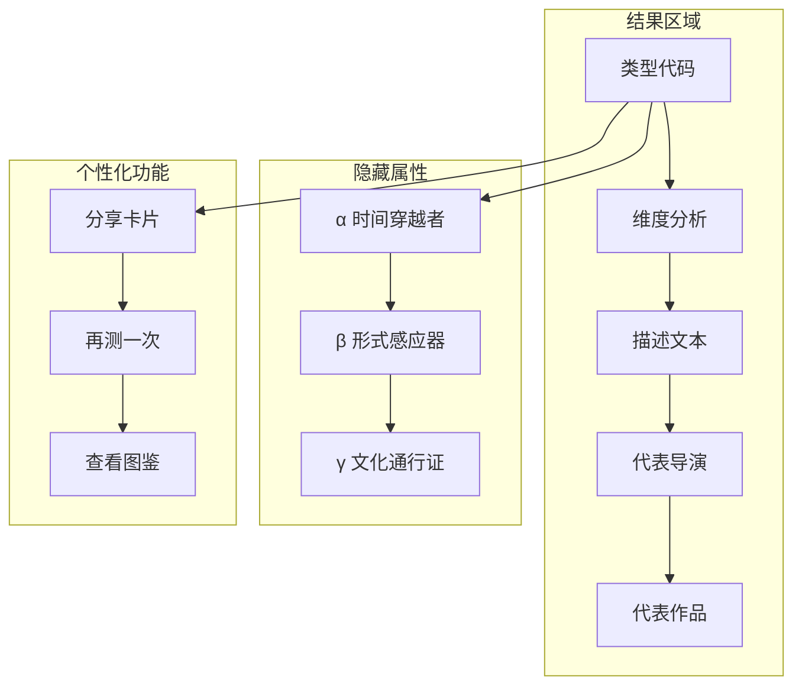
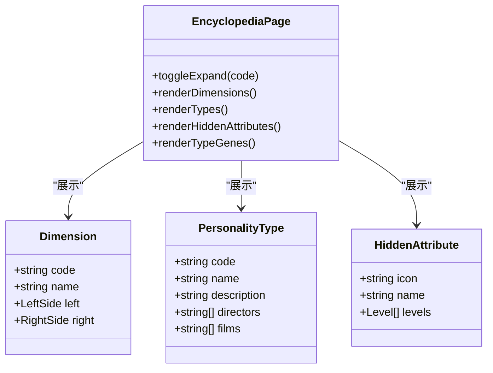

# 项目概述

<cite>
**本文档引用的文件**
- [README.md](file://README.md)
- [package.json](file://package.json)
- [AGENTS.md](file://AGENTS.md)
- [CLAUDE.md](file://CLAUDE.md)
- [next.config.ts](file://next.config.ts)
- [app/layout.tsx](file://app/layout.tsx)
- [app/globals.css](file://app/globals.css)
- [app/page.tsx](file://app/page.tsx)
- [app/quiz/page.tsx](file://app/quiz/page.tsx)
- [app/result/page.tsx](file://app/result/page.tsx)
- [app/encyclopedia/page.tsx](file://app/encyclopedia/page.tsx)
- [utils/calculator.ts](file://utils/calculator.ts)
- [data/types.ts](file://data/types.ts)
- [data/questions.ts](file://data/questions.ts)
- [data/directorsMeta.ts](file://data/directorsMeta.ts)
</cite>

## 目录
1. [引言](#引言)
2. [项目结构](#项目结构)
3. [核心组件](#核心组件)
4. [架构概览](#架构概览)
5. [详细组件分析](#详细组件分析)
6. [依赖分析](#依赖分析)
7. [性能考虑](#性能考虑)
8. [故障排除指南](#故障排除指南)
9. [结论](#结论)
10. [附录](#附录)

## 引言

FBTI（Film Buff Type Indicator）电影人格测试应用是一个基于MBTI理论与电影文化深度融合的创新项目。该项目旨在通过20个精心设计的问题，帮助用户发现自己的电影人格类型，从而获得个性化的电影推荐和观影体验。

### 项目核心目标

FBTI项目的核心目标是：
- **理论创新**：将MBTI的四个维度扩展到电影文化领域，创造独特的"电影人格"概念
- **用户体验优化**：提供直观、美观且富有电影质感的交互体验
- **个性化推荐**：基于用户的电影偏好，智能推荐导演和作品
- **文化普及**：通过有趣的方式推广电影文化和影史知识

### 设计理念

项目采用"电影即人格"的设计理念，将传统的MBTI理论转化为电影文化语境下的认知模型。每个维度都对应着不同的电影观看偏好和审美倾向：

- **E/A维度**：共情 vs 解析 - 关注情感共鸣与理性分析的平衡
- **X/S维度**：拓荒者 vs 深耕者 - 探索多样类型与专注特定领域的选择
- **P/W维度**：微光 vs 广角 - 个人内心与时代全景的关注焦点
- **L/D维度**：向阳 vs 逐暗 - 温暖希望与深刻反思的价值取向

### 技术特色

FBTI项目在技术实现上具有以下特色：
- **现代化技术栈**：基于Next.js 16.2.4构建，充分利用React 19的新特性
- **响应式设计**：采用TailwindCSS实现优雅的移动端适配
- **高性能计算**：内置智能算法，实时分析用户偏好并生成个性化结果
- **沉浸式体验**：通过渐变色彩和动画效果营造电影主题氛围

## 项目结构

FBTI项目采用模块化组织结构，主要分为以下几个核心部分：



**图表来源**
- [app/layout.tsx:1-53](file://app/layout.tsx#L1-L53)
- [data/types.ts:1-428](file://data/types.ts#L1-L428)
- [utils/calculator.ts:1-504](file://utils/calculator.ts#L1-L504)

### 主要目录说明

- **app/**：Next.js应用入口，包含所有页面组件
- **components/**：可复用的UI组件（当前为空，预留扩展）
- **data/**：核心数据模型，包含类型定义、问题集和元数据
- **utils/**：业务逻辑处理工具，主要是计算引擎
- **public/**：静态资源文件（当前为空）

**章节来源**
- [package.json:1-30](file://package.json#L1-L30)
- [next.config.ts:1-8](file://next.config.ts#L1-L8)

## 核心组件

### 数据模型体系

FBTI项目构建了完整的数据模型体系，支撑整个电影人格测试的核心功能。

#### 人格类型模型

项目定义了16种电影人格类型，每种类型都包含详细的特征描述：



**图表来源**
- [data/types.ts:1-428](file://data/types.ts#L1-L428)
- [utils/calculator.ts:5-41](file://utils/calculator.ts#L5-L41)

#### 问题系统模型

项目包含精心设计的20个问题，覆盖电影观看的各个方面：

```mermaid
flowchart TD
A[问题系统] --> B[二元选择问题]
A --> C[多项选择问题]
A --> D[二元跳过问题]
A --> E[多项选择(限制)]
B --> F[情感反应]
B --> G[推荐方式]
B --> H[重看动机]
C --> I[观影环境]
C --> J[观影社交]
C --> K[记忆锚点]
D --> L[配乐感知]
D --> M[女性主义电影]
E --> N[名场面定义]
E --> O[豆瓣TOP10]
```

**图表来源**
- [data/questions.ts:33-42](file://data/questions.ts#L33-L42)

**章节来源**
- [data/types.ts:11-428](file://data/types.ts#L11-L428)
- [data/questions.ts:44-800](file://data/questions.ts#L44-L800)

### 计算引擎

计算引擎是FBTI项目的核心，负责处理用户回答并生成个性化的电影人格结果。

#### 隐藏属性系统

项目实现了独特的隐藏属性系统，通过α、β、γ三个维度深度分析用户偏好：

- **α (alpha)**：时间穿越者 - 影史跨度和年代偏好
- **β (beta)**：形式感应器 - 对电影技法和视听语言的敏感度  
- **γ (gamma)**：文化通行证 - 国际化和多样性偏好

**章节来源**
- [utils/calculator.ts:1-504](file://utils/calculator.ts#L1-L504)
- [data/directorsMeta.ts:1-279](file://data/directorsMeta.ts#L1-L279)

## 架构概览

FBTI项目采用前后端分离的架构设计，结合了现代Web开发的最佳实践。



**图表来源**
- [app/page.tsx:1-76](file://app/page.tsx#L1-L76)
- [app/quiz/page.tsx:1-395](file://app/quiz/page.tsx#L1-L395)
- [app/result/page.tsx:1-923](file://app/result/page.tsx#L1-L923)
- [utils/calculator.ts:235-444](file://utils/calculator.ts#L235-L444)

### 技术栈选择

项目采用了经过验证的技术栈组合：

- **框架**：Next.js 16.2.4 - 提供SSR、静态生成和现代化开发体验
- **UI框架**：TailwindCSS 4 - 实现快速响应式设计和主题定制
- **动画**：Framer Motion 12.38.0 - 创建流畅的用户体验动画
- **图像处理**：html2canvas 1.4.1 - 支持结果分享功能
- **字体**：Next Font - 优化字体加载性能

**章节来源**
- [package.json:11-28](file://package.json#L11-L28)

## 详细组件分析

### 主页组件 (Landing Page)

主页作为用户入口，提供了简洁而富有电影质感的界面设计。

#### 设计特点



**图表来源**
- [app/page.tsx:6-76](file://app/page.tsx#L6-L76)

#### 功能特性

- **渐变背景**：使用暖色调渐变营造电影氛围
- **响应式布局**：适配各种设备尺寸
- **流畅动画**：按钮悬停效果和过渡动画
- **导航集成**：无缝连接到各个功能页面

**章节来源**
- [app/page.tsx:10-76](file://app/page.tsx#L10-L76)
- [app/globals.css:1-51](file://app/globals.css#L1-L51)

### 测试组件 (Quiz Page)

测试组件是项目的核心交互界面，实现了完整的问卷流程。

#### 问答流程



**图表来源**
- [app/quiz/page.tsx:19-95](file://app/quiz/page.tsx#L19-L95)

#### 特殊问题类型

项目支持四种不同类型的问题：

1. **二元选择**：简单的二选一问题
2. **多项选择**：允许选择多个答案
3. **二元跳过**：包含"跳过"选项的问题
4. **多项限制**：限制最多选择数量的问题

**章节来源**
- [app/quiz/page.tsx:19-395](file://app/quiz/page.tsx#L19-L395)
- [data/questions.ts:33-42](file://data/questions.ts#L33-L42)

### 结果组件 (Result Page)

结果组件提供了丰富的个性化反馈和分享功能。

#### 结果展示结构



**图表来源**
- [app/result/page.tsx:162-462](file://app/result/page.tsx#L162-L462)

#### 分享功能实现

项目集成了强大的分享功能，使用html2canvas生成高质量的分享卡片：

- **离屏渲染**：使用固定位置的DOM元素进行渲染
- **字体等待**：确保所有字体加载完成后再生成图片
- **高清输出**：使用2倍缩放确保图片质量
- **格式支持**：导出PNG格式图片供用户保存

**章节来源**
- [app/result/page.tsx:102-134](file://app/result/page.tsx#L102-L134)
- [app/result/page.tsx:454-794](file://app/result/page.tsx#L454-L794)

### 图鉴组件 (Encyclopedia Page)

图鉴组件提供了完整的电影人格类型和隐藏属性信息。

#### 信息架构



**图表来源**
- [app/encyclopedia/page.tsx:120-354](file://app/encyclopedia/page.tsx#L120-L354)

**章节来源**
- [app/encyclopedia/page.tsx:1-354](file://app/encyclopedia/page.tsx#L1-L354)

## 依赖分析

FBTI项目的依赖关系体现了清晰的分层架构设计。

```mermaid
graph TB
subgraph "运行时依赖"
A[next 16.2.4]
B[react 19.2.4]
C[react-dom 19.2.4]
D[framer-motion 12.38.0]
E[html2canvas 1.4.1]
end
subgraph "开发依赖"
F[tailwindcss 4]
G[typescript 5]
H[eslint 9]
I[@types/react 19]
end
subgraph "应用层"
J[app/]
K[utils/]
L[data/]
end
A --> J
B --> J
C --> J
D --> J
E --> J
F --> J
G --> J
H --> J
I --> J
J --> K
J --> L
K --> L
```

**图表来源**
- [package.json:11-28](file://package.json#L11-L28)

### 核心依赖说明

- **Next.js**：提供SSR、静态生成和现代化开发体验
- **React 19**：最新版本的React，支持并发特性
- **TailwindCSS**：实用优先的CSS框架，支持快速样式开发
- **Framer Motion**：用于创建流畅的动画和交互动效
- **html2canvas**：用于生成分享卡片的图像处理库

**章节来源**
- [package.json:1-30](file://package.json#L1-L30)

## 性能考虑

FBTI项目在性能优化方面采用了多种策略：

### 代码分割
- 使用Next.js的路由自动代码分割
- 按需加载大型组件和依赖
- 减少初始包体积

### 缓存策略
- 利用浏览器缓存机制
- 静态资源优化
- 字体预加载

### 渲染优化
- 使用React.memo优化组件渲染
- 避免不必要的重渲染
- 合理使用useState和useEffect

### 图像处理
- html2canvas的异步处理避免阻塞主线程
- 图片生成完成后及时释放内存

## 故障排除指南

### 常见问题及解决方案

#### 应用启动问题
- **问题**：开发服务器无法启动
- **解决方案**：检查Node.js版本兼容性，确保端口未被占用

#### 样式加载问题
- **问题**：字体或样式未正确加载
- **解决方案**：检查网络连接，清理浏览器缓存

#### 功能异常问题
- **问题**：测试结果计算错误
- **解决方案**：检查数据完整性，验证计算逻辑

**章节来源**
- [AGENTS.md:1-6](file://AGENTS.md#L1-L6)
- [CLAUDE.md:1-7](file://CLAUDE.md#L1-L7)

## 结论

FBTI电影人格测试应用成功地将MBTI理论与电影文化相结合，创造了一个独特而富有创意的用户体验。项目在技术实现上展现了现代化Web开发的最佳实践，同时在内容设计上体现了深厚的电影文化底蕴。

### 项目优势

1. **创新性**：将心理学理论应用于电影文化领域，具有开创性意义
2. **技术先进**：采用最新的React和Next.js技术栈
3. **用户体验优秀**：界面设计精美，交互流畅自然
4. **内容丰富**：涵盖16种电影人格类型和完整的隐藏属性体系

### 发展方向

未来可以考虑的功能扩展：
- 增加更多电影类型和导演信息
- 实现社交分享和社区功能
- 添加电影推荐算法
- 支持多语言版本

## 附录

### 项目配置

项目使用了现代化的开发配置，确保开发体验和生产性能的平衡。

**章节来源**
- [next.config.ts:1-8](file://next.config.ts#L1-L8)
- [app/layout.tsx:32-53](file://app/layout.tsx#L32-L53)
- [app/globals.css:1-51](file://app/globals.css#L1-L51)